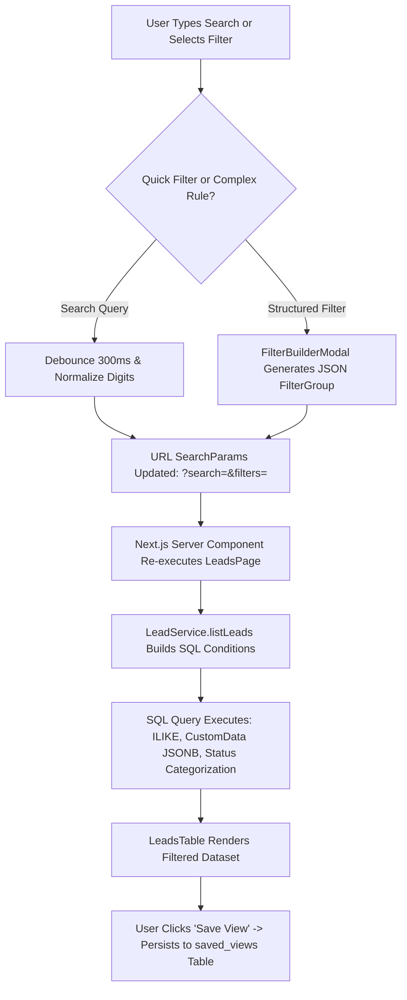
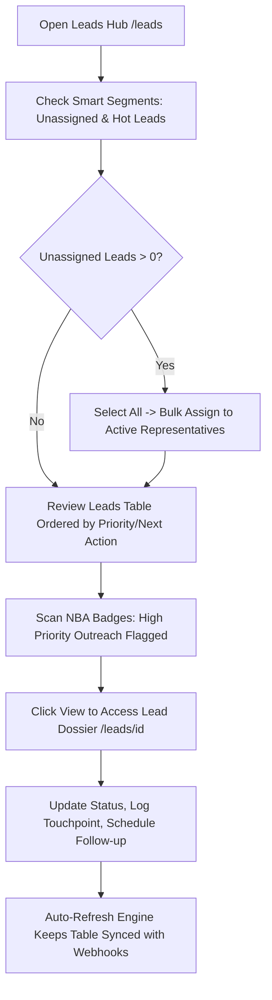
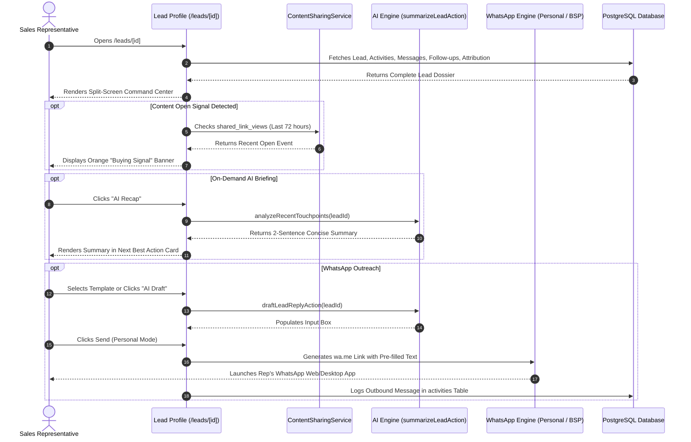
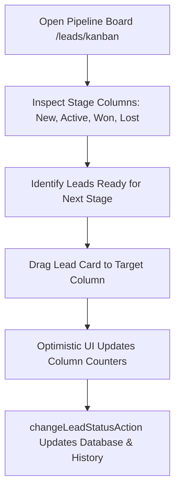
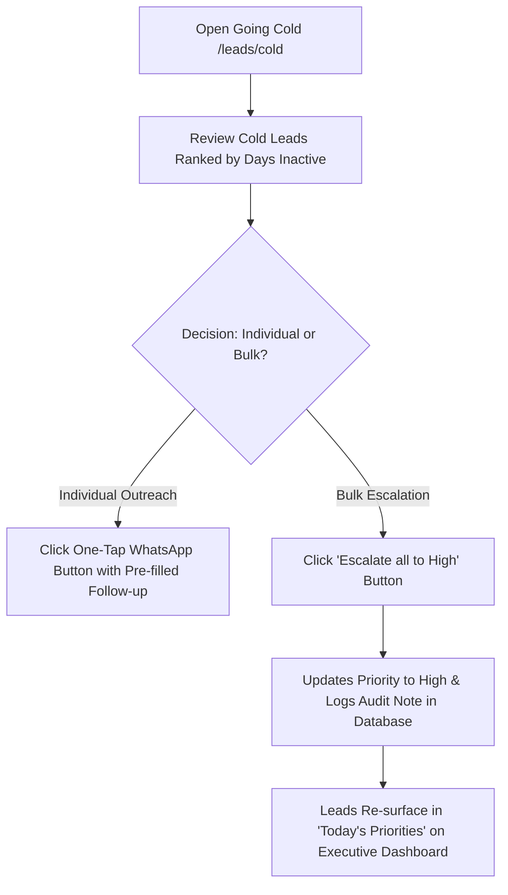

# Leads & Pipeline

Lead list, lead profile, quick add, global search, and the pipeline / going-cold logic.

> Consolidated from 8 source file(s). Content is verbatim; headings are nested two levels deeper under each section. Edit the original files if they still exist, then regenerate.

## Contents

1. [Ridhzo "Leads": Product & Marketing Specification](#1-ridhzo-leads-product--marketing-specification) — `docs/LEADS.md`
2. [Ridhzo "Lead Profile": Product & Marketing Specification](#2-ridhzo-lead-profile-product--marketing-specification) — `docs/LEAD_PROFILE.md`
3. [Global Quick Add (`QuickAddLeadDrawer`)](#3-global-quick-add-quickaddleaddrawer) — `docs/QUICK_ADD.md`
4. [Universal Search & Command Palette (`CommandPalette`)](#4-universal-search--command-palette-commandpalette) — `docs/GLOBAL_SEARCH.md`
5. [Ridhzo "Pipeline Board" & "Going Cold": Product & Marketing Specification](#5-ridhzo-pipeline-board--going-cold-product--marketing-specification) — `docs/PIPELINE_AND_GOING_COLD.md`
6. [Leads Management](#6-leads-management) — `docs/product-kb/05_LEADS_MANAGEMENT.md`
7. [Lead Profile](#7-lead-profile) — `docs/product-kb/06_LEAD_PROFILE.md`
8. [Pipeline Board & Lead Statuses](#8-pipeline-board--lead-statuses) — `docs/product-kb/07_PIPELINE_AND_STATUSES.md`

---

## 1. Ridhzo "Leads": Product & Marketing Specification

> Source: `docs/LEADS.md`

### Ridhzo "Leads": Product & Marketing Specification

> **Document Type:** Product Architecture, Feature Analysis & Website Marketing Reference  
> **Target Audience:** Sales Operations, Inbound Sales Teams, Business Development Reps (BDRs/SDRs), Growth Marketers  
> **Scope:** Main Leads Hub & Management Surface (`/leads`) — *Excludes individual lead profile dossier (`/leads/[id]`)*  
> **Source Verification:** Verified against live Ridhzo codebase (`src/app/(dashboard)/leads/page.tsx`, `LeadsTable.tsx`, `LeadsFilterBar.tsx`, `SmartSegments.tsx`, `QuickAddLeadDrawer.tsx`, `LeadImportWizard.tsx`, `LeadService.listLeads`, and PostgreSQL/Drizzle schema).

---

#### 1. Leads Management Overview

##### What the Leads Hub Is
The **Ridhzo Leads Hub** (`/leads`) is the central operational workstation and command grid for managing an organization's prospective customer database. Designed for high-velocity sales teams handling inbound marketing inquiries, cold outbound prospects, and high-touch B2B opportunities, the Leads Hub combines real-time webhook ingestion, intelligent multi-attribute filtering, instant bulk operations, and automated speed-to-lead execution in a single responsive table interface.

##### Why It Exists in Ridhzo
In high-performing sales organizations, leads are perishable assets. If prospective customer data is trapped in static spreadsheets or sluggish legacy CRMs, response times degrade, duplicate inquiries slip in, and reps waste hours manually assigning or updating records one by one.

Ridhzo's Leads Hub was engineered to eliminate pipeline friction through four foundational capabilities:
1. **Zero-Latency Inbound Ingestion:** New leads from Meta Lead Ads, Webhook APIs, and Inbound Web Forms appear automatically on the table within seconds via an active polling auto-refresh mechanism.
2. **Dynamic Smart Segmentation:** Real-time categorical chips isolate hot leads, high-value opportunities at risk, unassigned new leads, and stale records with a single click.
3. **High-Impact Bulk Operations:** Reps and managers can bulk-assign leads, bulk-update pipeline statuses, apply taxonomy tags, export custom CSVs, and fire personalized multi-lead WhatsApp campaigns in seconds.
4. **Preserved Context & Data Hygiene:** Native deduplication, human-friendly sequential display IDs (`Lead #1042`), custom field extensibility, and a 30-day recoverable recycle bin prevent accidental data loss.

##### Who Uses It
* **Frontline Sales Reps & Account Executives:** Work through assigned lead queues, execute one-click outreach, and advance deals through pipeline stages.
* **Business Development Reps (BDRs / SDRs):** Rapidly qualify inbound inquiries, add enrichment notes, and route qualified opportunities to senior closers.
* **Sales Managers & Team Leads:** Triage unassigned intake backlogs, distribute lead volume across representatives, and balance workload equity.
* **Marketing & Growth Operations:** Track inbound channel attribution (including Meta Ad Campaign, Ad Set, and Ad Name metadata) and import bulk campaign lists via the CSV Import Wizard.

##### Business Problems It Solves
* **The Delayed Intake Problem:** Inbound marketing leads sit unviewed because pages require manual reloads. Ridhzo's auto-refresh engine checks for new database entries while the user's tab is active.
* **Cluttered Data Grids:** Sales reps drown in irrelevance when viewing massive lead lists. Ridhzo provides multi-parameter search, customizable column views, and Boolean filter builders.
* **Manual Follow-up Fatigue:** Sending individual outreach messages across dozens of new leads is labor-intensive. Ridhzo integrates bulk WhatsApp campaign broadcasts with dynamic `{{first_name}}` merge tags directly on the table.
* **Accidental Deletions:** Permanent deletion causes panic and lost revenue. Ridhzo soft-deletes records into a 30-day recoverable Recycle Bin.

##### How It Differs from Dashboards and the Lead Profile
| Dimension | Leads Hub (`/leads`) | Executive Dashboard (`/`) | Individual Lead Profile (`/leads/[id]`) |
| :--- | :--- | :--- | :--- |
| **Focus** | **Operational Execution & Triage:** Multi-lead list management | **Strategic Governance:** Macro KPIs, SLAs, and channel charts | **Deep Customer Dossier:** Single-lead timeline, notes, tasks & chat |
| **View Type** | High-density data grid with pagination and bulk selection | Executive KPI cards, area curves, and workload bar charts | Tabbed client dossier (Activity, WhatsApp, Files, Reminders) |
| **Actions** | Bulk assign, bulk status change, bulk WhatsApp, CSV import/export | Date filtering, high-level SLA auditing, priority drill-down | Logging calls, drafting proposals, updating custom BANT data |

##### How a Sales Team Uses It During a Working Day
1. **08:30 AM — Inbound Triage:** 
   The sales team lead opens `/leads`. Using the **Smart Segments** bar, they click the `Unassigned New` chip, select all overnight inquiries, and trigger **Bulk Assign** to distribute them across the morning shift reps.
2. **10:00 AM — Outreach Power Hour:** 
   A sales rep searches for leads tagged `Event-Webinar` using the **Filter Builder**, checks 25 matching leads, clicks **Message**, and broadcasts a personalized WhatsApp follow-up using `{{first_name}}`.
3. **02:00 PM — Custom Column Inspection:** 
   The rep reviews active deals using custom company fields (e.g., "Property Type" or "Annual Budget") exposed directly on the table header without opening individual tabs.
4. **04:30 PM — Hygiene & Bulk Organization:** 
   Disqualified leads are selected and updated to `Unqualified` in bulk, or moved to the Recycle Bin with a single confirmation prompt.

---

#### 2. Everything Included in the Leads Hub

Based on the live implementation across `src/app/(dashboard)/leads/page.tsx` and accompanying components:

##### 1. Navigation & Quick-Action Header
* **Hot Leads Link (`/leads/hot`):** One-tap navigation to high-intent leads who have recently engaged with shared content or scored $\ge 70$.
* **Pipeline Board Link (`/leads/kanban`):** Visual drag-and-drop Kanban view of leads across stages.
* **Recycle Bin Link (`/leads/recycle-bin`):** Access to soft-deleted leads recoverable within 30 days.
* **Import Leads Trigger (`LeadImportWizard`):** Opens the multi-step CSV import wizard.
* **Add Lead Trigger (`QuickAddLeadDrawer`):** Opens a responsive slide-over drawer for manual lead creation.

##### 2. Real-Time Auto-Refresh Engine (`LeadsAutoRefresh`)
* **Mechanism:** Background polling timer executing every 20 seconds (`intervalMs = 20_000`) while the browser tab is active (`document.visibilityState === "visible"`).
* **Instant Re-Sync:** Triggers an immediate server re-render the exact moment a user returns to a backgrounded tab.
* **Performance Safeguard:** Automatically pauses polling when the tab is hidden, preventing unnecessary database queries.

##### 3. Smart Segments Bar (`SmartSegments`)
* **What It Shows:** Dynamic filter chips with live numerical count badges:
  * **Hot Leads (`Flame` icon):** High-intent opportunities with active engagement signals.
  * **High Value at Risk (`AlertTriangle` icon):** Open leads with high deal value that are aging without contact.
  * **Unassigned New (`UserPlus` icon):** Newly ingested leads lacking an assigned owner.
  * **Stale High Priority (`Snowflake` icon):** High-priority deals that have gone cold (`/leads/cold`).
* **Interaction:** One-click filtering that immediately scopes the table.

##### 4. Advanced Filter & Saved Views Bar (`LeadsFilterBar`)
* **Real-Time Debounced Search:** 300ms debounced input searching across **Lead Name**, **Email**, **Company**, and **Phone** (featuring custom regex telephone normalization that strips spaces, dashes, and country codes to match raw digits).
* **Saved Views Dropdown:** Switch between custom saved configurations (e.g., "My Active Deals", "Unassigned Inbound", "Q3 High Value").
* **Filter Builder Modal Trigger:** Opens complex Boolean query builder.
* **Save View Dialog Trigger:** Allows reps to persist active filters, sort orders, and column configurations.
* **Sort Controls:** Order by Creation Date, Updated Date, Name, Status, Owner, Next Follow-up, Priority, or Score.

##### 5. Multi-Attribute Filter Builder (`FilterBuilderModal`)
* **Capabilities:** Multi-rule filtering with `AND` / `OR` logic.
* **Supported Fields:**
  * Standard Attributes: `Status`, `Owner`, `Source`, `Tag`, `Priority`, `Name`, `Email`, `Phone`, `Company`, `Score`, `Expected Value`, `Created Date`, `Updated Date`, `Follow-up Date`.
  * **Meta / Facebook Ad Attribution Fields:** Ingested lead ad metadata: `customData.meta_campaign_name` (FB Campaign), `customData.meta_adset_name` (FB Ad Set), `customData.meta_ad_name` (FB Ad), and `customData.facebook_form_id`.
  * Operators: `contains`, `equals`, `not_equals`, `does_not_contain`, `is_empty`, `is_not_empty`, `greater_than`, `less_than`, `is_between`.

##### 6. Quick Add Lead Slide-Over Drawer (`QuickAddLeadDrawer`)
* **Form Attributes:** Full Name (required), Email Address, Phone Number, Company Name, Owner Selection dropdown.
* **Dynamic Custom Fields Integration:** Renders active organization custom fields (text, numbers, dropdowns, dates) defined in the custom fields schema.
* **Offline Outbox Support:** If internet connectivity drops, the drawer enqueues the lead in local storage (`enqueueOfflineLead`) for automatic background sync when reconnected.

##### 7. Lead Import Wizard (`LeadImportWizard`)
* **Step 1: Upload:** Drag-and-drop CSV upload with real-time file size and header validation. Includes sample CSV template download.
* **Step 2: Field Mapping:** Visual mapping between CSV headers and standard fields (`Name`, `Email`, `Phone`, `Company`, `Status`, `Expected Value`) or Custom Fields.
* **Step 3: Simulation & Dry Run:** Validates rows without writing to the database, surfacing new records, syntax errors, and duplicate contacts.
* **Step 4: Commit:** Bulk insert with automatic attribution to a selected lead source and default sales representative.

##### 8. Interactive Leads Data Grid (`LeadsTable`)
* **Table Columns:**
  1. **Checkbox:** Individual and "Select All" page toggles.
  2. **Display ID:** Per-tenant sequential number (`#1042`) assigned by atomic database trigger.
  3. **Name:** Clickable lead name navigating to the lead profile dossier (`/leads/[id]`).
  4. **Email & Phone:** Formatted contact information.
  5. **Status Badge:** Color-coded badge dynamically resolved from the tenant's custom status configuration (`CustomStatusSchemaService`).
  6. **Dynamic Custom Columns:** User-configured custom field columns (`showOnTable: true`) with role-based security (admin-only fields automatically hidden from non-admin clients).
  7. **Next Best Action:** Algorithmic badge generated by `NextBestActionService` showing the recommended next move (`label`, `priority`, and hover reason tooltip).
  8. **Created Date:** Localized relative timestamp via `<LocalTime mode="shortDate" />`.
  9. **Row Actions:** One-click **View** link, inline **Edit Lead Dialog**, and **Move to Recycle Bin** button.

##### 9. Multi-Lead Bulk Action Toolbar
When one or more checkboxes are checked, an interactive bulk operations toolbar appears:
* **Selected Count:** Indicates number of selected leads.
* **Bulk Assign:** Reassign selected leads to any team member via dropdown (`bulkAssignLeadAction`).
* **Bulk Status Change:** Transition selected leads to any valid status category (`bulkChangeLeadStatusAction`).
* **Bulk Tagging:** Type a tag name and apply it across all selected records (`bulkAddTagAction`).
* **Bulk WhatsApp Broadcast:** Opens an inline messaging drawer with dynamic merge tags (`{{first_name}}`) to dispatch mass WhatsApp communications via `sendCampaignAction`.
* **Export Selected CSV:** Generates an immediate browser client download of selected rows.
* **Bulk Delete:** Prompts confirmation dialog to move all selected leads to the 30-day Recycle Bin.

##### 10. Pagination & Responsive Controls
* **Page Size Selector:** Configurable between `10`, `20`, `50`, and `100` leads per page.
* **Summary Counter:** "Showing X - Y of Z leads".
* **Pagination Controls:** Previous and Next button controls with URL search parameter persistence.

---

#### 3. Leads Management Features

##### Intake & Acquisition
* **Customer Reference Numbers (CRN) & Sequential Display IDs:** Every lead receives an immutable, human-friendly number (`#1042`), unique sequential Customer Reference Number (`CRN-xxxx`), and dedicated CRN table column with sorting and instant lookup.
* **Automated Lead Ingestion:** Continuous background refresh detects new webhook entries without page reloads.
* **Multi-Format Contact Normalization:** Phone numbers with country codes, spaces, or dashes are indexed (`pg_trgm`) and searchable instantly.

##### Segmentation & Querying
* **Full-Text Multi-Field Search:** Searches CRN, displayId, name, email, company, and phone simultaneously.
* **Automated Budget Extraction & Filtering:** Unstructured budgets in form responses or notes are parsed into clean numeric amounts for range filtering.
* **Meta / Facebook Ad Attribution Filtering:** Filter leads directly by campaign name, ad set name, and form ID.
* **Saved View Persistence:** Save frequently used filter combinations for individual or organization-wide use.
* **One-Tap Smart Segments:** Instant access to Hot Leads, At-Risk deals, Unassigned leads, and Stale records.

##### Mass Execution & Automation
* **Bulk WhatsApp Messaging:** Broadcast messages directly from the table with personalization tokens.
* **Bulk Ownership Transfer:** Rebalance workloads across sales representatives in seconds.
* **Bulk Status Lifecycle Transitions:** Advance groups of leads from New $\to$ Active $\to$ Won/Lost.
* **On-the-Fly CSV Export:** Export filtered segments directly to CSV without third-party tools.

##### Data Governance & Safety
* **Role-Based Custom Field Protection:** Admin-only custom fields are stripped server-side from non-admin payloads.
* **30-Day Recoverable Recycle Bin:** Soft-deletes records with user attribution, eliminating accidental data loss.
* **Offline Outbox Resiliency:** Captures manually added leads in browser storage when operating without internet.

---

#### 4. Leads Operational Data Points

| Column / Data Point | Source Field | Type & Calculation | Operational Business Meaning |
| :--- | :--- | :--- | :--- |
| **Display ID** | `leads.displayId` | Sequential integer | Clear, human-friendly identifier for team callouts and customer reference. |
| **Lead Name** | `leads.name` | String (1-255 chars) | Primary prospective customer or client name. |
| **Contact Email** | `leads.email` | RFC-compliant email | Validated email address for quotes, proposals, and updates. |
| **Contact Phone** | `leads.phone` | String (E.164 compatible) | Normalized mobile number used for phone calls and one-tap WhatsApp. |
| **Status Badge** | `leads.status` | Dynamic tenant schema | Current pipeline lifecycle stage with custom tenant brand color. |
| **Next Best Action** | `NextBestActionService` | Algorithmic heuristic | Prescribes immediate sales action based on buying signals, scores, and SLA windows. |
| **Custom Fields** | `leads.customData` | JSONB key-value store | Tenant-specific business data (e.g., Property Type, Budget, Lead Score). |
| **Created Timestamp** | `leads.createdAt` | UTC Timestamp | Ingestion date, formatted into the user's localized timezone. |

---

#### 5. UI Drawers, Modals, and Action Overlays

##### 1. Quick Add Lead Drawer (`QuickAddLeadDrawer.tsx`)
A right-hand slide-over drawer enabling rapid manual entry. Uses Zod schema validation to verify email formatting and phone integrity. If custom fields are configured for the tenant, they render dynamically below standard contact fields.

##### 2. Lead Import Wizard Modal (`LeadImportWizard.tsx`)
A four-stage modal window that handles batch CSV onboarding. Features automated header detection, duplicate screening against existing database emails/phones, and dry-run error reporting before committing records to the database.

##### 3. Filter Builder Modal (`FilterBuilderModal.tsx`)
A visual query builder supporting nested rules and multi-type operators. Allows users to combine standard contact attributes, scoring thresholds, and Meta ad campaign parameters into reusable filters.

##### 4. Bulk WhatsApp Messaging Drawer
An inline composition panel that expands directly above the table when leads are selected. Supports multi-line templates and auto-populates `{{first_name}}` tokens during outbound dispatch.

---

#### 6. Search, Filter, and Saved View Architecture



##### Search Engine Normalization
When a user searches for a phone number (e.g., `+1 (555) 234-5678`), standard SQL searches fail if the database stores numbers in different formats. Ridhzo detects when a search term contains 3 or more digits and compiles a PostgreSQL regular expression:
```sql
regexp_replace(leads.phone, '[^0-9]', '', 'g') ILIKE '%5552345678%'
```
This guarantees that customer searches succeed regardless of how spaces, parentheses, or international dialing prefixes were entered.

---

#### 7. Frontline Sales & Marketing Use Cases

##### 1. Instant Triage of High-Volume Facebook Ad Campaigns
* **Scenario:** A paid marketing campaign generates 150 leads overnight.
* **Leads Hub Action:** The marketing manager opens `/leads`, launches the **Filter Builder**, selects `customData.meta_campaign_name equals "Summer Promo"`, and isolates the campaign leads.
* **Execution:** Using the bulk action bar, the manager selects all 150 leads, assigns them to the "Inbound Sales Team", and applies the tag `Summer-Promo-2026`.

##### 2. High-Touch Personal Follow-up via WhatsApp Broadcast
* **Scenario:** A sales rep wants to follow up with 18 leads who attended a product demo yesterday.
* **Leads Hub Action:** The rep selects the leads on the table and clicks **Message**.
* **Execution:** Enters: *"Hi {{first_name}} — thanks for attending yesterday's session! Let me know if you have questions on the quote."* The platform personalizes and dispatches the messages across all 18 leads.

##### 3. Rapid CSV Data Migration Without Duplicates
* **Scenario:** Migrating 2,000 legacy contacts from an external spreadsheet.
* **Leads Hub Action:** The operations lead launches the **Lead Import Wizard**, uploads the CSV, and runs the simulation dry run.
* **Execution:** The wizard flags 142 duplicate phone numbers already existing in Ridhzo, preventing database corruption and duplicate lead assignments.

---

#### 8. Daily Sales Execution Workflow



1. **Access Hub:** Load `/leads` with tenant-scoped authentication.
2. **Review Inbound Intake:** Inspect the `Unassigned New` Smart Segment chip.
3. **Execute Bulk Assignments:** Distribute newly ingested leads across team members.
4. **Follow Next Best Action:** Work through leads prioritized by high-intent buying signals.
5. **Maintain Clean Hygiene:** Apply tags, update pipeline stages, and clear disqualified records.

---

#### 9. Marketing-Friendly Feature Explanation

##### Why Sales Teams Win Deals with the Ridhzo Leads Engine

Your sales pipeline is only as fast as your lead management interface. When prospective buyers express interest, every second spent fighting cumbersome CRM grids is an opportunity handed to your competitors. **Ridhzo Leads Hub** gives your sales team an agile, real-time command center built for speed, clarity, and conversion.

* **Real-Time Webhook Synchronization:** Never miss an inbound prospect. As soon as a lead submits a Facebook ad or website form, Ridhzo's live auto-refresh surfaces them on your screen automatically.
* **Effortless Bulk Productivity:** Stop updating records one by one. Reassign hundreds of leads, change pipeline stages, apply tags, and launch personalized WhatsApp broadcasts in seconds.
* **Targeted Smart Segmentation:** Instantly cut through database noise. One-tap smart chips surface hot prospects, neglected inquiries, and high-value deals at risk before they slip away.
* **Frictionless CSV Importing:** Bring your contacts into Ridhzo with zero headaches. Our intelligent import wizard simulates imports, catches duplicates, and maps custom fields automatically.
* **Bulletproof Data Hygiene:** Protect your revenue engine. With atomic sequential lead numbering, phone normalization, role-based field security, and a 30-day recoverable recycle bin, your customer data remains pristine.

---

#### 10. Feature List for Website

* **Live Auto-Refresh Grid**  
  Background polling synchronization that automatically surfaces newly ingested leads from webhooks and ads without manual page reloads.

* **One-Tap Smart Segments**  
  Dynamic quick-filter chips highlighting Hot Leads, High Value at Risk, Unassigned New Leads, and Stale Opportunities.

* **Bulk WhatsApp Campaign Broadcast**  
  Select multiple leads directly on the table and dispatch personalized WhatsApp messages with dynamic `{{first_name}}` tokens.

* **Multi-Attribute Boolean Filter Builder**  
  Build complex multi-condition queries combining contact information, deal values, lead scores, and Meta/Facebook ad attribution.

* **Intelligent CSV Import Wizard**  
  Multi-step onboarding wizard featuring automated header mapping, dry-run simulation, syntax checking, and duplicate prevention.

* **Next Best Action Prescriptions**  
  Built-in AI/rules recommendation badges indicating the immediate next move to advance every deal.

* **Sequential Human-Friendly Display IDs**  
  Atomic database triggers assign clean, memorable numbers (`Lead #1042`) to simplify team communication.

* **Dynamic Custom Fields & Table Columns**  
  Tailor your data grid with custom business fields, complete with role-based visibility controls that protect confidential data.

* **Recoverable 30-Day Recycle Bin**  
  Soft-delete protection ensures that accidentally removed records can be restored with full activity histories intact.

* **Client-Side CSV Export**  
  Instant one-click browser download of selected leads for fast external reporting and executive briefings.

---

#### 11. Leads Page Structure

```
+====================================================================================+
| HEADER: Title ("Leads") + Subtitle ("Search, filter, and manage...")               |
| [Hot Leads] [Pipeline Board] [Recycle Bin] [Import Leads] [+ Add Lead Drawer]      |
+====================================================================================+
| SMART SEGMENTS BAR (Dynamic One-Tap Filter Chips with Count Badges)                |
|  [Flame] Hot Leads (12) | [Alert] High Value at Risk (4) | [UserPlus] Unassigned (9)|
+====================================================================================+
| FILTER & SAVED VIEWS BAR                                                           |
|  [Search Input (Debounced 300ms)] [Saved Views Dropdown] [Filter Builder] [Save]   |
+====================================================================================+
| [OPTIONAL] BULK ACTIONS TOOLBAR (Visible only when >= 1 checkbox selected)         |
|  "X selected" | [Assign to...] [Set status...] [Add Tag...] [Message] [Export] [Del]|
+====================================================================================+
| LEADS DATA GRID (LeadsTable - Responsive Table Container)                          |
|  [ ] | ID    | Name         | Email      | Phone      | Status  | NBA  | Created  |
|  [✓] | #1042 | Sarah Jenkins| s@corp.com | +155523456 | Active  | Call | 2h ago   |
|  [✓] | #1041 | Acme Holdings| info@ac.me | +659123456 | New     | WA   | 4h ago   |
+====================================================================================+
| PAGINATION & DENSITY FOOTER                                                        |
|  Rows per page: [20 v] | Showing 1 - 20 of 142 leads | Page 1 of 8 [< Prev] [Next >]|
+====================================================================================+
```

---

#### 12. Technical Reference

##### Routes and Entry Points
* **Main Leads Page:** [`src/app/(dashboard)/leads/page.tsx`](file:///Users/naveenadicharla/Documents/ridhzo/src/app/(dashboard)/leads/page.tsx)
* **Associated Route Links:**
  * Kanban Board: [`src/app/(dashboard)/leads/kanban/page.tsx`](file:///Users/naveenadicharla/Documents/ridhzo/src/app/(dashboard)/leads/kanban/page.tsx)
  * Hot Leads: [`src/app/(dashboard)/leads/hot/page.tsx`](file:///Users/naveenadicharla/Documents/ridhzo/src/app/(dashboard)/leads/hot/page.tsx)
  * Recycle Bin: [`src/app/(dashboard)/leads/recycle-bin/page.tsx`](file:///Users/naveenadicharla/Documents/ridhzo/src/app/(dashboard)/leads/recycle-bin/page.tsx)
  * Duplicates: [`src/app/(dashboard)/leads/duplicates/page.tsx`](file:///Users/naveenadicharla/Documents/ridhzo/src/app/(dashboard)/leads/duplicates/page.tsx)

##### UI Components (`src/components/leads/`)
* **Leads Table:** [`LeadsTable.tsx`](file:///Users/naveenadicharla/Documents/ridhzo/src/components/leads/LeadsTable.tsx)
* **Filter Bar:** [`LeadsFilterBar.tsx`](file:///Users/naveenadicharla/Documents/ridhzo/src/components/leads/LeadsFilterBar.tsx)
* **Smart Segments:** [`SmartSegments.tsx`](file:///Users/naveenadicharla/Documents/ridhzo/src/components/leads/SmartSegments.tsx)
* **Filter Builder Modal:** [`FilterBuilderModal.tsx`](file:///Users/naveenadicharla/Documents/ridhzo/src/components/leads/FilterBuilderModal.tsx)
* **Quick Add Lead Drawer:** [`QuickAddLeadDrawer.tsx`](file:///Users/naveenadicharla/Documents/ridhzo/src/components/leads/QuickAddLeadDrawer.tsx)
* **Lead Import Wizard:** [`LeadImportWizard.tsx`](file:///Users/naveenadicharla/Documents/ridhzo/src/components/leads/LeadImportWizard.tsx)
* **Auto Refresh Controller:** [`LeadsAutoRefresh.tsx`](file:///Users/naveenadicharla/Documents/ridhzo/src/components/leads/LeadsAutoRefresh.tsx)
* **Edit Lead Dialog:** [`EditLeadDialog.tsx`](file:///Users/naveenadicharla/Documents/ridhzo/src/components/leads/EditLeadDialog.tsx)
* **Save View Dialog:** [`SaveViewDialog.tsx`](file:///Users/naveenadicharla/Documents/ridhzo/src/components/leads/SaveViewDialog.tsx)

##### Backend Services & Server Actions
* **Core Query Engine:** [`src/domains/leads/service.ts`](file:///Users/naveenadicharla/Documents/ridhzo/src/domains/leads/service.ts) (`LeadService.listLeads`, `LeadService.deleteLead`)
* **Smart Segmentation Service:** [`src/domains/leads/smartSegmentationService.ts`](file:///Users/naveenadicharla/Documents/ridhzo/src/domains/leads/smartSegmentationService.ts) (`getSmartSegments`)
* **Saved Views Service:** [`src/domains/savedViews/service.ts`](file:///Users/naveenadicharla/Documents/ridhzo/src/domains/savedViews/service.ts) (`listViews`)
* **Next Best Action Engine:** [`src/domains/leads/nextBestActionService.ts`](file:///Users/naveenadicharla/Documents/ridhzo/src/domains/leads/nextBestActionService.ts) (`getRecommendation`)
* **Custom Status Schema:** [`src/domains/leads/customStatusSchemaService.ts`](file:///Users/naveenadicharla/Documents/ridhzo/src/domains/leads/customStatusSchemaService.ts)
* **Bulk Server Actions:**
  * [`src/lib/actions/leads.ts`](file:///Users/naveenadicharla/Documents/ridhzo/src/lib/actions/leads.ts) (`bulkAssignLeadAction`, `bulkChangeLeadStatusAction`, `bulkDeleteLeadsAction`, `createLeadAction`)
  * [`src/lib/actions/campaigns.ts`](file:///Users/naveenadicharla/Documents/ridhzo/src/lib/actions/campaigns.ts) (`sendCampaignAction`)
  * [`src/lib/actions/tags.ts`](file:///Users/naveenadicharla/Documents/ridhzo/src/lib/actions/tags.ts) (`bulkAddTagAction`)
  * [`src/lib/actions/import.ts`](file:///Users/naveenadicharla/Documents/ridhzo/src/lib/actions/import.ts) (`parseImportCsvAction`, `simulateImportAction`, `commitImportAction`)

##### Database Models (`src/db/schema/`)
* **Leads Schema:** [`src/db/schema/leads.ts`](file:///Users/naveenadicharla/Documents/ridhzo/src/db/schema/leads.ts) (`leads`, `leadSources`, `customStatusConfigs`, `leadTags`, `tags`)
* **Saved Views:** [`src/db/schema/savedViews.ts`](file:///Users/naveenadicharla/Documents/ridhzo/src/db/schema/savedViews.ts) (`savedViews`)
* **Custom Fields:** [`src/db/schema/system.ts`](file:///Users/naveenadicharla/Documents/ridhzo/src/db/schema/system.ts) (`customFieldDefinitions`)
* **Users & Teams:** [`src/db/schema/users.ts`](file:///Users/naveenadicharla/Documents/ridhzo/src/db/schema/users.ts) (`users`, `teams`)

---

## 2. Ridhzo "Lead Profile": Product & Marketing Specification

> Source: `docs/LEAD_PROFILE.md`

### Ridhzo "Lead Profile": Product & Marketing Specification

> **Document Type:** Product Architecture, Feature Analysis & Website Marketing Reference  
> **Target Audience:** Account Executives, Inbound Sales Representatives, Customer Success Managers, Sales Operations  
> **Scope:** Individual Lead Profile Dossier (`/leads/[id]`, e.g., `/leads/b30e02f7-f320-4a2b-9f03-312d7b6c557b`)  
> **Source Verification:** Verified against live Ridhzo codebase (`src/app/(dashboard)/leads/[id]/page.tsx`, `LeadHeaderQuickActions.tsx`, `WhatsAppSendBox.tsx`, `WhatsAppThread.tsx`, `ShareContentCard.tsx`, `LeadAiRecap.tsx`, `LeadRemindersTab.tsx`, `LeadAttachmentsTab.tsx`, and PostgreSQL/Drizzle schema).

---

#### 1. Lead Profile Overview

##### What the Lead Profile Dossier Is
The **Ridhzo Lead Profile** (`/leads/[id]`, as demonstrated by sample route `/leads/b30e02f7-f320-4a2b-9f03-312d7b6c557b`) is the comprehensive 360-degree customer dossier and conversational command cockpit for an individual prospective client. While the **Leads Hub** (`/leads`) organizes multi-lead queue distribution and bulk triage, the Lead Profile is where deals are actively worked, nurtured, negotiated, and closed.

Every customer touchpoint—inbound Meta ad attributes, two-way WhatsApp message threads, AI-generated conversation recaps, scheduled follow-up tasks, shared document read-receipts, internal collaboration notes, and contract attachments—is consolidated into a unified, high-density split-screen interface.

##### Why It Exists in Ridhzo
Traditional CRM contact records are static, administrative databases where sales reps waste time logging past events rather than executing next steps. Reps frequently suffer from "pre-call amnesia," forgetting what the prospect said three days ago or whether they reviewed the sent proposal.

Ridhzo's Lead Profile was engineered around an active execution philosophy:
1. **Context at a Glance:** The moment a rep opens a lead, prominent contextual banners alert them to duplicate records, buying signals (e.g., *"Opened proposal 3× in the last 24h"*), and algorithmic Next Best Actions.
2. **Dual-Mode Omnichannel Outreach:** Reps can communicate instantly via personal WhatsApp (one-tap native routing without Meta 24-hour restrictions) or enterprise Meta Cloud API (BSP), alongside direct click-to-call and email composition.
3. **Buyer Intent Radar (Trackable Content):** Replaces blind PDF attachments with trackable `/s/:slug` links that notify reps the moment a prospect opens a quote or deck.
4. **AI-Powered Acceleration:** Delivers on-demand AI conversation recaps and intelligent one-click reply drafting based on full thread history.

##### Who Uses It
* **Frontline Sales Reps & Account Executives:** Review prospect history before calls, dispatch WhatsApp messages, update opportunity stages, and log meeting outcomes.
* **Business Development Reps (BDRs):** Qualify inbound inquiries against BANT criteria and enroll prospects into multi-step nurture sequences.
* **Sales Managers & Deal Coaches:** Inspect stalled deals, review rep notes, evaluate loss reasons, and verify compliance with follow-up schedules.

##### Business Problems It Solves
* **Pre-Call Information Scrambling:** Consolidates contact information, custom form submissions, and interaction history on a single screen.
* **The "Proposal Black Hole":** Eliminates guessing whether a prospect received or reviewed a proposal by logging real-time link views and open timestamps.
* **Fragmented WhatsApp Messaging:** Bridges personal WhatsApp conversations with company CRM records, providing auditability across all rep-customer chats.
* **Missed Commitments:** Provides a dedicated follow-up reminder control with snooze, due-date scheduling, and calendar alerts.

##### How It Differs from Other Ridhzo Views
| Dimension | Lead Profile Dossier (`/leads/[id]`) | Leads Hub (`/leads`) | Executive Dashboard (`/`) |
| :--- | :--- | :--- | :--- |
| **Granularity** | **Micro:** Single prospect's entire lifecycle and history | **Macro Operations:** Multi-lead queues, bulk lists, and triage | **Macro Strategy:** Org-wide KPIs, SLAs, and channel charts |
| **Primary Goal** | Closing the individual deal through direct communication | Queue management, bulk assignment, and status updates | Monitoring response velocity, team workload, and revenue health |
| **Core Tools** | Two-way WhatsApp thread, trackable links, file tabs, AI recap | Mass WhatsApp broadcast, CSV import/export, filter builder | Recharts velocity charts, priority feed, date range presets |

##### How a Sales Rep Uses It During a Live Call
1. **Pre-Call Briefing (60 Seconds Before):** 
   The rep clicks into `/leads/[id]`. They click **Pre-Call Brief** for an instant modal synthesizing customer requirements, stated budget, prior objections, and suggested conversation openers.
2. **Reviewing Buying Signals:** 
   The rep glances at the **Lead Insights Chip** popover and notices an orange **Buying Signal Banner**: *"Sarah opened 'Q3 Enterprise Proposal' 2× recently."* The rep now knows the buyer is actively reviewing pricing.
3. **During the Call:** 
   The rep references the **Lead Source & Attribution Card** (confirming the lead came from the "Executive Webinar" ad set) and updates the **Custom Attributes** (e.g., setting budget to ₹25 Lakhs).
4. **Post-Call Wrap-up (Immediate):** 
   The rep switches the status from `New` to `Active`, logs call outcome notes, schedules a follow-up for Thursday at 10:00 AM using the **Follow-up Control**, and shares a trackable product brochure link via **Share Content**.

---

#### 2. Everything Included in the Lead Profile Dossier

Based on the live implementation in `src/app/(dashboard)/leads/[id]/page.tsx`:

```
+====================================================================================+
| [DUPLICATE BANNER] "Potential duplicate detected (matches email/phone)"           |
+====================================================================================+
| [BUYING SIGNAL BANNER] "Buying signal: Sarah opened 'Enterprise Quote' 3x recently"|
+====================================================================================+
| HEADER: [<- Back] (Initials) Lead Name [Status Badge] Lead #1042 · Created 2d ago  |
| Quick Actions Toolbar: [Call] [WhatsApp] [Email] [Schedule Follow-up] [Edit] [Del] |
+====================================================================================+
| LEFT COLUMN (1/3 Width)                   | RIGHT COLUMN (2/3 Width)               |
|                                           |                                        |
| 1. NEXT BEST ACTION & AI RECAP            | 10. AUTOMATED DRIP SEQUENCES CARD      |
|    - Priority label & reason              |     - Active enrollments & step status |
|    - On-demand "AI Recap" trigger         |     - One-click "+ Enroll" modal       |
|                                           |                                        |
| 2. LEAD INSIGHTS & QUALIFICATION          | 11. MULTI-TAB COMMUNICATION & AUDIT    |
|    - Lead score & enrichment evidence     |     +--------------------------------+ |
|    - Inbound message & activity flags     |     | Activity (12) | Follow-ups (2) | |
|                                           |     | Attachments(3)| WhatsApp (8)   | |
| 3. FOLLOW-UP REMINDER WIDGET              |     | Notes (4)     | Send Email     | |
|    - Next scheduled date & quick snooze   |     +--------------------------------+ |
|                                           |                                        |
| 4. SHARE & TRACK CONTENT CARD             |     [Tab 1: Activity Audit Timeline]   |
|    - Create trackable /s/:slug links      |     - Chronological event stream       |
|    - Real-time read receipt counters      |     - Author badges & relative time    |
|                                           |                                        |
| 5. RE-ENGAGEMENT PLAN CARD (Cold leads)   |     [Tab 2: Follow-ups & Reminders]    |
|                                           |     - Due dates, alerts, completion    |
| 6. LEAD MANAGEMENT CONTROLS               |                                        |
|    - Status dropdown (custom schema)      |     [Tab 3: Attachments Manager]       |
|    - Assignee dropdown (team users)       |     - Direct file upload & download    |
|    - Tag management pill badges           |                                        |
|    - Stage selector & Expected Value ($)  |     [Tab 4: WhatsApp Chat Engine]      |
|                                           |     - Two-way scrollable chat thread   |
| 7. LEAD SOURCE & MARKETING ATTRIBUTION    |     - Read delivery status receipts    |
|    - Channel name & source type badge     |     - Template picker & AI reply draft |
|    - Meta Campaign, Ad Set, Ad Name, Form |     - Personal (wa.me) vs BSP toggle   |
|    - Full UTM tags (Source, Medium, Term) |                                        |
|                                           |     [Tab 5: Collaboration Notes]       |
| 8. CONTACT INFORMATION CARD               |     - Rich text notes & user pins      |
|    - Email (mailto link)                  |                                        |
|    - Phone (tel: & WhatsApp direct web)   |     [Tab 6: Direct Email Composer]     |
|    - Company name                         |     - Subject, body & delivery toast   |
|                                           |                                        |
| 9. CUSTOM ATTRIBUTES (JSONB Custom Fields)|                                        |
|    - Live editable custom business fields |                                        |
+====================================================================================+
```

##### 1. Contextual Notification Banners
* **Duplicate Detection Banner (`LeadDuplicateBanner`):** Compares `email` and `phone` against existing organization leads, alerting reps to potential duplicates to prevent conflicting outreach.
* **Buying Signal Banner:** Fires automatically when a lead views shared collateral within the last 72 hours (`ContentSharingService`), displaying: *"Buying signal: [Lead] opened '[Title]' X times recently — reach out now while you're top of mind."*
* **Lost / Disqualification Banner:** Rendered if the status is `lost` or `unqualified`, displaying the recorded `lostReason` (e.g., *"Lost — reason: Competitor pricing"*).

##### 2. Header & Quick-Action Toolbar (`LeadHeaderQuickActions`)
* **Identity Block:** Back navigation to `/leads`, circular initials avatar, Lead Name, dynamic custom-colored Status Badge, Customer Reference Number (`CRN-xxxx`), sequential `Lead #[displayId]`, and localized creation timestamp.
* **Quick Actions Toolbar:**
  * **Pre-Call Brief:** Opens 1-click synthesized briefing modal with lead context, budget, objections, and talking points before dialing.
  * **Click-to-Call (`tel:`):** Launches device dialer or VoIP client with automatic call logging and rep notes.
  * **Instant WhatsApp:** Opens WhatsApp web/desktop app pre-populated with lead number.
  * **Direct Email:** Jumps directly to email composition tab.
  * **Quick Follow-up Scheduler:** Popover with one-click presets: *Later Today (+3h)*, *Tomorrow Morning (09:00 AM)*, *In 2 Days*, *Next Week*, or *Custom Date Picker*.
  * **Edit Lead Dialog:** Inline modal for editing primary contact details.
  * **Delete Button:** Moves lead to the 30-day recoverable Recycle Bin.

##### 3. Next Best Action & AI Recap Card
* **Next Best Action Prescription (`NextBestActionService`):** Evaluates lead status, recency, scores, and buying signals to output an actionable recommendation badge (`high`, `medium`, `low`) and tactical reason string.
* **On-Demand AI Recap (`LeadAiRecap`):** Server action (`summarizeLeadAction`) executing an on-demand AI call that distills activities, notes, and WhatsApp messages into a concise executive summary.

##### 4. Lead Insights & Qualification Card (`LeadInsightsCard`)
* **Lead Score Meter:** Displays composite score (0-100) based on profile completeness, engagement frequency, and BANT qualification.
* **Enrichment Evidence:** Highlights buying signals, inbound message presence, and company details.

##### 5. Follow-Up Control Widget (`LeadFollowUpControl`)
* **Next Follow-up Date:** Clear display of upcoming scheduled deadlines with overdue alert styling.
* **Quick Update:** Select new date/time presets to keep the deal on track.

##### 6. Share & Track Content Card (`ShareContentCard`)
* **Trackable Page Creation:** Generates a unique, trackable link (`/s/:slug`) for proposals, brochures, contracts, or target URLs.
* **Read Receipts & View Counters:** Displays exact view count and relative timestamp of last open (e.g., *"Viewed 4 times · 2 hours ago"*).
* **One-Click Share:** Copy link or share directly via WhatsApp.

##### 7. Re-engagement Plan Card (`ReengagementPlanCard`)
* **Automated Cold Cadence:** Renders for inactive or cold leads, prescribing a structured multi-day re-engagement schedule.

##### 8. Lead Management Controls Card
* **Status Control (`LeadStatusControl`):** Dropdown reflecting the organization's custom status schema (`CustomStatusSchemaService`), updating status across all boards and metrics.
* **Assignee Control (`LeadAssignControl`):** Reassign lead ownership across active team members.
* **Tag Manager (`LeadTags`):** Add or remove organizational taxonomy tags.
* **Stage & Expected Value (`LeadStageAndValueControl`):** Update pipeline stage and enter monetary expected deal value formatted in the workspace's localized currency (`getOrgFormat`).

##### 9. Lead Source & Ad Attribution Card
* **Source & Channel Type:** Displays source name and channel badge (e.g., Facebook Lead Ads, Google Lead Ads, Webhook).
* **Granular Attribution Metadata:** Automatically parses parameters stored in `customData`:
  * *Campaign Name (`meta_campaign_name` / `utm_campaign`)*
  * *Ad Set Name (`meta_adset_name`)*
  * *Ad Name (`meta_ad_name`)*
  * *Facebook Form Name (`facebook_form_id`)*
  * *UTM Source, Medium, Term, Content, GCLID, Page URL, Referrer*

##### 10. Contact Information Card
* **Email:** Clickable `mailto:` link.
* **Phone:** Clickable `tel:` phone call link and native WhatsApp routing link.
* **Company:** Organization name.

##### 11. Custom Attributes Card (`LeadCustomFields`)
* **Dynamic Business Fields:** Renders custom organizational fields (text, number, dropdown, date) configured in settings.
* **Inline Editing:** Reps can update custom field values directly from the card.
* **Role-Based Security:** Admin-only custom fields are hidden from non-admin users.

##### 12. Automated Sequences Card (`LeadSequencesCard`)
* **Drip Sequence Enrollment:** Displays currently enrolled nurture sequences, current step progress, and completion status.
* **Sequence Picker:** Enroll lead into pre-configured multi-channel sequences with a single click.

##### 13. Multi-Tab Communication & History Hub
* **Tab 1: Activity Log (`activities.length`):** Chronological timeline of calls, meetings, notes, status changes, and assignments with user attribution and timestamps.
* **Tab 2: Follow-ups (`reminders.length`):** List of pending and completed follow-up tasks with due dates, reminder alerts, and completion checkboxes.
* **Tab 3: Attachments (`attachments.length`):** Upload documents, PDFs, proposals, and images with file size tracking and download actions.
* **Tab 4: WhatsApp (`waMessages.length`):** 
  * *Thread History (`WhatsAppThread`):* Interactive chat history with timestamps and status ticks (sent, delivered, read).
  * *Messaging Sendbox (`WhatsAppSendBox`):* Template picker, AI-assisted reply drafting (`draftLeadReplyAction`), and dual-mode toggle (Personal `wa.me` vs. Meta Cloud API).
* **Tab 5: Notes (`notesCount`):** Internal team collaboration notes with timestamps and author details.
* **Tab 6: Send Email (`EmailSendBox`):** Dedicated email composer with subject, body, and status toast notifications.

---

#### 3. Lead Profile Features

##### Conversational Intelligence
* **Two-Way WhatsApp Chat Thread:** Complete conversational audit trail directly inside the CRM.
* **Dual WhatsApp Dispatch Modes:** Choose between Personal WhatsApp (zero Meta fees, no 24h template restrictions) and Enterprise Cloud BSP.
* **AI Reply Drafting:** Evaluates recent chat history to draft professional, personalized responses in seconds.
* **Template Picker:** Instant insertion of approved WhatsApp outreach templates.

##### Buyer Engagement & Content Tracking
* **Trackable Branded Links:** Generate unique `/s/:slug` URLs for quotes and proposals.
* **Real-Time Read Receipts:** View exact customer open counts and timestamps.
* **Buying Signal Automation:** Real-time banner alerts when prospects interact with shared collateral.

##### Deal & Pipeline Governance
* **Multi-Currency Deal Valuation:** Input expected deal values formatted in the workspace's native currency and locale.
* **Custom Status Normalization:** Seamless alignment with enterprise-configured lead lifecycle stages.
* **Sequential Display IDs:** Memorable, human-friendly numbers (`Lead #1042`) for team coordination.

##### Marketing & Inbound Attribution
* **Paid Ad Attribution:** Deep-dive tracking into Meta Ad Campaign, Ad Set, Ad, and Form Name.
* **Full UTM Parameter Parsing:** Capture UTM source, medium, campaign, keyword, and click IDs.

---

#### 4. Master Data Points & Attributes

| Field / Attribute | Database Source | Type & Format | Business Function |
| :--- | :--- | :--- | :--- |
| **Display ID** | `leads.displayId` | Integer (`#1042`) | Human-friendly reference for quick team communication. |
| **Lead Name** | `leads.name` | String (1-255) | Prospect primary contact name. |
| **Email Address** | `leads.email` | RFC-compliant email | Electronic communication and duplicate matching key. |
| **Phone Number** | `leads.phone` | String (E.164) | Normalized dialing number and WhatsApp routing ID. |
| **Company** | `leads.company` | String | Organization or business entity name. |
| **Status** | `leads.status` | Custom Schema Key | Current stage in the sales lifecycle. |
| **Expected Value** | `leads.expectedValue` | Numeric(12,2) | Monetary opportunity valuation. |
| **Lead Score** | `leads.score` | Integer (0-100) | Engagement and qualification score. |
| **Lost Reason** | `leads.lostReason` | String (120) | Root-cause categorization when a deal is closed-lost. |
| **Next Follow-up** | `leads.nextFollowUpAt` | Timestamp | Scheduled deadline for next sales touchpoint. |
| **Last Contacted** | `leads.lastContactedAt` | Timestamp | Timestamp of most recent outreach event. |
| **Custom Data** | `leads.customData` | JSONB Store | Dynamic attributes (ad attribution, custom fields). |

---

#### 5. Technical Architecture & Communication Flow



---

#### 6. Frontline Sales Use Cases

##### 1. Capitalizing on Live Proposal Views
* **Scenario:** A commercial real estate broker sent a $450,000 property brochure yesterday.
* **Lead Profile Action:** The broker opens `/leads/[id]` and sees: *"Buying signal: Prospect opened 'Harbor Point Brochure' 3× recently."*
* **Outcome:** The broker immediately clicks the header **Call** button to contact the prospect while their interest is active, securing a site tour.

##### 2. Rapid Pre-Call Catchup via AI Recap
* **Scenario:** An Account Executive has back-to-back demo calls and only 30 seconds to prepare for the next prospect.
* **Lead Profile Action:** The AE opens `/leads/[id]` and clicks **AI Recap**.
* **Outcome:** In 3 seconds, the AI outputs: *"Prospect inquired via Meta Lead Ads regarding enterprise SSO; had 2 WhatsApp touchpoints discussing pricing tiers; scheduled demo today to review multi-user permissions."* The AE conducts the call with full context.

##### 3. Re-engaging Cold Inactive Prospects
* **Scenario:** A lead has been silent for 18 days.
* **Lead Profile Action:** The rep reviews the **Re-engagement Plan Card**, selects the prescribed 3-touch cadence, and enrolls the lead into the **Re-engagement Sequence**.
* **Outcome:** Automated personalized touchpoints re-open the sales dialogue without manual drafting.

---

#### 7. Marketing-Friendly Feature Explanation

##### Why Top Closers Rely on the Ridhzo Lead Profile

In modern sales, deals are won by the reps who have the best context and fastest execution. When every second counts, flipping between different tools to read customer notes, find phone numbers, and draft WhatsApp messages slows you down. The **Ridhzo Lead Profile** gives sales professionals an unfair advantage by placing complete customer intelligence and multi-channel outreach in a single view.

* **Complete Customer Context in One View:** No more digging through scattered email threads or CRM tabs. See your prospect's entire history—from their initial Facebook ad click to their latest WhatsApp message—in one clean dossier.
* **Never Call Blind Again:** With on-demand AI Recaps, you can get fully up to speed on any opportunity in 3 seconds before picking up the phone.
* **Know the Exact Moment to Strike:** Stop wondering if clients opened your proposal. Trackable document links notify you the instant collateral is opened so you can follow up with perfect timing.
* **Frictionless WhatsApp Execution:** Communicate the way your customers prefer. Choose between personal WhatsApp routing (zero Meta approval delays) or enterprise Cloud API, complete with AI reply drafting.
* **Stay on Top of Follow-ups:** Never let a commitment slip through the cracks. Built-in follow-up scheduling with quick-snooze controls ensures you always follow through.

---

#### 8. Feature List for Website

* **360-Degree Customer Dossier**  
  Consolidates contact information, pipeline stages, custom fields, interaction timelines, and file attachments in a unified interface.

* **Live Buying Signal Detection**  
  Visual alerts notify reps the moment a prospect opens shared proposals, quotes, or marketing collateral.

* **Dual-Mode WhatsApp Messaging**  
  Switch seamlessly between one-tap personal WhatsApp routing and enterprise Meta Cloud API, complete with full thread history.

* **AI Conversation Recap & Reply Drafting**  
  Generate instant executive summaries of lead history and draft intelligent WhatsApp responses with a single click.

* **Trackable Branded Document Sharing**  
  Share proposals and brochures via trackable `/s/:slug` links with real-time read receipts and view counters.

* **Paid Ad Attribution Transparency**  
  Deep tracking into originating Meta Campaigns, Ad Sets, Ads, and Form Names alongside full UTM parameter sets.

* **Algorithmic Next Best Action**  
  Actionable recommendations based on lead buying signals, scores, and SLA response windows.

* **Automated Drip Sequence Enrollment**  
  Enroll leads directly into automated multi-step nurture sequences with live progress tracking.

* **Quick Follow-up Scheduler**  
  Schedule and snooze follow-up tasks with one-click presets to maintain outreach discipline.

* **Centralized File Attachment Vault**  
  Upload, preview, and download contracts, proposals, and images associated with the customer record.

* **30-Day Recoverable Protection**  
  Safely remove leads to the recycle bin with full 30-day restoration capabilities.

---

#### 9. Lead Profile Page Structure

```
+====================================================================================+
| NOTIFICATION BANNERS                                                               |
|  - Duplicate Warning Banner (matches existing phone/email)                         |
|  - Buying Signal Banner (content opened in last 72 hours)                          |
|  - Lost / Disqualified Reason Banner (lostReason breakdown)                        |
+====================================================================================+
| HEADER BAR                                                                         |
|  [<- Back to Leads] [Avatar] Lead Name [Status Badge] | Lead #1042 · Created 2d ago |
|  Quick Actions Toolbar: [Call] [WhatsApp] [Email] [Follow-up] [Edit] [Delete]      |
+====================================================================================+
| 2-COLUMN RESPONSIVE LAYOUT (grid-cols-1 lg:grid-cols-3 gap-6)                      |
|                                                                                    |
| [LEFT COLUMN: lg:col-span-1]                | [RIGHT COLUMN: lg:col-span-2]        |
|  1. Next Best Action & AI Recap Card        |  10. Automated Sequences Card        |
|  2. Lead Insights & Qualification Card      |  11. Multi-Tab Workstation Container |
|  3. Follow-up Reminder Widget               |      [Activity] Chronological feed   |
|  4. Share & Track Content Card              |      [Follow-ups] Task checklist     |
|  5. Re-engagement Plan Card (Cold leads)    |      [Attachments] Document vault    |
|  6. Lead Management Controls Card           |      [WhatsApp] Live chat & sendbox  |
|  7. Lead Source & Attribution Card          |      [Notes] Internal team notes     |
|  8. Contact Information Card                |      [Send Email] Direct composer    |
|  9. Custom Attributes Card                  |                                      |
+====================================================================================+
```

---

#### 10. Technical Reference

##### Routes and Entry Points
* **Lead Profile Page:** [`src/app/(dashboard)/leads/[id]/page.tsx`](file:///Users/naveenadicharla/Documents/ridhzo/src/app/(dashboard)/leads/[id]/page.tsx)
* **Parent Leads Hub:** [`src/app/(dashboard)/leads/page.tsx`](file:///Users/naveenadicharla/Documents/ridhzo/src/app/(dashboard)/leads/page.tsx)

##### UI Components (`src/components/leads/`)
* **Header Actions:** [`LeadHeaderQuickActions.tsx`](file:///Users/naveenadicharla/Documents/ridhzo/src/components/leads/LeadHeaderQuickActions.tsx)
* **Duplicate Banner:** [`LeadDuplicateBanner.tsx`](file:///Users/naveenadicharla/Documents/ridhzo/src/components/leads/LeadDuplicateBanner.tsx)
* **AI Conversation Recap:** [`LeadAiRecap.tsx`](file:///Users/naveenadicharla/Documents/ridhzo/src/components/leads/LeadAiRecap.tsx)
* **Insights & Scoring:** [`LeadInsightsCard.tsx`](file:///Users/naveenadicharla/Documents/ridhzo/src/components/leads/LeadInsightsCard.tsx)
* **Follow-up Control:** [`LeadFollowUpControl.tsx`](file:///Users/naveenadicharla/Documents/ridhzo/src/components/leads/LeadFollowUpControl.tsx)
* **Share Content Card:** [`ShareContentCard.tsx`](file:///Users/naveenadicharla/Documents/ridhzo/src/components/leads/ShareContentCard.tsx)
* **Re-engagement Card:** [`ReengagementPlanCard.tsx`](file:///Users/naveenadicharla/Documents/ridhzo/src/components/leads/ReengagementPlanCard.tsx)
* **Status Control:** [`LeadStatusControl.tsx`](file:///Users/naveenadicharla/Documents/ridhzo/src/components/leads/LeadStatusControl.tsx)
* **Assignee Control:** [`LeadAssignControl.tsx`](file:///Users/naveenadicharla/Documents/ridhzo/src/components/leads/LeadAssignControl.tsx)
* **Tag Manager:** [`LeadTags.tsx`](file:///Users/naveenadicharla/Documents/ridhzo/src/components/leads/LeadTags.tsx)
* **Stage & Value Control:** [`LeadStageAndValueControl.tsx`](file:///Users/naveenadicharla/Documents/ridhzo/src/components/leads/LeadStageAndValueControl.tsx)
* **Custom Fields Card:** [`LeadCustomFields.tsx`](file:///Users/naveenadicharla/Documents/ridhzo/src/components/leads/LeadCustomFields.tsx)
* **Sequences Card:** [`LeadSequencesCard.tsx`](file:///Users/naveenadicharla/Documents/ridhzo/src/components/leads/LeadSequencesCard.tsx)
* **Reminders Tab:** [`LeadRemindersTab.tsx`](file:///Users/naveenadicharla/Documents/ridhzo/src/components/leads/LeadRemindersTab.tsx)
* **Attachments Tab:** [`LeadAttachmentsTab.tsx`](file:///Users/naveenadicharla/Documents/ridhzo/src/components/leads/LeadAttachmentsTab.tsx)
* **WhatsApp Thread:** [`WhatsAppThread.tsx`](file:///Users/naveenadicharla/Documents/ridhzo/src/components/leads/WhatsAppThread.tsx)
* **WhatsApp Sendbox:** [`WhatsAppSendBox.tsx`](file:///Users/naveenadicharla/Documents/ridhzo/src/components/leads/WhatsAppSendBox.tsx)
* **Notes Tab:** [`LeadNotesTab.tsx`](file:///Users/naveenadicharla/Documents/ridhzo/src/components/leads/LeadNotesTab.tsx)
* **Email Sendbox:** [`EmailSendBox.tsx`](file:///Users/naveenadicharla/Documents/ridhzo/src/components/leads/EmailSendBox.tsx)

##### Backend Services & Server Actions
* **Lead Query Service:** [`src/domains/leads/service.ts`](file:///Users/naveenadicharla/Documents/ridhzo/src/domains/leads/service.ts) (`LeadService.getLead`)
* **Content Sharing Engine:** [`src/domains/leads/contentSharingService.ts`](file:///Users/naveenadicharla/Documents/ridhzo/src/domains/leads/contentSharingService.ts) (`listForLead`)
* **Next Best Action Engine:** [`src/domains/leads/nextBestActionService.ts`](file:///Users/naveenadicharla/Documents/ridhzo/src/domains/leads/nextBestActionService.ts) (`getRecommendation`)
* **WhatsApp Messaging Service:** [`src/lib/messaging/whatsapp/service.ts`](file:///Users/naveenadicharla/Documents/ridhzo/src/lib/messaging/whatsapp/service.ts) (`WhatsAppService.listForLead`)
* **AI Actions:** [`src/lib/actions/ai.ts`](file:///Users/naveenadicharla/Documents/ridhzo/src/lib/actions/ai.ts) (`summarizeLeadAction`, `draftLeadReplyAction`)
* **Activity Engine:** [`src/domains/activities/service.ts`](file:///Users/naveenadicharla/Documents/ridhzo/src/domains/activities/service.ts) (`ActivityService.getLeadActivities`)
* **Custom Status Schema:** [`src/domains/leads/customStatusSchemaService.ts`](file:///Users/naveenadicharla/Documents/ridhzo/src/domains/leads/customStatusSchemaService.ts)

##### Database Models (`src/db/schema/`)
* `leads` (`src/db/schema/leads.ts`)
* `leadSources` (`src/db/schema/leads.ts`)
* `leadPipelineStages` (`src/db/schema/leads.ts`)
* `customStatusConfigs` (`src/db/schema/leads.ts`)
* `activities` (`src/db/schema/activities.ts`)
* `followUps` (`src/db/schema/activities.ts`)
* `leadAttachments` (`src/db/schema/activities.ts`)
* `whatsappMessages` (`src/db/schema/whatsapp.ts`)
* `sharedLinks`, `sharedLinkViews` (`src/db/schema/sharedContent.ts`)
* `users`, `organizations` (`src/db/schema/users.ts`, `src/db/schema/organizations.ts`)

---

## 3. Global Quick Add (`QuickAddLeadDrawer`)

> Source: `docs/QUICK_ADD.md`

### Global Quick Add (`QuickAddLeadDrawer`)

#### 1. Executive Summary & Purpose

The **Global Quick Add** drawer is the primary high-velocity lead intake tool in Ridhzo CRM. Accessible from any page in the dashboard header via the **Quick Add** button (or keyboard shortcuts), it enables sales reps to capture inbound phone leads, event contacts, and walk-ins in under 5 seconds without leaving their current workflow.

Key capabilities include:
- **Global Header Availability:** Mounted on the dashboard top bar across desktop and tablet viewports.
- **Dynamic Custom Fields Injection:** Automatically fetches and renders the organization's custom field definitions with strict required-field validation.
- **Offline-First Resilience:** If network connectivity drops, leads are intercepted and safely enqueued in client-side IndexedDB outboxes with automatic background synchronization upon reconnection.
- **Immediate Team Assignment:** Direct owner assignment dropdown with user pre-fetching.
- **Inline Server-Side Error Mapping:** Catches duplicates, email format anomalies, and constraint violations, highlighting the specific form controls directly.

---

#### 2. File & Component Architecture

| Purpose | File Path |
| :--- | :--- |
| **Drawer UI & Form Controller** | [`src/components/leads/QuickAddLeadDrawer.tsx`](file:///Users/naveenadicharla/Documents/ridhzo/src/components/leads/QuickAddLeadDrawer.tsx) |
| **Header Integration** | [`src/components/layout/Header.tsx:62-67`](file:///Users/naveenadicharla/Documents/ridhzo/src/components/layout/Header.tsx#L62-L67) |
| **Custom Field Dynamic Renderer** | [`src/components/leads/CustomFieldInputs.tsx`](file:///Users/naveenadicharla/Documents/ridhzo/src/components/leads/CustomFieldInputs.tsx) |
| **Server Lead Creation Action** | [`src/lib/actions/leads.ts`](file:///Users/naveenadicharla/Documents/ridhzo/src/lib/actions/leads.ts) |
| **Offline Sync & Storage Queue** | [`src/lib/offline/outbox.ts`](file:///Users/naveenadicharla/Documents/ridhzo/src/lib/offline/outbox.ts) |
| **Custom Field Schema Query** | [`src/lib/actions/customFields.ts`](file:///Users/naveenadicharla/Documents/ridhzo/src/lib/actions/customFields.ts) |
| **Team Users Directory Action** | [`src/lib/actions/users.ts`](file:///Users/naveenadicharla/Documents/ridhzo/src/lib/actions/users.ts) |

---

#### 3. Data Intake & Validation Schema

The form uses `react-hook-form` paired with a Zod resolver schema to ensure high data integrity:

```typescript
const formSchema = z.object({
  name: z.string().trim().min(1, "Name is required").max(255, "Name cannot exceed 255 characters"),
  email: z.string().trim().email("Invalid email address").optional().or(z.literal("")).or(emptyStringToUndefined),
  phone: z.string().trim().max(50, "Phone number too long").optional().or(z.literal("")).or(emptyStringToUndefined),
  company: z.string().trim().max(255, "Company name cannot exceed 255 characters").optional().or(z.literal("")).or(emptyStringToUndefined),
  ownerId: z.string().optional().or(z.literal("")).or(emptyStringToUndefined),
});
```

##### Core Input Fields:
1. **Full Name (`name`):** Required. Standard text input with autofocus.
2. **Email Address (`email`):** Optional. Validated against standard email RFC format.
3. **Phone Number (`phone`):** Optional. International dial code and digit handling.
4. **Company / Organization (`company`):** Optional. Firmographic association.
5. **Assign Owner (`ownerId`):** Optional. Dropdown populated with active organization members; defaults to unassigned or current logged-in rep.

---

#### 4. Dynamic Custom Fields Integration

1. **Preload on Mount & On Open:** When the drawer mounts, `listCustomFieldsAction()` loads all active fields. When opened, it re-fetches to guarantee newly added fields in `/settings/custom-fields` appear instantly.
2. **Support for 10 Field Types:** Leverages [`CustomFieldInputs`](file:///Users/naveenadicharla/Documents/ridhzo/src/components/leads/CustomFieldInputs.tsx) supporting:
   - Text & Long Text (Textarea)
   - Number & Currency (with ISO currency symbol normalization)
   - Date & Time
   - Single Select & Multi-Select
   - Checkbox (Boolean)
   - URL
3. **Client-Side Required Enforcement:** Before submission, the form iterates over active definitions:
   ```typescript
   const missing = activeDefs.filter((d) => d.required && !(String(customValues[d.key] ?? "")).trim());
   if (missing.length) {
     toast({
       variant: "destructive",
       title: "Required field missing",
       description: `Please fill in required custom field: ${missing.map((m) => m.label).join(", ")}`,
     });
     return;
   }
   ```

---

#### 5. Offline-First Resilience

Field sales representatives frequently capture lead details in trade shows, elevators, or areas with unstable mobile connectivity.

If `!navigator.onLine`:
1. The submission skips the network fetch.
2. The payload is passed to [`enqueueOfflineLead(leadPayload)`](file:///Users/naveenadicharla/Documents/ridhzo/src/lib/offline/outbox.ts).
3. The lead is saved locally in IndexedDB with a client-generated UUID and local timestamp.
4. A friendly toast informs the user:
   `"Saved offline ⚡ — You're offline. Lead was saved locally and will auto-sync once reconnected."`
5. The drawer cleanly closes and resets the form.
6. The global `OfflineStatusIndicator` tracks the outbox, and the service worker flushes pending leads to `/api/leads` as soon as connectivity resumes.

---

#### 6. Server Action Execution & Error Handling

When online, `createLeadAction` dispatches to [`LeadService.createLead`](file:///Users/naveenadicharla/Documents/ridhzo/src/domains/leads/service.ts):
- **Event Fan-Out:** Automatically emits `lead.created` triggering deduplication checks, automated lead distribution, CAPI conversion postback, and BullMQ background enrichment.
- **Structured Error Handling:** If the server returns field-level validation errors (e.g., duplicated phone number or invalid domain), errors are mapped directly onto the form fields via `form.setError(key, { message })`.
- **Success Flow:** Displays a success toast, closes the drawer, resets custom field inputs, and revalidates dashboard and lead list routes (`router.refresh()`).

---

## 4. Universal Search & Command Palette (`CommandPalette`)

> Source: `docs/GLOBAL_SEARCH.md`

### Universal Search & Command Palette (`CommandPalette`)

#### 1. Executive Summary & Purpose

The **Universal Search & Command Palette** is Ridhzo CRM's central keyboard-driven navigation and search system. Triggered via `⌘K` (macOS) or `Ctrl+K` (Windows/Linux), or by clicking the search bar in the global header, it provides instant access to leads, team members, and CRM views without page reloads.

Key design principles include:
- **Universal Multi-Entity Search:** Simultaneously searches across leads (by name, email, phone, company) and organization team members (by first name, last name, full name, email).
- **Debounced Server Search:** 200ms debounce window prevents typing lag and database connection exhaustion.
- **Server-Driven Ranking (`shouldFilter={false}`):** Delegates fuzzy matching and relevance sorting to PostgreSQL ILIKE queries rather than client-side string filters, ensuring live, accurate results.
- **Instant Keyboard Navigation:** Arrow key selection and `Enter` key execution with direct route transitions via Next.js `useRouter`.

---

#### 2. File & Component Architecture

| Purpose | File Path |
| :--- | :--- |
| **Command Palette Modal** | [`src/components/layout/CommandPalette.tsx`](file:///Users/naveenadicharla/Documents/ridhzo/src/components/layout/CommandPalette.tsx) |
| **Header Search Trigger** | [`src/components/layout/Header.tsx:23-58`](file:///Users/naveenadicharla/Documents/ridhzo/src/components/layout/Header.tsx#L23-L58) |
| **Server Search Action** | [`src/lib/actions/search.ts`](file:///Users/naveenadicharla/Documents/ridhzo/src/lib/actions/search.ts) |
| **Underlying Command Primitives (`cmdk`)** | [`src/components/ui/command.tsx`](file:///Users/naveenadicharla/Documents/ridhzo/src/components/ui/command.tsx) |
| **Database Schema** | [`src/db/schema/leads.ts`](file:///Users/naveenadicharla/Documents/ridhzo/src/db/schema/leads.ts), [`src/db/schema/users.ts`](file:///Users/naveenadicharla/Documents/ridhzo/src/db/schema/users.ts) |

---

#### 3. Global Header Integration & Keyboard Shortcuts

The global header mounts the command palette and registers a global event listener:

```typescript
// Header.tsx
React.useEffect(() => {
  const isMac =
    typeof navigator !== "undefined" &&
    /(Mac|iPhone|iPod|iPad)/i.test(navigator.userAgent || navigator.platform || "");
  setShortcutLabel(isMac ? "⌘K" : "Ctrl+K");

  const onKey = (e: KeyboardEvent) => {
    if ((e.metaKey || e.ctrlKey) && e.key.toLowerCase() === "k") {
      e.preventDefault();
      setSearchOpen((o) => !o);
    }
  };
  document.addEventListener("keydown", onKey);
  return () => document.removeEventListener("keydown", onKey);
}, []);
```

##### Visual Search Bar Trigger:
On desktop displays, the header features a prominent search box:
```tsx
<button
  type="button"
  onClick={() => setSearchOpen(true)}
  className="relative w-full max-w-md hidden md:flex items-center rounded-md border border-border bg-card px-3 py-2 text-sm text-muted-foreground hover:bg-accent/50 transition-colors"
>
  <Search className="mr-2 h-4 w-4" />
  Search leads, team members, or jump to…
  <kbd className="ml-auto text-xs bg-muted text-muted-foreground rounded px-1.5 py-0.5 font-mono">{shortcutLabel}</kbd>
</button>
```

---

#### 4. Universal Search Engine (`searchUniversalAction`)

When the user types at least 2 characters, a 200ms debounced request dispatches to [`searchUniversalAction`](file:///Users/naveenadicharla/Documents/ridhzo/src/lib/actions/search.ts):

##### 4.1 Parallel Multi-Entity Query Execution
The server executes two queries simultaneously using `Promise.all`:

```typescript
const [leadRows, userRows] = await Promise.all([
  // Query 1: Leads Matching
  db
    .select({ id: leads.id, name: leads.name, email: leads.email, phone: leads.phone, company: leads.company })
    .from(leads)
    .where(and(
      eq(leads.organizationId, organizationId),
      or(
        ilike(leads.name, like),
        ilike(leads.email, like),
        ilike(leads.phone, like),
        ilike(leads.company, like)
      ),
    ))
    .orderBy(desc(leads.createdAt))
    .limit(10),

  // Query 2: Team Members Matching
  db
    .select({
      id: users.id,
      firstName: users.firstName,
      lastName: users.lastName,
      email: users.email,
      roleName: roles.name,
    })
    .from(users)
    .leftJoin(roles, eq(users.roleId, roles.id))
    .where(and(
      eq(users.organizationId, organizationId),
      isNull(users.deletedAt),
      or(
        ilike(users.email, like),
        ilike(users.firstName, like),
        ilike(users.lastName, like),
        ilike(sql<string>`concat_ws(' ', ${users.firstName}, ${users.lastName})`, like),
      ),
    ))
    .limit(5),
]);
```

##### 4.2 Security & Multi-Tenant Boundaries
Both queries enforce strict tenant boundaries:
- Enforces `eq(leads.organizationId, organizationId)` and `eq(users.organizationId, organizationId)`.
- Ignores soft-deleted team members (`isNull(users.deletedAt)`).
- Caps results at 10 leads and 5 team members to maintain instantaneous response times.

---

#### 5. Result Groups & Direct Actions

The palette organizes results into three distinct categories:

##### 1. Leads Group
- **Display:** Shows lead name, primary contact channel (email, phone), and company.
- **Action:** Selecting a lead immediately closes the modal and navigates to the 360° lead dossier at `/leads/${lead.id}`.

##### 2. Team Members Group
- **Display:** Shows team member full name, assigned role badge (e.g. `Admin`, `Sales Rep`), and email.
- **Action:** Selecting a team member routes to the filtered leads list showing only leads owned by that user: `/leads?owner=${user.id}`.

##### 3. Navigation Shortcuts ("Go to")
Always accessible at the bottom of the list for rapid hotkey jumping:
- **Leads:** Jumps to `/leads` (List triage).
- **Kanban:** Jumps to `/leads/kanban` (Visual stage board).
- **Follow-ups:** Jumps to `/follow-ups` (Task hub and calendar).
- **Settings:** Jumps to `/settings` (System configuration).

---

## 5. Ridhzo "Pipeline Board" & "Going Cold": Product & Marketing Specification

> Source: `docs/PIPELINE_AND_GOING_COLD.md`

### Ridhzo "Pipeline Board" & "Going Cold": Product & Marketing Specification

> **Document Type:** Product Architecture, Feature Analysis & Website Marketing Reference  
> **Target Audience:** Sales Directors, Revenue Operations, Account Executives, BDRs, Growth Marketers  
> **Scope:** Pipeline Board (`/leads/kanban`) and Going Cold Engine (`/leads/cold`)  
> **Source Verification:** Verified against live Ridhzo codebase (`src/app/(dashboard)/leads/kanban/page.tsx`, `KanbanBoard.tsx`, `src/app/(dashboard)/leads/cold/page.tsx`, `ReclaimStaleButton.tsx`, `StaleLeadReclamationService.ts`, `CustomStatusSchemaService.ts`, and PostgreSQL/Drizzle schema).

---

#### 1. Executive Overview

Ridhzo’s CRM suite features two tightly coupled pipeline execution surfaces that address opposite ends of the sales velocity spectrum:
1. **The Pipeline Board (`/leads/kanban`):** An agile, visual drag-and-drop Kanban interface designed for active deal progression across custom lifecycle stages.
2. **The "Going Cold" Intelligence Engine (`/leads/cold`):** An automated safety net and reclamation system that flags leads falling silent and prevents prospective revenue from decaying.

```
┌────────────────────────────────────────────────────────────────────────────────────────┐
│                                 THE RIDHZO PIPELINE CYCLE                              │
└────────────────────────────────────────────────────────────────────────────────────────┘
                                             │
                                             ▼
                        ┌────────────────────────────────────────┐
                        │      PIPELINE BOARD (/leads/kanban)    │
                        │ Visual Drag-and-Drop Lifecycle Stages  │
                        │   New  ──►  Active  ──►  Won / Lost   │
                        └────────────────────────────────────────┘
                                             │
                                  [No contact for 14+ days]
                                             │
                                             ▼
                        ┌────────────────────────────────────────┐
                        │         GOING COLD (/leads/cold)       │
                        │ Automated Inactivity Detection Radar   │
                        │   • Inactivity days counter            │
                        │   • One-tap WhatsApp re-engagement     │
                        │   • "Escalate all to High" button      │
                        └────────────────────────────────────────┘
                                             │
                            [Reclaimed: Priority set to High]
                                             │
                                             ▼
                        ┌────────────────────────────────────────┐
                        │ Re-surfaces in "Today's Priorities"    │
                        │   on Executive & Sales Dashboards      │
                        └────────────────────────────────────────┘
```

##### Why These Features Exist in Ridhzo
In B2B and high-value sales, deals rarely move in a single straight line. As sales reps manage dozens of concurrent conversations, two common operational failures occur:
* **Frictional Status Updates:** Reps fail to update deal stages because clicking into individual dropdown menus is tedious. The **Pipeline Board** eliminates this friction with intuitive drag-and-drop movement and optimistic UI updates.
* **Silent Deal Decay (The "Cold Lead" Trap):** Reps prioritize the loudest inbound inquiries, allowing older leads to slip into inactivity. The **Going Cold** engine continuously monitors communication recency, identifies inactive prospects, and provides one-click bulk reclamation.

---

#### 2. Part I: The Pipeline Board (`/leads/kanban`)

##### What It Is
The **Ridhzo Pipeline Board** (`/leads/kanban`) is a visual drag-and-drop workspace that displays an organization's active opportunities arranged in vertical stage columns. It provides a visual overview of funnel distribution, allowing sales representatives and managers to advance deals through the pipeline.

##### Dynamic Tenant Status Schema (No Hardcoded Columns)
Unlike rigid CRMs that enforce a static 5-column structure, Ridhzo's Pipeline Board dynamically mirrors the organization's configured status schema via `CustomStatusSchemaService`:
* If an enterprise creates custom stages (e.g., `Site Visit Scheduled`, `Legal Review`, `Proposal Delivered`), the Kanban board automatically renders corresponding vertical columns in the exact display order defined in settings.
* Every stage transition executed on the board triggers database status updates and records an audit log in `lead_status_history`.

##### Infinite Column Pagination & Performance Architecture
To support enterprise workspaces with tens of thousands of leads without crashing browser memory:
* **Initial Batching:** The server loads an initial batch of 20 leads per column (`LeadService.listLeadsByStage(organizationId, 20)`).
* **On-Demand "Load More":** If a column contains more than 20 leads, a `"Load more (X left)"` button with a spinner appears at the bottom of that column, fetching the next page via `listStageLeadsAction(status, nextPage, 20)`.
* **Zero Layout Shift:** Preserves vertical scroll positions independently within each stage column.

##### Optimistic Drag-and-Drop Mechanics
* **Instant Visual Feedback:** When a card is dragged from one column to another, the card moves immediately and the column header counter updates optimistically.
* **Server Synchronization:** Calls `changeLeadStatusAction(id, targetStatus)` in the background.
* **Automatic Rollback Safety:** If the network fails or permissions reject the change, the card snaps back to its originating column and a destructive toast notification informs the user.

---

#### 3. Part II: The "Going Cold" Engine (`/leads/cold`)

##### What It Is
The **Going Cold Page** (`/leads/cold`) is an automated pipeline safety net that detects, tracks, and reclaims prospective clients who are at risk of being lost to inactivity. 

##### Algorithmic Cold Lead Detection (`StaleLeadReclamationService`)
A lead is classified as **"Cold"** if it meets the following database criteria:
1. **Status is Open:** `status IN ('new', 'active')` (resolved deals—won, lost, unqualified—are excluded).
2. **Inactivity Exceeds Threshold:**
   * If the lead has been contacted: $\text{lastContactedAt} < \text{now} - \text{thresholdDays}$.
   * If the lead has never been contacted: $\text{createdAt} < \text{now} - \text{thresholdDays}$.
   * **Default Threshold:** 14 days of silence (customizable via URL parameter `?days=...`).

##### The Going Cold Table & Outreach Triggers
The page ranks cold leads from the longest neglected to the most recently stagnant, displaying:
* **Lead Identity:** Clickable name linking to `/leads/[id]`, email, and phone number.
* **Lifecycle Status:** Current status badge (e.g., `active`, `new`).
* **Inactivity Counter:** Explicit duration (e.g., `24d`), accompanied by contextual subtext:
  * *"last contact 24 days ago"* (for stalled conversations)
  * *"added 18 days ago, never contacted"* (for neglected intake leads)
* **One-Tap Re-engagement WhatsApp:** Generates a pre-filled direct WhatsApp message link:
  > *"Hi [Name] — following up, wanted to make sure you didn't slip through the cracks. Any questions I can help with?"*
* **Click-to-Call Link:** Direct `tel:[phone]` dialing trigger.

##### One-Click Bulk Reclamation ("Escalate all to High")
When cold leads accumulate, managers can click **"Escalate all to High"** (`ReclaimStaleButton.tsx`):
1. **Priority Mutation:** Atomically updates `leads.priority = 'high'` across all detected cold leads.
2. **Audit Logging:** Injects an activity log into each lead’s audit trail:  
   *`"Lead flagged as stale (X days inactive). Priority escalated to High for immediate re-engagement."`*
3. **Surfacing in Priority Queues:** Because priority is escalated to High, these leads immediately populate the **"Today's Priorities"** banner on the Executive Dashboard (`/`) and the **Smart Segments** bar on the Leads Hub (`/leads`).

---

#### 4. Feature Comparison: Pipeline Board vs. Going Cold

| Feature Dimension | Pipeline Board (`/leads/kanban`) | Going Cold (`/leads/cold`) |
| :--- | :--- | :--- |
| **Primary Objective** | Active deal advancement and stage organization | Inactivity detection and relationship recovery |
| **User Interaction** | Drag-and-drop card movement across columns | Targeted outreach and one-click bulk priority escalation |
| **Data Scope** | All active and closed leads organized by stage | Exclusively `new` and `active` leads silent for 14+ days |
| **Pagination Model** | Per-column independent pagination (20 leads/page) | Single prioritized list sorted by days inactive |
| **Direct Action** | Click to view lead, drag to change status | One-tap WhatsApp nudge, click-to-call, Escalate to High |
| **Empty State** | Dashed "Drop leads here" drop zone per column | *"Every new or active lead has been contacted. Nice work."* |

---

#### 5. Master Data Points & Operational Metrics

| Metric / Attribute | Source Component / Service | Technical Calculation | Operational Business Value |
| :--- | :--- | :--- | :--- |
| **Stage Column Total** | `KanbanBoard.tsx` | SQL count per status category | Identifies volume accumulation and stage bottlenecks. |
| **Stage Page Size** | `LeadService.listLeadsByStage` | 20 leads per initial fetch | Ensures fast initial page loads regardless of database size. |
| **Days Inactive** | `StaleLeadReclamationService` | $\lfloor (\text{now} - \text{lastContactedAt}) / 86400000 \rfloor$ | Measures how long a prospective buyer has been neglected. |
| **Never-Contacted Flag** | `StaleLeadReclamationService` | `isNull(leads.lastContactedAt)` | Identifies leads that were ingested but never worked. |
| **Reclaim Threshold** | URL param `?days=` (default: 14) | Dynamic date threshold calculation | Allows management to adjust sensitivity (e.g., 7 days vs 30 days). |
| **Escalated Priority** | `reclaimStaleLeadsAction` | `leads.priority = 'high'` | Forces stagnant leads back into executive and rep priority feeds. |

---

#### 6. Daily Sales & Management Workflows

##### 1. Daily Pipeline Standup (The Kanban Flow)

* **Step 1:** The sales manager opens `/leads/kanban` during morning pipeline review.
* **Step 2:** They identify deals in "Active" where proposals have been delivered.
* **Step 3:** The rep drags cards to "Won" or custom closing stages, immediately updating organizational conversion metrics.

##### 2. Weekly Deal Recovery Sprint (The Going Cold Flow)

* **Step 1:** Every Friday afternoon, sales leadership opens `/leads/cold`.
* **Step 2:** They review 15 leads that have had zero touchpoints in over two weeks.
* **Step 3:** For top opportunities, reps tap the **WhatsApp** button to send instant re-engagement nudges.
* **Step 4:** The manager clicks **"Escalate all to High"**, ensuring all remaining cold deals appear on Monday morning priority call lists.

---

#### 7. Marketing-Friendly Feature Explanation

##### Why Revenue Teams Rely on Ridhzo Pipeline & Reclamation

Closing deals requires momentum. When opportunities are hidden in static lists, reps lose track of deal stages. Worse, when deals go silent, they slip through the cracks and end up signing with competitors. **Ridhzo's Pipeline Board and Going Cold Engine** provide continuous visibility and automated protection for your active revenue.

* **Effortless Pipeline Movement:** Move deals forward with responsive drag-and-drop simplicity. Your board automatically adapts to your custom sales stages, giving you a live picture of your sales funnel.
* **No More Lost Deals to Inactivity:** Ridhzo continuously monitors customer communication recency. The moment a lead goes silent for 14 days, it surfaces on the "Going Cold" radar before the relationship is lost.
* **Frictionless WhatsApp Re-engagement:** Re-open conversations with a single tap. Pre-filled WhatsApp follow-up links allow reps to reach out to cold prospects in seconds without typing repetitive messages.
* **One-Click Executive Escalation:** Reclaim neglected pipeline with one click. Escalate all cold leads to High priority to push them directly to the top of sales rep daily call lists.

---

#### 8. Feature List for Website

* **Visual Drag-and-Drop Pipeline Board**  
  An interactive Kanban interface that mirrors your organization's custom sales stages for visual deal progression.

* **Optimistic Real-Time Stage Updates**  
  Instant card movement with automated database synchronization and background rollback protection.

* **Per-Stage Scalable Batch Loading**  
  High-performance per-column batch loading with on-demand pagination supporting high-volume pipelines.

* **Automated Cold Lead Detection Radar**  
  Continuously monitors touchpoint recency to surface active leads that haven't received outreach in 14+ days.

* **Pre-Filled WhatsApp Recovery Links**  
  One-tap re-engagement buttons that open WhatsApp with pre-drafted follow-up messages designed to re-ignite conversations.

* **One-Click Bulk Priority Escalation**  
  Escalate all neglected cold leads to "High" priority simultaneously, logging audit notes and surfacing them in executive priority queues.

* **Inactivity Timeline Transparency**  
  Clear indicators distinguishing between stalled mid-funnel deals and newly ingested leads that were never contacted.

* **Clean Hygiene Empty States**  
  Motivational zero-state confirmations validating that every active prospect has received timely contact.

---

#### 9. Page Structures & Blueprints

##### Pipeline Board Layout (`/leads/kanban`)
```
+====================================================================================+
| HEADER: Pipeline Board ("Drag and drop leads to update...")        [List View ->]  |
+====================================================================================+
| KANBAN VIEWPORT (Horizontal Scroll, gap-4)                                         |
|                                                                                    |
| [STAGE 1: NEW (14)]  | [STAGE 2: ACTIVE (8)] | [STAGE 3: WON (22)] | [LOST (5)]   |
| +------------------+ | +-------------------+ | +-----------------+ | +----------+ |
| | Sarah Jenkins    | | | Acme Corporation  | | | Global Logistics| | | Old Corp | |
| | sarah@corp.com   | | | +65 9123 4567     | | | deals@glob.com  | | | —        | |
| +------------------+ | +-------------------+ | +-----------------+ | +----------+ |
| | Robert Davis     | | | Nexus Tech        | | | Summit Partners | |              |
| | rob@nex.io       | | | contact@nex.io    | | | $45,000         | |              |
| +------------------+ | +-------------------+ | +-----------------+ |              |
| [Load more (4 left)] |                       |                     |              |
+====================================================================================+
```

##### Going Cold Layout (`/leads/cold`)
```
+====================================================================================+
| [<- Back to Leads]  [Snowflake] Going cold                         [Escalate all]  |
| "New or active leads with no contact in 14+ days. Reach out before they're gone."  |
+====================================================================================+
| CARD CONTAINER: "12 cold leads"                                                    |
|                                                                                    |
| LEAD NAME & CONTACT       | STATUS   | INACTIVITY DURATION       | REACH OUT       |
| ------------------------- | -------- | ------------------------- | --------------- |
| Michael Chang             | [Active] | 24d                       | [WhatsApp]      |
| m.chang@apex.com          |          | last contact 24 days ago  | [Call]          |
| ------------------------- | -------- | ------------------------- | --------------- |
| Horizon Advisory          | [New]    | 16d                       | [WhatsApp]      |
| +1 (555) 019-2834         |          | added 16d, never contacted| [Call]          |
+====================================================================================+
```

---

#### 10. Technical Reference

##### Routes and Entry Points
* **Pipeline Kanban Page:** [`src/app/(dashboard)/leads/kanban/page.tsx`](file:///Users/naveenadicharla/Documents/ridhzo/src/app/(dashboard)/leads/kanban/page.tsx)
* **Going Cold Page:** [`src/app/(dashboard)/leads/cold/page.tsx`](file:///Users/naveenadicharla/Documents/ridhzo/src/app/(dashboard)/leads/cold/page.tsx)

##### UI Components (`src/components/leads/`)
* **Kanban Board Component:** [`KanbanBoard.tsx`](file:///Users/naveenadicharla/Documents/ridhzo/src/components/leads/KanbanBoard.tsx)
* **Reclaim Stale Button:** [`ReclaimStaleButton.tsx`](file:///Users/naveenadicharla/Documents/ridhzo/src/components/leads/ReclaimStaleButton.tsx)

##### Backend Services & Server Actions
* **Stale Lead Detection & Reclamation:** [`src/domains/leads/staleLeadReclamationService.ts`](file:///Users/naveenadicharla/Documents/ridhzo/src/domains/leads/staleLeadReclamationService.ts) (`detectStaleLeads`, `reclaimStaleLeads`)
* **Custom Status Schema:** [`src/domains/leads/customStatusSchemaService.ts`](file:///Users/naveenadicharla/Documents/ridhzo/src/domains/leads/customStatusSchemaService.ts) (`getTenantStatusSchema`)
* **Per-Stage Batch Fetching:** [`src/domains/leads/service.ts`](file:///Users/naveenadicharla/Documents/ridhzo/src/domains/leads/service.ts) (`LeadService.listLeadsByStage`)
* **Server Actions:**
  * Status Change: [`src/lib/actions/leads.ts`](file:///Users/naveenadicharla/Documents/ridhzo/src/lib/actions/leads.ts) (`changeLeadStatusAction`, `listStageLeadsAction`)
  * Bulk Reclamation: [`src/lib/actions/staleLeads.ts`](file:///Users/naveenadicharla/Documents/ridhzo/src/lib/actions/staleLeads.ts) (`reclaimStaleLeadsAction`)

##### Database Tables & Schema Models (`src/db/schema/`)
* `leads` (`src/db/schema/leads.ts`): Queries `status`, `lastContactedAt`, `createdAt`, `priority`, and `updatedAt`.
* `customStatusConfigs` (`src/db/schema/leads.ts`): Supplies dynamic column keys, labels, and order indices.
* `leadStatusHistory` (`src/db/schema/leads.ts`): Records every status change triggered via Kanban drag-and-drop.
* `activities` (`src/db/schema/activities.ts`): Logs automated reclamation notes when leads are escalated.

---

## 6. Leads Management

> Source: `docs/product-kb/05_LEADS_MANAGEMENT.md`

### Leads Management

#### What it is
The **Leads** hub is where your team finds, sorts and works every lead. It is built for speed on both desktop and phone, and scales smoothly to tens of thousands of leads.

#### Key capabilities

##### Lead list & CRN Tracking
- **Dedicated Customer Reference Number (CRN):** Every lead is assigned a permanent, human-readable Customer Reference Number (`crn`, e.g. `CRN-xxxx`) and `displayId`. The table features a dedicated **CRN column** for fast identification.
- **Faster-to-scan table:** Streamlined layout showing lead CRN, name, contact icons, source, stage, owner, **lead score badge directly in table**, next follow-up, and tags.
- **Server-side search with trigram indexing (`pg_trgm`):** Ultra-fast phone matching across any format (`9876543210`, `+91 98765 43210`), plus instant search by CRN, displayId, name, email, or company.
- **Sort:** By newest, last updated, CRN, name, status, owner, next follow-up, or score.
- **High-performance pagination:** Cursor-based and offset pagination ensuring instant page transitions even with tens of thousands of leads.

##### Advanced filters & Budget Parsing
- Filter by **status, owner, team, source, tags, dates, score, parsed budget, and any custom field**.
- Automated budget parsing intelligently extracts stated numbers and currency units into structured amounts for precise numeric range filtering.
- Operators: equals, not equals, contains, does not contain, is empty, is not empty, before, after, between, greater than, less than.
- Combine conditions with **AND / OR**.
- Active filters shown as chips — remove one or clear all.
- Mobile-friendly filter drawer.

##### Saved views
- Save any combination of search + filters + sort as a named view ("Facebook leads this week", "My untouched leads").
- Ready-made default views plus your own custom ones, shared across the workspace.

##### Smart segments
One-tap segments that surface what needs attention: **hot leads**, **high-value deals at risk**, **unassigned new leads**, **stale high-priority deals**.

##### Bulk actions (select up to hundreds at once)
- Assign / reassign owner
- Change status
- Add tags
- Send a WhatsApp **campaign** (up to 500 leads per send)
- Export to CSV
- Delete (to recycle bin) or purge (permanent deletion for authorized admins)

##### Tags
- Unlimited free-form tags (e.g., "2BHK", "Budget 50L+", "Webinar-Sept").
- Tags can trigger automations ("Tag added: VIP → assign to senior rep").
- AI can auto-tag incoming replies (paid plans).

##### Configurable Lead Fields (`Settings → Lead Fields`)
Admins have complete control over lead fields across the organisation:
- **Field visibility:** Toggle on/off standard fields (e.g. company, alternate phone) to keep forms and cards uncluttered. Note: the `company` field is completely optional and no longer requireable by default.
- **Required fields:** Designate mandatory fields for lead creation or stage progression.
- **Field ordering:** Reorder fields to match your sales reps' exact qualification flow.
- **Default values & validation:** Set standard fallback values and format checks.

##### Custom fields
Capture the details that matter to *your* business. 10 field types:

| Type | Example |
|---|---|
| Text | Preferred location |
| Long text | Requirements |
| Number | Family size |
| Currency | Budget (defaults to ₹ INR, configurable per organization; stored as a clean number for summing and sorting) |
| Date | Expected move-in date |
| Date & time | Callback time |
| Dropdown (single) | Property type: Apartment / Villa / Plot |
| Multi-select | Interested courses |
| Checkbox | Loan required? |
| URL | LinkedIn profile |

Custom fields can be grouped into tabs, used in filters, web forms, imports, mobile app sync, API, and automations.

##### Hot Leads (`Leads → Hot`)
Leads with the highest **lead score** surface automatically. The score calculates status stage, profile completeness, recent interactions, call durations, activity volume, and WhatsApp engagement, and decays over time if a lead goes quiet.

##### Going Cold (`Leads → Cold`)
An automatic safety net: open leads with **no contact for 14+ days** (or never contacted 14 days after arriving).
- Shows how long each lead has been silent ("last contact 24 days ago" / "added 18 days ago, never contacted").
- One-tap **WhatsApp re-engagement message** and **click-to-call**.
- **"Escalate all to High"** — one click raises all cold leads to high priority and logs it on each lead.
- Cold leads get a suggested **4-step win-back plan** (WhatsApp → call → email → special offer).

##### Duplicates (`Leads → Duplicates`)
- Finds leads sharing the same phone or email.
- **Merge** in one click — notes, activities, call logs, follow-ups, messages and tags are combined into one record.
- Optional **auto-merge** for new incoming duplicates.

##### Recycle Bin & Lead Purge (`Leads → Recycle Bin`)
- Deleted leads are kept in the Recycle Bin for **30 days** and can be restored with one click.
- Deleted leads do not count towards plan lead limits.
- **Lead Purge:** Authorized admins with purge permission can permanently delete leads (either individually or in bulk via the purge endpoint) for strict data hygiene and privacy compliance.

##### Export
Export all or filtered leads to CSV (permission-controlled).

#### Real use cases
- **Morning triage:** A manager opens the saved view "Unassigned – today", bulk-assigns 25 leads across 3 reps in 10 seconds.
- **Campaign follow-up:** Filter "Source = Diwali Offer form AND Status = New", bulk-send a WhatsApp campaign with the offer brochure.
- **Clean-up:** A team that imported 3 spreadsheets merges 180 duplicates in minutes.
- **Mistake recovery:** A rep accidentally deletes a lead; the admin restores it from the Recycle Bin.

#### Why it matters
- Reps spend time talking to leads, not hunting for them.
- Managers can see and act on the whole pipeline in seconds.
- No lead is lost to duplicates, deletions or silence.

---

## 7. Lead Profile

> Source: `docs/product-kb/06_LEAD_PROFILE.md`

### Lead Profile

#### What it is
Every lead has one dedicated page that holds **everything** about them — contact details, form responses, every call and conversation, AI guidance, tasks, meetings, files, and next steps. Open it and you know the full story in 5 seconds.

#### What's on the lead profile
| Section | What you see / do |
|---|---|
| **Organised Header with CRN** | Customer Reference Number (`crn`, e.g. `CRN-xxxx`), `displayId`, name, phone, email, priority, lead score badge, and source. Below it, **Owner, Stage, and Tags are organised in one clean labelled row** for instant recognition. |
| **Lead Insights Chip & Popover** | Compact status chip highlighting lead intent, budget, sentiment, and AI score. Hovering or clicking reveals a detailed contextual popover. |
| **Pre-Call Brief Generator** | 1-click dossier button right before dialing: synthesizes lead requirements, budget, timeline, past objections, and talking points into an instant cheat-sheet. |
| **One-tap actions** | Call, WhatsApp, SMS, Email — pre-filled with your templates. On Android, calls are auto-logged. |
| **Status & owner controls** | Change status or reassign in one tap (full history with sequence numbers is recorded). |
| **Live Next Best Action (NBA)** | Real-time live recommendation of the immediate next move (e.g. "Send site visit brochure", "Call to confirm budget", "Close deal") updating automatically without full-page polling. |
| **1-Click AI Suggestions** | Smart suggestions panel powered by full lead context: **1-click fill missing fields**, **1-click change status**, and **next action apply**. |
| **Status Playbooks** | Stage-specific guidance showing key qualification questions, recommended talk tracks, and milestone checklists for the lead's current stage. |
| **Call Metrics & Rep Call Notes** | Total calls, call answer rate %, total duration, timestamps, and audio playback/transcripts. Reps can log explicit call outcome notes as distinct activities. Answered calls automatically complete matching scheduled follow-ups. |
| **"What they told you in the form"** | All original answers from the ad or web form. |
| **Configurable & custom fields** | Your business-specific fields, editable inline. Company field is optional. |
| **Activity timeline** | Chronological feed with explicit sequence numbering (`seq`) of every note, device call log, rep note, WhatsApp chat, email, status change, assignment, meeting, Meta CAPI delivery status, and system event. |
| **WhatsApp conversation** | Threaded chat view with delivery/read status (Business API mode). |
| **Follow-ups** | Upcoming and past reminders; auto-completes on answered calls or contact logs. |
| **Meetings** | Scheduled meetings/site visits, GPS check-in, and recorded outcomes. |
| **Sequences** | Which drip sequences the lead is enrolled in; enroll or pause in one tap. |
| **Attachments** | Upload and view files (quotes, ID proofs, brochures, call audio recordings). |
| **Shared content** | Tracked links/brochures you shared and whether the lead opened them. |
| **AI summary** | One-click AI brief of who the lead is, their requirements, and where things stand. |
| **AI reply draft** | Draft the next WhatsApp/email in a chosen tone and language. |
| **Best time to contact** | When this lead is most likely to answer calls and messages. |
| **Re-engagement plan** | For cold leads — a 4-step win-back schedule. |
| **Audit export** | Full chronological history export of the lead. |

#### Mobile App Parity
The Ridhzo mobile app provides full parity with the web Lead Profile:
- View complete lead details, timeline, and custom fields.
- Access live Next Best Action and the mobile AI suggestions endpoint (`/api/mobile/leads/[id]/ai-suggestions`) to apply field updates and status changes with a single tap from your phone.
- Direct click-to-call with automatic background call sync.

#### Real use cases
- **Call prep with Pre-Call Brief:** Before calling, a rep clicks "Pre-Call Brief", glances at the synthesized summary (score 85, Stage: Site Visit Done, budget ₹75L, previous concern about possession date), and starts the call with tailored talking points.
- **Automatic call logging:** Rep taps Call → speaks for 6 minutes → hangs up → call log, talk duration, and auto-completion of the pending "Call lead" follow-up are already recorded.
- **AI 1-click update:** Rep opens AI Suggestions → AI notes that the customer mentioned a budget of ₹75 Lakhs on the call → rep taps "Apply" to save the budget field instantly.
- **Handover:** A rep goes on leave; the new owner reads the timeline, call history, and AI summary, continuing the conversation seamlessly.

#### Why it matters
- No more "who spoke to this customer last and what did they say?"
- Eliminates manual call and note-taking overhead for sales reps.
- AI suggestions guide reps on the exact right action to close deals faster.
- Consistent, informed conversations across both web and mobile.

---

## 8. Pipeline Board & Lead Statuses

> Source: `docs/product-kb/07_PIPELINE_AND_STATUSES.md`

### Pipeline Board & Lead Statuses

#### Pipeline Board (Kanban)
A visual board where each column is a lead status/stage and each card is a lead.

- **Drag and drop** a card to change its status — instantly saved, status history recorded, automations triggered, and real-time live refresh enabled.
- Each column loads leads in batches with **"Load more"**, so the board stays fast even with thousands of leads.
- Cards show name, source, owner, deal value, lead score, and next follow-up.
- Fully responsive on mobile with swipe navigation between stages.

#### Custom statuses
Every business sells differently, so statuses are fully customisable in **Settings → General → Statuses**:
- Rename, add, reorder, and colour statuses (e.g., *New → Contacted → Site Visit Booked → Negotiation → Booked → Lost*).
- Each status belongs to a group (open, won, lost) so reports on win rate and conversion work automatically.
- **Loss reasons** — Insights groups lost leads by reason (price, competitor, product fit, ghosted…) based on the notes your team writes, for win/loss analysis.

#### AI Lead Context & Stage Playbooks
Custom statuses and their transitions are deeply woven into Ridhzo's unified AI context engine:
- **Status Playbooks:** For each status stage, Ridhzo provides stage-tailored playbooks. When reps open a lead, the playbook provides exact qualifying questions, objection counters, and next milestone criteria for that stage.
- **1-Click AI Status Transitions:** When a rep logs notes or calls, AI analyses the conversation and can suggest moving the lead to the next status stage with a 1-click "Apply" button.
- **Status History in AI Prompts:** AI drafts and summaries factor in the complete history of how long a lead stayed in each stage, identifying stagnant leads or rapid movers.

#### Status history
Every status change is stored with who and when — powering funnel velocity ("how many days from Contacted to Booked?"), rep velocity metrics, and conversion reports.

#### Real use cases
- **Real estate:** New → Contacted → Site Visit Scheduled → Site Visit Done → Negotiation → Booked / Lost.
- **Education:** Enquiry → Counselling Done → Application Submitted → Fee Paid / Dropped.
- **Clinic:** New → Appointment Booked → Visited → Treatment Started / Not Interested.
- **Status Playbook in action:** An education counsellor opens a lead in "Counselling Done"; the stage playbook lists 3 essential eligibility questions to ask before advancing to "Application Submitted".
- **Manager's weekly review:** Opens the board, sees 40 leads stuck in "Negotiation" — filters by owner to coach the right rep.

#### Why it matters
- See your entire sales funnel at a glance.
- Moving a lead is one gesture, not a form.
- AI guides reps on the exact right play for each stage.
- Stage data turns into real insights: bottlenecks, velocity and forecast.
