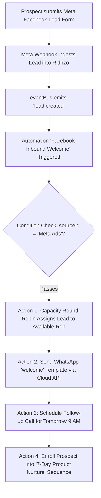
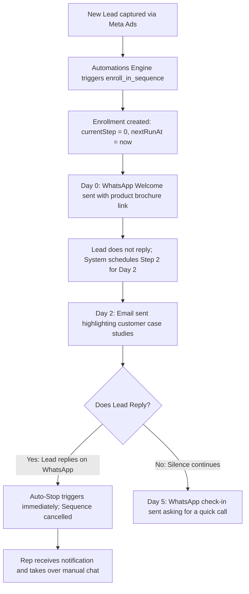

# Automations & Sequences

Automation rules and builder, drip sequences (list, detail, edit), and their product summaries.

> Consolidated from 7 source file(s). Content is verbatim; headings are nested two levels deeper under each section. Edit the original files if they still exist, then regenerate.

## Contents

1. [Ridhzo "Automations" Engine: Product & Marketing Specification](#1-ridhzo-automations-engine-product--marketing-specification) — `docs/AUTOMATIONS.md`
2. [Ridhzo "Create Automation" & Workflow Builder: Product & Marketing Specification](#2-ridhzo-create-automation--workflow-builder-product--marketing-specification) — `docs/CREATE_AUTOMATION.md`
3. [Ridhzo "Sequences" Engine: Product & Marketing Specification](#3-ridhzo-sequences-engine-product--marketing-specification) — `docs/SEQUENCES.md`
4. [Ridhzo Sequence Detail & Live Funnel Visualizer: Product & Marketing Specification](#4-ridhzo-sequence-detail--live-funnel-visualizer-product--marketing-specification) — `docs/SEQUENCE_DETAIL.md`
5. [Ridhzo Sequence Editor & AI Drip Refinement: Product & Marketing Specification](#5-ridhzo-sequence-editor--ai-drip-refinement-product--marketing-specification) — `docs/SEQUENCE_EDIT.md`
6. [Automations (WHEN → IF → THEN)](#6-automations-when--if--then) — `docs/product-kb/12_AUTOMATIONS.md`
7. [Sequences (Automatic Drip Follow-ups)](#7-sequences-automatic-drip-follow-ups) — `docs/product-kb/13_SEQUENCES.md`

---

## 1. Ridhzo "Automations" Engine: Product & Marketing Specification

> Source: `docs/AUTOMATIONS.md`

### Ridhzo "Automations" Engine: Product & Marketing Specification

> **Document Type:** Product Architecture, Feature Analysis & Website Marketing Reference  
> **Target Audience:** Chief Revenue Officers, Sales Directors, Revenue Operations Managers, Growth Engineers  
> **Scope:** Automations Hub (`/automations`), Workflow Builder (`/automations/create`, `/automations/[id]/edit`), Event Bus Dispatcher (`handlers.ts`), Execution Engine (`AutomationEngine.ts`), Distributed Worker (`automationWorker.ts`), Prebuilt Templates, and Multi-Condition Matching (`conditions.ts`).  
> **Source Verification:** Verified against live Ridhzo codebase (`src/app/(dashboard)/automations/page.tsx`, `AutomationBuilder.tsx`, `AutomationCard.tsx`, `AutomationTemplates.tsx`, `engine.ts`, `schema.ts`, `templates.ts`, `automationWorker.ts`, `handlers.ts`, `conditions.ts`, and PostgreSQL schema `src/db/schema/automations.ts`).

---

#### 1. Executive Overview

Speed and consistency define modern revenue teams. When a high-intent lead submits an inquiry, every second of delay reduces conversion probability. Yet, in most organizations, high-friction administrative tasks—manually routing leads, assigning sales representatives, sending welcome messages, setting reminder tasks, and enrolling prospects into nurture sequences—rely on human memory and manual entry.

**Ridhzo’s Automations Engine** is an event-driven, distributed workflow automation platform built directly into the CRM core:
1. **Event-Driven Reactive Architecture:** Listens directly to domain events emitted across the application (lead creation, assignment changes, status mutations, follow-up completions, and overdue escalations).
2. **Visual "WHEN → IF → THEN" Builder:** A clean interface enabling non-technical revenue leaders to define triggers, filter rules (source, company, status, custom fields, tags), and multi-step action sequences without writing code.
3. **1-Click Prebuilt Templates:** Out-of-the-box workflow recipes for the four most critical revenue workflows (instant WhatsApp welcome, automatic next-day follow-up, overdue manager alert, and won-deal referral request).
4. **Capacity-Aware Smart Routing:** Beyond basic 1-to-1 rep assignment, the engine supports automated round-robin assignment load-balanced by real-time rep workload and capacity caps.
5. **Enterprise-Grade Resilience:** Built on a distributed BullMQ queue with strict idempotency keys, automatic 3-attempt exponential backoff, recursive loop suppression, and partial-action fault tolerance.

```
┌────────────────────────────────────────────────────────────────────────────────────────┐
│                        RIDHZO EVENT-DRIVEN AUTOMATION LIFECYCLE                        │
└────────────────────────────────────────────────────────────────────────────────────────┘
                                              │
                      ┌───────────────────────┴───────────────────────┐
                      ▼                                               ▼
         [Inbound Lead Capture]                             [CRM State Change]
        Meta Ads, Webhooks, Forms                   Status changed, Follow-up overdue
                      │                                               │
                      └───────────────────────┬───────────────────────┘
                                              ▼
                               ┌─────────────────────────────┐
                               │     eventBus (emitter.ts)   │
                               │  lead.created, etc.         │
                               └─────────────────────────────┘
                                              │
                                              ▼
                               ┌─────────────────────────────┐
                               │  handlers.ts: dispatchTrigger│
                               │  • Loop Guard: source≠auto  │
                               │  • Org Tenancy Isolation    │
                               │  • Deduplication Key        │
                               └─────────────────────────────┘
                                              │
                                              ▼
                               ┌─────────────────────────────┐
                               │  BullMQ: automations Queue  │
                               │  Attempts: 3, Backoff: 30s  │
                               └─────────────────────────────┘
                                              │
                                              ▼
                               ┌─────────────────────────────┐
                               │   automationWorker.ts       │
                               │  Idempotency check in DB    │
                               │  (automation_runs table)    │
                               └─────────────────────────────┘
                                              │
                                              ▼
                               ┌─────────────────────────────┐
                               │    AutomationEngine.ts      │
                               └─────────────────────────────┘
                                              │
                     ┌────────────────────────┴────────────────────────┐
                     ▼                                                 ▼
             [EVALUATE CONDITIONS]                             [EXECUTE ACTIONS]
          • Source ID match                                  1. assign_round_robin (Capacity)
          • Advanced field / tag match                       2. schedule_follow_up (dueInDays)
          • Custom fields: customData.foo                    3. send_whatsapp (Meta Cloud API)
          • Boolean AND / OR trees                           4. enroll_in_sequence (Drip)
```

---

#### 2. Everything Included in the Automations Subsystem

##### A. The Automations Hub (`/automations`)
The control center for organizational workflow automation:
* **Workflow Directory:** Displays all active and inactive automations configured within the tenant organization.
* **1-Tap Power Toggles (`AutomationCard.tsx`):** Enable or pause workflows instantly with a single click. Active workflows execute immediately upon receiving events; paused workflows are skipped safely.
* **Inline Management:** Direct triggers for editing existing workflows (`/automations/[id]/edit`) or deleting outdated automations with relational cascade cleanup.
* **Empty State Guidance:** Contextual guidance and instant access to templates when no workflows are active.

##### B. Prebuilt Automation Templates (`AutomationTemplates.tsx`)
Four enterprise templates designed for immediate time-to-value:
1. **Welcome WhatsApp on new lead:**  
   * *Trigger:* `lead.created`  
   * *Action:* Sends an instant Meta-approved WhatsApp welcome template (`welcome`) with personal token variables (`{{name}}`). Guarantees sub-minute speed-to-lead.
2. **Schedule a first follow-up:**  
   * *Trigger:* `lead.created`  
   * *Action:* Automatically creates a scheduled follow-up task due exactly 24 hours out (`dueInDays: 1`), ensuring zero inbound prospects are neglected.
3. **Nudge on overdue follow-ups:**  
   * *Trigger:* `follow_up.overdue`  
   * *Action:* Posts an urgent alert note on the lead's activity timeline, prompting the rep to take immediate corrective action.
4. **Ask for a referral on won deals:**  
   * *Trigger:* `lead.status_changed` (filtered to `won`)  
   * *Action:* Logs a reminder task prompting the account manager to thank the buyer and request customer referrals.

##### C. Visual "WHEN → IF → THEN" Builder (`AutomationBuilder.tsx`)
A flexible, three-tier rule builder:

###### 1. "WHEN" (Triggers)
Defines the real-time event that initiates the workflow:
* `lead.created`: Fires immediately when a lead is captured via Meta Lead Ads, API webhooks, CSV import, or manual entry.
* `lead.assigned`: Fires when a lead ownership transitions to a representative.
* `lead.status_changed`: Fires when a lead moves across lifecycle states (e.g., `new` → `active`, `contacted` → `won`).
* *Underlying Engine Triggers:* Also supports `lead.stage_changed`, `lead.tag_added`, `follow_up.scheduled`, `follow_up.completed`, `follow_up.overdue`, and `task.completed`.

###### 2. "IF" (Conditions & Filtering)
Filters which leads should execute the workflow to prevent unwanted mass execution:
* **Source Filtering:** Dropdown selector filtering by lead channel (e.g., *Facebook Ads*, *Google Search*, *Website Consultation Form*, or *Any Source*).
* **Advanced Field Matching:** Matches any standard lead attribute (`status`, `company`, `email`, `phone`, `expectedValue`).
* **Tags & Segmentation:** Evaluates organizational tags assigned to the lead.
* **Custom Fields (`customData.*`):** Dynamically inspects unstructured JSON custom fields (e.g., `customData.budget`, `customData.industry`).
* **Operators:** `equals`, `not_equals`, `contains`, `does_not_contain`, `greater_than`, `less_than`.
* **Boolean Nesting:** Pure recursive condition tree engine supporting complex `AND` / `OR` group logic.

###### 3. "THEN" (Sequential Multi-Step Actions)
Executes an ordered list of tasks sequentially:
* **Assign Lead (`assign_lead`):** Direct assignment to a specific team member.
* **Assign Round-Robin (`assign_round_robin`):** Automatic capacity-aware distribution across active reps, respecting configurable capacity limits (`maxCapacity`).
* **Change Status (`change_status`):** Advances the lead’s stage automatically (e.g., marks a lead `contacted` once outreach is sent).
* **Schedule Follow-up (`schedule_follow_up`):** Generates a formal follow-up task with relative offsets (`dueInDays`, `dueInHours`, `dueInMinutes`) or an absolute datetime override.
* **Create Task (`create_task`):** Logs internal rep to-dos linked to the lead.
* **Add Note (`add_note`):** Injects automated operational or audit notes onto the customer's timeline.
* **Send WhatsApp (`send_whatsapp`):** Dispatches pre-approved Meta Business API WhatsApp templates with personalized token substitution (`{{name}}`, etc.).
* **Enroll in Sequence (`enroll_in_sequence`):** Enrolls the lead into multi-day automated drip campaigns.

---

#### 3. Technical Architecture & Database Models

##### Database Schema (`src/db/schema/automations.ts`)

Ridhzo structures automations into five specialized relational tables:

```typescript
export const automations = pgTable('automations', {
  id: uuid('id').defaultRandom().primaryKey(),
  organizationId: uuid('organization_id').references(() => organizations.id, { onDelete: 'cascade' }).notNull(),
  name: varchar('name', { length: 255 }).notNull(),
  isActive: boolean('is_active').default(true).notNull(),
  createdAt: timestamp('created_at').defaultNow().notNull(),
  updatedAt: timestamp('updated_at').defaultNow().notNull(),
}, (table) => ({
  orgIdx: index('automations_org_idx').on(table.organizationId),
}));

export const automationTriggers = pgTable('automation_triggers', {
  id: uuid('id').defaultRandom().primaryKey(),
  automationId: uuid('automation_id').references(() => automations.id, { onDelete: 'cascade' }).notNull(),
  type: varchar('type', { length: 255 }).notNull(), // 'lead.created', 'lead.status_changed', etc.
  config: jsonb('config').default({}),
});

export const automationConditions = pgTable('automation_conditions', {
  id: uuid('id').defaultRandom().primaryKey(),
  automationId: uuid('automation_id').references(() => automations.id, { onDelete: 'cascade' }).notNull(),
  config: jsonb('config').default({}), // Recursive { type: 'AND' | 'OR', conditions: [...] }
});

export const automationActions = pgTable('automation_actions', {
  id: uuid('id').defaultRandom().primaryKey(),
  automationId: uuid('automation_id').references(() => automations.id, { onDelete: 'cascade' }).notNull(),
  type: varchar('type', { length: 255 }).notNull(), // 'assign_lead', 'send_whatsapp', etc.
  config: jsonb('config').default({}),
  orderIndex: integer('order_index').default(0),
});

export const automationRuns = pgTable('automation_runs', {
  id: uuid('id').defaultRandom().primaryKey(),
  automationId: uuid('automation_id').references(() => automations.id, { onDelete: 'cascade' }).notNull(),
  leadId: uuid('lead_id').references(() => leads.id, { onDelete: 'cascade' }),
  status: varchar('status', { length: 50 }).notNull(), // 'pending' | 'running' | 'completed' | 'skipped' | 'failed'
  error: varchar('error', { length: 255 }),
  startedAt: timestamp('started_at').defaultNow().notNull(),
  completedAt: timestamp('completed_at'),
  idempotencyKey: varchar('idempotency_key', { length: 255 }).unique(),
  retryCount: integer('retry_count').default(0).notNull(),
});
```

---

#### 4. Resilience, Safety & Enterprise Reliability

##### 1. Cascading Loop Prevention (Infinite Trigger Guard)
A common vulnerability in CRM automation engines occurs when an automation modifies a lead, which emits a new event, inadvertently re-triggering another automation in an infinite loop.
* **The Guard:** In [`src/lib/events/handlers.ts`](file:///Users/naveenadicharla/Documents/ridhzo/src/lib/events/handlers.ts):
  ```typescript
  if (payload.source === "automation") return;
  ```
* Every database mutation executed by `AutomationEngine` tags its operation with `source: "automation"`. The event dispatcher immediately suppresses these secondary events, preventing status ping-pong or assignment loops.

##### 2. Multi-Tenant Boundary Isolation
* Triggers look up the lead's owner organization in the database (`leads.organizationId`).
* Only active automations strictly belonging to the lead's organization (`automations.organizationId = lead.organizationId`) are retrieved. Cross-tenant event leakage is architecturally impossible.

##### 3. Distributed Idempotency & De-duplication
* **Composite Idempotency Key:**
  $$\text{idempotencyKey} = \text{automationId} + \text{"-"} + \text{leadId} + \text{"-"} + \text{eventType} [ + \text{"-"} + \text{discriminator} ]$$
* **Event Discriminator:** For one-time events like `lead.created`, the key is unique per lead. For recurring triggers (`lead.status_changed`, `lead.assigned`), the key includes the new status or assignee to allow valid future transitions while suppressing duplicate firings of the exact same transition.
* **BullMQ + DB Unique Constraint:** BullMQ enforces `jobId = idempotencyKey`, immediately discarding duplicate enqueues. Concurrently, `automation_runs.idempotency_key` uses `.onConflictDoNothing()`.

##### 4. Fault-Tolerant Partial Execution
* Actions execute sequentially. If a non-fatal third-party action fails (e.g., a WhatsApp message fails because the recipient's phone number is malformed or the tenant has not configured their WhatsApp BSP), the engine does **not** abort.
* It continues executing remaining steps (e.g., assigning the lead, logging the audit note, and enrolling the lead in a nurture sequence).
* Only when **all** actions fail does the engine throw an error, triggering BullMQ's 3-attempt exponential backoff (30-second delay).

##### 5. Automated Database Hygiene
* To prevent unbounded database growth from high-volume lead capture, `pruneOldAutomationRuns(retentionDays = 30)` runs periodically to purge execution logs older than 30 days.

---

#### 5. Master Trigger & Action Reference

##### Supported Triggers

| Trigger Identifier | UI Label | Event Source | Description & Payload |
| :--- | :--- | :--- | :--- |
| `lead.created` | **Lead created** | `eventBus.emit('lead.created')` | Fires on lead intake via web form, Meta Ad, API, or manual creation. |
| `lead.assigned` | **Lead assigned** | `eventBus.emit('lead.assigned')` | Fires when lead owner changes. Payload contains `ownerId` and `assignedById`. |
| `lead.status_changed` | **Lead status changed** | `eventBus.emit('lead.status_changed')` | Fires when lifecycle status is updated. Discriminates by `newStatus`. |
| `lead.stage_changed` | **Stage changed** | `eventBus.emit('lead.stage_changed')` | Fires on pipeline Kanban movement. Discriminates by `stageId`. |
| `lead.tag_added` | **Tag added** | `eventBus.emit('lead.tag_added')` | Fires when a representative or import attaches a tag. |
| `follow_up.scheduled` | **Follow-up scheduled** | `eventBus.emit('follow_up.scheduled')` | Fires when a task is booked. |
| `follow_up.completed` | **Follow-up completed** | `eventBus.emit('follow_up.completed')` | Fires when a task is marked done. |
| `follow_up.overdue` | **Follow-up overdue** | `eventBus.emit('follow_up.overdue')` | Fires when a follow-up crosses its deadline. |
| `task.completed` | **Task completed** | `eventBus.emit('task.completed')` | Fires when a general task is finished. |

##### Supported Actions

| Action Identifier | Action Name | Configuration Schema | Operational Effect |
| :--- | :--- | :--- | :--- |
| `assign_lead` | **Assign lead** | `{"userId": "<UUID>"}` | Directly assigns the lead to a specific team member. |
| `assign_round_robin` | **Round-robin balance** | `{"maxCapacity": 25}` | Evaluates active rep workloads and assigns to the rep with greatest available capacity. |
| `change_status` | **Change status** | `{"status": "contacted"}` | Updates lead status, records status history, and fires conversion tracking. |
| `schedule_follow_up` | **Schedule follow-up** | `{"title": "...", "dueInDays": 1}` | Creates a pending follow-up task with a relative offset, updating `leads.nextFollowUpAt`. |
| `create_task` | **Create task** | `{"title": "...", "dueInHours": 4}` | Schedules an internal rep task. |
| `add_note` | **Add note** | `{"content": "..."}` | Writes an automated entry onto the lead's chronological activity timeline. |
| `send_whatsapp` | **Send WhatsApp** | `{"templateName": "welcome", "variables": ["{{name}}"]}` | Dispatches a Meta Business Cloud API template message to the lead. |
| `enroll_in_sequence` | **Enroll in sequence** | `{"sequenceId": "<UUID>"}` | Enrolls the lead into a multi-day automated drip communication sequence. |

---

#### 6. Daily Workflows & Real-World Use Cases

##### 1. Inbound Facebook Ad Intake (Zero-Touch Speed-to-Lead)

1. **Intake:** A prospect submits a form on a Meta Instagram ad.
2. **Evaluation:** Ridhzo verifies the lead originated from the Meta Ads source.
3. **Execution:**
   * Rep assignment is balanced across the sales team based on capacity.
   * A personalized WhatsApp greeting arrives on the prospect’s phone in under 30 seconds.
   * A reminder task is automatically booked on the assigned rep’s calendar for 9:00 AM tomorrow.
   * The prospect is enrolled into a nurture drip sequence.

##### 2. High-Value Escalation Workflow
1. **Trigger:** `lead.created`.
2. **Condition:** `customData.budget greater_than 50000`.
3. **Action:**
   * Assign directly to Senior Enterprise Account Executive.
   * Set lead priority to `high`.
   * Post timeline alert note: *"High-budget enterprise inbound. Priority response required."*
   * Book immediate 1-hour follow-up task.

---

#### 7. Marketing-Friendly Feature Explanation

##### Why Revenue Leaders Build on Ridhzo Automations

In sales, timing is everything. Studies prove that reaching out to an inbound lead within 5 minutes makes you 21 times more likely to qualify the opportunity. Yet most sales teams lose hours manually copying lead details, pinging reps on Slack, and typing repetitive welcome messages.

**Ridhzo Automations turns your sales playbook into an autonomous 24/7 revenue engine.**

* **Respond Before Your Competitors Wake Up:** The instant a prospect fills out a form, Ridhzo triggers personalized WhatsApp greetings, assigns the right representative, and books their discovery call—completely hands-free.
* **No-Code Simplicity, Enterprise Power:** Build sophisticated multi-step workflows in minutes using our intuitive "When → If → Then" visual builder. Choose from prebuilt templates or create custom logic tailored to your exact sales process.
* **Intelligent Capacity-Aware Routing:** Stop dumping leads on overloaded reps. Ridhzo’s smart round-robin distribution balances deals across your team based on real-time rep capacity.
* **Bulletproof Reliability:** Engineered with distributed BullMQ queues, de-duplication locks, and infinite loop protection, Ridhzo automations execute flawlessly at enterprise scale.

---

#### 8. Feature List for Website Marketing

* **Visual "When → If → Then" Workflow Builder**  
  A drag-and-drop, no-code automation canvas that empowers sales operations to design multi-step lead workflows in minutes.

* **Instant-Response Speed-to-Lead**  
  Eliminate manual delays by triggering automated WhatsApp greetings and calendar invites the moment a lead arrives.

* **1-Click Prebuilt Revenue Recipes**  
  Deploy proven workflow templates for inbound welcomes, next-day follow-ups, overdue deal nudges, and referral requests.

* **Capacity-Aware Round-Robin Routing**  
  Automatically balance inbound lead distribution across your sales team based on individual rep capacity and active deal load.

* **Deep Multi-Condition Filtering**  
  Filter automations by lead source, deal size, custom fields, company attributes, and organizational tags using advanced `AND` / `OR` logic.

* **Multi-Channel Sequential Execution**  
  Execute ordered action chains: assign reps, update statuses, schedule follow-up tasks, log notes, send WhatsApps, and trigger drip sequences.

* **Automated Drip Sequence Enrollment**  
  Seamlessly route qualified inbound leads directly into multi-step nurture sequences based on source or customer intent.

* **Infinite Loop & Race Condition Protection**  
  Enterprise safety guards prevent cascading trigger loops, status ping-pong, and duplicate outbound messages.

* **Real-Time Audit Trail & Run Logs**  
  Full transparency into every workflow execution with detailed status indicators, retry counts, and error diagnostics.

---

#### 9. Page Blueprints & Wireframes

##### Automations Hub (`/automations`)
```
+====================================================================================+
| Automations                                                [+ Create Automation]   |
+====================================================================================+
| START FROM A TEMPLATE                                                              |
| +--------------------+ +--------------------+ +--------------------+ +------------+|
| | [Zap] Welcome WA   | | [Zap] First Call   | | [Zap] Overdue Alert| | [Zap] Won  ||
| | Instant WhatsApp   | | Book call 1d out   | | Nudge rep on stall | | Referral   ||
| | [Use template]     | | [Use template]     | | [Use template]     | | [Use templ]||
| +--------------------+ +--------------------+ +--------------------+ +------------+|
+====================================================================================+
| ACTIVE AUTOMATIONS                                                                 |
|                                                                                    |
| +--------------------------------------------------------------------------------+ |
| | Facebook Ads -> Instant Welcome & Sequence               [Active]              | |
| | Trigger: lead.created | Conditions: Source = Facebook    [Pause] [Edit] [Trash]| |
| +--------------------------------------------------------------------------------+ |
| | High-Value Inbound Escalation                            [Active]              | |
| | Trigger: lead.created | Conditions: Budget > $50,000     [Pause] [Edit] [Trash]| |
| +--------------------------------------------------------------------------------+ |
| | Stalled Deal Manager Nudge                               [Inactive]            | |
| | Trigger: follow_up.overdue                               [Activate][Edit][Trash| |
| +--------------------------------------------------------------------------------+ |
+====================================================================================+
```

##### Automation Builder Layout (`/automations/create`)
```
+====================================================================================+
| [<- Go back]  Create Automation                                                    |
+====================================================================================+
| Automation Name: [ Facebook leads -> welcome + nurture                           ] |
|                                                                                    |
| 1. WHEN (trigger)                                                                  |
|    [ Lead created                                                       v ]        |
|                                                                                    |
| 2. IF (conditions) — optional                                                      |
|    Lead source:           [ Facebook Ads                                v ]        |
|    Advanced field match:  [ status           ] [ Equals v ] [ new                ] |
|                                                                                    |
| 3. THEN (actions) — Runs in order                                                  |
|    +-----------------------------------------------------------------------------+ |
|    | (1) [ Assign round-robin (balance across team)                            v ] |
|    |     Config: {"maxCapacity": 25}                                             | |
|    +-----------------------------------------------------------------------------+ |
|    | (2) [ Send WhatsApp                                                       v ] |
|    |     Config: {"templateName": "welcome", "variables": ["{{name}}"]}          | |
|    +-----------------------------------------------------------------------------+ |
|    | (3) [ Enroll in sequence                                                  v ] |
|    |     Sequence: [ 7-Day Product Onboarding Nurture                          v ] |
|    +-----------------------------------------------------------------------------+ |
|    [+ Add action]                                                                  |
|                                                                                    |
| [ Save automation ]                                                                |
+====================================================================================+
```

---

#### 10. Technical Reference

##### Routes & Entry Points
* **Automations Dashboard:** [`src/app/(dashboard)/automations/page.tsx`](file:///Users/naveenadicharla/Documents/ridhzo/src/app/(dashboard)/automations/page.tsx)
* **Create Automation:** [`src/app/(dashboard)/automations/create/page.tsx`](file:///Users/naveenadicharla/Documents/ridhzo/src/app/(dashboard)/automations/create/page.tsx)
* **Edit Automation:** [`src/app/(dashboard)/automations/[id]/edit/page.tsx`](file:///Users/naveenadicharla/Documents/ridhzo/src/app/(dashboard)/automations/[id]/edit/page.tsx)

##### UI Components (`src/components/automations/`)
* **Visual Builder:** [AutomationBuilder.tsx](file:///Users/naveenadicharla/Documents/ridhzo/src/components/automations/AutomationBuilder.tsx)
* **Workflow Card:** [AutomationCard.tsx](file:///Users/naveenadicharla/Documents/ridhzo/src/components/automations/AutomationCard.tsx)
* **Template Selector:** [AutomationTemplates.tsx](file:///Users/naveenadicharla/Documents/ridhzo/src/components/automations/AutomationTemplates.tsx)

##### Core Engine & Services
* **Automation Engine:** [`src/lib/automation/engine.ts`](file:///Users/naveenadicharla/Documents/ridhzo/src/lib/automation/engine.ts) (`AutomationEngine.evaluateAndExecute`, `resolveDueAt`)
* **Event Dispatcher & Loop Guard:** [`src/lib/events/handlers.ts`](file:///Users/naveenadicharla/Documents/ridhzo/src/lib/events/handlers.ts) (`dispatchTrigger`, loop suppression `source === "automation"`)
* **Condition Evaluator:** [`src/lib/leads/conditions.ts`](file:///Users/naveenadicharla/Documents/ridhzo/src/lib/leads/conditions.ts) (`evaluateConditionGroup`, `readField`)
* **Template Definitions:** [`src/lib/automation/templates.ts`](file:///Users/naveenadicharla/Documents/ridhzo/src/lib/automation/templates.ts) (`AUTOMATION_TEMPLATES`, `buildTemplatePayload`)
* **Server Actions:** [`src/lib/actions/automations.ts`](file:///Users/naveenadicharla/Documents/ridhzo/src/lib/actions/automations.ts) (`createAutomation`, `updateAutomation`, `createAutomationFromTemplate`, `toggleAutomation`, `deleteAutomation`)

##### Background Queue & Workers
* **BullMQ Worker:** [`src/lib/jobs/workers/automationWorker.ts`](file:///Users/naveenadicharla/Documents/ridhzo/src/lib/jobs/workers/automationWorker.ts) (`automationWorker`, `AUTOMATION_QUEUE_NAME = "automations"`, concurrency 3)
* **Database Maintenance:** [`pruneOldAutomationRuns`](file:///Users/naveenadicharla/Documents/ridhzo/src/lib/jobs/workers/automationWorker.ts) (purges runs $>30$ days)

##### Database Tables (`src/db/schema/automations.ts`)
* `automations`: Primary tenant automation records and active state.
* `automationTriggers`: Event trigger definitions.
* `automationConditions`: JSONB condition trees.
* `automationActions`: Ordered action pipeline.
* `automationRuns`: Execution audit trail with unique idempotency keys.

---

## 2. Ridhzo "Create Automation" & Workflow Builder: Product & Marketing Specification

> Source: `docs/CREATE_AUTOMATION.md`

### Ridhzo "Create Automation" & Workflow Builder: Product & Marketing Specification

> **Document Type:** Product Architecture, Feature Analysis & Website Marketing Reference  
> **Target Audience:** Chief Revenue Officers, Sales Operations Directors, Growth Marketers, CRM Administrators  
> **Scope:** Create Automation Surface (`/automations/create`), Edit Automation Surface (`/automations/[id]/edit`), Visual Rule Canvas (`AutomationBuilder.tsx`), Condition Engine (`conditions.ts`), Transactional Persistence (`automations.ts`), Capacity Routing (`capacityAssignmentService.ts`), and Timing Offsets (`resolveDueAt`).  
> **Source Verification:** Verified against live Ridhzo codebase (`src/app/(dashboard)/automations/create/page.tsx`, `src/app/(dashboard)/automations/[id]/edit/page.tsx`, `AutomationBuilder.tsx`, `engine.ts`, `schema.ts`, `conditions.ts`, `sourceService.ts`, `sequenceService.ts`, `capacityAssignmentService.ts`, `src/lib/actions/automations.ts`, and PostgreSQL schema).

---

#### 1. Executive Overview

In competitive sales environments, standard "if this, then that" automation tools frequently fall short. They either force non-technical sales managers into intimidating, spaghetti-like node editors or restrict them to simplistic, single-step triggers that cannot inspect custom attributes or balance rep capacity.

The **Ridhzo Create Automation Suite** (`/automations/create`) delivers an intuitive, three-tiered visual canvas designed specifically for revenue operations:
1. **The "WHEN → IF → THEN" Mental Model:** A clean, vertical rule canvas that mirrors human logic. Teams specify the initiating CRM event (WHEN), optional multi-layered lead filters (IF), and an ordered sequence of automated tasks (THEN).
2. **Context-Aware Dynamic Selectors:** The builder automatically queries the tenant's real-time configuration—populating lead sources (Facebook Ads, Web Forms, Inbound Webhooks) and active multi-step sequences directly into visual dropdown menus.
3. **Capacity-Aware Team Load Balancing:** Includes native intelligent round-robin actions that inspect real-time rep workload (`maxCapacity`) and route deals to the agent with the highest available bandwidth.
4. **Relative Timing Offsets (`resolveDueAt`):** Solves the classic automation pitfall of hardcoded dates. Follow-ups and tasks calculate deadlines dynamically relative to the execution moment (e.g., `dueInDays: 1`, `dueInHours: 4`, `dueInMinutes: 30`).
5. **Transactional Integrity & Atomic Updates:** Whether creating a new rule or updating an active workflow, changes persist atomically within database transactions, preventing partial or broken state.

```
┌────────────────────────────────────────────────────────────────────────────────────────┐
│                        RIDHZO "CREATE AUTOMATION" ARCHITECTURE                         │
└────────────────────────────────────────────────────────────────────────────────────────┘
                                              │
                      ┌───────────────────────┴───────────────────────┐
                      ▼                                               ▼
             [/automations/create]                         [/automations/[id]/edit]
         Loads sources & sequences                     Fetches existing workflow + steps
                      │                                               │
                      └───────────────────────┬───────────────────────┘
                                              ▼
                             ┌─────────────────────────────────┐
                             │     AutomationBuilder.tsx       │
                             │  • Rule Name & Active State     │
                             │  • 1. WHEN (Trigger Select)     │
                             │  • 2. IF (Source & Field Match) │
                             │  • 3. THEN (Ordered Actions)    │
                             └─────────────────────────────────┘
                                              │
                                       [Client Save]
                                 • Upfront JSON Validation
                                 • RBAC: automations.manage
                                              │
                                              ▼
                             ┌─────────────────────────────────┐
                             │  createAutomation Server Action │
                             │  (Atomic DB Transaction)        │
                             └─────────────────────────────────┘
                                              │
                     ┌────────────────────────┼────────────────────────┐
                     ▼                        ▼                        ▼
         INSERT into automations    INSERT into triggers      INSERT into actions
         • organizationId           • type                    • orderIndex (0, 1, 2)
         • name, isActive           • config                  • type, config
                                              │
                                              ▼
                                    INSERT into conditions
                                    • Recursive AND/OR group
```

---

#### 2. The 3-Tier Rule Canvas Structure

##### 1. Automation Metadata
* **Automation Name:** Required descriptive text field (e.g., *"Facebook Leads → Welcome WhatsApp + Day 1 Call"*). Maximum 255 characters.
* **Active Status Toggle:** Controls whether the automation is live immediately upon saving (`isActive = true`) or saved in a draft/paused state (`isActive = false`).

---

##### 2. Tier 1: WHEN (Trigger Configuration)

The **WHEN** block defines the exact lifecycle event that invokes the automation:

```
┌────────────────────────────────────────────────────────────┐
│ 1. WHEN (trigger)                                          │
│    [ Lead created                                     v ]  │
└────────────────────────────────────────────────────────────┘
```

###### Supported Primary Triggers (Dropdown UI):
* **`lead.created` (Lead created):** Fires the instant a prospect enters the CRM via Meta Lead Ads webhooks, landing page forms, API endpoints, or manual intake.
* **`lead.assigned` (Lead assigned):** Fires whenever lead ownership is granted to a representative or transferred between reps.
* **`lead.status_changed` (Lead status changed):** Fires when a deal progresses across lifecycle states (e.g., `new` → `active`, `contacted` → `won`, `lost`).

###### Full Schema Triggers (Supported by Underlying Engine):
* `lead.stage_changed`: Fires when a lead card moves across Kanban pipeline stages.
* `lead.tag_added`: Fires when a user or batch process attaches a new categorization tag.
* `follow_up.scheduled`: Fires when a call, meeting, or task is booked.
* `follow_up.completed`: Fires when a rep marks a scheduled outreach completed.
* `follow_up.overdue`: Fires when a scheduled task crosses its deadline without completion.
* `task.completed`: Fires upon fulfillment of a general rep task.

---

##### 3. Tier 2: IF (Conditions & Filtering) — Optional

The **IF** block provides precision filtering to ensure automations execute only on target prospects, avoiding unwanted mass actions:

```
┌────────────────────────────────────────────────────────────┐
│ 2. IF (conditions) — optional                              │
│    Lead source:                                            │
│    [ Facebook Ads                                     v ]  │
│                                                            │
│    Advanced field match — optional:                        │
│    [ status           ] [ Equals v ] [ new               ] │
└────────────────────────────────────────────────────────────┘
```

###### 1. Lead Source Selector
Dynamically populated with real-time sources from [LeadSourceService.getSources](file:///Users/naveenadicharla/Documents/ridhzo/src/domains/leads/sourceService.ts):
* **`__any__` (Any source):** Triggers regardless of origin channel.
* **Specific Source:** Restricts execution to specific channels (e.g., *Facebook Lead Ads*, *Google Ads Webhook*, *Website Contact Form*, *Cold Outreach List*).

###### 2. Advanced Field Matcher
Matches any attribute of the customer record:
* **Target Field:**
  * Native fields: `status`, `company`, `email`, `phone`, `expectedValue`, `priority`.
  * Lead Tags: Evaluates tags attached to the lead (e.g., `VIP`, `Enterprise`).
  * Custom Fields (`customData.*`): Dynamically inspects tenant custom fields (e.g., `customData.budget`, `customData.industry`, `customData.propertyType`).
* **Comparison Operators:**
  * `equals`: Exact case-insensitive match (`String(val).toLowerCase()`).
  * `not_equals`: Excludes specific values.
  * `contains`: Substring search.
  * `does_not_contain`: Negative substring search.
  * `greater_than`: Numeric comparison (e.g., `expectedValue > 10000`).
  * `less_than`: Numeric comparison.
* **Condition Engine Logic:** The builder combines the selected Source and Advanced Field into a composite `AND` condition group stored as structured JSONB:
  ```json
  {
    "type": "AND",
    "conditions": [
      { "field": "sourceId", "operator": "equals", "value": "uuid-facebook-ads" },
      { "field": "status", "operator": "equals", "value": "new" }
    ]
  }
  ```

---

##### 4. Tier 3: THEN (Ordered Action Sequence)

The **THEN** block represents an ordered, sequential pipeline of actions that execute step-by-step when conditions pass:

```
┌────────────────────────────────────────────────────────────┐
│ 3. THEN (actions) — Runs in order                          │
│                                                            │
│ (1) [ Assign round-robin (balance across team)        v ]  │
│     Config: {"maxCapacity": 25}                            │
│                                                            │
│ (2) [ Send WhatsApp                                   v ]  │
│     Config: {"templateName": "welcome", "variables": ["{{name}}"]}
│                                                            │
│ (3) [ Enroll in sequence                              v ]  │
│     Sequence: [ 7-Day Inbound Nurture                 v ]  │
│                                                            │
│ [+ Add action]                                             │
└────────────────────────────────────────────────────────────┘
```

* **Visual Step Sequencing:** Each action displays a circular sequence badge (`1`, `2`, `3`...) indicating strict execution order (`orderIndex`).
* **Reorder & Removal:** Individual steps can be deleted via the trash icon button while preserving the rest of the chain.
* **Multi-Step Stacking:** Users can append unlimited actions by clicking **`+ Add action`**.

---

#### 3. Deep Dive: Supported Actions & Configuration Schemas

| Action Key | Display Label | Purpose & Mechanism | Config Payload Example |
| :--- | :--- | :--- | :--- |
| `assign_lead` | **Assign lead (to a person)** | Directly assigns lead ownership to a specific rep. Calls `AssignmentService.assignLead`. | `{"userId": "7b8e1f02-..."}` |
| `assign_round_robin` | **Assign round-robin (balance across team)** | Dynamically inspects rep workloads and assigns deal to the rep with greatest available capacity. Calls `CapacityAssignmentService.assignLeadWithCapacity`. | `{"maxCapacity": 25}` |
| `change_status` | **Change status** | Updates lead lifecycle stage, writes audit history, and updates conversion tracking. | `{"status": "contacted"}` |
| `add_note` | **Add note** | Writes an internal note on the lead's chronological timeline. Calls `ActivityService.addActivity`. | `{"content": "Automated intake note: High priority inbound."}` |
| `create_task` | **Create task** | Schedules an internal rep task with relative offset computation. | `{"title": "Verify business registration", "dueInHours": 4}` |
| `schedule_follow_up` | **Schedule follow-up** | Creates a formal customer follow-up, synchronizing `leads.nextFollowUpAt`. | `{"title": "First discovery call", "dueInDays": 1}` |
| `send_whatsapp` | **Send WhatsApp** | Dispatches a Meta Business Cloud API pre-approved template with token substitution. | `{"templateName": "welcome", "variables": ["{{name}}"]}` |
| `enroll_in_sequence` | **Enroll in sequence** | Enrolls the lead into a multi-step drip nurture sequence via friendly dropdown. | `{"sequenceId": "9c12a4..."}` |

---

#### 4. Intelligent Dynamic Capabilities

##### 1. Capacity-Aware Round-Robin Balancing (`CapacityAssignmentService`)
Unlike basic round-robin implementations that blindly distribute leads in a static circle—overloading busy reps and ignoring absent staff—Ridhzo's `assign_round_robin` action performs real-time capacity analysis:
1. **Queries Active Reps:** Evaluates all users in the organization where `isActive = true`.
2. **Counts Active Deals:** Computes each rep's current open pipeline (`status IN ('new', 'active')`).
3. **Calculates Remaining Bandwidth:**
   $$\text{capacityRemaining} = \max(0, \text{maxCapacity} - \text{activeCount})$$
   *(Default capacity is 25 deals, customizable per action config).*
4. **Selects Optimal Rep:** Ranks reps by available capacity descending; the rep with the greatest bandwidth receives the lead.
5. **Fail-Safe Protection:** If all reps have reached their maximum limit, an error is caught and logged, preventing deal assignment to overloaded agents.

##### 2. Relative Time Resolution (`resolveDueAt`)
A critical engineering challenge in CRM automation is scheduling tasks relative to when an event occurs. If an automation hardcoded an absolute date, subsequent leads would inherit expired deadlines.

Ridhzo’s [resolveDueAt](file:///Users/naveenadicharla/Documents/ridhzo/src/lib/automation/engine.ts) function computes timestamps dynamically at execution time:
* **`dueInMinutes`:** $\text{dueAt} = \text{now} + (\text{minutes} \times 60,000)$
* **`dueInHours`:** $\text{dueAt} = \text{now} + (\text{hours} \times 3,600,000)$
* **`dueInDays`:** $\text{dueAt} = \text{now} + (\text{days} \times 86,400,000)$
* **Absolute Override (`dueAt`):** Allows an exact ISO timestamp if required.

##### 3. Integrated Sequence Dropdown
When users select `enroll_in_sequence`:
* The builder replaces raw JSON input with a **Sequence Picker Dropdown**.
* It queries [SequenceService.list](file:///Users/naveenadicharla/Documents/ridhzo/src/domains/leads/sequenceService.ts) to populate all available drip sequences configured in the tenant workspace.
* Selecting a sequence automatically formats the underlying action config payload: `{"sequenceId": "..."}`.

##### 4. WhatsApp Cloud API Prerequisite Guard
Automated instant messaging requires Meta Business Cloud API integration. If a user selects `send_whatsapp`, the builder renders a contextual advisory banner:
> ⚠️ **Info:** Automated WhatsApp needs the WhatsApp Business API. In personal mode it is logged as a manual reminder instead.

---

#### 5. Persistence & Transactional Integrity

When a user clicks **"Save automation"**, the request is processed by [createAutomation](file:///Users/naveenadicharla/Documents/ridhzo/src/lib/actions/automations.ts) or [updateAutomation](file:///Users/naveenadicharla/Documents/ridhzo/src/lib/actions/automations.ts).

##### 1. RBAC Permission Gate
Mutations require the `automations.manage` role permission:
```typescript
const { organizationId } = await requirePermission("automations.manage");
```
Regular sales reps can view active automations, but only authorized administrators or sales operations managers can create or modify them.

##### 2. Transactional Atomicity (Zero Partial Saves)
Creating or editing an automation touches four separate relational tables (`automations`, `automationTriggers`, `automationConditions`, `automationActions`). To prevent orphaned rows or corrupted configurations:
```typescript
const newAutomation = await db.transaction(async (tx) => {
  // 1. Insert/Update parent automation record
  const [created] = await tx.insert(automations).values({ organizationId, name, isActive }).returning();
  
  // 2. Insert trigger definition
  await tx.insert(automationTriggers).values({ automationId: created.id, type: trigger.type, config: trigger.config });

  // 3. Insert condition tree
  if (conditions) {
    await tx.insert(automationConditions).values({ automationId: created.id, config: conditions });
  }

  // 4. Insert ordered action chain with explicit orderIndex
  for (let i = 0; i < actions.length; i++) {
    await tx.insert(automationActions).values({
      automationId: created.id,
      type: actions[i].type,
      config: actions[i].config,
      orderIndex: i,
    });
  }
  return created;
});
```
When editing an existing automation, `updateAutomation` executes an atomic wholesale replacement of child records within the transaction—guaranteeing that deleted steps or modified triggers never leave residual configurations.

---

#### 6. Real-World Blueprint Recipes

##### Recipe 1: High-Volume Inbound Meta Ad Playbook
* **Business Goal:** Instantly greet inbound Facebook Ad leads via WhatsApp, balance them across available SDRs, and book next-day calls.
* **Trigger (WHEN):** `lead.created`
* **Condition (IF):** `sourceId equals "Facebook Ads"`
* **Action 1 (THEN):** `assign_round_robin` (`{"maxCapacity": 30}`)
* **Action 2 (THEN):** `send_whatsapp` (`{"templateName": "welcome_v1", "variables": ["{{first_name}}"]}`)
* **Action 3 (THEN):** `schedule_follow_up` (`{"title": "Introductory Discovery Call", "dueInDays": 1}`)
* **Action 4 (THEN):** `enroll_in_sequence` (`{"sequenceId": "7-day-product-onboarding"}`)

##### Recipe 2: High-Value VIP Inbound Escalation
* **Business Goal:** Route high-budget enterprise prospects directly to a Senior Account Executive and flag priority.
* **Trigger (WHEN):** `lead.created`
* **Condition (IF):** `customData.budget greater_than 50000`
* **Action 1 (THEN):** `assign_lead` (`{"userId": "ae-user-uuid"}`)
* **Action 2 (THEN):** `change_status` (`{"status": "active"}`)
* **Action 3 (THEN):** `add_note` (`{"content": "🚨 HIGH TICKET INBOUND: Budget exceeds $50k. Immediate phone contact required."}`)
* **Action 4 (THEN):** `create_task` (`{"title": "Conduct background company research", "dueInHours": 2}`)

##### Recipe 3: Stalled Deal Alert on Overdue Follow-up
* **Business Goal:** Ensure deals do not slip when a rep misses their follow-up deadline.
* **Trigger (WHEN):** `follow_up.overdue`
* **Condition (IF):** `priority equals "high"`
* **Action 1 (THEN):** `add_note` (`{"content": "ALERT: Scheduled follow-up is past due. Manager notified."}`)

---

#### 7. Marketing-Friendly Feature Explanation

##### Why Revenue Operations Teams Love the Ridhzo Workflow Builder

Most CRMs force sales operations into a painful dilemma: settle for primitive 1-step notification tools, or spend thousands of dollars on third-party integration platforms that break whenever schemas change.

**Ridhzo’s Workflow Builder gives you enterprise automation power with no-code simplicity.**

* **The 3-Minute Workflow:** Build powerful multi-step sales engines in under three minutes. With intuitive "When → If → Then" structuring, anyone on your team can design automated processes without engineering help.
* **Smart Capacity Load Balancing:** Never burn out your top performers. Ridhzo’s built-in round-robin engine monitors active deal counts and automatically routes leads to reps who have the bandwidth to convert them.
* **Dynamic Time Intelligence:** Schedule tasks and follow-up calls that automatically adjust to when a lead arrives. Set calls for 30 minutes, 4 hours, or 1 business day after initial contact.
* **Seamless Drip Integration:** Connect inbound inquiries directly into automated nurture sequences with a single click.

---

#### 8. Feature List for Website Marketing

* **Visual "When → If → Then" Rule Canvas**  
  An intuitive, vertical workflow builder that translates sales playbooks into executable automation sequences in minutes.

* **Dynamic Workspace Synchronization**  
  Automatically pulls active lead sources, team members, and communication sequences into visual dropdown selectors.

* **Capacity-Aware Round-Robin Lead Routing**  
  Balances inbound opportunities across sales reps based on real-time open pipeline volume and configurable capacity limits.

* **Relative Time Offsets (`resolveDueAt`)**  
  Dynamically calculates task and follow-up due dates relative to trigger execution (`dueInMinutes`, `dueInHours`, `dueInDays`).

* **Unstructured Custom Field Filtering**  
  Filter automations using standard CRM fields, organizational tags, or custom JSON attributes (`customData.field`).

* **Multi-Condition Boolean Nesting**  
  Supports complex `AND` and `OR` condition trees with full comparison operators (`equals`, `contains`, `greater_than`).

* **Pre-Built Sequence Enrollment**  
  Directly enroll leads into multi-channel WhatsApp and email drip campaigns from within the automation pipeline.

* **Transactional Persistence & RBAC Security**  
  Every workflow creation and edit is guarded by `automations.manage` permissions and persisted atomically within database transactions.

---

#### 9. Page Blueprints & Wireframes

##### Create Automation Layout (`/automations/create`)
```
+====================================================================================+
| [<- Go back]  Create Automation                                                    |
+====================================================================================+
| Automation Name:                                                                   |
| [ Facebook leads -> welcome + nurture                                            ] |
|                                                                                    |
| 1. WHEN (trigger)                                                                  |
|    [ Lead created                                                       v ]        |
|                                                                                    |
| 2. IF (conditions) — optional                                                      |
|    Lead source:                                                                    |
|    [ Facebook Ads                                                       v ]        |
|                                                                                    |
|    Advanced field match — optional:                                                |
|    [ status                    ] [ Equals         v ] [ new                      ] |
|                                                                                    |
| 3. THEN (actions) — Runs in order                                                  |
|    +-----------------------------------------------------------------------------+ |
|    | (1) [ Assign round-robin (balance across team)                            v ] |
|    |     Config: {"maxCapacity": 25}                                             | |
|    +-----------------------------------------------------------------------------+ |
|    | (2) [ Send WhatsApp                                                       v ] |
|    |     Config: {"templateName": "welcome", "variables": ["{{name}}"]}          | |
|    |     (i) Automated WhatsApp needs the WhatsApp Business API.                  | |
|    +-----------------------------------------------------------------------------+ |
|    | (3) [ Schedule follow-up                                                  v ] |
|    |     Config: {"title": "First discovery call", "dueInDays": 1}                | |
|    +-----------------------------------------------------------------------------+ |
|    | (4) [ Enroll in sequence                                                  v ] |
|    |     Sequence: [ 7-Day Product Onboarding Nurture                          v ] |
|    +-----------------------------------------------------------------------------+ |
|    [+ Add action]                                                                  |
|                                                                                    |
| [ Save automation ]                                                                |
+====================================================================================+
```

---

#### 10. Technical Reference

##### Routes & Page Controllers
* **Create Page:** [`src/app/(dashboard)/automations/create/page.tsx`](file:///Users/naveenadicharla/Documents/ridhzo/src/app/(dashboard)/automations/create/page.tsx)
* **Edit Page:** [`src/app/(dashboard)/automations/[id]/edit/page.tsx`](file:///Users/naveenadicharla/Documents/ridhzo/src/app/(dashboard)/automations/[id]/edit/page.tsx)

##### UI Components
* **Canvas Component:** [AutomationBuilder.tsx](file:///Users/naveenadicharla/Documents/ridhzo/src/components/automations/AutomationBuilder.tsx)

##### Domain Services & Server Actions
* **Server Actions:** [`src/lib/actions/automations.ts`](file:///Users/naveenadicharla/Documents/ridhzo/src/lib/actions/automations.ts) (`createAutomation`, `updateAutomation`, `getAutomation`)
* **Lead Sources Service:** [LeadSourceService.getSources](file:///Users/naveenadicharla/Documents/ridhzo/src/domains/leads/sourceService.ts)
* **Sequences Service:** [SequenceService.list](file:///Users/naveenadicharla/Documents/ridhzo/src/domains/leads/sequenceService.ts)
* **Capacity Assignment Service:** [CapacityAssignmentService.assignLeadWithCapacity](file:///Users/naveenadicharla/Documents/ridhzo/src/domains/leads/capacityAssignmentService.ts)
* **Condition Matcher:** [evaluateConditionGroup](file:///Users/naveenadicharla/Documents/ridhzo/src/lib/leads/conditions.ts)
* **Time Resolution:** [resolveDueAt](file:///Users/naveenadicharla/Documents/ridhzo/src/lib/automation/engine.ts)

##### Schemas & Validation
* **Zod Input Schema:** `automationSchema` in [`src/lib/actions/automations.ts`](file:///Users/naveenadicharla/Documents/ridhzo/src/lib/actions/automations.ts)
* **Trigger & Action Schemas:** [TriggerConfigSchema](file:///Users/naveenadicharla/Documents/ridhzo/src/lib/automation/schema.ts), [ActionConfigSchema](file:///Users/naveenadicharla/Documents/ridhzo/src/lib/automation/schema.ts)
* **Database Models:** `automations`, `automationTriggers`, `automationConditions`, `automationActions` in [`src/db/schema/automations.ts`](file:///Users/naveenadicharla/Documents/ridhzo/src/db/schema/automations.ts)

---

## 3. Ridhzo "Sequences" Engine: Product & Marketing Specification

> Source: `docs/SEQUENCES.md`

### Ridhzo "Sequences" Engine: Product & Marketing Specification

> **Document Type:** Product Architecture, Feature Analysis & Website Marketing Reference  
> **Target Audience:** Chief Revenue Officers, Sales Directors, Growth Marketers, Account Executives, BDR Managers  
> **Scope:** Sequences Hub (`/sequences`), Sequence Detail & Flow Visualizer (`/sequences/[id]`), Sequence Builder (`SequenceBuilder.tsx`), Interactive Funnel Canvas (`SequenceFlow.tsx`), Automated Worker (`sequenceWorker.ts`), Delivery Engine (`SequenceService.ts`), Send Windows & Quiet Hours (`nextSendableAt`), and Lead Profile Card (`LeadSequencesCard.tsx`).  
> **Source Verification:** Verified against live Ridhzo codebase (`src/app/(dashboard)/sequences/page.tsx`, `src/app/(dashboard)/sequences/[id]/page.tsx`, `SequenceBuilder.tsx`, `SequenceFlow.tsx`, `SequenceRowActions.tsx`, `LeadSequencesCard.tsx`, `sequenceService.ts`, `sequenceWorker.ts`, `src/lib/actions/sequences.ts`, and PostgreSQL schema `src/db/schema/sequences.ts`).

---

#### 1. Executive Overview

In high-value sales, customer acquisition is rarely a single-day event. Research proves that prospective buyers take days or weeks to evaluate options, compare competitors, and build internal consensus. When sales teams rely on manual daily reminders to follow up, outreach decays rapidly after day two, leaving massive amounts of pipeline revenue on the table.

**Ridhzo’s Sequences Engine** is an intelligent, multi-channel drip automation system designed to nurture prospects over multi-day or multi-week cadences across **WhatsApp** and **Email**:
1. **Multi-Step Time-Delayed Drips:** Configures ordered communication cadences where steps execute relative to enrollment day (Day 0, Day 2, Day 5, Day 10).
2. **AI-Powered Sequence Drafting:** Revenue leaders describe their objective in plain English (e.g., *"Nurture an enterprise demo lead over 10 days toward a contract review"*), and Ridhzo's AI generates complete multi-step copy, optimal day offsets, and tokenized message bodies.
3. **Interactive Visual Flow & Funnel Tracking (`SequenceFlow.tsx`):** A visual pipeline canvas featuring animated glowing-dot connector rails that illustrates exactly where every prospect is currently positioned in the nurture journey, complete with per-step volume counters and conversion share bars.
4. **Zero-Spam Reply Auto-Stop Protection:** The moment a lead replies via WhatsApp, responds by email, or is marked as `won`, `lost`, or `unqualified`, Ridhzo instantly terminates active enrollments—eliminating embarrassing automated outreach to active conversations.
5. **Timezone-Aware Quiet Hours (`nextSendableAt`):** Steps automatically respect the organization's business hours and timezone, deferring messages scheduled in the middle of the night to the next morning's send window.
6. **Dual-Trigger Enrollment:** Leads can be enrolled manually from their lead profile dossier (`/leads/[id]`) or automatically enrolled by the **Automations Engine** (`/automations`) the moment an inbound ad form is submitted.

```
┌────────────────────────────────────────────────────────────────────────────────────────┐
│                          RIDHZO SEQUENCE LIFECYCLE ARCHITECTURE                        │
└────────────────────────────────────────────────────────────────────────────────────────┘
                                              │
                      ┌───────────────────────┴───────────────────────┐
                      ▼                                               ▼
         [Manual Enrollment on Lead]                       [Automated Enrollment]
          LeadSequencesCard.tsx                             Action: enroll_in_sequence
                      │                                               │
                      └───────────────────────┬───────────────────────┘
                                              ▼
                             ┌─────────────────────────────────┐
                             │  DATABASE: sequence_enrollments │
                             │  currentStep = 0, status=active │
                             │  nextRunAt = now + dayOffset    │
                             └─────────────────────────────────┘
                                              │
                                              ▼
                             ┌─────────────────────────────────┐
                             │  sequenceWorker.ts (BullMQ)     │
                             │  Runs scan every 5 minutes      │
                             │  Atomic 15-minute lease claim   │
                             └─────────────────────────────────┘
                                              │
                                              ▼
                             ┌─────────────────────────────────┐
                             │    SequenceService.runDue()     │
                             └─────────────────────────────────┘
                                              │
                      ┌───────────────────────┴───────────────────────┐
                      ▼                                               ▼
             [QUIET HOURS CHECK]                             [AUTO-STOP GUARDS]
         nextSendableAt(now, window)                      Halts if lead replied on WA/Email
         Defers to morning if off-hours                   or status is won/lost/unqualified
                      │                                               │
                      └───────────────────────┬───────────────────────┘
                                              ▼
                             ┌─────────────────────────────────┐
                             │       MULTI-CHANNEL DISPATCH    │
                             ├────────────────┬────────────────┤
                             │ WhatsApp (BSP) │ Email (Mailer) │
                             └────────────────┴────────────────┘
                                              │
                               [Step Sent Successfully]
                                              │
                                              ▼
                             ┌─────────────────────────────────┐
                             │ Advance: currentStep = step + 1 │
                             │ nextRunAt = createdAt + day * DAY│
                             │ (Status: completed on last step)│
                             └─────────────────────────────────┘
```

---

#### 2. Everything Included in the Sequences Subsystem

##### A. The Sequences Hub (`/sequences`)
A split-screen productivity interface combining sequence management with rapid authoring:
* **Left Column — Sequence Builder (`SequenceBuilder.tsx`):** Complete authoring studio for creating new sequences from scratch or drafting them via AI.
* **Right Column — Active Directory:** Displays all existing sequences with live step counters (`Layers` icon), active enrollment tallies (`Users` icon), and deep links into detailed funnel flows.
* **Inline Action Bar (`SequenceRowActions.tsx`):**
  * **Pause / Resume (`Play` / `Pause`):** Pauses all outgoing messages across active enrollments with one click.
  * **Edit (`Pencil`):** Navigates to `/sequences/[id]/edit`.
  * **Delete (`Trash2`):** Deletes sequence and cascades cleanup across steps and active runs.

##### B. AI-Powered Drip Drafter (`generateSequenceAction`)
Revenue teams no longer need to write 5-step email sequences from scratch:
* **Natural Language Goal Prompt:** Enter an objective (e.g., *"Nurture a new real estate lead over two weeks toward booking an on-site property tour"*).
* **AI Generation (`Sparkles`):** The LLM drafts an optimal multi-step schedule, assigns logical day offsets (e.g., Day 0, Day 2, Day 5, Day 9), selects appropriate channels, and drafts personalized message copy.
* **Instant Customization:** Generated steps populate directly into the editor for review and customization prior to saving.

##### C. The Visual Sequence Flow Canvas (`SequenceFlow.tsx`)
Located at `/sequences/[id]`, this visual flow canvas renders the live progression of deals:
* **Dynamic Connector Rails:** CSS-powered vertical rails with glowing dots animating downwards (`seqflow-fall` animation) indicating active prospective traffic.
* **Entry Node (`UserPlus`):** Visual start node indicating total prospective clients currently moving through the sequence (`funnel.active`).
* **Step Cards:**
  * **Numbered Badges:** Distinct step sequencing badges (`1`, `2`, `3`...).
  * **Channel Badges:** WhatsApp (green chip with `MessageSquare` icon) vs. Email (sky-blue chip with `Mail` icon).
  * **Timing Offsets:** Displays execution delay (e.g., `day 0`, `day 2`, `day 5`).
  * **Message Preview:** Truncated message text supporting multi-line spacing.
  * **Attachment Links:** Clickable document chips (`Paperclip` icon) linking to brochures, pricing sheets, or decks.
  * **Live Client Counters:** Displays exact number of leads currently waiting on this step.
  * **Share Distribution Bar:** Dynamic colored progress bar showing what percentage of active leads are positioned on this step.
* **Exit Node (`CheckCircle2`):** Terminal node tracking successfully completed runs (`funnel.completed`) alongside leads removed early due to replies or conversions (`funnel.removed`).

##### D. Multi-Channel Message Delivery
* **WhatsApp Cloud API Integration:**
  * Dispatches messages via `WhatsAppService.send`.
  * Formats attachments cleanly: `${rendered}\n\n📎 ${label}: ${attachmentUrl}`.
  * *Mode Guard:* If tenant operates in Personal WhatsApp mode without BSP, automated sends are prevented and logged as manual follow-up notes on the lead's timeline.
* **Rich Email Dispatch:**
  * Dispatched via `sendEmail` with HTML line breaks and embedded attachment links.
  * Logs an activity entry with type `email` and content preview.
* **Dynamic Personalization Tokens (`renderTokens`):**
  * `{{first_name}}` (extracts first name from full name string)
  * `{{name}}` (full customer name)
  * `{{company}}` (client organization name)
  * `{{email}}` (prospect email)
  * `{{phone}}` (contact phone number)

##### E. In-Dossier Lead Card (`LeadSequencesCard.tsx`)
Embedded inside the customer profile at `/leads/[id]`:
* **Active Status Display:** Lists all sequences the lead is currently enrolled in, along with status pills (`active`, `completed`, `stopped`).
* **1-Click Manual Enrollment:** Reps can tap **"+ Add to Sequence"**, selecting from a modal list of available sequences.
* **Manual Stop Control:** Reps can click **"Stop"** on any active enrollment to instantly halt further automated outreach.

---

#### 3. Autonomous Engine & Reliability Architecture

##### Database Schema (`src/db/schema/sequences.ts`)

Ridhzo structures drip campaigns into three normalized relational tables:

```typescript
export const sequences = pgTable("sequences", {
  id: uuid("id").defaultRandom().primaryKey(),
  organizationId: uuid("organization_id").references(() => organizations.id, { onDelete: "cascade" }).notNull(),
  name: varchar("name", { length: 255 }).notNull(),
  description: text("description"),
  isActive: boolean("is_active").default(true).notNull(),
  createdAt: timestamp("created_at").defaultNow().notNull(),
});

export const sequenceSteps = pgTable("sequence_steps", {
  id: uuid("id").defaultRandom().primaryKey(),
  sequenceId: uuid("sequence_id").references(() => sequences.id, { onDelete: "cascade" }).notNull(),
  stepIndex: integer("step_index").notNull(),
  dayOffset: integer("day_offset").default(0).notNull(), // Days from enrollment
  channel: varchar("channel", { length: 10 }).default("whatsapp").notNull(), // 'whatsapp' | 'email'
  body: text("body").notNull(),
  attachmentUrl: varchar("attachment_url", { length: 2048 }),
  attachmentName: varchar("attachment_name", { length: 255 }),
}, (t) => ({
  seqIdx: index("sequence_steps_seq_idx").on(t.sequenceId, t.stepIndex),
}));

export const sequenceEnrollments = pgTable("sequence_enrollments", {
  id: uuid("id").defaultRandom().primaryKey(),
  sequenceId: uuid("sequence_id").references(() => sequences.id, { onDelete: "cascade" }).notNull(),
  leadId: uuid("lead_id").references(() => leads.id, { onDelete: "cascade" }).notNull(),
  organizationId: uuid("organization_id").references(() => organizations.id, { onDelete: "cascade" }).notNull(),
  currentStep: integer("current_step").default(0).notNull(),
  status: varchar("status", { length: 10 }).default("active").notNull(), // 'active' | 'completed' | 'stopped'
  retryCount: integer("retry_count").default(0).notNull(),
  nextRunAt: timestamp("next_run_at"),
  createdAt: timestamp("created_at").defaultNow().notNull(),
}, (t) => ({
  dueIdx: index("sequence_enrollments_due_idx").on(t.status, t.nextRunAt),
  leadIdx: index("sequence_enrollments_lead_idx").on(t.leadId),
}));
```

---

#### 4. Operational Intelligence & Safety Guards

##### 1. The Zero-Spam Auto-Stop Radar (`stopForLead`)
A fatal flaw in standard email marketing tools is sending automated "Just following up!" emails to prospects who are already actively conversing with a sales rep.

Ridhzo enforces automated cross-system cancellation via `SequenceService.stopForLead(leadId, reason)`:
* **WhatsApp Inbound Reply:** When a customer replies to a WhatsApp message, the webhook listener immediately halts all active sequences:
  ```typescript
  await SequenceService.stopForLead(lead.id, "lead replied on WhatsApp");
  ```
* **Email Inbound Reply:** When an inbound email arrives via mailhooks:
  ```typescript
  await SequenceService.stopForLead(lead.id, "lead replied by email");
  ```
* **Deal Won or Lost:** When a rep moves a deal to `won`, `lost`, or `unqualified`:
  ```typescript
  await SequenceService.stopForLead(p.leadId, `lead marked ${p.newStatus}`);
  ```
* **Timeline Audit Logging:** Every auto-stop injects a clear explanation onto the lead timeline:  
  *`"Sequence stopped — lead replied on WhatsApp."`*

##### 2. Timezone-Aware Quiet Hours (`nextSendableAt`)
Ridhzo prevents messages from waking clients up at 3:00 AM:
* Evaluates tenant organization configuration: `organizations.timezone`, `sequenceWindowStart`, and `sequenceWindowEnd` (e.g., 09:00 to 18:00).
* **Wrap-Around Support:** Supports overnight quiet periods (e.g., 20:00 to 06:00).
* **Automatic Deferral:** If a sequence step becomes due at 11:00 PM, `nextSendableAt` detects the window violation and defers `nextRunAt` to 9:00 AM the following morning.

##### 3. Atomic Lease Claiming & Concurrency Protection
To prevent duplicate messages when multiple background workers or serverless containers execute:
* In `SequenceService.runDue`:
  ```sql
  UPDATE sequence_enrollments 
  SET next_run_at = now + 15 minutes 
  WHERE id = :id AND status = 'active' AND next_run_at <= now 
  RETURNING id;
  ```
* Only the worker that successfully claims the 15-minute lease executes the send. Concurrent workers see `nextRunAt` pushed into the future and safely skip it.

##### 4. Exponential Retry Backoff & Permanent Failure Detection
* **Transient Network Errors:** If an external API (Meta or Mailer) fails temporarily, the enrollment retries up to 3 times with a 10-minute linear backoff (`retryCount + 1 * 10 minutes`).
* **Permanent Delivery Blocks:** If a lead lacks an email or phone number, or the organization has no WhatsApp Business API configured, the engine flags the failure as permanent. It advances the sequence rather than stalling, logging a manual reminder:  
  *`"Sequence step (whatsapp) not sent — send manually."`*

---

#### 5. Master Data Points & Operational Metrics

| Metric / Attribute | Source Component / Service | Technical Calculation | Operational Business Value |
| :--- | :--- | :--- | :--- |
| **Active Enrollments** | `SequenceDetailPage` / `SequenceFlow` | `COUNT(enrollments) WHERE status='active'` | Measures current live prospective engagement across the sequence. |
| **Completed Enrollments** | `SequenceFlow` (Exit Node) | `COUNT(enrollments) WHERE status='completed'` | Tracks prospective clients who received the entire nurture curriculum. |
| **Removed Early** | `SequenceFlow` (Exit Node) | `COUNT(enrollments) WHERE status='stopped'` | Measures leads who converted, replied, or were unenrolled before the final step. |
| **Step Client Density** | `SequenceFlow` (Step Card) | `COUNT(enrollments) WHERE currentStep = stepIndex` | Identifies bottlenecks and drop-off points in the nurture flow. |
| **Step Share (%)** | `SequenceFlow` (Share Bar) | $\frac{\text{Clients at Step}}{\text{Total Active Enrolled}} \times 100$ | Visualizes pipeline flow distribution across stages. |
| **Total Duration** | `SequenceDetailPage` | $\max(\text{steps.dayOffset})$ | Displays the total lifespan of the nurture cadence (e.g., "over 14 days"). |

---

#### 6. Daily Sales & Management Workflows

##### 1. Inbound Lead Auto-Nurture Flow


##### 2. The Rep's One-Click Profile Enrollment
1. **Discovery Complete:** Rep finishes a call with a prospect on `/leads/[id]` who isn't ready to buy today.
2. **Open Lead Sequences Card:** Rep clicks **"+ Add to Sequence"**.
3. **Select Campaign:** Rep chooses *"30-Day Long-Term Stay-in-Touch"* and clicks **Enroll**.
4. **Autonomous Execution:** The prospect receives automated check-ins over the next month without the rep having to remember manual calendar reminders.

---

#### 7. Marketing-Friendly Feature Explanation

##### Why Revenue Teams Rely on Ridhzo Sequences

In modern B2B sales, 95% of your target market is not ready to buy today. If your sales reps only focus on the 5% with immediate budget, 95% of your lead generation spend is wasted. Yet asking reps to manually check in with hundreds of cold prospects every few days is impossible.

**Ridhzo Sequences turns forgotten leads into closed deals with autonomous multi-channel drips.**

* **Put Long-Term Nurturing on Autopilot:** Automatically guide prospects across multi-day WhatsApp and email sequences that keep your company top-of-mind until they are ready to purchase.
* **Never Spam an Active Deal:** Ridhzo’s intelligent reply radar listens across WhatsApp and email. The second a customer replies or books a call, the sequence stops instantly—ensuring your team always looks professional.
* **AI-Generated Campaigns in Seconds:** Stop staring at a blank screen. Describe what you want to achieve, and our AI drafts complete multi-step sequences with proven messaging and timing.
* **Respect Business Hours Automatically:** Never worry about sending automated messages at midnight. Ridhzo’s quiet-hours intelligence ensures every message lands cleanly during business hours in your customer's timezone.
* **Visual Flow Analytics:** Watch deals move through your sequence with our animated pipeline flow visualizer. See exactly how many prospects are at each step and where conversions happen.

---

#### 8. Feature List for Website Marketing

* **Multi-Channel WhatsApp & Email Sequences**  
  Nurture prospects across the channels they check most, combining direct WhatsApp messaging with formal email follow-ups.

* **AI-Powered Drip Sequence Generator**  
  Turn a one-sentence sales goal into a full 5-step nurture sequence complete with copy and time offsets in seconds.

* **Instant Reply Auto-Stop Protection**  
  Automatically halts sequences the moment a prospect replies on WhatsApp, responds via email, or is marked Won or Lost.

* **Interactive Animated Funnel Visualizer**  
  A visual flow canvas with glowing-dot connector rails illustrating active customer density and step-by-step conversion rates.

* **Timezone-Aware Quiet Hours Engine**  
  Automatically defers messages scheduled during off-hours, ensuring outreach arrives cleanly during working business windows.

* **Relative Day Offset Scheduling**  
  Steps execute automatically relative to enrollment day (Day 0, Day 2, Day 7, Day 14) with zero manual rescheduling.

* **Clickable Document & Media Attachments**  
  Deliver product brochures, pricing guides, and presentation decks directly within WhatsApp and email sequence steps.

* **Dynamic Personalization Tokens**  
  Personalize outreach at scale with automatic token substitution for `{{first_name}}`, `{{name}}`, `{{company}}`, and `{{phone}}`.

* **1-Click Profile Dossier Enrollment**  
  Enroll individual prospects or entire segments directly from lead profile pages or via automated workflow rules.

---

#### 9. Page Blueprints & Wireframes

##### Sequences Hub Layout (`/sequences`)
```
+====================================================================================+
| [GitFork] Sequences                                                                |
| "Multi-step WhatsApp & email drips. Enroll leads from any lead page."               |
+====================================================================================+
| NEW SEQUENCE (LEFT COLUMN)                 | YOUR SEQUENCES (RIGHT COLUMN)         |
|                                            |                                       |
| Name: [ Inbound Demo Follow-up           ] | +-----------------------------------+ |
| Describe goal (AI will draft):             | | New Lead Welcome & Nurture        | |
| [ Follow up after demo over 10 days ]      | | [Layers] 4 steps  [Users] 28 active| |
| [Sparkles Draft with AI]                   | | [Pause] [Edit] [Trash]            | |
|                                            | +-----------------------------------+ |
| STEPS                                      | | Enterprise Long-Term Stay-in-Touch| |
| +----------------------------------------+ | | [Layers] 6 steps  [Users] 92 active| |
| | Day [ 0 ]  [ WhatsApp               v] | | [Play] [Edit] [Trash]             | |
| | Message: Hi {{first_name}}, thanks for | +-----------------------------------+ |
| | Attachment: [Brochure] [https://...]   | | Lost Deal Re-engagement           | |
| +----------------------------------------+ | | [Layers] 3 steps  [Users] 14 active| |
| | Day [ 2 ]  [ Email                  v] | | [Pause] [Edit] [Trash]            | |
| | Message: Wanted to share our case study| +-----------------------------------+ |
| +----------------------------------------+ |                                       |
| [+ Add step]           [Save sequence]     |                                       |
+====================================================================================+
```

##### Sequence Flow Detail View (`/sequences/[id]`)
```
+====================================================================================+
| [<- Back]  Inbound Demo Follow-up           [Active]  [Pencil Edit]                |
| "4 steps over 10 days"                                                             |
+====================================================================================+
| [UserPlus] New leads enter here                                                    |
| Enrolled manually or by an automation                        [ 28 in sequence ]    |
+------------------------------------------------------------------------------------+
|                                     : (animated glowing rail)                      |
+------------------------------------------------------------------------------------+
| [1] [WhatsApp]  [Clock Day 0]                                                      |
| "Hi {{first_name}}, thanks for joining today's walkthrough! Here is the deck..."   |
| [Paperclip Presentation Deck]                                [ 12 people here ]    |
| [====================================              ] 43% share                     |
+------------------------------------------------------------------------------------+
|                                     :                                              |
+------------------------------------------------------------------------------------+
| [2] [Email]  [Clock Day 3]                                                         |
| "Wanted to check if you had a chance to review the pricing options..."             |
|                                                              [  9 people here ]    |
| [===========================                       ] 32% share                     |
+------------------------------------------------------------------------------------+
|                                     :                                              |
+------------------------------------------------------------------------------------+
| [3] [WhatsApp]  [Clock Day 7]                                                      |
| "Quick check-in — would you like to schedule a 15-minute Q&A with our engineer?"   |
|                                                              [  7 people here ]    |
| [=====================                             ] 25% share                     |
+------------------------------------------------------------------------------------+
|                                     :                                              |
+------------------------------------------------------------------------------------+
| [CheckCircle2] Finished the sequence                                               |
| 14 removed early (replied on WhatsApp)                       [ 142 completed ]     |
+====================================================================================+
```

---

#### 10. Technical Reference

##### Routes & Page Controllers
* **Sequences Directory:** [`src/app/(dashboard)/sequences/page.tsx`](file:///Users/naveenadicharla/Documents/ridhzo/src/app/(dashboard)/sequences/page.tsx)
* **Sequence Detail:** [`src/app/(dashboard)/sequences/[id]/page.tsx`](file:///Users/naveenadicharla/Documents/ridhzo/src/app/(dashboard)/sequences/[id]/page.tsx)
* **Sequence Edit:** [`src/app/(dashboard)/sequences/[id]/edit/page.tsx`](file:///Users/naveenadicharla/Documents/ridhzo/src/app/(dashboard)/sequences/[id]/edit/page.tsx)

##### UI Components (`src/components/sequences/`)
* **Interactive Canvas:** [SequenceFlow.tsx](file:///Users/naveenadicharla/Documents/ridhzo/src/components/sequences/SequenceFlow.tsx)
* **Sequence Builder:** [SequenceBuilder.tsx](file:///Users/naveenadicharla/Documents/ridhzo/src/components/sequences/SequenceBuilder.tsx)
* **Row Actions:** [SequenceRowActions.tsx](file:///Users/naveenadicharla/Documents/ridhzo/src/components/sequences/SequenceRowActions.tsx)
* **Lead Dossier Card:** [LeadSequencesCard.tsx](file:///Users/naveenadicharla/Documents/ridhzo/src/components/leads/LeadSequencesCard.tsx)

##### Core Engine & Services
* **Sequence Domain Service:** [`src/domains/leads/sequenceService.ts`](file:///Users/naveenadicharla/Documents/ridhzo/src/domains/leads/sequenceService.ts) (`create`, `update`, `enroll`, `runDue`, `stopForLead`, `nextSendableAt`, `deliver`)
* **AI Generation Action:** `generateSequenceAction` in [`src/lib/actions/ai.ts`](file:///Users/naveenadicharla/Documents/ridhzo/src/lib/actions/ai.ts)
* **Server Actions:** [`src/lib/actions/sequences.ts`](file:///Users/naveenadicharla/Documents/ridhzo/src/lib/actions/sequences.ts) (`createSequenceAction`, `updateSequenceAction`, `enrollLeadsAction`, `stopEnrollmentAction`, `setSequenceActiveAction`, `deleteSequenceAction`)

##### Background Distributed Workers
* **Sequence Cron Runner:** [`src/lib/jobs/workers/sequenceWorker.ts`](file:///Users/naveenadicharla/Documents/ridhzo/src/lib/jobs/workers/sequenceWorker.ts) (`createSequenceWorker`, `scheduleSequenceScan` on queue `sequence-runner` every 5 minutes)

##### Database Schema Tables (`src/db/schema/sequences.ts`)
* `sequences`: Sequence metadata, name, and active toggle.
* `sequenceSteps`: Step definitions, day offsets, channels, message bodies, and attachment URLs.
* `sequenceEnrollments`: Lead run records with `currentStep`, lease locks on `nextRunAt`, status, and retry counts.

---

## 4. Ridhzo Sequence Detail & Live Funnel Visualizer: Product & Marketing Specification

> Source: `docs/SEQUENCE_DETAIL.md`

### Ridhzo Sequence Detail & Live Funnel Visualizer: Product & Marketing Specification

> **Document Type:** Product Architecture, Feature Analysis & Website Marketing Reference  
> **Target Audience:** Sales Directors, Revenue Operations Managers, Growth Engineers, BDR Team Leads  
> **Scope:** Sequence Detail View (`/sequences/[id]`), Animated Funnel Visualizer (`SequenceFlow.tsx`), Live Instance Inspection (`dbc24b3a-a878-4c1f-9712-47c20febbdc8`), Funnel Aggregation Queries (`SequenceService.getDetail`), and Cross-System Auto-Stop Integration.  
> **Source Verification:** Verified against live Ridhzo codebase (`src/app/(dashboard)/sequences/[id]/page.tsx`, `SequenceFlow.tsx`, `SequenceService.ts`, `LeadSequencesCard.tsx`, and verified against PostgreSQL live database records for sequence `dbc24b3a-a878-4c1f-9712-47c20febbdc8`).

---

#### 1. Executive Overview

Most marketing automation platforms represent multi-step email drips as static lists or detached flowchart builders. While creating steps is straightforward, monitoring how leads actually flow through the cadence in real time is notoriously difficult. Revenue leaders are left wondering: *How many leads are stuck on Step 2? Did anyone complete Step 4? Why did prospects stop receiving messages?*

The **Ridhzo Sequence Detail View (`/sequences/[id]`)** provides a transparent, living funnel visualizer for multi-channel sales drips:
1. **Real-Time Funnel Transparency:** Combines step copy, delivery channels, timing offsets, and document attachments with live prospective traffic counts at every stage of the journey.
2. **Animated Glowing-Dot Flow Canvas (`SequenceFlow.tsx`):** A custom CSS-rendered pipeline featuring animated falling glowing dots along vertical rails, visualizing active lead movement between steps.
3. **Per-Step Client Density & Share Bars:** Shows the exact number of active leads waiting on each step alongside proportional distribution bars (e.g., *"12 people here — 43% share"*).
4. **Three-State Funnel Accounting:** Categorizes all historical enrollments into:
   * **Active (`funnel.active`):** Prospects currently moving through the cadence.
   * **Completed (`funnel.completed`):** Prospects who received all scheduled touchpoints.
   * **Removed Early (`funnel.removed`):** Prospects who converted, replied, or were unenrolled before the final step.
5. **Direct Integration with Live Workspace Records:** Every element on this screen is backed by live PostgreSQL aggregations grouped across `sequence_enrollments` and `sequence_steps`.

---

#### 2. Live Database Instance: `/sequences/dbc24b3a-a878-4c1f-9712-47c20febbdc8`

To ground this specification in the active Ridhzo workspace, we inspected the live database record for the URL requested by the user:

##### Database Record Details
* **Sequence ID:** `dbc24b3a-a878-4c1f-9712-47c20febbdc8`
* **Tenant Organization ID:** `4033e7d7-7238-48b5-b8be-109f2ddceeb8`
* **Sequence Name:** *"Nurture a new insurance lead over a week toward booking a ca"*
* **Status:** `isActive = true` (Live & ready for enrollments)
* **Created At:** September 19, 2026

##### Configured Steps in Database
```json
[
  {
    "id": "4a0e1434-6372-4ba7-8eda-176ad42da94c",
    "sequenceId": "dbc24b3a-a878-4c1f-9712-47c20febbdc8",
    "stepIndex": 0,
    "dayOffset": 0,
    "channel": "whatsapp",
    "body": "m",
    "attachmentUrl": null,
    "attachmentName": null
  }
]
```

##### Live Funnel State
* **Total Lifespan:** `0 days` ($\max(\text{dayOffset}) = 0$)
* **Total Steps:** `1 step`
* **Active Enrollments:** `0 in sequence`
* **Completed Enrollments:** `0 completed`
* **Removed Early:** `0 removed`

---

#### 3. Page Structure & Header Blueprint

When navigating to `/sequences/[id]`, the page controller executes [getSequenceDetailAction](file:///Users/naveenadicharla/Documents/ridhzo/src/lib/actions/sequences.ts), calculating header metrics and rendering the visual flow:

```
+====================================================================================+
| [<- Back]  Nurture a new insurance lead over a week...     [Active]  [Pencil Edit] |
| 1 step over 0 days                                                                 |
+====================================================================================+
```

##### 1. Navigation & Actions
* **Back Button (`<ArrowLeft />`):** Seamless one-click return to the main Sequences hub (`/sequences`).
* **Sequence Title:** High-contrast typography displaying the full campaign name.
* **Duration & Step Summary:** Dynamically computes total lifespan in days:
  ```typescript
  const days = seq.steps.reduce((m, s) => Math.max(m, s.dayOffset), 0);
  // Displays: "X steps over Y days"
  ```
* **Status Badge:** Renders `Active` (primary solid badge) or `Inactive` (muted secondary badge).
* **Edit Action Button:** Direct deep-link to `/sequences/[id]/edit`, opening the visual builder to modify copy, adjust day offsets, or add steps.

---

#### 4. Deep Dive: The `SequenceFlow` Visual Canvas

The core component of this page is [SequenceFlow.tsx](file:///Users/naveenadicharla/Documents/ridhzo/src/components/sequences/SequenceFlow.tsx), an interactive timeline visualizer:

```
┌────────────────────────────────────────────────────────┐
│ [UserPlus] New leads enter here                        │
│ Enrolled manually or by an automation     [ 28 active] │
└────────────────────────────────────────────────────────┘
                            │
              : (animated falling dots) :
                            │
┌────────────────────────────────────────────────────────┐
│ [1] [WhatsApp]  [Clock Day 0]                          │
│ "Hi {{first_name}}, thanks for reaching out! Here..."  │
│ [Paperclip Brochure]                     [ 12 people ] │
│ [=========================             ] 43% share     │
└────────────────────────────────────────────────────────┘
                            │
              : (animated falling dots) :
                            │
┌────────────────────────────────────────────────────────┐
│ [2] [Email]  [Clock Day 3]                             │
│ "Wanted to share our latest coverage comparison..."    │
│                                          [  9 people ] │
│ [===================                   ] 32% share     │
└────────────────────────────────────────────────────────┘
                            │
              : (animated falling dots) :
                            │
┌────────────────────────────────────────────────────────┐
│ [CheckCircle2] Finished the sequence                   │
│ 14 removed early (replied / converted)   [ 142 done ]  │
└────────────────────────────────────────────────────────┘
```

##### A. The Entry Node (`UserPlus`)
* **Visual Anchor:** Clean rounded card with primary icon badge (`bg-primary/10 text-primary`).
* **Title & Guidance:** *"New leads enter here"* with subtext *"Enrolled manually or by an automation"*.
* **Live Counter:** Large tabular numeric indicator displaying total leads currently in the sequence (`funnel.active`).

##### B. Animated Glowing Connector Rails (`seqflow-connector`)
* **Vertical Rail:** A 2px gradient rail linking steps (`linear-gradient(to bottom, hsl(var(--border)), hsl(var(--border) / .35))`).
* **Falling Glowing Dots:** CSS-animated glowing pulses (`seqflow-fall`) that fall smoothly top-to-bottom:
  ```css
  .seqflow-dot {
    position: absolute;
    left: -3px;
    width: 8px;
    height: 8px;
    border-radius: 9999px;
    background: hsl(var(--primary));
    box-shadow: 0 0 10px 1px hsl(var(--primary) / .8);
    animation: seqflow-fall 1.8s cubic-bezier(.5,0,.5,1) infinite;
  }
  ```
* **Traffic Flow Label:** If active leads are progressing between steps, a numerical indicator displays the flow count directly on the rail.
* **Accessibility:** Automatically honors `prefers-reduced-motion` media queries by freezing animations.

##### C. Step Cards & Channel Styling
Each step card renders with theme-aware channel styling:

| Channel | Icon | Chip Styling | Border Highlight | Progress Bar Color |
| :--- | :--- | :--- | :--- | :--- |
| **WhatsApp** | `MessageSquare` | `bg-green-500/15 text-green-700 dark:text-green-400` | `border-green-500/40` | `bg-green-500` |
| **Email** | `Mail` | `bg-sky-500/15 text-sky-700 dark:text-sky-400` | `border-sky-500/40` | `bg-sky-500` |

* **Step Number Pill:** High-contrast circular badge (`1`, `2`, `3`...).
* **Day Offset Indicator:** Shows execution day (`Clock` icon with `day 0`, `day 2`, `day 5`).
* **Message Body Preview:** Truncated preview supporting line breaks and token interpolation (`{{first_name}}`, `{{name}}`).
* **Document Attachments:** Clickable pill (`Paperclip` icon) with attachment name linking directly to `attachmentUrl`.
* **Current Lead Counter:** Right-aligned counter showing exact number of clients currently sitting on this step (`clients: perStep.get(stepIndex)`).
* **Share Distribution Bar:** Dynamic percentage bar showing what proportion of active leads are waiting on this step:
  $$\text{share} = \text{round}\left(\frac{\text{clients}}{\max(\text{funnel.active}, 1)} \times 100\right)\%$$

##### D. The Exit Node (`CheckCircle2`)
* **Visual Anchor:** Emerald celebratory node (`bg-green-500/12 text-green-600`).
* **Completion Counter:** Displays total leads who successfully received all scheduled steps (`funnel.completed`).
* **Early Removal Accounting:** Explicitly lists leads removed early (`funnel.removed`), representing leads who converted, replied, or were manually stopped before the sequence ended.

---

#### 5. Backend Funnel Query Engine

The metrics driving this screen are calculated in [SequenceService.getDetail](file:///Users/naveenadicharla/Documents/ridhzo/src/domains/leads/sequenceService.ts):

##### 1. Funnel Accounting Aggregation
```sql
SELECT status, count(*)::int AS n
FROM sequence_enrollments
WHERE sequence_id = :sequenceId
GROUP BY status;
```
Populates the funnel object:
* `active`: Leads currently in progress.
* `completed`: Leads that finished the final step.
* `stopped`: Leads stopped early due to replies or status updates.

##### 2. Per-Step Client Density Aggregation
```sql
SELECT current_step, count(*)::int AS n
FROM sequence_enrollments
WHERE sequence_id = :sequenceId AND status = 'active'
GROUP BY current_step;
```
Maps the active lead count directly to each step's `stepIndex`, feeding both the *"X people here"* label and the proportional share progress bar.

---

#### 6. How Leads Enter and Exit This View

##### Inbound Paths (How Leads Enter)
1. **Automated Inbound Routing (`/automations`):**  
   The **Automations Engine** triggers the `enroll_in_sequence` action upon form submission or Meta Lead Ad capture, instantly injecting leads into Step 1.
2. **Manual Profile Enrollment (`/leads/[id]`):**  
   Sales reps click **"+ Add to Sequence"** on the customer dossier ([LeadSequencesCard](file:///Users/naveenadicharla/Documents/ridhzo/src/components/leads/LeadSequencesCard.tsx)) to enroll individual deals.

##### Outbound Paths (How Leads Exit)
1. **Natural Completion:**  
   The lead receives the final scheduled step, and the background worker marks the enrollment as `status = 'completed'`.
2. **WhatsApp Reply Trigger:**  
   The customer sends an inbound WhatsApp message. The webhook listener executes `SequenceService.stopForLead(leadId, "lead replied on WhatsApp")`, immediately removing the lead from the active funnel and logging a timeline note.
3. **Email Reply Trigger:**  
   The prospect responds to a sequence email. The inbound email parser calls `SequenceService.stopForLead(leadId, "lead replied by email")`.
4. **Deal Conversion / Resolution:**  
   A sales rep marks the deal as `won`, `lost`, or `unqualified`. The event bus triggers auto-stop to prevent unwanted messaging to closed clients.
5. **Manual Rep Intervention:**  
   A rep clicks **"Stop"** directly on `/leads/[id]`.

---

#### 7. Recommendations for Expanding Sequence `dbc24b3a...`

The current live sequence `dbc24b3a-a878-4c1f-9712-47c20febbdc8` currently contains only a single test step (`"m"`). To convert this into an enterprise-grade insurance drip campaign, the following 4-step sequence structure is recommended:

```
┌────────────────────────────────────────────────────────────────────────┐
│ RECOMMENDED PRODUCTION STRUCTURE FOR SEQUENCE dbc24b3a...              │
├─────────┬──────────┬──────────┬────────────────────────────────────────┤
│ Step    │ Timing   │ Channel  │ Content & Strategic Objective          │
├─────────┼──────────┼──────────┼────────────────────────────────────────┤
│ Step 1  │ Day 0    │ WhatsApp │ Instant Welcome & Policy Overview      │
│         │ (Imm.)   │          │ Attachment: 2026 Insurance Guide (PDF) │
├─────────┼──────────┼──────────┼────────────────────────────────────────┤
│ Step 2  │ Day 2    │ Email    │ Coverage Comparison & Customer Reviews │
│         │ (+2d)    │          │ Highlight: How Client A saved 25%      │
├─────────┼──────────┼──────────┼────────────────────────────────────────┤
│ Step 3  │ Day 5    │ WhatsApp │ Direct Consultation Call Invite        │
│         │ (+3d)    │          │ "Hi {{first_name}}, quick 10-min call?"│
├─────────┼──────────┼──────────┼────────────────────────────────────────┤
│ Step 4  │ Day 9    │ Email    │ Break-up Email & Resource Center Link  │
│         │ (+4d)    │          │ "Closing out your file — feel free to  │
│         │          │          │ reach out whenever you're ready."      │
└─────────┴──────────┴──────────┴────────────────────────────────────────┘
```

Revenue leaders can implement this upgrade by clicking **"Edit"** on `/sequences/dbc24b3a-a878-4c1f-9712-47c20febbdc8/edit` and using the AI Drip Drafter to populate the copy.

---

#### 8. Marketing-Friendly Feature Explanation

##### Why Revenue Leaders Rely on Ridhzo’s Sequence Flow Canvas

Setting up a multi-step drip campaign is only half the battle. If you can’t see where your prospective clients are, you have no idea whether your messaging is working or where deals are dropping off.

**Ridhzo’s Sequence Flow Canvas gives you total visibility into your automated revenue engine.**

* **Real-Time Visual Journey:** See your entire customer journey on a single dynamic canvas. Animated connector rails show active traffic moving step-by-step through your nurture process.
* **Spot Bottlenecks Instantly:** Identify exactly which steps hold the highest percentage of leads. If 60% of your prospects are waiting on Step 3, you know exactly where to optimize your messaging.
* **Full Attribution Transparency:** Track exactly how many leads completed the entire curriculum versus how many were removed early because they replied or converted into won customers.
* **Seamless Multi-Channel Harmony:** View WhatsApp messages and formal email follow-ups side-by-side with clear timing indicators and document attachments.

---

#### 9. Feature List for Website Marketing

* **Live Interactive Funnel Canvas**  
  An animated visual timeline displaying step-by-step customer density, message copy, and conversion distribution.

* **Dynamic Traffic Share Indicators**  
  Visual progress bars showing the exact percentage of active enrolled leads currently positioned on each sequence step.

* **Three-State Funnel Accounting**  
  Comprehensive tracking distinguishing between active prospects, completed campaigns, and leads removed early due to replies or conversions.

* **Animated Connector Rails**  
  CSS-powered vertical glowing rails indicating live lead progression between multi-day touchpoints.

* **Multi-Channel Step Highlighting**  
  Distinct visual styling distinguishing green WhatsApp messages from sky-blue email communications.

* **Embedded Document Previews**  
  Displays attached product brochures, pricing sheets, and decks with clickable links directly on each step card.

* **Dynamic Duration Calculation**  
  Automatically computes and displays total campaign lifespan in days based on configured step timing offsets.

* **One-Click Campaign Editing**  
  Instant access to the sequence builder to adjust copy, add steps, or pause outbound messaging with zero downtime.

---

#### 10. Technical Reference

##### Routes & Page Controllers
* **Sequence Detail Route:** [`src/app/(dashboard)/sequences/[id]/page.tsx`](file:///Users/naveenadicharla/Documents/ridhzo/src/app/(dashboard)/sequences/[id]/page.tsx)
* **Sequence Edit Route:** [`src/app/(dashboard)/sequences/[id]/edit/page.tsx`](file:///Users/naveenadicharla/Documents/ridhzo/src/app/(dashboard)/sequences/[id]/edit/page.tsx)

##### UI Components
* **Funnel Flow Canvas:** [SequenceFlow.tsx](file:///Users/naveenadicharla/Documents/ridhzo/src/components/sequences/SequenceFlow.tsx)
* **Lead Dossier Card:** [LeadSequencesCard.tsx](file:///Users/naveenadicharla/Documents/ridhzo/src/components/leads/LeadSequencesCard.tsx)

##### Backend Services & Server Actions
* **Detail Aggregator:** `SequenceService.getDetail` in [`src/domains/leads/sequenceService.ts`](file:///Users/naveenadicharla/Documents/ridhzo/src/domains/leads/sequenceService.ts)
* **Server Action:** `getSequenceDetailAction` in [`src/lib/actions/sequences.ts`](file:///Users/naveenadicharla/Documents/ridhzo/src/lib/actions/sequences.ts)
* **Auto-Stop Hook:** `SequenceService.stopForLead` in [`src/domains/leads/sequenceService.ts`](file:///Users/naveenadicharla/Documents/ridhzo/src/domains/leads/sequenceService.ts)

##### Database Models (`src/db/schema/sequences.ts`)
* `sequences`: Stores sequence name, active status, and tenant organization ID.
* `sequenceSteps`: Stores ordered steps with `dayOffset`, `channel`, `body`, and attachments.
* `sequenceEnrollments`: Tracks individual lead runs with `currentStep`, `status`, and `nextRunAt`.

---

## 5. Ridhzo Sequence Editor & AI Drip Refinement: Product & Marketing Specification

> Source: `docs/SEQUENCE_EDIT.md`

### Ridhzo Sequence Editor & AI Drip Refinement: Product & Marketing Specification

> **Document Type:** Product Architecture, Feature Analysis & Website Marketing Reference  
> **Target Audience:** Revenue Operations Managers, Sales Directors, Growth Marketers, BDR Team Leads  
> **Scope:** Sequence Edit Interface (`/sequences/[id]/edit`), Sequence Builder in Edit Mode (`SequenceBuilder.tsx`), AI Drip Generation & Heuristic Fallbacks (`generateSequenceAction`), Wholesale Step Mutation (`SequenceService.update`), Active Enrollment Preservation, and Live Case Study on Sequence `dbc24b3a-a878-4c1f-9712-47c20febbdc8`.  
> **Source Verification:** Verified against live Ridhzo codebase (`src/app/(dashboard)/sequences/[id]/edit/page.tsx`, `SequenceBuilder.tsx`, `ai.ts`, `sequenceService.ts`, `src/lib/actions/sequences.ts`, and verified against PostgreSQL live database records for sequence `dbc24b3a-a878-4c1f-9712-47c20febbdc8`).

---

#### 1. Executive Overview

Sales messaging is never static. Market conditions shift, objection patterns evolve, and marketing collateral gets updated. If modifying a live sales drip requires pausing all active leads, re-enrolling hundreds of prospects, or dealing with broken cron jobs, sales operations teams hesitate to refine their copy, resulting in stagnant conversion rates.

The **Ridhzo Sequence Editor (`/sequences/[id]/edit`)** provides an agile, non-destructive editing studio for multi-channel sales drips:
1. **Active Enrollment Preservation:** When a sequence is updated, active prospect runs are **not** disrupted or cancelled. Leads currently sitting at Step 2 remain at Step 2; they simply receive the updated Step 2, Step 3, and Step 4 definitions from that point forward.
2. **AI-Powered Sequence Re-Drafting:** Users can type a revised campaign goal and click **"Generate"** (`Sparkles` icon) to completely regenerate multi-step copy, day offsets, and channels using either live LLMs or built-in contextual sales heuristics.
3. **Wholesale Atomic Database Mutation:** Updates persist atomically within database transactions, replacing previous `sequence_steps` records while maintaining strict tenant isolation.
4. **Multi-Channel Precision Editing:** Empowers sales leaders to fine-tune day offsets, toggle between WhatsApp and Email channels, attach brochures or decks (`attachmentUrl`), and embed dynamic personalization tokens (`{{first_name}}`, `{{company}}`).
5. **Zero-Downtime Hot Reloading:** Changes take effect immediately on the next 5-minute background worker scan (`sequenceWorker.ts`).

```
┌────────────────────────────────────────────────────────────────────────────────────────┐
│                         RIDHZO SEQUENCE EDITING ARCHITECTURE                           │
└────────────────────────────────────────────────────────────────────────────────────────┘
                                              │
                                              ▼
                             ┌─────────────────────────────────┐
                             │ /sequences/[id]/edit            │
                             │ Page Controller queries:        │
                             │ SequenceService.getWithSteps()  │
                             └─────────────────────────────────┘
                                              │
                                              ▼
                             ┌─────────────────────────────────┐
                             │ SequenceBuilder (initial=data)  │
                             │ • Pre-populates Name & Desc     │
                             │ • Pre-populates Step Cards      │
                             │ • AI Drip Prompt (Optional)     │
                             └─────────────────────────────────┘
                                              │
                      ┌───────────────────────┴───────────────────────┐
                      ▼                                               ▼
           [Manual Customization]                          [AI Re-Generation]
        • Tweak day offset (0, 2, 5)                  • Goal: "Insurance follow-up"
        • Channel: WhatsApp / Email                   • generateSequenceAction()
        • Insert tokens: {{first_name}}               • Heuristic fallback ready
        • Attach PDF URL / Brochure                   • Replaces steps in canvas
                      │                                               │
                      └───────────────────────┬───────────────────────┘
                                              ▼
                                   [Click 'Update sequence']
                                              │
                                              ▼
                             ┌─────────────────────────────────┐
                             │ updateSequenceAction(id, data)  │
                             │ Zod Schema Validation           │
                             └─────────────────────────────────┘
                                              │
                                              ▼
                             ┌─────────────────────────────────┐
                             │   SequenceService.update()      │
                             │ • UPDATE sequences (name, desc) │
                             │ • DELETE old sequence_steps     │
                             │ • INSERT new sequence_steps     │
                             └─────────────────────────────────┘
                                              │
                                              ▼
                             ┌─────────────────────────────────┐
                             │ ACTIVE ENROLLMENT PRESERVATION: │
                             │ Enrollments retain currentStep! │
                             │ Next scan delivers new copy.    │
                             └─────────────────────────────────┘
```

---

#### 2. Live Database Case Study: Editing `dbc24b3a-a878-4c1f-9712-47c20febbdc8`

When accessing `/sequences/dbc24b3a-a878-4c1f-9712-47c20febbdc8/edit`, the page controller queries the live PostgreSQL database and loads the current sequence record:

##### Initial Preloaded State (Current Live DB Record)
* **Sequence ID:** `dbc24b3a-a878-4c1f-9712-47c20febbdc8`
* **Pre-filled Name:** *"Nurture a new insurance lead over a week toward booking a ca"*
* **Pre-filled Description:** `""` (empty)
* **Pre-filled Steps:**
  * **Step 1:** Day `0` | Channel: `WhatsApp` | Body: `"m"` | Attachments: `None`

##### The Problem with the Current Record
The existing record was saved with placeholder test text (`"m"`). It has only one step, lacks multi-channel follow-up, and provides no value to an inbound insurance lead.

##### The Transformation: Upgrading to a High-Converting Insurance Drip
By utilizing `/sequences/dbc24b3a-a878-4c1f-9712-47c20febbdc8/edit`, sales operations can enter the goal:
> *"Nurture a new insurance lead over 7 days toward booking an auto policy consultation call"*

Clicking **"Generate"** or configuring the steps manually transforms the sequence into an enterprise-grade cadence:

```
┌────────────────────────────────────────────────────────────────────────────────────────┐
│ BEFORE EDITING (Current DB Record)                                                     │
├───────┬───────┬──────────┬─────────────────────────────────────────────────────────────┤
│ Step  │ Day   │ Channel  │ Content                                                     │
├───────┼───────┼──────────┼─────────────────────────────────────────────────────────────┤
│ 1     │ Day 0 │ WhatsApp │ "m"                                                         │
└───────┴───────┴──────────┴─────────────────────────────────────────────────────────────┘
                                              │
                                              ▼
┌────────────────────────────────────────────────────────────────────────────────────────┐
│ AFTER EDITING (Transformed Production Cadence)                                         │
├───────┬───────┬──────────┬─────────────────────────────────────────────────────────────┤
│ Step  │ Day   │ Channel  │ Content                                                     │
├───────┼───────┼──────────┼─────────────────────────────────────────────────────────────┤
│ 1     │ Day 0 │ WhatsApp │ "Hi {{first_name}}, thanks for connecting! I'm preparing a  │
│       │ (Imm.)│          │ customized insurance quote for you. Any specific timelines?"│
├───────┼───────┼──────────┼─────────────────────────────────────────────────────────────┤
│ 2     │ Day 2 │ WhatsApp │ "Hi {{first_name}}, sharing our 2026 policy comparison guide│
│       │ (+2d) │          │ below. Would this weekend work for a quick 10-minute call?" │
│       │       │          │ Attachment: Policy_Guide_2026.pdf                           │
├───────┼───────┼──────────┼─────────────────────────────────────────────────────────────┤
│ 3     │ Day 5 │ Email    │ "Hi {{first_name}},\n\nChecking in on the insurance options │
│       │ (+3d) │          │ we discussed. We can tailor coverage to your exact budget.  │
│       │       │          │ Feel free to book a consultation on my calendar: [Link]\n\n │
│       │       │          │ Best regards,"                                              │
├───────┼───────┼──────────┼─────────────────────────────────────────────────────────────┤
│ 4     │ Day 8 │ WhatsApp │ "Hi {{first_name}}, just checking in one final time. I'm    │
│       │ (+3d) │          │ here whenever you're ready to review your coverage options!"│
└───────┴───────┴──────────┴─────────────────────────────────────────────────────────────┘
```

---

#### 3. Detailed Interface & Functional Walkthrough

##### 1. Navigation Header
* **Back Button (`<ArrowLeft />`):** Returns to the sequences directory (`/sequences`).
* **Title:** Clean, prominent heading *"Edit sequence"*.

##### 2. Campaign Metadata Section
* **Sequence Name (`#seq-name`):** Pre-populated with the current title. Allows editing campaign names without breaking automation links.
* **Description (`#seq-desc`):** Optional textarea describing campaign intent, target audience, or internal ownership notes.

##### 3. AI Drip Assistant (`#seq-goal`)
* **Natural Language Goal Input:** Users enter target outcomes (e.g., *"Re-engage stalled software trial users over two weeks"*).
* **"Generate" Button (`Sparkles` icon):**
  * Dispatches [generateSequenceAction](file:///Users/naveenadicharla/Documents/ridhzo/src/lib/actions/ai.ts).
  * **Dual Engine Architecture:**
    1. *AI Engine (Online):* Prompts Anthropic/OpenAI using `businessPreamble(org)` and `SEQ_SYSTEM` to generate structured JSON steps.
    2. *Heuristic Engine (Offline/Fallback):* If AI is disabled or unreachable, [buildContextualSequence](file:///Users/naveenadicharla/Documents/ridhzo/src/lib/actions/ai.ts) automatically detects keywords (*insurance, demo, call, quote, property*) and injects curated, high-converting steps.
  * Replaces the editor's step cards with freshly drafted content, while preserving the user's ability to edit before saving.

##### 4. Step Cards Editor
Each step card represents an isolated touchpoint in the cadence:
* **Day Offset Input (`dayOffset`):** Number input (`min={0}`) specifying days from initial enrollment. Day 0 executes immediately; Day 2 executes 48 hours later.
* **Channel Selector (`channel`):**
  * **WhatsApp:** Sends via Meta Cloud API.
  * **Email:** Sends formatted HTML email via standard mailer.
* **Message Body Textarea (`body`):**
  * Full multi-line textarea supporting line breaks.
  * Live Token Interpolation: Supports `{{first_name}}`, `{{name}}`, `{{company}}`, `{{email}}`, and `{{phone}}`.
* **Collapsible Document & Attachment Bar:**
  * **Attachment Name:** Human-readable label (e.g., *"Policy Brochure"*).
  * **Attachment URL:** Direct URL to hosted media, PDF, or cloud file.
* **Delete Step Button (`Trash2` icon):** Removes individual touchpoints. Disabled when only one step remains.
* **Add Step Button (`+ Add step`):** Appends a new step card, automatically calculating `dayOffset = (previousDayOffset) + 2` to maintain natural pacing.

##### 5. Mode Advisory Banners
* **WhatsApp Cloud API Notice:**  
  *`"WhatsApp steps require the WhatsApp Business API. In personal mode they're logged as manual reminders instead of auto-sent."`*  
  Educates reps that running in Personal WhatsApp mode logs reminders rather than attempting direct automated background sends.

---

#### 4. Backend Persistence & Data Integrity

When the user clicks **"Update sequence"** (`Save` icon), the frontend calls [updateSequenceAction](file:///Users/naveenadicharla/Documents/ridhzo/src/lib/actions/sequences.ts).

##### 1. Zod Validation Gate
```typescript
const stepSchema = z.object({
  dayOffset: z.coerce.number().int().min(0).max(365),
  channel: z.enum(["whatsapp", "email"]),
  body: z.string().min(1).max(2000),
  attachmentUrl: z.string().url().max(2048).nullish().or(z.literal("")).transform((v) => v || null),
  attachmentName: z.string().max(255).nullish().or(z.literal("")).transform((v) => v || null),
});

const createSchema = z.object({
  name: z.string().trim().min(1).max(255),
  description: z.string().max(2000).nullish().or(z.literal("")).transform((v) => v || null),
  steps: z.array(stepSchema).min(1, "Add at least one step"),
});
```

##### 2. Wholesale Step Mutation (`SequenceService.update`)
```typescript
static async update(
  organizationId: string, 
  sequenceId: string, 
  name: string, 
  steps: SequenceStepInput[], 
  description?: string | null
) {
  // 1. Verify tenant organization ownership
  const [seq] = await db.select({ id: sequences.id })
    .from(sequences)
    .where(and(eq(sequences.id, sequenceId), eq(sequences.organizationId, organizationId)));
  if (!seq) throw new Error("Sequence not found");

  // 2. Update parent sequence record
  await db.update(sequences)
    .set({ name, description: description ?? null })
    .where(eq(sequences.id, sequenceId));

  // 3. Atomically replace steps
  await db.delete(sequenceSteps).where(eq(sequenceSteps.sequenceId, sequenceId));
  if (steps.length) {
    await db.insert(sequenceSteps).values(
      steps.map((s, i) => ({
        sequenceId,
        stepIndex: i,
        dayOffset: Math.max(0, Math.floor(s.dayOffset)),
        channel: s.channel === "email" ? "email" : "whatsapp",
        body: s.body,
        attachmentUrl: s.attachmentUrl || null,
        attachmentName: s.attachmentName || null,
      }))
    );
  }
  return { id: sequenceId };
}
```

##### 3. Why Active Enrollments Do Not Break
When steps are replaced wholesale, what happens to leads currently running through the sequence?
* **Index-Based Pointer:** Each lead's enrollment record tracks `currentStep` (e.g., `currentStep = 1`).
* **Seamless Next Step Execution:** When the 5-minute background cron worker ([sequenceWorker](file:///Users/naveenadicharla/Documents/ridhzo/src/lib/jobs/workers/sequenceWorker.ts)) runs, it queries:
  ```typescript
  const steps = await db.select().from(sequenceSteps)
    .where(eq(sequenceSteps.sequenceId, enr.sequenceId))
    .orderBy(asc(sequenceSteps.stepIndex));
  const step = steps[enr.currentStep];
  ```
* Because `currentStep` is an integer index, the lead simply receives the **updated definition** of that step index on their next scheduled date.
* If a sequence is shortened and `steps[enr.currentStep]` no longer exists, the engine automatically completes the enrollment cleanly:
  ```typescript
  if (!step) {
    await db.update(sequenceEnrollments)
      .set({ status: "completed", nextRunAt: null })
      .where(eq(sequenceEnrollments.id, enr.id));
    continue;
  }
  ```

---

#### 5. Marketing-Friendly Feature Explanation

##### Why Revenue Operations Teams Love the Ridhzo Sequence Editor

In sales, your first draft of a follow-up sequence is rarely your best. High-growth sales teams constantly A/B test messaging, update pricing links, and refine call-to-actions based on customer replies. In traditional systems, editing an active sequence risks breaking live campaigns or spamming active deals.

**Ridhzo makes sequence refinement seamless, safe, and instantaneous.**

* **Edit Live Campaigns with Zero Risk:** Refine messaging, adjust timing offsets, and replace collateral without pausing your sales pipeline. Active prospects seamlessly transition to your new messaging.
* **AI-Assisted Message Polish:** Overcome writer's block with our integrated AI assistant. Describe your updated sales objective, and let AI draft high-converting touchpoints with proven cadence timing.
* **Unified Multi-Channel Control:** Seamlessly switch steps between WhatsApp and Email to match your buyer’s preferred communication channels.
* **Automatic Collateral Distribution:** Keep brochures, presentation decks, and pricing guides up to date with direct attachment links embedded right into your message steps.

---

#### 6. Feature List for Website Marketing

* **Agile Drip Campaign Refinement**  
  Update copy, adjust day offsets, and reorder steps on active sequences with zero operational downtime.

* **Active Enrollment Continuity**  
  Safely edit live cadences without resetting active prospect positions or causing duplicate message delivery.

* **One-Click AI Drip Re-Drafting**  
  Generate revised 3-to-5 step communication flows from a simple natural language goal prompt in seconds.

* **Heuristic Offline Sales Recipes**  
  Built-in fallback templates ensure intelligent sequence drafting even in environments without an active LLM connection.

* **Multi-Channel Step Toggling**  
  Flexibly assign individual steps to WhatsApp or Email to optimize touchpoint frequency and engagement.

* **Dynamic Document & PDF Linking**  
  Embed pitch decks, brochures, and case study links directly into outgoing sequence steps.

* **Smart Day Offset Auto-Pacing**  
  Automatically spaces out newly added steps by +2 days to maintain natural follow-up cadences.

* **Real-Time Token Personalization**  
  Test and refine dynamic personalization tokens (`{{first_name}}`, `{{company}}`) across every touchpoint.

---

#### 7. Page Blueprint & Wireframe

##### Sequence Edit Screen (`/sequences/[id]/edit`)
```
+====================================================================================+
| [<- Go back]  Edit sequence                                                        |
+====================================================================================+
| Name:                                                                              |
| [ Nurture a new insurance lead over a week toward booking a ca                   ] |
|                                                                                    |
| Description (optional):                                                            |
| [ High-priority nurture for inbound auto insurance quote inquiries               ] |
|                                                                                    |
| Describe the goal (AI will draft the steps):                                       |
| [ Nurture an insurance lead for 7 days toward booking a consultation call        ] |
|                                                    [Sparkles Drafting... / Generate|
|                                                                                    |
| STEPS                                                                              |
| (i) WhatsApp steps require the WhatsApp Business API. In personal mode...         |
|                                                                                    |
| +--------------------------------------------------------------------------------+ |
| | Day [ 0 ]  [ WhatsApp               v ]                                [Trash] | |
| | Message:                                                                       | |
| | Hi {{first_name}}, thanks for connecting! I'm preparing a customized quote...   | |
| | Attachment label: [ Rate Card 2026 ]  Attachment URL: [ https://...          ] | |
| +--------------------------------------------------------------------------------+ |
| | Day [ 2 ]  [ WhatsApp               v ]                                [Trash] | |
| | Message:                                                                       | |
| | Hi {{first_name}}, sharing our policy comparison guide. Does Friday work?       | |
| | Attachment label: [ Guide PDF      ]  Attachment URL: [ https://...          ] | |
| +--------------------------------------------------------------------------------+ |
| | Day [ 5 ]  [ Email                  v ]                                [Trash] | |
| | Message:                                                                       | |
| | Hi {{first_name}},\n\nChecking in on the coverage options we prepared...       | |
| | Attachment label: [                ]  Attachment URL: [                      ] | |
| +--------------------------------------------------------------------------------+ |
| [+ Add step]                                                                       |
|                                                                                    |
|                                                      [Save  Update sequence]       |
+====================================================================================+
```

---

#### 8. Technical Reference

##### Routes & Page Controllers
* **Edit Controller:** [`src/app/(dashboard)/sequences/[id]/edit/page.tsx`](file:///Users/naveenadicharla/Documents/ridhzo/src/app/(dashboard)/sequences/[id]/edit/page.tsx)
* **Detail Controller:** [`src/app/(dashboard)/sequences/[id]/page.tsx`](file:///Users/naveenadicharla/Documents/ridhzo/src/app/(dashboard)/sequences/[id]/page.tsx)

##### UI Components
* **Editor Component:** [SequenceBuilder.tsx](file:///Users/naveenadicharla/Documents/ridhzo/src/components/sequences/SequenceBuilder.tsx)

##### Server Actions & Domain Services
* **Fetch Action:** `getSequenceAction` in [`src/lib/actions/sequences.ts`](file:///Users/naveenadicharla/Documents/ridhzo/src/lib/actions/sequences.ts)
* **Mutation Action:** `updateSequenceAction` in [`src/lib/actions/sequences.ts`](file:///Users/naveenadicharla/Documents/ridhzo/src/lib/actions/sequences.ts)
* **AI Action:** `generateSequenceAction` in [`src/lib/actions/ai.ts`](file:///Users/naveenadicharla/Documents/ridhzo/src/lib/actions/ai.ts)
* **Domain Service:** `SequenceService.update` and `SequenceService.getWithSteps` in [`src/domains/leads/sequenceService.ts`](file:///Users/naveenadicharla/Documents/ridhzo/src/domains/leads/sequenceService.ts)

##### Database Models (`src/db/schema/sequences.ts`)
* `sequences`: Updates `name`, `description`, and `updatedAt`.
* `sequenceSteps`: Atomically deleted and re-inserted with ordered `stepIndex` (0..N).
* `sequenceEnrollments`: Active runs preserve `currentStep` pointer, preventing campaign disruption.

---

## 6. Automations (WHEN → IF → THEN)

> Source: `docs/product-kb/12_AUTOMATIONS.md`

### Automations (WHEN → IF → THEN)

#### What it is
Automations do the repetitive work for your team, 24/7. You build a rule in plain language: **WHEN** something happens, **IF** conditions match, **THEN** do one or more actions. No coding.

#### Triggers (WHEN)
| Trigger | Fires when |
|---|---|
| Lead created | A new lead arrives from any source (ads, forms, API, import, manual, missed calls) |
| Lead assigned | A lead's owner changes |
| Lead status changed | Status is updated (you can target a specific status) |
| Stage changed | Lead moves on the pipeline board |
| Tag added | A tag is added to a lead |
| Call logged (`call.logged`) | An incoming, outgoing, or missed call is recorded or synced from an Android phone |
| Follow-up scheduled | A follow-up is created |
| Follow-up completed | A follow-up is marked done (manually or auto-completed via call) |
| Follow-up overdue | A follow-up passes its due time |
| Task completed | A task is finished |

#### Conditions (IF)
Match on any lead field — source, status, owner, tags, city, budget, any custom field — using equals, contains, is empty, greater than, before/after, etc. Combine with **AND / OR**.

#### Actions (THEN)
| Action | What it does |
|---|---|
| Assign lead | Assign to a specific person |
| Round-robin (capacity-aware) | Assign to the rep with the most free capacity |
| Change status | Update the lead's status |
| Schedule follow-up | Create a follow-up X days later |
| Create task | Create an internal task X hours later |
| Add note | Write a note on the timeline |
| Send WhatsApp | Send a WhatsApp template (Business API mode) |
| Enroll in sequence | Start a multi-step drip sequence |

One automation can run several actions in order.

#### Ready-made templates
Start from proven recipes instead of a blank screen, for example:
- **Speed-to-lead:** New Facebook lead → round-robin assign → send WhatsApp welcome → follow-up in 1 hour.
- **Missed Call Recovery:** Call logged (missed) → send instant WhatsApp "Sorry we missed your call" → schedule high-priority callback task.
- **High-value escalation:** New lead with budget > X → assign to senior rep → add note "VIP".
- **Nurture on status:** Status = "Interested" → enroll in "7-day nurture" sequence.
- **Overdue rescue:** Follow-up overdue → reassign or create task for the manager.

#### Safety & reliability
- **Serverless Resilience:** Background execution queues and job handlers survive serverless cold starts and restarts without dropping events.
- **Idempotency & Loop protection:** Each automation step is strictly idempotent and prevents endless cascading loops.
- **Live UI Refresh:** Web and mobile sessions reflect state updates in real time as automations execute.
- **Partial failure tolerance:** If one action fails, the others still run and the failure is logged.
- **Pause / resume:** Any automation can be toggled on/off instantly with a switch.

#### Real use cases
- **Call-driven follow-up:** Rep finishes an answered call synced via Android → automation moves status to "Contacted" and schedules a nurture task.
- **Real-estate developer:** Leads from "Project A" form go to the Project A team; leads from "Project B" go to Project B; all get a WhatsApp brochure instantly.
- **Coaching institute:** When a lead is tagged "Demo attended", status changes to "Hot" and a fee-reminder sequence starts.
- **Insurance advisor (solo):** Every new lead automatically gets a follow-up for tomorrow 10 AM, so none are forgotten.

#### Plan limits
Free: 2 automations · Starter: 15 · Unlimited: unlimited. On downgrade, the oldest automations keep running; extra ones pause.

#### Why it matters
- Every lead gets the same fast, professional treatment — even at night or on holidays.
- Saves each rep hours per week of manual assigning, tagging and scheduling.
- Your best sales process runs automatically, not just when your best rep remembers.

---

## 7. Sequences (Automatic Drip Follow-ups)

> Source: `docs/product-kb/13_SEQUENCES.md`

### Sequences (Automatic Drip Follow-ups)

#### What it is
A **sequence** is a series of messages sent automatically over days — e.g., WhatsApp on Day 0, email on Day 2, WhatsApp with brochure on Day 5, check-in on Day 9. Leads receive consistent follow-up without your team having to remember.

#### Key capabilities
- **Multi-step, multi-channel:** each step is WhatsApp or email, with a delay (Day 0, 2, 5…).
- **Personalisation tokens:** `{{first_name}}`, `{{name}}`, `{{phone}}`, `{{email}}`, and any custom field token `{{custom_field_key}}` (with `{{company}}` available for B2B).
- **Attachments/links** on steps — brochures, price sheets, decks.
- **AI Sequence Drafter:** type a goal — *"Nurture a new real-estate lead over two weeks toward booking a site visit"* — and AI drafts the full schedule, channels and messages. Edit and save.
- **AI "improve" for any message** to make it clearer or more persuasive.
- **Enroll leads** manually from the lead profile ("+ Add to sequence"), in bulk, or automatically via automations.
- **Auto-stop** when the lead replies or converts, so you never message someone who already said yes.
- **Pause / resume** a whole sequence with one click.
- **Visual funnel view:** see how many leads are on each step, how many completed, and how many were removed early (replied/converted).
- **Personal WhatsApp mode:** if you don't use the Business API, WhatsApp steps become reminders on the lead's timeline for the rep to send with one tap.

#### Real use cases
- **Real estate:** "New enquiry nurture" — Day 0 welcome + project brochure, Day 2 amenities video, Day 5 site-visit invitation, Day 9 limited-offer reminder.
- **Education:** "Admission season" — course details, scholarship info, fee deadline reminder, counsellor call invite.
- **B2B services:** "Demo no-show" — reschedule link, case study, final check-in.
- **Win-back:** "Cold leads" — 4-touch sequence for leads silent for 30+ days.

#### Plan limits
Free: 1 sequence · Starter: 10 · Unlimited: unlimited.

#### Why it matters
- Persistent, polite follow-up is what closes deals — sequences make it automatic.
- Every lead gets your best messages, not whatever a rep types at 7 PM.
- AI drafting means you can launch a new nurture campaign in minutes.
