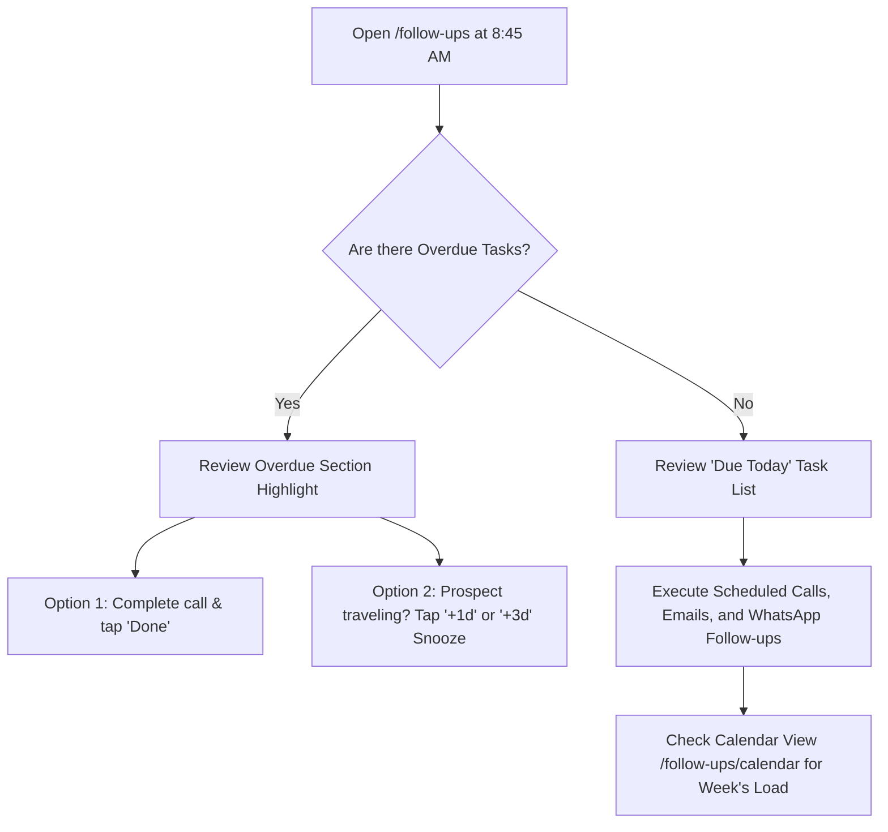
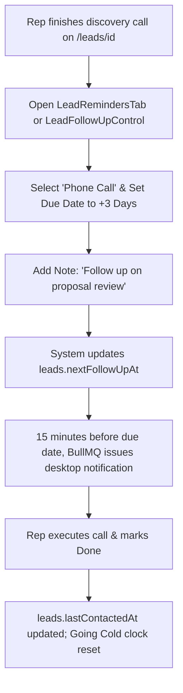

# Follow-ups, Messaging & Meetings

Follow-ups, assignment & alerts, messaging, templates, email/SMTP, and meetings & booking.

> Consolidated from 7 source file(s). Content is verbatim; headings are nested two levels deeper under each section. Edit the original files if they still exist, then regenerate.

## Contents

1. [Ridhzo "Follow-ups" & Task Management: Product & Marketing Specification](#1-ridhzo-follow-ups--task-management-product--marketing-specification) — `docs/FOLLOW_UPS.md`
2. [Settings: Message Templates Hub (`/settings/templates`)](#2-settings-message-templates-hub-settingstemplates) — `docs/SETTINGS_MESSAGE_TEMPLATES.md`
3. [Settings: Email (SMTP) Hub (`/settings/email`)](#3-settings-email-smtp-hub-settingsemail) — `docs/SETTINGS_EMAIL_SMTP.md`
4. [Lead Assignment & New-Lead Alerts](#4-lead-assignment--new-lead-alerts) — `docs/product-kb/08_ASSIGNMENT_AND_ALERTS.md`
5. [Messaging: WhatsApp, Email, Templates, Campaigns & Content Sharing](#5-messaging-whatsapp-email-templates-campaigns--content-sharing) — `docs/product-kb/09_MESSAGING.md`
6. [Follow-ups & Reminders](#6-follow-ups--reminders) — `docs/product-kb/10_FOLLOW_UPS.md`
7. [Meetings, Site Visits & Public Booking Page](#7-meetings-site-visits--public-booking-page) — `docs/product-kb/11_MEETINGS_AND_BOOKING.md`

---

## 1. Ridhzo "Follow-ups" & Task Management: Product & Marketing Specification

> Source: `docs/FOLLOW_UPS.md`

### Ridhzo "Follow-ups" & Task Management: Product & Marketing Specification

> **Document Type:** Product Architecture, Feature Analysis & Website Marketing Reference  
> **Target Audience:** Sales Directors, Revenue Operations, Account Executives, SDRs, Field Agents  
> **Scope:** Follow-ups Hub (`/follow-ups`), Interactive Calendar View (`/follow-ups/calendar`), Lead Profile Controls (`LeadFollowUpControl` & `LeadRemindersTab`), Background Reminder Workers (`followUpReminderWorker`), State Synchronization (`syncLeadFollowUpState`), Overdue Escalation Engine (`FollowUpEscalationService`), and Google Calendar Sync.  
> **Source Verification:** Verified against live Ridhzo codebase (`src/app/(dashboard)/follow-ups/page.tsx`, `src/app/(dashboard)/follow-ups/calendar/page.tsx`, `FollowUpActions.tsx`, `LeadFollowUpControl.tsx`, `LeadRemindersTab.tsx`, `FollowUpService.ts`, `state.ts`, `followUpReminderWorker.ts`, `followUpEscalationService.ts`, `googleCalendarService.ts`, `BookingService.ts`, and PostgreSQL schema).

---

#### 1. Executive Overview

In modern B2B and high-touch sales, deals are won or lost in the follow-up. Industry research consistently proves that 80% of sales require at least five touchpoints, yet 44% of sales reps abandon outreach after just one attempt. When follow-ups live in dispersed sticky notes, unlinked spreadsheets, or mental to-do lists, deals silently slip through the cracks, response times explode, and high-intent buyers sign with competitors.

**Ridhzo’s Follow-up & Task Management Engine** provides an institutionalized, closed-loop task execution system directly tethered to the customer record:
1. **The Follow-ups List Hub (`/follow-ups`):** A rep-focused daily action center organizing pending, due-today, and overdue commitments into a clean triage queue with 1-click completion and rapid snoozing.
2. **The Interactive Calendar (`/follow-ups/calendar`):** A high-visibility, month-by-month scheduling matrix showing touchpoint density, past-due obligations, and direct lead navigation.
3. **In-Dossier Quick Controls & Reminders Tab:** Precision controls on `/leads/[id]` offering 1-click scheduling presets alongside a multi-channel reminder suite (Calls, WhatsApp, Emails, Meetings).
4. **Automated 15-Minute Background Reminders:** BullMQ-powered cron scanning that evaluates impending deadlines and issues in-app alerts and timeline events without relying on fragile client timers.
5. **State Synchronization & Going Cold Prevention:** Every follow-up action automatically recalculates the lead's next scheduled touchpoint (`nextFollowUpAt`) and completion automatically logs a customer contact (`lastContactedAt`), instantly resetting the 14-day "Going Cold" inactivity clock.

```
┌────────────────────────────────────────────────────────────────────────────────────────┐
│                          RIDHZO FOLLOW-UP LIFECYCLE ARCHITECTURE                       │
└────────────────────────────────────────────────────────────────────────────────────────┘
                                              │
                ┌─────────────────────────────┼─────────────────────────────┐
                ▼                             ▼                             ▼
     [Quick Presets on Lead]     [Lead Reminders Tab]           [Public Booking Link]
      Today, +1d, +7d, +1m        Call, Email, Meeting          Google Calendar Sync
                │                             │                             │
                └─────────────────────────────┬─────────────────────────────┘
                                              ▼
                             ┌─────────────────────────────────┐
                             │  DATABASE: follow_ups Table     │
                             │  due_at, status, type, user_id  │
                             └─────────────────────────────────┘
                                              │
                     ┌────────────────────────┴────────────────────────┐
                     ▼                                                 ▼
        [state.ts: syncLeadFollowUpState]            [followUpReminderWorker (BullMQ)]
         Single source of truth: updates              Scans every 5m for items due in ≤15m.
         leads.next_follow_up_at = soonest            Issues in-app notification & audit note.
                     │                                                 │
                     └────────────────────────┬────────────────────────┘
                                              ▼
                     ┌─────────────────────────────────────────────────┐
                     │             REPRESENTATIVE SURFACES             │
                     ├────────────────────────┬────────────────────────┤
                     │ /follow-ups (List Hub) │ /follow-ups/calendar   │
                     │ • Overdue highlight    │ • Monthly date matrix  │
                     │ • Done / +1d / +3d     │ • Time-stamped badges  │
                     └────────────────────────┴────────────────────────┘
                                              │
                               [Representative Completes]
                                              │
                                              ▼
                             ┌─────────────────────────────────┐
                             │    state.ts: markLeadContacted  │
                             │  • leads.lastContactedAt = now  │
                             │  • Resets 14-day Going Cold     │
                             │  • Feeds Rep Performance Stats  │
                             └─────────────────────────────────┘
```

---

#### 2. Everything Included in Follow-ups & Task Management

##### A. The Follow-ups Dashboard Hub (`/follow-ups`)
The central execution cockpit for frontline sales reps and account managers:
* **Personal Scoping with Team Backup:** Evaluates `or(eq(followUps.userId, userId), eq(leads.ownerId, userId))`—ensuring reps see tasks explicitly assigned to them as well as tasks on leads they personally own, while strictly filtering out soft-deleted leads (`isNull(leads.deletedAt)`).
* **4 High-Level Metric Tiles:**
  1. **Due Today:** Count of all pending follow-ups scheduled for today's calendar date (including items whose timestamp has passed earlier in the day).
  2. **Overdue:** Prominent counter of pending items where `dueAt < now`.
  3. **Upcoming:** Future pending items beyond today.
  4. **Completed:** Historical count of successfully fulfilled tasks.
* **Triage Sections:**
  * **Overdue Section:** Highlighted container grouping past-due items at the top of the feed to drive urgent remediation.
  * **Upcoming Section:** Clean chronological grouping of scheduled future outreach.
* **One-Click Rapid Execution Toolbar (`FollowUpActions.tsx`):**
  * **Done (`Check`):** Instant completion via `completeFollowUp(id)`. Updates status, logs completion time, sets `leads.lastContactedAt`, and fires the event bus.
  * **+1d Snooze (`Clock`):** Postpones the follow-up by 24 hours, resetting the target time to 9:00 AM the next business morning.
  * **+3d Snooze:** Postpones the follow-up by 3 days at 9:00 AM (ideal for weekend or post-demo buffer).
  * **Cancel (`X`):** Cancels the follow-up with confirmation toast, recalculating the lead's next pending date.

##### B. The Interactive Calendar Matrix (`/follow-ups/calendar`)
A visual bird's-eye view of task distribution across the month:
* **Dynamic Date Grid (`date-fns`):** Renders Sunday through Saturday columns using `startOfWeek(startOfMonth(cursor))` and `endOfWeek(endOfMonth(cursor))`.
* **Month Navigation & Quick-Jumps:** Previous month (`?month=YYYY-MM`), Next month, and a dedicated **"Today"** quick jump button.
* **Smart Cell Indicators:**
  * Dates outside the active month are rendered with subtle opacity (`opacity-40`).
  * Current date is highlighted with a circular primary badge (`isToday`).
* **Lead Task Pills:**
  * Shows formatted time (`<LocalTime iso={it.dueAt} mode="time" />`), Lead Name, and Task Title.
  * **Completed Tasks:** Rendered with muted styling and strike-through text.
  * **Overdue Tasks:** Rendered with emphasized border and foreground contrast.
  * **Deep Linking:** Clicking any pill navigates directly into that lead’s profile dossier (`/leads/[leadId]`).

##### C. In-Dossier Quick Scheduler (`LeadFollowUpControl.tsx`)
Positioned on the lead dossier header/sidebar for zero-friction date setting:
* **Smart Overdue Detection:** If `nextFollowUpAt < now`, the button turns into a warning-red badge with a clock icon (*"Follow-up overdue"*).
* **1-Tap Schedule Presets:**
  * *Set to today (9:00 AM)*
  * *Set to tomorrow (9:00 AM)*
  * *Set to 1 week from now*
  * *Set to 1 month from now*
  * *Set to someday (+3 months)*
  * *Remove follow up (Trash trigger)*

##### D. Comprehensive Reminders & Tasks Suite (`LeadRemindersTab.tsx`)
An enterprise-grade multi-channel task manager embedded directly inside `/leads/[id]`:
* **Multi-Channel Task Types:** Categorizes tasks with dedicated visual icons:
  * 📞 **Phone Call** (`Phone` icon — emerald)
  * ✉️ **Email** (`Mail` icon — blue)
  * 📹 **Meeting** (`Video` icon — purple)
  * 🔔 **Follow-up / Task** (`Bell` icon — amber)
* **Creation Modal / Inline Drawer:** Captures Title, Type, Due Date & Time (`datetime-local`), and optional detailed Description/Notes.
* **Interactive Status Toggles:** Clickable status circles allow reps to mark tasks done (`CheckCircle2`) or reopen completed tasks directly from the timeline.
* **In-Place Editing:** Modal dialog allowing reps to change task titles, switch communication types, or adjust due dates on the fly.
* **Archival Separation:** Cleanly separates active tasks from completed historical items with completion date stamps.

##### E. Overdue Escalation Engine (`FollowUpEscalationService.ts`)
A background intelligence service that monitors follow-up hygiene and enforces managerial accountability:
* **3-Tier Severity Classification:**
  * **Medium Severity:** Overdue by $< 24\text{ hours}$.
  * **High Severity:** Overdue by $24 - 48\text{ hours}$.
  * **Critical Severity:** Overdue by $\ge 48\text{ hours}$.
* **Automated Activity Alerts (`escalateOverdueFollowUps`):** Automatically injects urgent managerial alerts into the lead's activity log:  
  *`"ALERT: Scheduled follow-up is overdue by 52 hours (Escalation level: CRITICAL). Immediate contact required."`*
* **Surfaced on Insights Page:** Feeds the overdue follow-up table on `/insights`, ranking delayed tasks by total hours overdue.

##### F. Automated Background Reminders Worker (`followUpReminderWorker.ts`)
* **BullMQ Distributed Queue (`follow-up-reminder-scan`):** Runs every 5 minutes in the background.
* **15-Minute Lookahead Horizon:** Scans for pending tasks due within the next 15 minutes (`dueAt <= now + 15m`).
* **Snooze-Aware & Idempotent:** Respects `snoozedUntil` timestamps and cross-references the `reminders` table (`sentAt IS NOT NULL`) so no duplicate notifications are ever sent.
* **Notification & Audit Dispatch:** Triggers in-app alerts (`NotificationService.create({ type: "follow_up_due" })`) and logs an activity record (`"Reminder sent: [Title]"`).

##### G. Public Booking & Google Calendar Synchronization (`BookingService.ts`)
* **Inbound Meeting Intake (`/book/[slug]`):** When a prospect books a consultation via Ridhzo's public booking link, the engine:
  1. Matches or creates the lead record.
  2. Sets `leads.nextFollowUpAt = bookingDate`.
  3. Records a meeting entry on the activity timeline.
  4. Automatically synchronizes a 30-minute calendar block to the assigned rep's connected Google Calendar via `GoogleCalendarService.createEvent`.

---

#### 3. Technical Architecture & Database Models

##### Database Schema (`follow_ups` & `reminders`)

Ridhzo unifies "Follow-ups" and "Reminders" under a single PostgreSQL table defined in [`src/db/schema/activities.ts`](file:///Users/naveenadicharla/Documents/ridhzo/src/db/schema/activities.ts):

```typescript
export const followUps = pgTable('follow_ups', {
  id: uuid('id').defaultRandom().primaryKey(),
  leadId: uuid('lead_id').references(() => leads.id).notNull(),
  userId: uuid('user_id').references(() => users.id),
  type: varchar('type', { length: 50 }).notNull(), // 'Call' | 'WhatsApp' | 'Email' | 'Meeting' | 'Task' | 'Note'
  title: varchar('title', { length: 255 }).notNull(),
  description: text('description'),
  status: varchar('status', { length: 50 }).default('pending').notNull(), // 'pending' | 'completed' | 'cancelled'
  dueAt: timestamp('due_at').notNull(),
  snoozedUntil: timestamp('snoozed_until'),
  completedAt: timestamp('completed_at'),
  createdAt: timestamp('created_at').defaultNow().notNull(),
  updatedAt: timestamp('updated_at').defaultNow().notNull(),
}, (table) => ({
  userDueIdx: index('follow_ups_user_due_idx').on(table.userId, table.status, table.dueAt),
  leadIdx: index('follow_ups_lead_idx').on(table.leadId),
}));

export const reminders = pgTable('reminders', {
  id: uuid('id').defaultRandom().primaryKey(),
  followUpId: uuid('follow_up_id').references(() => followUps.id).notNull(),
  remindAt: timestamp('remind_at').notNull(),
  sentAt: timestamp('sent_at'),
  createdAt: timestamp('created_at').defaultNow().notNull(),
}, (table) => ({
  followUpIdx: index('reminders_follow_up_idx').on(table.followUpId),
}));
```

##### The State Synchronization Principle (`syncLeadFollowUpState`)

To eliminate "ghost overdue" alerts and stale badges across the CRM, Ridhzo enforces an architectural contract in [`src/domains/follow-ups/state.ts`](file:///Users/naveenadicharla/Documents/ridhzo/src/domains/follow-ups/state.ts):

* **Single Source of Truth:** The denormalized column `leads.next_follow_up_at` is guaranteed to represent the **soonest pending follow-up** across all active tasks for that lead.
* **Automatic Recalculation:** Every time a follow-up is created, marked completed, cancelled, snoozed, or deleted, `syncLeadFollowUpState(leadId)` executes:
  ```sql
  SELECT due_at FROM follow_ups 
  WHERE lead_id = :leadId AND status = 'pending' 
  ORDER BY due_at ASC LIMIT 1;
  ```
  It updates `leads.nextFollowUpAt` to this value (or `NULL` if all tasks are cleared).
* **Contact Verification (`markLeadContacted`):** When any follow-up is marked as completed, `markLeadContacted(leadId, completedAt)` immediately updates `leads.lastContactedAt`. This resets the 14-day inactivity clock, removing the lead from the "Going Cold" list and updating lead engagement scores.

---

#### 4. Master Data Points & Operational Metrics

| Metric / Attribute | Source Component / Service | Technical Calculation | Operational Business Value |
| :--- | :--- | :--- | :--- |
| **Due Today Count** | `FollowUpsDashboard` (`/follow-ups`) | `status = 'pending' AND dueAt::date = today` | Gives reps their exact immediate target quota for the current day. |
| **Overdue Count** | `FollowUpsDashboard` / `MetricsCards` | `status = 'pending' AND dueAt < now` | Identifies broken commitments and operational pipeline backlog. |
| **Completion Rate (%)** | `AnalyticsService.getFollowUpMetrics` | $\frac{\text{Completed Tasks}}{\text{Total Tasks}} \times 100$ | Evaluates rep discipline and task fulfillment efficiency. |
| **Overdue Severity** | `FollowUpEscalationService` | $\lfloor (\text{now} - \text{dueAt}) / 3600000 \rfloor$ (Med $<24$h, High $24-48$h, Crit $\ge 48$h) | Allows management to intervene on chronically neglected deals before churn. |
| **Completed Tasks per Rep** | `TeamPerformanceService` | `COUNT(follow_ups) WHERE status='completed' GROUP BY userId` | Measures sales rep activity volume independent of win rate. |
| **Upcoming Queue** | `FollowUpsDashboard` | `status = 'pending' AND dueAt > endOfToday` | Gives reps visibility into pipeline commitments over the coming weeks. |

---

#### 5. Daily Sales & Management Workflows

##### 1. The Rep's Morning Triage Routine (Zero Overdue Inbox)

1. **8:45 AM:** Sales rep opens `/follow-ups`.
2. **Clear Overdue:** Rep immediately addresses items in the highlighted Overdue container. If a client is temporarily unavailable, the rep clicks **`+1d`** or **`+3d`** to snooze cleanly without leaving overdue debt.
3. **Execute Due Today:** Rep completes today's calls, tapping **`Done`** after each touchpoint. This logs contact timestamps, triggers event bus emissions, and updates their completion rate.

##### 2. The Mid-Funnel Re-engagement Cadence


##### 3. Management Escalation & Audit Sweep
1. **Pipeline Review:** Sales Manager navigates to `/insights`.
2. **Inspect Overdue Table:** Evaluates all tasks flagged as **CRITICAL** ($\ge 48$ hours past deadline).
3. **Trigger Escalation:** The manager or system runs `escalateOverdueFollowUps`, injecting audit warnings into the lead's permanent timeline and prompting team leads to reassign the lead if necessary.

---

#### 6. Marketing-Friendly Feature Explanation

##### Why High-Velocity Sales Teams Win with Ridhzo Follow-ups

Deals aren't lost because your product is inferior; they are lost because reps forget to follow up. In competitive markets, the sales team that responds fastest and follows through consistently wins the contract. **Ridhzo transforms follow-ups from an afterthought into an automated execution machine.**

* **Never Drop the Ball:** Whether it’s an urgent call scheduled for this afternoon or a long-term check-in three months out, Ridhzo keeps every promise visible and organized.
* **1-Click Triage:** Sales reps shouldn't waste 10 minutes updating dropdown menus. Complete tasks in one click, or snooze follow-ups by 1 or 3 days with a single tap.
* **Automated 15-Minute Radar:** Ridhzo’s background intelligence monitors your calendar and alerts you 15 minutes before every call, ensuring you never show up unprepared.
* **Automatic Contact Sync:** When you complete a task, Ridhzo automatically logs customer contact and resets your "Going Cold" inactivity counter—keeping your pipeline clean without manual data entry.
* **Visual Calendar Matrix:** Switch effortlessly between your daily to-do list and a full month calendar to balance your workload and prevent scheduling bottlenecks.

---

#### 7. Feature List for Website Marketing

* **Unified Daily Follow-up Cockpit**  
  A centralized, rep-focused dashboard organizing overdue, due-today, and upcoming obligations into a friction-free action queue.

* **Interactive Monthly Calendar View**  
  A drag-free, visual scheduling grid displaying task density, appointment times, and direct lead navigation across the entire month.

* **1-Click Rapid Triage & Snooze**  
  Mark tasks done instantly, or postpone follow-ups to 9:00 AM tomorrow (`+1d`) or next week (`+3d`) with one tap.

* **Multi-Channel Reminder Suite**  
  Schedule and categorize outreach specifically for Phone Calls, WhatsApp chats, Emails, and Meetings with distinct visual icons.

* **Autonomous 15-Minute Background Reminders**  
  Server-side BullMQ cron scans alert reps 15 minutes before commitments, ensuring zero missed appointments.

* **Single-Source State Synchronization**  
  Guarantees that lead dossier cards, pipeline badges, and triage feeds always point to the next real pending task—eliminating ghost overdue alerts.

* **3-Tier Managerial Escalation**  
  Automatically flags overdue tasks as Medium ($<24\text{h}$), High ($24-48\text{h}$), or Critical ($\ge 48\text{h}$) and injects urgency alerts into the activity timeline.

* **Automated Inactivity Protection**  
  Completing any follow-up automatically timestamps customer contact, keeping active deals off the "Going Cold" radar.

* **Google Calendar Integration**  
  Public booking requests automatically schedule follow-up tasks and sync 30-minute meeting slots directly to the rep's Google Calendar.

---

#### 8. Page Blueprints & Wireframes

##### Follow-ups List Dashboard (`/follow-ups`)
```
+====================================================================================+
| My Follow-ups                                                 [Calendar view ->]   |
+====================================================================================+
| [DUE TODAY: 8]       | [OVERDUE: 3]          | [UPCOMING: 14]     | [COMPLETED: 42]|
+====================================================================================+
| PENDING ACTIONS                                                                    |
|                                                                                    |
| [!] OVERDUE (3)                                                                    |
| +--------------------------------------------------------------------------------+ |
| | Follow-up on pricing quote (Call)          | Due: Yesterday, 4:00 PM           | |
| | Lead: Marcus Vance                         | [Done] [+1d] [+3d] [X]            | |
| +--------------------------------------------------------------------------------+ |
| | Send product spec sheet (Email)            | Due: Sep 18, 10:00 AM             | |
| | Lead: Apex Dynamics                        | [Done] [+1d] [+3d] [X]            | |
| +--------------------------------------------------------------------------------+ |
|                                                                                    |
| UPCOMING (14)                                                                      |
| +--------------------------------------------------------------------------------+ |
| | Demo walkthrough (Meeting)                 | Due: Today, 2:30 PM               | |
| | Lead: Elena Rostova                        | [Done] [+1d] [+3d] [X]            | |
| +--------------------------------------------------------------------------------+ |
| | Contract signature review (Call)           | Due: Tomorrow, 9:00 AM            | |
| | Lead: Bluefin Capital                      | [Done] [+1d] [+3d] [X]            | |
| +--------------------------------------------------------------------------------+ |
+====================================================================================+
```

##### Calendar View Layout (`/follow-ups/calendar`)
```
+====================================================================================+
| September 2026                         [List] [<] [Today] [>]                     |
+====================================================================================+
|  Sun    |  Mon    |  Tue    |  Wed    |  Thu    |  Fri    |  Sat    |
+---------+---------+---------+---------+---------+---------+---------+
| 31      | 1       | 2       | 3       | 4       | 5       | 6       |
| (dim)   |         | [10:00] |         | [14:00] |         |         |
|         |         | Acme-Call|        | Glob-Demo|        |         |
+---------+---------+---------+---------+---------+---------+---------+
| 7       | 8       | 9       | 10      | 11      | 12      | 13      |
|         | [09:00] |         | [11:30] |         | [16:00] |         |
|         | Rex-Task|         | Nova-Mtg|         | Tech-Call|        |
+---------+---------+---------+---------+---------+---------+---------+
| 14      | 15      | 16      | 17      | 18      | 19      | 20      |
|         |         | [!]OVER | [Done]  | [Done]  | (TODAY) |         |
|         |         | Apex-Qte| SentDoc | Review  | [14:30] |         |
|         |         |         |         |         | Elena-Mtg|        |
+====================================================================================+
```

---

#### 9. Technical Reference

##### Routes & Entry Points
* **List Dashboard:** [`src/app/(dashboard)/follow-ups/page.tsx`](file:///Users/naveenadicharla/Documents/ridhzo/src/app/(dashboard)/follow-ups/page.tsx)
* **Calendar View:** [`src/app/(dashboard)/follow-ups/calendar/page.tsx`](file:///Users/naveenadicharla/Documents/ridhzo/src/app/(dashboard)/follow-ups/calendar/page.tsx)

##### UI Components
* **List Action Bar:** [`src/components/leads/FollowUpActions.tsx`](file:///Users/naveenadicharla/Documents/ridhzo/src/components/leads/FollowUpActions.tsx)
* **Lead Dossier Quick Control:** [`src/components/leads/LeadFollowUpControl.tsx`](file:///Users/naveenadicharla/Documents/ridhzo/src/components/leads/LeadFollowUpControl.tsx)
* **Lead Profile Reminders Tab:** [`src/components/leads/LeadRemindersTab.tsx`](file:///Users/naveenadicharla/Documents/ridhzo/src/components/leads/LeadRemindersTab.tsx)
* **Dashboard Metric Cards:** [`src/components/dashboard/MetricsCards.tsx`](file:///Users/naveenadicharla/Documents/ridhzo/src/components/dashboard/MetricsCards.tsx)

##### Domain Services & Server Actions
* **Follow-up Domain Service:** [`src/domains/follow-ups/service.ts`](file:///Users/naveenadicharla/Documents/ridhzo/src/domains/follow-ups/service.ts) (`createFollowUp`, `completeFollowUp`, `snoozeFollowUp`, `rescheduleFollowUp`, `cancelFollowUp`)
* **State Synchronization:** [`src/domains/follow-ups/state.ts`](file:///Users/naveenadicharla/Documents/ridhzo/src/domains/follow-ups/state.ts) (`syncLeadFollowUpState`, `markLeadContacted`)
* **Overdue Escalations:** [`src/domains/leads/followUpEscalationService.ts`](file:///Users/naveenadicharla/Documents/ridhzo/src/domains/leads/followUpEscalationService.ts) (`getOverdueFollowUps`, `escalateOverdueFollowUps`)
* **Team Performance Metrics:** [`src/domains/leads/teamPerformanceService.ts`](file:///Users/naveenadicharla/Documents/ridhzo/src/domains/leads/teamPerformanceService.ts) (completed tasks per user)
* **Public Booking & Calendar Sync:** [`src/domains/booking/service.ts`](file:///Users/naveenadicharla/Documents/ridhzo/src/domains/booking/service.ts), [`src/domains/integrations/googleCalendarService.ts`](file:///Users/naveenadicharla/Documents/ridhzo/src/domains/integrations/googleCalendarService.ts)
* **Server Actions:**
  * [`src/lib/actions/follow-ups.ts`](file:///Users/naveenadicharla/Documents/ridhzo/src/lib/actions/follow-ups.ts) (`createFollowUp`, `completeFollowUp`, `snoozeFollowUp`, `cancelFollowUp`, `assignFollowUp`)
  * [`src/lib/actions/reminders.ts`](file:///Users/naveenadicharla/Documents/ridhzo/src/lib/actions/reminders.ts) (`createReminderAction`, `updateReminderAction`, `toggleReminderStatusAction`, `deleteReminderAction`)
  * [`src/lib/actions/leads.ts`](file:///Users/naveenadicharla/Documents/ridhzo/src/lib/actions/leads.ts) (`updateLeadFollowUpAction`)

##### Background Workers
* **Follow-up Reminder Cron:** [`src/lib/jobs/workers/followUpReminderWorker.ts`](file:///Users/naveenadicharla/Documents/ridhzo/src/lib/jobs/workers/followUpReminderWorker.ts) (`processFollowUpReminderScan`, `scheduleFollowUpReminderScan`)

---

## 2. Settings: Message Templates Hub (`/settings/templates`)

> Source: `docs/SETTINGS_MESSAGE_TEMPLATES.md`

### Settings: Message Templates Hub (`/settings/templates`)

The **Message Templates Hub** is Ridhzo's centralized repository for authoring, managing, and standardizing reusable sales outreach across WhatsApp, Email, and SMS. Located at [`src/app/(dashboard)/settings/templates/page.tsx`](file:///Users/naveenadicharla/Documents/ridhzo/src/app/(dashboard)/settings/templates/page.tsx) and driven by [`TemplatesManager.tsx`](file:///Users/naveenadicharla/Documents/ridhzo/src/components/templates/TemplatesManager.tsx), this feature equips sales teams with one-tap canned responses, dynamic token interpolation, and consistent multi-channel communication.

---

#### 1. Executive Summary & Business Value

In high-velocity inbound sales, response time and message quality dictate deal conversion:

1. **Sub-60-Second First Contact**: Reps select pre-approved templates with a single tap rather than manually typing repetitive greetings, meeting links, or pricing brochures.
2. **Dynamic Lead Personalization**: Built-in interpolation tokens (`{{first_name}}`, `{{name}}`, `{{email}}`, `{{phone}}`, `{{company}}`) automatically tailor each message to the recipient, avoiding robotic boilerplate.
3. **Multi-Channel Consistency**: Unifies outreach standards across **WhatsApp**, **Email**, and **SMS**, ensuring brand compliance across all sales representatives.
4. **Native Omnichannel Integration**: Templates flow seamlessly into the **Lead Profile Dossier** ([`WhatsAppSendBox.tsx`](file:///Users/naveenadicharla/Documents/ridhzo/src/components/leads/WhatsAppSendBox.tsx)), **Quick Response Modals** ([`QuickResponseDialog.tsx`](file:///Users/naveenadicharla/Documents/ridhzo/src/components/leads/QuickResponseDialog.tsx)), and **Automated Drip Sequences** ([`Sequences.tsx`](file:///Users/naveenadicharla/Documents/ridhzo/src/components/sequences/SequencesManager.tsx)).

---

#### 2. Technical Architecture & Data Flow

```
+----------------------------------------------------------------------------------------------------+
|                                      TEMPLATE MANAGEMENT HUB                                       |
|                                                                                                    |
|  Server Route: src/app/(dashboard)/settings/templates/page.tsx                                     |
|  Permissions: requirePermission("templates.manage")                                                |
|  Data Pre-fetch: listTemplates() -> SELECT FROM message_templates WHERE organization_id = :orgId   |
+----------------------------------------------------------------------------------------------------+
                                                |
                                                v
+----------------------------------------------------------------------------------------------------+
|                                      TEMPLATES MANAGER CANVAS                                      |
|                                                                                                    |
|  Component: src/components/templates/TemplatesManager.tsx                                         |
|  - Create / Edit Form: Name, Channel (WhatsApp/Email/SMS), Subject (Email), Body                  |
|  - Token Insertion Guide: {{name}}, {{first_name}}, {{email}}, {{phone}}, {{company}}             |
|  - Real-time Local State: Optimistic updates on create/edit/delete with rollback on failure         |
+----------------------------------------------------------------------------------------------------+
                                                |
                        +-----------------------+-----------------------+
                        |                                               |
                        v                                               v
+-----------------------------------------------+   +-----------------------------------------------+
|             ONE-TAP MANUAL DISPATCH           |   |           AUTOMATED DRIP & WORKFLOWS          |
|                                               |   |                                               |
|  1. WhatsApp Send Box (WhatsAppSendBox.tsx)   |   |  1. Sequences Engine (SequenceStep.tsx)       |
|     - Personal: wa.me deep-link with prefill  |   |     - Automated scheduled drip steps          |
|     - BSP: Direct in-app Meta Cloud API send  |   |  2. Workflow Automations (automationsWorker)  |
|  2. Quick Response Dialog (QuickResponse.tsx) |   |     - Triggered on new lead or status change  |
|     - Instant WhatsApp or Email modal popup   |   |     - Executes send_whatsapp / send_email     |
+-----------------------------------------------+   +-----------------------------------------------+
                        |                                               |
                        +-----------------------+-----------------------+
                                                |
                                                v
+----------------------------------------------------------------------------------------------------+
|                                    LEAD TIMELINE & AUDIT LOGGING                                   |
|                                                                                                    |
|  ActivityService.addActivity({ type: "message" | "email", content: "[channel] <body preview>" })   |
|  Recorded on lead detail timeline with timestamp and sender ID                                     |
+----------------------------------------------------------------------------------------------------+
```

---

#### 3. UI Layout & Visual Hierarchy

The Message Templates page provides a clean, distraction-free authoring and management environment:

##### A. Navigation & Header
- **Breadcrumb Back Link**: Ghost button linking back to `/settings`.
- **Title**: `Message Templates`
- **Subtitle**: *"Canned messages for one-tap sending and automations. Tokens are filled per lead."*

##### B. Template Authoring Card (`TemplatesManager.tsx`)
Positioned at the top of the canvas, the authoring card switches between **New Template** and **Edit Template** modes:

```
+----------------------------------------------------------------------------------------------------+
|                                           NEW TEMPLATE                                             |
+----------------------------------------------------------------------------------------------------+
|  [ Template Name: Intro & Schedule Call            ]  [ Channel: WhatsApp                        v ]|
|  [ Email Subject: Discussion regarding your property inquiry                                      ] |
|                                                                                                    |
|  Message Body:                                                                                     |
|  +----------------------------------------------------------------------------------------------+  |
|  | Hi {{first_name}}, thanks for reaching out to {{company}}!                                   |  |
|  |                                                                                              |  |
|  | I saw your inquiry regarding our services. Are you free for a quick 5-minute call today at    |  |
|  | 3:00 PM or tomorrow morning?                                                                 |  |
|  |                                                                                              |  |
|  | Best regards,                                                                                |  |
|  | Sales Advisory Team                                                                          |  |
|  +----------------------------------------------------------------------------------------------+  |
|                                                                                                    |
|  Use tokens: {{first_name}}, {{name}}, {{email}}, {{phone}}, {{company}}      [ + Save template ]  |
+----------------------------------------------------------------------------------------------------+
```

- **Template Name Input**: Clear alphanumeric title (e.g., *"Price Quote Follow-up"*).
- **Channel Selector**: Native dropdown selecting `WhatsApp`, `Email`, or `SMS`.
- **Conditional Email Subject**: When `channel === "email"`, an additional input appears for the email subject line.
- **Message Body Textarea**: Expandable input supporting multi-line text and token placeholders.
- **Action Buttons**:
  - `Save template` / `Update template` (with loading spinner).
  - `Cancel edit` button when modifying an existing template.

##### C. Active Templates List
Templates are displayed as distinct cards:
- **Card Header**: Displays template name, channel badge (`whatsapp`, `sms`, `email`), and quick action buttons.
- **Actions**:
  - **Edit (Pencil Icon)**: Populates the authoring form with the template's data and scrolls to the top.
  - **Delete (Trash Icon)**: Removes the template with immediate optimistic UI removal and database synchronization.
- **Body Preview**: Renders formatted text with preserved line breaks (`whitespace-pre-wrap`).
- **Subject Display**: Displays `Subject: <text>` for email templates.

---

#### 4. Supported Channels & Dispatch Mechanisms

```
+----------------------------------------------------------------------------------------------------+
|                                     CHANNEL COMPARISON MATRIX                                      |
+-----------+----------------------+-----------------------------+-----------------------------------+
| Channel   | Key Identifier       | Dispatch Methods            | Protocol / Provider               |
+-----------+----------------------+-----------------------------+-----------------------------------+
| WhatsApp  | whatsapp             | 1. Personal (wa.me)         | WhatsApp Web / Mobile Protocol    |
|           |                      | 2. Business API (In-app)    | Meta Cloud API / Watxio BSP       |
| Email     | email                | In-App SMTP Mailer          | Nodemailer / SendGrid / SMTP      |
| SMS       | sms                  | In-App Gateway & Twilio     | Direct Cellular Carrier Network   |
+-----------+----------------------+-----------------------------+-----------------------------------+
```

##### Channel 1: WhatsApp (`whatsapp`)
WhatsApp is Ridhzo's primary real-time engagement channel:
1. **Personal Mode (`mode = "personal"`)**:
   - Generates a pre-filled direct WhatsApp link:
     ```
     https://wa.me/<digits>?text=<encoded_body>
     ```
   - Opens the rep's personal or desktop WhatsApp client. Reps review and tap send from their own phone number.
   - Bypasses Meta's 24-hour service conversation window and template approval requirements.
2. **Business API Mode (`mode = "bsp"`)**:
   - Sends directly through the CRM via [`sendWhatsAppAction`](file:///Users/naveenadicharla/Documents/ridhzo/src/lib/actions/messaging.ts#L78).
   - Inside Meta's 24-hour customer care window: Dispatches free-form text.
   - Outside the 24-hour window: Prompts the rep to select a pre-approved Meta Business template.

##### Channel 2: Email (`email`)
- Requires both a **Subject Line** and **Message Body**.
- Dispatches via [`sendEmailAction`](file:///Users/naveenadicharla/Documents/ridhzo/src/lib/actions/messaging.ts#L105) using the organization's configured SMTP server ([`src/lib/mail/mailer.ts`](file:///Users/naveenadicharla/Documents/ridhzo/src/lib/mail/mailer.ts)).
- Converts line breaks to clean HTML paragraphs (`<p>${body.replace(/\n/g, "<br/>")}</p>`).
- Automatically logs the sent email as a timeline event in `activities`.

##### Channel 3: SMS (`sms`)
- Standard text messaging for quick alerts, verification codes, or prospects without active WhatsApp accounts.
- Concise plain text without subject lines.

---

#### 5. Dynamic Token Interpolation Engine

Ridhzo supports dynamic token placeholders, allowing one template to adapt across thousands of distinct contacts:

```
+------------------+------------------------------+-------------------------+------------------------+
| Token Syntax     | Source Column                | Extraction Logic        | Sample Output          |
+------------------+------------------------------+-------------------------+------------------------+
| {{first_name}}   | leads.name                   | name.split(' ')[0]      | "Alex"                 |
| {{name}}         | leads.name                   | leads.name || "Client"  | "Alex Johnson"         |
| {{email}}        | leads.email                  | leads.email             | "alex@example.com"     |
| {{phone}}        | leads.phone                  | leads.phone             | "+1 (415) 555-0199"    |
| {{company}}      | leads.company                | leads.company || Org    | "Acme Corporation"     |
+------------------+------------------------------+-------------------------+------------------------+
```

##### Interpolation Implementation ([`QuickResponseDialog.tsx`](file:///Users/naveenadicharla/Documents/ridhzo/src/components/leads/QuickResponseDialog.tsx#L47))
When a rep selects a template from a dropdown, Ridhzo immediately parses and replaces tokens in the active textarea:
```typescript
let text = tmpl.body || "";
text = text.replace(/\{\{first_name\}\}/gi, leadName ? leadName.split(" ")[0] : "there");
text = text.replace(/\{\{name\}\}/gi, leadName || "Client");
text = text.replace(/\{\{email\}\}/gi, email || "");
text = text.replace(/\{\{phone\}\}/gi, phone || "");
text = text.replace(/\{\{company\}\}/gi, company || "your company");
setBody(text);
```
Reps can review and edit the personalized text before sending.

---

#### 6. Omnichannel Integration Across Ridhzo

Templates are consumed across four primary workflow areas:

##### 1. Lead Profile Dossier ([`WhatsAppSendBox.tsx`](file:///Users/naveenadicharla/Documents/ridhzo/src/components/leads/WhatsAppSendBox.tsx))
Inside the lead dossier's WhatsApp tab:
- Reps click **Insert a template...** dropdown.
- Selecting a template populates the message box instantly.
- Reps can click **Draft with AI** to adjust tone or tap **Send** for immediate delivery.

##### 2. Quick Response Modal ([`QuickResponseDialog.tsx`](file:///Users/naveenadicharla/Documents/ridhzo/src/components/leads/QuickResponseDialog.tsx))
Accessible directly from lead table rows or Kanban cards:
- Opens a lightweight modal with channel toggle (WhatsApp / Email).
- Selecting a template automatically switches the channel to match the template's designated type.
- Delivers the message and updates lead activity in a single interaction.

##### 3. Automated Sequences Engine ([`SequenceFlow.tsx`](file:///Users/naveenadicharla/Documents/ridhzo/src/components/sequences/SequenceFlow.tsx))
- Sequence creators choose message templates when constructing multi-day drip steps (e.g., Step 1: Immediate WhatsApp intro $\rightarrow$ Step 2: Day 3 Email check-in $\rightarrow$ Step 3: Day 7 SMS reminder).

##### 4. Workflow Automations Worker ([`automationsWorker.ts`](file:///Users/naveenadicharla/Documents/ridhzo/src/lib/jobs/workers/automationsWorker.ts))
- Automated actions (e.g., WHEN lead status changes to "Won", THEN send customer onboarding template) execute server-side using pre-configured message templates.

---

#### 7. Security, RBAC & Database Schema

##### Role-Based Access Control (RBAC)
- **Authoring & Modification**: Restricted to administrators and managers via `requirePermission("templates.manage")`.
- **Consumption & Dispatch**: All authenticated sales representatives can view and send templates via `requireOrg()`.

##### Database Schema ([`messageTemplates`](file:///Users/naveenadicharla/Documents/ridhzo/src/db/schema/templates.ts#L5))
```typescript
export const messageTemplates = pgTable('message_templates', {
  id: uuid('id').defaultRandom().primaryKey(),
  organizationId: uuid('organization_id').references(() => organizations.id),
  name: varchar('name', { length: 255 }).notNull(),
  channel: varchar('channel', { length: 20 }).notNull().default('whatsapp'), // whatsapp, sms, email
  subject: varchar('subject', { length: 255 }), // email only
  body: text('body').notNull(), // supports {{name}} {{first_name}} {{email}} {{phone}} {{company}}
  createdAt: timestamp('created_at').defaultNow().notNull(),
  updatedAt: timestamp('updated_at').defaultNow().notNull(),
});
```

- **Tenant Isolation**: Every query includes `where(eq(messageTemplates.organizationId, organizationId))`.
- **Referential Integrity**: Linked to `organizations.id` to ensure proper cascading when an organization is managed.

---

#### 8. Complete Code & Symbol Reference

##### Frontend Components & Views
- [`TemplatesPage`](file:///Users/naveenadicharla/Documents/ridhzo/src/app/(dashboard)/settings/templates/page.tsx): Server route pre-fetching organization templates.
- [`TemplatesManager`](file:///Users/naveenadicharla/Documents/ridhzo/src/components/templates/TemplatesManager.tsx): Client-side manager handling CRUD operations, form editing, and channel filtering.
- [`WhatsAppSendBox`](file:///Users/naveenadicharla/Documents/ridhzo/src/components/leads/WhatsAppSendBox.tsx): Lead profile messaging box with one-tap template selector.
- [`QuickResponseDialog`](file:///Users/naveenadicharla/Documents/ridhzo/src/components/leads/QuickResponseDialog.tsx): Modal dialog for instant outreach across WhatsApp and Email.

##### Server Actions
- [`listTemplates`](file:///Users/naveenadicharla/Documents/ridhzo/src/lib/actions/messaging.ts#L12): Retrieves templates for the tenant organization, with optional channel filtering.
- [`createTemplateAction`](file:///Users/naveenadicharla/Documents/ridhzo/src/lib/actions/messaging.ts#L29): Validates and inserts a new template with Zod schema verification.
- [`updateTemplateAction`](file:///Users/naveenadicharla/Documents/ridhzo/src/lib/actions/messaging.ts#L44): Modifies an existing template with tenant ownership checks.
- [`deleteTemplateAction`](file:///Users/naveenadicharla/Documents/ridhzo/src/lib/actions/messaging.ts#L63): Permanently deletes a template from the database.
- [`sendWhatsAppAction`](file:///Users/naveenadicharla/Documents/ridhzo/src/lib/actions/messaging.ts#L78): Dispatches WhatsApp messages via Watxio or Meta Cloud API.
- [`sendEmailAction`](file:///Users/naveenadicharla/Documents/ridhzo/src/lib/actions/messaging.ts#L105): Sends outbound emails through the shared SMTP mailer and logs activity.
- [`logMessageAction`](file:///Users/naveenadicharla/Documents/ridhzo/src/lib/actions/messaging.ts#L134): Records message dispatch events onto the lead's activity timeline.

##### Database Tables
- [`messageTemplates`](file:///Users/naveenadicharla/Documents/ridhzo/src/db/schema/templates.ts#L5): Drizzle ORM table storing template schemas, channels, subjects, and bodies.
- [`activities`](file:///Users/naveenadicharla/Documents/ridhzo/src/db/schema/leads.ts): Activity timeline recording dispatched messages.

---

## 3. Settings: Email (SMTP) Hub (`/settings/email`)

> Source: `docs/SETTINGS_EMAIL_SMTP.md`

### Settings: Email (SMTP) Hub (`/settings/email`)

The **Email (SMTP) Hub** is Ridhzo's outbound email infrastructure manager. Located at [`src/app/(dashboard)/settings/email/page.tsx`](file:///Users/naveenadicharla/Documents/ridhzo/src/app/(dashboard)/settings/email/page.tsx) and managed by [`EmailSettingsManager.tsx`](file:///Users/naveenadicharla/Documents/ridhzo/src/components/settings/EmailSettingsManager.tsx), this feature allows organizations to route all outbound customer communications through their own corporate mail servers (Google Workspace, Microsoft 365, Amazon SES, SendGrid, Mailgun, or private SMTP servers) with AES-256-GCM credential encryption and automated fallback resilience.

---

#### 1. Executive Summary & Business Value

Outbound email deliverability and sender reputation directly influence sales engagement:

1. **Custom Domain Authority & SPF/DKIM Alignment**: Sending sales emails from your own domain (e.g., `sales@acme.com`) rather than a shared generic CRM domain dramatically improves inbox placement, eliminates spam flagging, and reinforces brand legitimacy.
2. **Zero-Knowledge Credential Encryption**: Sensitive SMTP passwords are encrypted at rest using industry-standard AES-256-GCM. Passwords are never returned in client JSON responses or exposed in browser HTML.
3. **Resilient Dual-Transport Architecture**: If an organization's custom mail server experiences downtime, rate limits, or network errors, Ridhzo's mailer automatically falls back to the shared high-availability platform transport ([`mailer.ts`](file:///Users/naveenadicharla/Documents/ridhzo/src/lib/mail/mailer.ts#L44)), guaranteeing invitations and customer messages are never lost.
4. **Pre-Flight Diagnostic Testing**: Administrators can send real-time diagnostic test emails to their own accounts before turning on custom sending, with live error surfacing for DNS, TLS, or authentication mismatches.

---

#### 2. Technical Architecture & Mail Delivery Pipeline

```
+----------------------------------------------------------------------------------------------------+
|                                    EMAIL SETTINGS ROUTE & RBAC                                     |
|                                                                                                    |
|  Server Route: src/app/(dashboard)/settings/email/page.tsx                                         |
|  Authorization Guard: if (!hasPermission("settings.manage")) redirect("/leads")                   |
|  Data Pre-fetch: EmailSettingsService.getView(organizationId)                                      |
+----------------------------------------------------------------------------------------------------+
                                                |
                                                v
+----------------------------------------------------------------------------------------------------+
|                                    EMAIL SETTINGS MANAGER UI                                       |
|                                                                                                    |
|  Component: src/components/settings/EmailSettingsManager.tsx                                       |
|  - Sender Profile: From Name, From Email                                                           |
|  - SMTP Host & Port: Host, Port (587 / 465), TLS toggle (smtpSecure)                               |
|  - Authentication: Username, Password (blank preserves existing encrypted hash)                    |
|  - Activation Switch: "Use my SMTP server" toggle                                                  |
|  - Diagnostic Engine: "Send test email" button with live error surfacing                           |
+----------------------------------------------------------------------------------------------------+
                                                |
                                                v
+----------------------------------------------------------------------------------------------------+
|                                    OUTBOUND MAILER ORCHESTRATOR                                    |
|                                                                                                    |
|  Service: src/lib/mail/mailer.ts (sendEmail)                                                       |
|                                                                                                    |
|  Is organizationId provided AND email_settings.enabled === 1?                                      |
|                                                                                                    |
|            YES (Custom SMTP Enabled)                               NO (Custom SMTP Off)            |
|                       |                                                     |                      |
|                       v                                                     v                      |
|  [Nodemailer Custom Transport]                                 [Shared Resend Transport]           |
|  - Decrypts AES-256-GCM password                                - Uses platform MAIL_FROM          |
|  - Connects to tenant host:port                                - Fallback if tenant SMTP fails    |
|  - Sends from tenant domain                                                                        |
+----------------------------------------------------------------------------------------------------+
```

---

#### 3. UI Layout & Visual Hierarchy

The Email Settings Hub is contained within a centered, high-focus container (`max-w-2xl`):

##### A. Navigation & Header
- **Breadcrumb Link**: Ghost button with back arrow linking back to `/settings`.
- **Title**: `Email (SMTP)`
- **Subtitle**: *"Send lead emails from your own mail server. When off, the built-in transport is used."*

##### B. Sender Identity Card
Configures the public-facing identity visible in the recipient's inbox:
- **From Name**: Friendly sender name (e.g., *"Acme Advisory Group"*).
- **From Email**: Validated corporate address (e.g., `advisors@acme.com`). Validated via Zod email regex.

```
+----------------------------------------------------------------------------------------------------+
|                                             SENDER                                                 |
+----------------------------------------------------------------------------------------------------+
|  From Name:   [ Acme Advisory Group                   ]                                            |
|  From Email:  [ advisors@acme.com                     ]                                            |
+----------------------------------------------------------------------------------------------------+
```

##### C. SMTP Server Configuration Card
Configures the network credentials for connecting to the mail transfer agent:
- **Host**: SMTP domain or IP (e.g., `smtp.gmail.com`, `smtp.sendgrid.net`, `smtp.office365.com`).
- **Port**: Port number (`587` for STARTTLS, `465` for direct SSL/TLS).
- **Username**: SMTP login account or API key token (e.g., `apikey`).
- **Password**: Password input field with intelligent state preservation:
  - If a password is already stored, the input placeholder renders `•••••••• (leave blank to keep)`.
  - Leaving the field blank on update preserves the previously encrypted password without forcing the admin to re-enter credentials.
- **TLS (SSL) Checkbox**: Toggles `smtpSecure` (on for port 465, off for 587/STARTTLS).

```
+----------------------------------------------------------------------------------------------------+
|                                           SMTP SERVER                                              |
+----------------------------------------------------------------------------------------------------+
|  Host:        [ smtp.sendgrid.net                     ]  Port:     [ 587                         ] |
|  Username:    [ apikey                                ]  Password: [ •••••••• (leave blank to keep)]|
|                                                                                                    |
|  [x] Use TLS (SSL) — on for port 465, off for 587/STARTTLS                                         |
+----------------------------------------------------------------------------------------------------+
```

##### D. Activation Switch & Diagnostic Actions
- **Custom SMTP Activation Toggle**:
  - `Use my SMTP server`: Master switch activating custom sending.
  - Subtitle: *"When off, emails send via the built-in transport."*
  - **Incomplete Config Gate**: The toggle cannot be enabled unless host, port, username, password, and from-email are all present ([`src/lib/actions/emailSettings.ts#L37`](file:///Users/naveenadicharla/Documents/ridhzo/src/lib/actions/emailSettings.ts#L37)).
- **Action Buttons**:
  - `Save`: Persists configuration.
  - `Send test email`: Fires an immediate diagnostic message to the logged-in administrator's account.

```
+----------------------------------------------------------------------------------------------------+
|  Use my SMTP server                                                            [  (o) Toggle: ON ] |
|  When off, emails send via the built-in transport.                                                 |
+----------------------------------------------------------------------------------------------------+
|  [ Save Button ]   [ Send test email (Send Icon) ]                                                 |
|                                                                                                    |
|  The password is encrypted at rest and never shown again. Test sends to your own account email     |
|  using the saved settings — do this before turning the toggle on.                                  |
+----------------------------------------------------------------------------------------------------+
```

---

#### 4. Cryptographic Security & AES-256-GCM Encryption

SMTP credentials allow unauthorized mail dispatch if compromised. Ridhzo enforces zero-knowledge storage principles:

```
+----------------------------------------------------------------------------------------------------+
|                                    SECURITY SPECIFICATION                                          |
+-----------------------+----------------------------------------------------------------------------+
| Attribute             | Technical Implementation                                                   |
+-----------------------+----------------------------------------------------------------------------+
| Cipher Algorithm      | AES-256-GCM (Galois/Counter Mode with integrity authentication tag)        |
| Key Derivation        | process.env.ENCRYPTION_SECRET (32-byte secret key)                         |
| Encrypted Column      | email_settings.smtp_password_enc (stored as ciphertext:iv:tag)             |
| Client Exposure       | ZERO. Only boolean `hasPassword` is returned to the browser.               |
| Empty Update Handling | Blank passwords on update retain the existing encrypted hash.              |
+-----------------------+----------------------------------------------------------------------------+
```

##### Database Schema ([`emailSettings`](file:///Users/naveenadicharla/Documents/ridhzo/src/db/schema/emailSettings.ts#L7))
```typescript
export const emailSettings = pgTable('email_settings', {
  id: uuid('id').defaultRandom().primaryKey(),
  organizationId: uuid('organization_id').references(() => organizations.id, { onDelete: 'cascade' }).notNull().unique(),
  fromName: varchar('from_name', { length: 255 }),
  fromEmail: varchar('from_email', { length: 255 }),
  smtpHost: varchar('smtp_host', { length: 255 }),
  smtpPort: integer('smtp_port'),
  smtpSecure: integer('smtp_secure').default(1).notNull(), // 1 = TLS (465), 0 = STARTTLS/none
  smtpUser: varchar('smtp_user', { length: 255 }),
  smtpPasswordEnc: text('smtp_password_enc'), // AES-256-GCM ciphertext
  enabled: integer('enabled').default(0).notNull(),
  createdAt: timestamp('created_at').defaultNow().notNull(),
  updatedAt: timestamp('updated_at').defaultNow().notNull(),
});
```

---

#### 5. Dual-Transport Engine & Resilient Fallback

Ridhzo’s mailer ([`src/lib/mail/mailer.ts`](file:///Users/naveenadicharla/Documents/ridhzo/src/lib/mail/mailer.ts)) implements an intelligent dual-transport system:

##### 1. Lazy Runtime Isolation
`nodemailer` and `EmailSettingsService` are imported dynamically inside `sendViaOrgSmtp()`:
```typescript
const { EmailSettingsService } = await import("@/domains/organizations/emailSettingsService");
const nodemailer = (await import("nodemailer")).default;
```
This ensures heavyweight SMTP libraries and native Node sockets never leak into client-side code or edge runtime bundles.

##### 2. Automatic Fault-Tolerant Fallback
Network timeouts or misconfigured SMTP credentials must not block mission-critical communications (such as team member invites or deal notifications):
```typescript
export async function sendEmail(mail: Mail, organizationId?: string): Promise<void> {
  if (organizationId) {
    try {
      if (await sendViaOrgSmtp(organizationId, mail)) return;
    } catch (e) {
      console.error("[mail] tenant SMTP send failed, falling back to shared transport", (e as Error)?.message);
    }
  }

  // Fallback to shared platform transport (Resend in production, console in development)
  const r = resend();
  if (!r) {
    console.log(`[mail:dev] to=${mail.to} subject="${mail.subject}"\n${mail.html}`);
    return;
  }
  await r.emails.send({ from: FROM, to: mail.to, subject: mail.subject, html: mail.html });
}
```
If the tenant's mail server rejects the message, Ridhzo catches the error, logs the failure for administrative review, and delivers the message via the platform's shared transport. **No emails are silently dropped.**

---

#### 6. Pre-Flight Diagnostic Testing Flow

Before enabling custom SMTP, administrators can test their configuration:

1. Admin fills in Host, Port, User, Password, and From-Email, then clicks **Save**.
2. Admin clicks **Send test email**.
3. Server Action [`sendTestEmailAction`](file:///Users/naveenadicharla/Documents/ridhzo/src/lib/actions/emailSettings.ts#L64) triggers:
   - Queries the active user's email address from `users`.
   - Invokes [`EmailSettingsService.sendTest`](file:///Users/naveenadicharla/Documents/ridhzo/src/domains/organizations/emailSettingsService.ts#L91), decrypting the stored password and initializing a Nodemailer transport.
   - Sends a test email with the subject *"Ridhzo SMTP test"*.
4. **Error Transparency**: If connection or authentication fails, the exact SMTP server error (e.g., `535 5.7.8 Username and Password not accepted`, `ENOTFOUND smtp.invalid.com`) is surfaced in a destructive toast notification, allowing immediate troubleshooting.

---

#### 7. Outbound Email Triggers Across Ridhzo

Once enabled, custom SMTP routes all outbound email operations:

1. **Direct One-Tap Lead Outreach**: Reps emailing leads via [`sendEmailAction`](file:///Users/naveenadicharla/Documents/ridhzo/src/lib/actions/messaging.ts#L105) inside the lead profile dossier.
2. **Quick Response Modal**: One-click email templates dispatched from the `/leads` list view.
3. **Automated Drip Sequences**: Email steps scheduled within multi-day sequence drips ([`Sequences.tsx`](file:///Users/naveenadicharla/Documents/ridhzo/src/components/sequences/SequencesManager.tsx)).
4. **Team Member Invitations**: Branded onboarding emails dispatched by [`inviteUserAction`](file:///Users/naveenadicharla/Documents/ridhzo/src/lib/actions/invitations.ts).
5. **System Password Resets**: Tokenized password reset emails sent via [`requestPasswordResetAction`](file:///Users/naveenadicharla/Documents/ridhzo/src/lib/actions/passwordReset.ts).

---

#### 8. Complete Code & Symbol Reference

##### Frontend Components & Views
- [`EmailSettingsPage`](file:///Users/naveenadicharla/Documents/ridhzo/src/app/(dashboard)/settings/email/page.tsx): Route handler checking `settings.manage` permissions and pre-fetching email configuration.
- [`EmailSettingsManager`](file:///Users/naveenadicharla/Documents/ridhzo/src/components/settings/EmailSettingsManager.tsx): Client-side manager providing sender forms, SMTP fields, TLS toggle, and test send triggers.

##### Server Actions
- [`getEmailSettingsAction`](file:///Users/naveenadicharla/Documents/ridhzo/src/lib/actions/emailSettings.ts#L12): Retrieves the sanitized public view of the tenant's email settings.
- [`updateEmailSettingsAction`](file:///Users/naveenadicharla/Documents/ridhzo/src/lib/actions/emailSettings.ts#L28): Validates inputs, enforces complete config when enabling, and encrypts the password.
- [`sendTestEmailAction`](file:///Users/naveenadicharla/Documents/ridhzo/src/lib/actions/emailSettings.ts#L64): Dispatches a live diagnostic test message to the administrator's email.

##### Domain Services & Delivery Infrastructure
- [`EmailSettingsService`](file:///Users/naveenadicharla/Documents/ridhzo/src/domains/organizations/emailSettingsService.ts): Domain service managing database records, password encryption/decryption, and test dispatches.
- [`sendEmail`](file:///Users/naveenadicharla/Documents/ridhzo/src/lib/mail/mailer.ts#L39): Core mailer function coordinating tenant SMTP and shared Resend fallback.
- [`encryptSecret` / `decryptSecret`](file:///Users/naveenadicharla/Documents/ridhzo/src/lib/crypto/secret.ts): AES-256-GCM encryption helpers.
- [`emailSettings`](file:///Users/naveenadicharla/Documents/ridhzo/src/db/schema/emailSettings.ts#L7): Drizzle ORM table storing SMTP configurations and encrypted passwords.

---

## 4. Lead Assignment & New-Lead Alerts

> Source: `docs/product-kb/08_ASSIGNMENT_AND_ALERTS.md`

### Lead Assignment & New-Lead Alerts

#### Automatic assignment
The faster the right person calls, the higher the conversion. Ridhzo assigns every new lead automatically.

| Method | How it works | Best for |
|---|---|---|
| **Round-robin** | Leads go to the next rep in turn — fair and even. Race-safe even when many leads arrive together. | Teams with similar reps |
| **Team-based round-robin** | Rotate within a specific team (e.g., "Hyderabad team", "Telugu-speaking counsellors") | Multi-city or multi-language teams |
| **Capacity-based** | Each rep has a maximum number of active leads; new leads go to whoever has the most free capacity | Preventing overload |
| **Per-source assignment** | Leads from a given source go to a chosen person/team | Different teams per product/campaign |
| **Automation rules** | "IF city = Pune THEN assign to Rahul" — any condition | Territory, product, budget based routing |
| **Manual & bulk** | Reassign one lead or hundreds at once | Managers balancing workload |

Only active users receive leads; deactivated users are skipped automatically. Every assignment is logged on the lead timeline and notifies the new owner.

#### New-lead alerts (Settings → New-lead alerts)
Send an alert about each new lead to anyone — **inside or outside** your team:
- **Email** — a clean summary of the lead with a link to open it.
- **In-app notification** to chosen team members.
- **WhatsApp** (with the Business API and an approved template).
- **Conditions:** only alert for certain sources, statuses or custom-field values (e.g., "Budget > ₹1 crore → alert the director").
- **Test** a rule before switching it on; see a **delivery log** for each rule.

#### Instant alerts to the owner & sales rep
- **Dedicated High-Priority Mobile Push Channels:** On mobile devices, alerts use high-priority notification channels (New Leads, Calls, Reminders) with sound and badge counts, ensuring immediate delivery even in doze mode.
- **Direct Tap Routing:** Tapping a push notification deep-links straight into that lead's profile, so reps can call or message in one tap without finding the lead in a list.
- **Smart Missed-Call Filtering:** When a lead calls a rep and the rep misses the call, the device OS already shows a native missed-call alert. Ridhzo detects this and suppresses redundant duplicate push alerts to that same device, while keeping the activity logged and alerting other team channels if assigned.
- **Redis Device Registration Deduplication:** Device push tokens are deduplicated via Redis, pruning stale tokens and ensuring network reconnects never cause duplicate notifications.
- **In-app bell** with an alert sound for desktop and web sessions.
- Optional email notifications (each user controls their own preferences).

#### Real use cases
- **Speed-to-lead:** Facebook lead arrives at 9:02 PM → assigned to the on-shift rep → high-priority push buzzes phone → rep taps notification → WhatsApp sent at 9:03 PM.
- **Smart Call Alert:** Customer misses rep call; Ridhzo logs the attempt without double-alerting the rep's phone, but triggers an automatic WhatsApp "Sorry we missed your call".
- **Channel partner / agency:** A marketing agency forwards every new lead to its client's sales head by email automatically.
- **VIP escalation:** Leads with budget above a threshold alert the owner on WhatsApp as well as the assigned rep.
- **Fairness:** Reps stop fighting over leads — round-robin is automatic and transparent.

#### Why it matters
- Leads are contacted in minutes, not hours.
- Work is spread fairly; no rep is overloaded.
- Clean notification hygiene: reps get alerted to what matters without spam or duplicate buzzes.
- Managers and partners stay informed without logging in.

---

## 5. Messaging: WhatsApp, Email, Templates, Campaigns & Content Sharing

> Source: `docs/product-kb/09_MESSAGING.md`

### Messaging: WhatsApp, Email, Templates, Campaigns & Content Sharing

#### WhatsApp — two ways to use it

##### 1. Personal WhatsApp mode (free, no setup)
- Tap **WhatsApp** on any lead → your own WhatsApp (phone or WhatsApp Web) opens with the chat and a pre-filled, personalised message.
- Also one-tap **Call**, **SMS** and **Email** links.
- Perfect for solo agents and small teams who use their own WhatsApp numbers.
- The message is logged on the lead's timeline.

##### 2. WhatsApp Business API mode (automation)
Connect the official WhatsApp Business API (via Ridhzo's WhatsApp integration partners like Watxio or Meta Cloud API with organization tenant ID isolation) to unlock:
- **Send from inside Ridhzo** — conversation view with delivery and read receipts.
- **Incoming replies** land on the lead's timeline and can trigger automations (and AI auto-tagging on paid plans).
- **Approved templates** for messages outside WhatsApp's 24-hour window; free text inside it — Ridhzo picks the right one automatically.
- **Auto-send on new lead** (via automations), **sequences**, **campaigns**, **missed-call auto-reply** and **WhatsApp new-lead alerts**.
- **Direct billing:** Billed directly via Meta/your provider without artificial CRM message credits.

#### Message templates (Settings → Templates)
- Create reusable WhatsApp and email templates.
- **Personalisation tokens** filled automatically: `{{first_name}}`, `{{name}}`, `{{phone}}`, `{{email}}`, and any custom field token like `{{custom_field_key}}` (the `{{company}}` token remains available if your team uses it).
- Currency amounts automatically format using your organization's configured currency (e.g. ₹50,000).
- Use templates from the lead profile, bulk campaigns, automations and sequences.
- Example: *"Hi {{first_name}}, thanks for your interest in Green Acres! When is a good time for a quick call?"*

#### Bulk WhatsApp campaigns
- Select up to **500 leads** from the list → write one message → send.
- Per-lead failures (no phone, outside the 24-hour window) are counted and never stop the batch.
- In personal mode, a reminder note is logged on each lead to send manually.

#### Email (Settings → Email)
- Connect your own **SMTP** (Gmail, Google Workspace, Zoho Mail, Outlook, Amazon SES, etc.) so emails go from *your* address.
- **Custom Reply-To:** Configure a dedicated reply-to address so customer responses route directly to your central inbox or support team.
- **Email Verification & Error Tracking:** Live connection test before saving, clear diagnostic error messages if credentials expire, and AES-256-GCM encryption.
- Used for one-off emails, sequences, meeting confirmations, new-lead alerts and notifications. A built-in fallback sender keeps system emails flowing.
- **Unbranded 1-to-1 Lead Outreach:** Outbound emails sent to leads use a clean, natural personal email layout without platform branding or promotional footers, ensuring customer emails appear as genuine personal correspondence from the sales rep.
- **Cryptographic 1-Click Unsubscribe:** Includes compliance-ready unsubscribe links (`/api/unsubscribe`) with signed tokens for easy opt-out handling.
- **Branded Platform Notifications:** Internal system emails (billing receipts, security codes, team alerts) feature a responsive branded layout with full dark mode support.
- Replies can be logged back on the lead timeline (Lead Intelligence settings) with intelligent inbound deduplication and automatic filtering for out-of-office (OOO) and bounce messages.

#### Content sharing with open tracking
- Share a brochure, price list, property page, video or any link with a lead via a **tracked link**.
- You get notified when the lead **opens** it, and see view counts and last-viewed time on the lead.
- Safe by design — only normal web links are allowed.

**Use case:** An interior designer shares a portfolio link on WhatsApp; the moment the lead opens it, the designer gets a notification and calls while interest is hot.

#### AI help for messages
- **Draft reply**: AI writes the next WhatsApp/email based on the conversation, form answers, and your company's **AI Business Profile**. It automatically adapts tone (friendly, professional, short, assertive) and language (auto-matches the lead, or Hindi, Hinglish, Tamil, Telugu, etc.). It never invents prices or offers.
- See [AI Features](14_AI_FEATURES.md).

#### Real use cases
- **Instant first response:** Automation sends a WhatsApp welcome template the moment a Facebook lead arrives, even at 2 AM.
- **Festival offer:** Filter all "Interested – not booked" leads and send a Diwali offer campaign.
- **Missed call:** A customer calls the showroom during lunch; Ridhzo auto-sends "Sorry we missed your call — we'll call you back shortly."

#### Why it matters
- Indian customers live on WhatsApp — Ridhzo meets them there.
- Personalised messages in seconds, without typing.
- Every message is recorded, so the team shares one history.

---

## 6. Follow-ups & Reminders

> Source: `docs/product-kb/10_FOLLOW_UPS.md`

### Follow-ups & Reminders

#### What it is
Most sales happen after the 5th follow-up — and most people stop after the 1st. Ridhzo's dedicated follow-up system makes sure every lead has an active next step and no callback falls through the cracks.

#### Key capabilities
- **Create a follow-up** on any lead: title, date & time, notes, and type (Call, WhatsApp, Meeting, Task).
- **Auto-completion on Answered Calls:** When a sales call is logged or synced from the Android app, matching pending follow-ups are marked completed automatically.
  - **Smart Outcome Protection:** Unanswered or missed calls **do not** close follow-ups; the task remains open so the rep remembers to try again.
- **Callback Pile-up Prevention:** Dedicated **Today count** and grouping prevents tasks from snowballing into an unmanageable queue. Overdue tasks are cleanly segmented.
- **Reminders** delivered on time via high-priority push notifications with alert sounds, in-app bell, and optional email.
- **Follow-ups page** — clean views for Today, Upcoming, Overdue, and Completed.
- **Calendar view** — visualize follow-ups by day, week, or month.
- **One-tap completion** — completing updates the lead's "last contacted" and "next follow-up" timestamps instantly.
- **Overdue escalation** — overdue follow-ups are ranked by severity (24h+ = High, 48h+ = Critical) for manager oversight.
- **Automated follow-ups** — automations can schedule follow-ups (e.g., "New lead → follow up in 1 day", "Site visit completed → follow up in 2 days").
- **Business hours & timezone aware** — reminders respect your workspace timezone and working hours.
- **Mobile Idempotency (`Idempotency-Key`):** Mobile actions are strictly idempotent, preventing duplicate task completions or double-logging during spotty cellular connectivity.

#### Real use cases
- **Automatic callback closure:** A rep calls a lead on their Android phone at the scheduled follow-up time; after a 4-minute conversation, Ridhzo syncs the call and automatically marks the follow-up as Completed.
- **Unanswered call protection:** A rep calls a lead, but the lead doesn't answer (0-second duration); Ridhzo logs the attempt on the timeline, but keeps the follow-up active so the rep calls back later.
- **Callback promised:** Lead says "call me Saturday 11 AM" → rep sets a follow-up → Saturday 11 AM phone buzzes with the lead's name and a one-tap call button.
- **Nurture after a site visit:** Follow-up set for 2 days after every site visit automatically.
- **Manager oversight:** Monday morning the manager views critical overdue follow-ups and redistributes them before leads turn cold.

#### Why it matters
- Converts more leads with zero extra ad spend.
- Saves reps time by auto-completing tasks upon real phone conversations.
- Prevents callback pile-up and ensures reps start every day with a clean, focused to-do list.

---

## 7. Meetings, Site Visits & Public Booking Page

> Source: `docs/product-kb/11_MEETINGS_AND_BOOKING.md`

### Meetings, Site Visits & Public Booking Page

#### What it is
Ridhzo handles the step where leads become customers — the meeting. It supports online meetings and in-person visits, sends confirmations and reminders to the lead, and lets field staff check in on location.

#### Meeting types
| Type | Example |
|---|---|
| **Online meeting** | Google Meet / Zoom demo — join link sent to the lead |
| **Site visit** | Property viewing, solar roof survey, interior site measurement |
| **Store / office visit** | Showroom visit, clinic appointment, admission counselling |
| **In person** | Meeting at the customer's location |

Durations: 15, 30, 45, 60, 90 or 120 minutes.

#### Key capabilities
- **Schedule a meeting** from the lead profile: type, date/time, duration, assignee, location or meeting link, notes.
- **Saved locations** (Settings → Meetings) — your stores, offices, project sites with address and Google Maps link.
- **Confirmation to the lead** by WhatsApp/email: "Hi Asha, your site visit with Acme Homes is confirmed" with time (in the lead's local time), place, map link and the rep's name — or the join link for online meetings.
- **Automatic reminders:** the lead gets a reminder **24 hours** and **1 hour** before the meeting (only when the booking was made well in advance), and the assigned rep gets a heads-up close to the start time plus a prompt afterwards to record the outcome.
- **Reschedule and cancellation messages** to the lead (WhatsApp and/or email).
- **Daily team summary** each morning (8–11 AM in your timezone).
- **Add to Google Calendar** link, and automatic **Google Calendar sync** when connected.
- **GPS check-in** — field reps check in on arrival; location and time are recorded (proof of visit).
- **Outcomes** — mark Completed, No-show or Cancelled, write the outcome, and set the next follow-up in the same step. Optionally notify the lead.
- **Role-based meeting permissions** — control who can schedule, reassign, or log meeting outcomes.
- **Reopen** a meeting if plans change.
- **Customisable meeting message templates.**
- **Meetings page** — all upcoming and past meetings for you or the team.

#### Public booking page (`/book/your-business`)
- A shareable link where leads **book a 30-minute slot themselves**, up to **14 days ahead**, only within your **business hours and working days**, in your timezone.
- Shows your business name, address and phone.
- Bookings create (or match) the lead and a meeting automatically, and appear on your Google Calendar if connected.

**Use case:** A dental clinic puts its booking link in its Instagram bio and Google Business profile; patients book consultation slots at night, and the front desk sees them in the morning.

#### Real use cases
- **Real estate:** Site visit booked → lead gets WhatsApp confirmation with the Google Maps pin → reminder the morning of → rep checks in at the site → outcome "Interested in Tower B, 3BHK" → follow-up in 2 days.
- **Education counselling:** Parents book a campus visit via the booking page.
- **B2B demo:** Online meeting with a Meet link, logged on the timeline, outcome recorded.
- **No-show handling:** Mark "No-show" → automatically set a follow-up to reschedule.

#### Why it matters
- Fewer no-shows thanks to confirmations and reminders.
- Managers get proof of field visits (GPS check-in).
- Leads can book 24/7 without back-and-forth calls.
