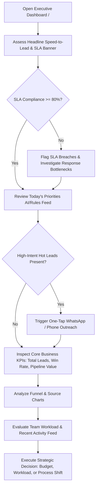
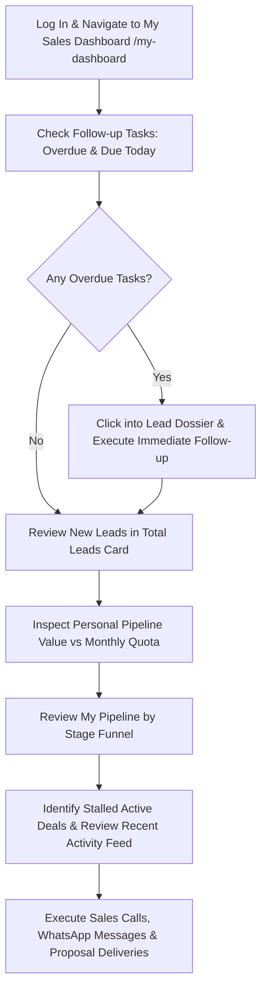

# Dashboards, Insights & AI

Executive and personal dashboards, insights, the AI assistant, and AI feature summaries.

> Consolidated from 6 source file(s). Content is verbatim; headings are nested two levels deeper under each section. Edit the original files if they still exist, then regenerate.

## Contents

1. [Ridhzo Executive Dashboard: Product & Marketing Specification](#1-ridhzo-executive-dashboard-product--marketing-specification) — `docs/EXECUTIVE_DASHBOARD.md`
2. [Ridhzo "My Dashboard": Product & Marketing Specification](#2-ridhzo-my-dashboard-product--marketing-specification) — `docs/MY_DASHBOARD.md`
3. [Ridhzo "Insights": Product & Marketing Specification](#3-ridhzo-insights-product--marketing-specification) — `docs/INSIGHTS.md`
4. [Global AI Assistant & Copilot](#4-global-ai-assistant--copilot) — `docs/AI_ASSISTANT.md`
5. [AI Features](#5-ai-features) — `docs/product-kb/14_AI_FEATURES.md`
6. [Dashboards & Insights](#6-dashboards--insights) — `docs/product-kb/15_DASHBOARDS_AND_INSIGHTS.md`

---

## 1. Ridhzo Executive Dashboard: Product & Marketing Specification

> Source: `docs/EXECUTIVE_DASHBOARD.md`

### Ridhzo Executive Dashboard: Product & Marketing Specification

> **Document Type:** Product Architecture, Feature Analysis & Website Marketing Reference  
> **Target Audience:** Business Executives, Product Marketing Managers, Enterprise Buyers  
> **Source Verification:** Verified against live Ridhzo codebase (`src/app/(dashboard)/page.tsx`, `AnalyticsService`, `SlaAnalyticsService`, `ContentSharingService`, `NextBestActionService`, and PostgreSQL/Drizzle schema).

---

#### 1. Executive Dashboard Overview

##### What the Executive Dashboard Is
The **Ridhzo Executive Dashboard** (`/`) is the central intelligence and control center of the Ridhzo lead management and sales execution platform. It aggregates organization-wide commercial performance into a unified, real-time command surface. Rather than requiring senior business leaders to navigate through disjointed operational lists, spreadsheets, or raw activity logs, the Executive Dashboard distills high-velocity sales pipelines into four critical dimensions:
1. **Speed-to-Lead & SLA Compliance:** Real-time visibility into how rapidly incoming leads receive first contact.
2. **High-Intent Content Engagement:** Immediate tracking of leads actively viewing shared documents, quotes, and collateral.
3. **Pipeline Volume & Commercial Health:** Dynamic tracking of total active volume, weighted pipeline currency value, and conversion efficiency.
4. **Team Capacity & Channel Attribution:** Source-by-source inbound performance, team workload distribution, and live operational activity feeds.

##### Why It Exists in Ridhzo
In modern B2B and high-touch B2C sales environments (such as performance marketing agencies, real estate, financial services, and consultancy), deals are won or lost in the first few minutes after a lead expresses interest. Traditional Customer Relationship Management (CRM) tools operate as passive databases where data is buried and reports lag behind by days. 

Ridhzo was engineered with an opinionated commercial philosophy: **"First-to-respond wins the deal."** The Executive Dashboard exists to give leadership uninterrupted transparency into this response velocity, identifying revenue bottlenecks, operational breaches, and high-value conversion windows as they occur.

##### Who Uses It
* **Chief Executive Officers (CEOs) & Founders:** Gain an instant, single-pane-of-glass overview of company revenue trajectory, marketing channel effectiveness, and conversion health.
* **Chief Commercial Officers (CCOs) & VPs of Sales:** Monitor pipeline capacity, hold teams accountable to Service Level Agreements (SLAs), evaluate individual rep workloads, and forecast revenue.
* **Heads of Marketing & Growth Directors:** Assess lead generation channel ROI, identify which inbound marketing campaigns produce qualified pipeline, and track whether sales teams are converting marketing-generated opportunities.
* **Sales Directors & Branch/Team Managers:** Maintain visibility across sales representatives, track overdue follow-up tasks, and intervene on high-priority opportunities before deals go cold.

##### Business Problems It Solves
* **The "Lead Black Hole":** Marketing spends significant budgets generating leads that sit uncontacted for hours or days. The dashboard tracks average first response time and SLA breaches to eradicate neglected inquiries.
* **Fragmented Sales Pipeline Visibility:** Eliminates the guesswork regarding active pipeline value and current deal distribution across different funnel stages.
* **Invisible Buyer Intent:** In traditional workflows, sales reps have no idea when a prospect is reviewing a proposal. Ridhzo detects real-time document and link engagement, surfacing active interest directly on the executive interface.
* **Unbalanced Workload Allocation:** Visualizes lead counts per representative to prevent rep burnout and eliminate unassigned or bottlenecked leads.
* **Delayed Decision-Making:** Removes dependency on end-of-month manual spreadsheet reconciliations by delivering live database aggregations.

##### Decisions It Helps Executives Make
* **Marketing Budget Allocation:** Double down on top-performing acquisition channels (e.g., Meta Ads vs. Organic vs. Partner Portals) and cut spend on low-yield sources.
* **Staffing & Resource Balancing:** Reallocate inbound leads from overburdened sales representatives to reps with available capacity.
* **Sales Process & SLA Optimization:** Pinpoint whether missed targets stem from slow initial outreach (SLA failure), poor mid-funnel follow-ups (high overdue tasks), or low closing efficiency.
* **Urgent Deal Intervention:** Intervene or prompt reps to act on high-intent buyer signals (e.g., a lead repeatedly opening a shared proposal).

##### How It Differs from Operational Dashboards and Regular Reports
| Dimension | Executive Dashboard (`/`) | Operational Dashboards (e.g., `/my-dashboard`, `/follow-ups`) | Static / Scheduled Reports |
| :--- | :--- | :--- | :--- |
| **Scope** | Tenant-wide, strategic overview across all reps, teams, and channels | Individual sales representative's assigned leads and personal tasks | Historical, snapshot-in-time exports (CSV/PDF) |
| **Primary Goal** | High-level business governance, SLA enforcement, and pipeline health | Daily task execution, calling leads, and clearing pending follow-ups | Post-mortem accounting, board decks, and compliance auditing |
| **Data Cadence** | Live database aggregations rendered per request (no stale cache) | Live personal workflow queue | Asynchronous, delayed (daily, weekly, or monthly) |
| **Interactivity** | High-level date filtering, cross-channel breakdowns, executive priorities | Task checking, call logging, note taking, status updating | Read-only static charts or tabular data |

##### How an Executive Uses It During a Working Day
1. **Morning Briefing (08:30 AM):** 
   The executive opens the dashboard and checks the **Speed to First Response** banner and **SLA Compliance Rate** from the previous 24 hours. If SLA compliance drops below 80%, the executive immediately flags response bottlenecks to sales team leads.
2. **Mid-Day Pipeline Inspection (01:00 PM):** 
   The executive reviews the **MetricsCards** and **Pipeline Distribution** area chart to assess deal movement. They inspect **Follow-up Tasks**; a surge in overdue tasks signals operational drag requiring operational escalation.
3. **High-Value Opportunity Check (03:30 PM):** 
   In the **Today's Priorities** panel, the executive reviews top opportunities that are actively opening shared proposals or collateral. If an enterprise deal shows high engagement, the executive can initiate a one-tap WhatsApp message or phone call directly from the interface.
4. **Evening Review & Resource Rebalancing (06:00 PM):** 
   Using the **Leads by Source** and **Lead Distribution by Owner** charts, the executive identifies which inbound sources drove today's growth and ensures that leads distributed across representatives remain balanced.

---

#### 2. Everything Included in the Executive Dashboard

Based directly on the live implementation in `src/app/(dashboard)/page.tsx`, `src/components/dashboard/`, and associated backend services, the Executive Dashboard contains the following components and features:

##### 1. Executive Headline & Date Filter Bar
* **Feature Name:** Dashboard Header & Date Filter (`DashboardDateFilter`)
* **What It Shows:** Page title, strategic subtitle, and interactive range buttons (`All Time`, `Today`, `Last 7 Days`, `Last 30 Days`, `This Month`).
* **Why It Matters:** Enables instant temporal slicing of pipeline performance without page reloading or complex configuration.
* **Data Source:** URL Search Parameters (`?range=...`) passed to server-side database aggregations.
* **Calculation:** Computes dynamic UTC calendar boundaries:
  * `today`: Current date from `00:00:00.000` to now.
  * `7d`: Rolling 7-day timestamp (`now - 7 * 86400000ms`).
  * `30d`: Rolling 30-day timestamp (`now - 30 * 86400000ms`).
  * `this_month`: 1st day of the current calendar month at `00:00:00.000` to now.
  * `all`: Unbounded time horizon.
* **Filters:** Date range selector.
* **Interactions:** One-click button toggle updating URL state via Next.js router.
* **Action Supported:** Isolates recent marketing campaign performance vs. cumulative historical pipeline metrics.

##### 2. Onboarding Zero-State Banner (`GettingStarted`)
* **Feature Name:** First-Run Setup Guide
* **What It Shows:** A structured 4-step onboarding pathway shown exclusively when `sla.totalLeads === 0`.
  1. *Connect a lead source* (Routes to `/settings/sources` for Website or Facebook Lead Ads integration).
  2. *Choose how you message* (Routes to `/settings` for Personal WhatsApp or Meta Cloud Business API selection).
  3. *Add your first lead* (Routes to `/leads` for manual creation or CSV import).
  4. *Turn on instant auto-reply* (Routes to `/automations` for the automated Welcome WhatsApp flow).
* **Why It Matters:** Eliminates blank dashboard paralysis for newly created tenant workspaces.
* **Data Source:** `SlaAnalyticsService.getSlaMetrics(organizationId)`.
* **Calculation:** Rendered if `totalLeads === 0`.
* **Action Supported:** Accelerates time-to-value for new enterprise accounts.

##### 3. Response Velocity & Buying Intent Banner
* **Feature Name:** SLA & Content Engagement Bar
* **What It Shows:** Three mission-critical executive health indicators in a unified visual container:
  1. **Avg. Speed to First Response:** Mean elapsed minutes between lead creation and the first recorded contact event (`lastContactedAt`), accompanied by total contacted count (`X of Y leads contacted`).
  2. **Content Opened (7d):** Total views of shared trackable links in the past 7 days, paired with an alert linking to cold/unopened content (`/leads/hot`) when unviewed shares exist.
  3. **SLA Compliance:** Percentage of leads contacted within the organizational SLA threshold (default: 15 minutes). Breached count is explicitly stated.
* **Why It Matters:** Focuses management directly on response velocity and active client interest—the two highest predictors of deal closing.
* **Data Source:** `SlaAnalyticsService.getSlaMetrics(organizationId)` and `ContentSharingService.orgEngagementStats(organizationId)`.
* **Calculation:**
  * *Avg First Contact Minutes:* $\frac{\sum (\text{lastContactedAt} - \text{createdAt})}{\text{contactedLeads Count}}$ (converted to minutes, formatted into minutes, hours, or days).
  * *SLA Compliance Rate:* $\frac{\text{Compliant Leads Count}}{\text{Total Leads Count}} \times 100$. Dynamic visual badge: Emerald (`>= 80%`), Orange (`< 80%`).
  * *Content Opens:* Count of rows in `shared_link_views` where `viewed_at >= now - 7 days`.
* **Interactions:** Interactive hyperlink to `/leads/hot` for unengaged collateral re-targeting.
* **Action Supported:** Enforces operational discipline on lead responsiveness and identifies proposals that require follow-up nudges.

##### 4. Today's Priorities Panel (`PriorityActions`)
* **Feature Name:** Next Best Action Intelligence Feed
* **What It Shows:** A ranked list (top 6) of urgent, high-priority opportunities requiring leadership or rep intervention.
* **Why It Matters:** Moves beyond passive analytics into proactive execution, showing *who* to contact, *why* to contact them, and providing *direct communication triggers*.
* **Data Source:** `LeadService.listPriorityCandidates()`, cross-referenced with `ContentSharingService.recentlyEngagedLeadIds()` and evaluated via `NextBestActionService.getRecommendation()`.
* **Calculation & Scoring Logic:**
  * Pulls up to 200 high-priority candidates: leads with status `new` and uncontacted; leads with open status and overdue follow-up; active leads with lead score $\ge 70$; or leads with content views in the last 72 hours.
  * Sorts engaged content viewers to the very top, followed by descending `score`.
  * Generates rule-based contextual reasons (e.g., *"Opened 'your shared content' 1 time recently — strike while interest is high"* or *"New lead requires initial outreach within 24 hours"*).
* **Interactions:**
  * Clickable lead name navigating to `/leads/[id]`.
  * Contextual status badge (`destructive`, `default`, `secondary`).
  * **One-Tap WhatsApp Button:** Direct web/app link to `https://wa.me/[phone]?text=[pre-filled follow-up]`.
  * **Click-to-Call Button:** Native `tel:[phone]` link.
* **Action Supported:** Enables instant, friction-free outreach to high-probability converting leads.

##### 5. Core Metric KPI Cards (`MetricsCards`)
* **Feature Name:** Executive KPI Cards (4 Cards)
* **What It Shows:**
  1. **Total Leads:** Total volume, split into new and active count.
  2. **Conversion Rate:** Win rate percentage, with exact won vs. lost/unqualified ratio.
  3. **Pipeline Value:** Total monetary value of active deals formatted in workspace currency.
  4. **Follow-up Tasks:** Overdue task count, tasks due today, and overall completion rate percentage.
* **Why It Matters:** Provides standard executive financial and operational sanity checks.
* **Data Source:** `AnalyticsService.getLeadMetrics(filters)` and `AnalyticsService.getFollowUpMetrics(filters)`.
* **Calculation:**
  * *Total Leads:* Count of non-deleted leads matching filters.
  * *Conversion Rate:* $\frac{\text{Won}}{\text{Won} + \text{Lost} + \text{Unqualified}} \times 100$. (Unqualified leads are calculated as closed losses to avoid flattering conversion percentages).
  * *Pipeline Value:* Sum of `expectedValue` for leads in the `in_progress` status category.
  * *Follow-up Completion Rate:* $\frac{\text{Completed Follow-ups}}{\text{Total Follow-ups}} \times 100$.
* **Filters:** Inherits active date range, owner ID, and team ID filters.
* **Action Supported:** Evaluates cash pipeline trajectory and operational backlog.

##### 6. Leads by Source Chart (`LeadsBySourceChart`)
* **Feature Name:** Inbound Acquisition Channel Breakdown
* **What It Shows:** Vertical bar chart illustrating lead volume generated across every configured source (e.g., Facebook Ads, Google Ads, Website Forms, Organic, Direct).
* **Why It Matters:** Demonstrates where marketing spend is converting into real sales volume.
* **Data Source:** `AnalyticsService.getLeadsBySource(filters)`.
* **Calculation:** Grouped SQL aggregation joining `leads` with `lead_sources` on `leads.source_id = lead_sources.id`.
* **Interactions:** Recharts dark-mode tooltip displaying exact lead counts and percentages.
* **Action Supported:** Informs budget allocation decisions across marketing channels.

##### 7. Pipeline Distribution Chart (`LeadsByStageChart`)
* **Feature Name:** Pipeline Stage Volume Curve
* **What It Shows:** Smooth gradient Area Chart depicting lead distribution across pipeline stages (`New`, `Active`, `Won`, `Lost`, `Unqualified`).
* **Why It Matters:** Highlights pipeline bottlenecks (e.g., a bulge at "Active" with low throughput to "Won").
* **Data Source:** `AnalyticsService.getPipelineDistribution(filters)`.
* **Calculation:** Grouped counts across status categories mapped via `CustomStatusSchemaService`.
* **Interactions:** Interactive hover tooltip displaying stage name and volume.
* **Action Supported:** Identifies where deals are dropping off or stalling in the qualification funnel.

##### 8. Lead Distribution by Owner Chart (`LeadsByOwnerChart`)
* **Feature Name:** Representative Workload Allocation
* **What It Shows:** Horizontal bar chart displaying the total number of assigned leads per sales team member (or "Unassigned").
* **Why It Matters:** Prevents uneven lead distribution, ensuring high performers are adequately supplied and leads are not neglected in "Unassigned" status.
* **Data Source:** `AnalyticsService.getLeadsByOwner(filters)`.
* **Calculation:** SQL join between `leads` and `users` on `leads.owner_id = users.id`.
* **Interactions:** Interactive hover tooltip indicating exact lead load per rep.
* **Action Supported:** Prompts rebalancing of automated round-robin assignment rules.

##### 9. Recent Activity Timeline Feed (`RecentActivityFeed`)
* **Feature Name:** Real-Time Operational Audit Feed
* **What It Shows:** The 10 most recent chronological actions performed across the entire organization, with icon-coded event types (`Message`, `Note`, `Assignment`, `Tag`, `System/Clock`), actor name, lead link, and localized relative time.
* **Why It Matters:** Gives executives a pulse check on whether sales reps are actively working deals.
* **Data Source:** `AnalyticsService.getRecentActivity(filters)`.
* **Calculation:** Queries `activities` joined with `leads` and `users`, ordered by `occurredAt DESC` limited to 10 rows.
* **Interactions:** Direct clickable navigation link to the individual lead's profile (`/leads/[id]`).
* **Action Supported:** Instant spot-checking of representative notes, outbound WhatsApp messages, and lead reassignments.

---

#### 3. Executive Dashboard Features

Below is the complete categorization of features supported by the live application codebase, clearly distinguishing what is displayed directly in the Executive Dashboard, what exists in the backend analytics engine, and what is located in secondary modules:

##### Business Overview
* **Tenant-Scoped Executive Control:** Isolated multi-tenant workspace architecture (`requireOrg()`) ensuring that data is strictly partitioned per organization.
* **Dynamic Currency & Locale Formatting:** All monetary and date metrics automatically adapt to the organization's regional settings (configured in `organizations.currency`, `locale`, `dateFormat`, `timezone`) via `getOrgFormat`.
* **First-Run Empty State Guidance:** Automated detection of zero-lead states with structured onboarding recommendations.

##### Lead Performance & Speed-to-Lead
* **Average Speed to First Contact:** Quantifies operational response time from lead generation to first recorded outreach.
* **SLA Threshold Compliance Monitoring:** Tracks percentage of leads contacted within 15 minutes and flags SLA breaches.
* **Lead Volume Status Tracking:** Real-time visibility into open vs. in-progress volume.

##### Sales Performance & Pipeline Health
* **Pipeline Stage Distribution:** Multi-stage funnel visualization covering New, Active, Won, Lost, and Unqualified stages.
* **Custom Status Category Normalization:** Support for enterprise-customized lead stages via `CustomStatusSchemaService` (mapping arbitrary custom status keys into standard analytical categories: `open`, `in_progress`, `won`, `lost`, `unqualified`).
* **Follow-up Operational Accountability:** Tracks task completion rates, overdue follow-up counts, and same-day task deadlines.

##### Revenue & Financial Metrics
* **Active Pipeline Valuation:** Real-time cumulative calculation of `expectedValue` for active opportunities.
* **Win/Loss Conversion Rate:** Accurate closed-loop calculation factoring in both disqualified and lost deals to prevent artificial inflation.
* **Backend Expected Revenue Calculation (Engine Feature):** `AnalyticsService.getLeadMetrics` calculates cumulative closed-won revenue (`expectedRevenue`), accessible via the API and backend analytics.

##### Customer & Buyer Insights
* **7-Day Document & Content Engagement:** Tracks total views on shared collateral (proposals, brochures, spec sheets).
* **Unengaged Content Detection:** Identifies shared proposals that prospects have ignored for over 24 hours, offering direct re-engagement paths.
* **Predictive Next Best Action:** Proprietary heuristic engine identifying warm buying signals and recommending high-impact sales maneuvers.

##### Team & Representative Performance
* **Owner Lead Allocation:** Horizontal comparative visualization of active workload per representative.
* **Team-Level Aggregation (Engine Feature):** `AnalyticsService.getLeadsByTeam` provides lead grouping by designated sales teams. *(Available in the analytics service and backend API)*.
* **Multi-Branch Hierarchy Note:** *Ridhzo does not use a physical "Branch" schema.* Instead, Ridhzo organizes sales operations using **Organizations (Tenants)**, **Teams**, and **Individual Users (Owners)**. Enterprise branch models map cleanly to Ridhzo's Team and Organization structures.

##### Activity Monitoring & Auditability
* **Multi-Channel Activity Stream:** Real-time feed capturing notes, outbound messaging, team reassignments, and tagging.
* **Localized Timestamp Formatting:** User-facing timestamps rendered according to workspace timezone settings.

##### Filters & Controls
* **Temporal Presets:** Single-click date boundary switching (`All Time`, `Today`, `7d`, `30d`, `This Month`).
* **URL Parameter Filtering:** Support for `ownerId` and `teamId` URL parameters to filter dashboard queries down to specific reps or teams.

##### Complementary Advanced Analytics (Located in `/insights`)
To maintain high responsiveness, deep statistical analyses are separated into the dedicated **Insights** interface (`src/app/(dashboard)/insights/page.tsx`). These include:
* *Pipeline Health Scorecard & Composite Grading (A/B/C/D)*
* *Revenue Forecasting (Weighted Pipeline & Forecast Value)*
* *Win/Loss Reason Analysis (`lostReason` breakdown)*
* *Acquisition Channel ROI & Lead Acquisition Cost*
* *Pipeline Velocity & Cycle Time (Average Days to Close)*
* *Stage Stagnation & Pipeline Aging Matrix*
* *Customer Lifetime Value (LTV) & Cohort Retention*
* *Geographic Concentration Analytics*
* *Rep Capacity & Workload Balancing Scorecards*

---

#### 4. Dashboard Metrics

The following table documents every Key Performance Indicator (KPI) presented on the Ridhzo Executive Dashboard:

| KPI | Meaning | Calculation | Business Use |
| :--- | :--- | :--- | :--- |
| **Avg. Speed to First Response** | Average time elapsed from when an inbound lead is created to when a rep initiates contact. | $\frac{\sum (\text{lastContactedAt} - \text{createdAt})}{\text{contactedLeads Count}}$ | Identifies response bottlenecks. Faster response directly correlates with higher win rates. |
| **SLA Compliance Rate** | Percentage of all organization leads contacted within the designated SLA window (default 15 minutes). | $\frac{\text{Leads Contacted in } \le 15\text{m}}{\text{Total Leads}} \times 100$ | Enforces service standards and holds sales management accountable for lead decay. |
| **SLA Breached Count** | Absolute count of leads that exceeded the SLA window without outreach or remain uncontacted past 15 minutes. | Count of leads where response time $> 15\text{m}$ or age $> 15\text{m}$ uncontacted | Pinpoints the exact volume of neglected prospective customers. |
| **Content Opened (7d)** | Total number of client views logged on trackable shared links/documents over the past 7 days. | Count of rows in `shared_link_views` where `viewed_at >= now - 7 days` | Measures active customer buying intent and interest in shared collateral. |
| **Ignored Content Count** | Number of shared documents that have registered 0 opens after 24 hours. | Count of `shared_links` where `view_count = 0` and `created_at < now - 24h` | Flags prospects who may require follow-up nudges or alternative outreach channels. |
| **Total Leads** | Total count of active, non-deleted leads matching the current workspace and date filter. | $\text{Count of leads where deletedAt IS NULL}$ | Core operational volume indicator showing overall business top-of-funnel scale. |
| **New Leads** | Leads in the initial intake stage awaiting engagement. | Count of leads where status category = `'open'` | Monitors intake backlog awaiting sales rep assignment or qualification. |
| **Active Leads** | Leads currently engaged in active sales conversations. | Count of leads where status category = `'in_progress'` | Represents work-in-progress pipeline requiring ongoing nurturing. |
| **Conversion Rate (Win Rate)** | Percentage of closed opportunities that resulted in a successfully won customer. | $\frac{\text{Won}}{\text{Won} + \text{Lost} + \text{Unqualified}} \times 100$ | Primary sales efficiency metric. Unqualified leads count against win rate to maintain calculation integrity. |
| **Pipeline Value** | Cumulative monetary expected value of all active in-progress opportunities. | $\sum \text{expectedValue for active leads}$ | Indicates short-term revenue pipeline formatted in the workspace's currency. |
| **Overdue Follow-ups** | Count of scheduled follow-up tasks whose due date has elapsed without completion. | Count of `follow_ups` where $\text{status} = \text{'pending'}$ and $\text{dueAt} < \text{now}$ | Immediate indicator of operational slippage or rep burnout. |
| **Due Today Follow-ups** | Tasks scheduled for completion before the end of the current calendar day. | Count of `follow_ups` where $\text{status} = \text{'pending'}$ and $\text{dueAt}$ is today | Operational work queue volume for the current day. |
| **Follow-up Completion Rate** | Percentage of all assigned follow-up tasks that have been successfully closed. | $\frac{\text{Completed Follow-ups}}{\text{Total Follow-ups}} \times 100$ | Measures overall team task compliance and execution discipline. |
| **Median Response Time (Engine)** | Statistical midpoint response time across all contacted leads. | $\text{Median of } (\text{lastContactedAt} - \text{createdAt})$ | Provides an un-skewed benchmark immune to historical outlier leads. |
| **< 5-Min Response Rate (Engine)** | Percentage of incoming leads contacted within 5 minutes of creation. | $\frac{\text{Leads Contacted in } \le 300\text{s}}{\text{Total Leads}} \times 100$ | Measures elite speed-to-lead capability (the gold standard in performance marketing). |

---

#### 5. Charts and Visualizations

Every chart on the Ridhzo Executive Dashboard is rendered using a unified monochrome aesthetic designed for readability and dark-mode elegance:

```
+------------------------------------------------------------------------------------+
|  Leads by Source [Bar Chart, col-span-4]  |  Pipeline Distribution [Area Chart]    |
|  (Distribution across channels)           |  (Leads broken down by current stage)  |
+-------------------------------------------+----------------------------------------+
|  Lead Distribution by Owner [H-Bar]       |  Recent Activity [Timeline Feed]       |
|  (Assigned leads per sales rep)           |  (Live chronological actions across org)|
+------------------------------------------------------------------------------------+
```

##### 1. Leads by Source Chart
* **Component:** `LeadsBySourceChart` (`src/components/dashboard/Charts.tsx`)
* **Chart Type:** Vertical Bar Chart (`BarChart` via Recharts).
* **Data Represented:** Total count of incoming leads grouped by originating channel (e.g., Meta Ads, Google Ads, Inbound Website, Partner API, Direct/Organic).
* **Time Period:** Dictated by the global Date Filter (`all`, `today`, `7d`, `30d`, `this_month`).
* **Available Filters:** Date Range, Owner ID, Team ID.
* **Executive Takeaway:** Directly identifies which customer acquisition channels are generating volume, allowing marketing leaders to optimize ad spend.

##### 2. Pipeline Distribution Chart
* **Component:** `LeadsByStageChart` (`src/components/dashboard/Charts.tsx`)
* **Chart Type:** Area Chart with Gradient Fill (`AreaChart` via Recharts).
* **Data Represented:** Volume of leads positioned across each stage of the sales pipeline (`New`, `Active`, `Won`, `Lost`, `Unqualified`).
* **Time Period:** Dictated by global Date Filter.
* **Available Filters:** Date Range, Owner ID, Team ID.
* **Executive Takeaway:** Visualizes the conversion funnel shape. Bulges in intermediate stages highlight workflow friction or lack of follow-up velocity.

##### 3. Lead Distribution by Owner Chart
* **Component:** `LeadsByOwnerChart` (`src/components/dashboard/Charts.tsx`)
* **Chart Type:** Horizontal Bar Chart (`BarChart layout="vertical"` via Recharts).
* **Data Represented:** Total volume of leads actively assigned to each sales representative or categorized as "Unassigned".
* **Time Period:** Dictated by global Date Filter.
* **Available Filters:** Date Range, Owner ID, Team ID.
* **Executive Takeaway:** Reveals workload equity across the sales force. Highlights whether unassigned leads are accumulating or certain reps are over-allocated.

##### 4. Recent Activity Timeline Feed
* **Component:** `RecentActivityFeed` (`src/components/dashboard/RecentActivityFeed.tsx`)
* **Widget Type:** Chronological Activity Timeline Feed (10 latest actions).
* **Data Represented:** Real-time log entries capturing user notes, customer calls, outgoing messages, lead stage movements, and tags.
* **Time Period:** Rolling real-time window.
* **Available Filters:** Date Range, Organization Scope.
* **Executive Takeaway:** Confirms ongoing sales outreach in real time. Provides immediate verification that team members are active.

---

#### 6. Filters and Controls

The Executive Dashboard provides flexible filtering to segment organization-wide data:

##### 1. Date Range Filter (`DashboardDateFilter`)
* **UI Location:** Top right header.
* **Control Mechanism:** 5 quick-toggle buttons updating the `?range=` URL query string without losing page state.
* **Filter Options:**
  * **All Time (`range=all`):** Removes date constraints; calculates historical aggregates.
  * **Today (`range=today`):** Limits queries to records created from midnight of the current day to the present moment.
  * **Last 7 Days (`range=7d`):** Rolling 168-hour window.
  * **Last 30 Days (`range=30d`):** Rolling 720-hour window.
  * **This Month (`range=this_month`):** Constrains data from the 1st day of the current calendar month.
* **Impact on Dashboard:** Re-executes server-side queries for `getLeadsBySource`, `getPipelineDistribution`, `getLeadsByOwner`, `getLeadMetrics`, `getFollowUpMetrics`, and `getRecentActivity`.

##### 2. Owner & Team URL Filtering (`ownerId`, `teamId`)
* **Control Mechanism:** Query parameters parsed directly by `ExecutiveDashboardPage` (`?ownerId=...` and `?teamId=...`).
* **Backend Support:** `AnalyticsFilters` natively applies SQL `eq(leads.ownerId, filters.ownerId)` and `eq(leads.teamId, filters.teamId)` across all metrics and charts.
* **Impact on Dashboard:** Enables executive managers to drill into a single team or individual sales representative while using the executive view.

##### 3. Structural Comparison: Branches vs. Teams in Ridhzo
* Traditional ERP software often enforces rigid geographic "Branch" tables.
* Ridhzo employs a flexible multi-tenant model: **Organizations** represent independent business entities, **Teams** represent commercial divisions or regional offices, and **Users** represent individual sales representatives.
* Filtering by `teamId` serves the exact business function of comparing regional branches or specialized business units.

---

#### 7. Executive Use Cases

##### 1. Morning Review: First-Response Velocity Audit
* **Scenario:** An executive arrives at 08:30 AM to evaluate overnight lead handling.
* **Dashboard Action:** Checks the **Speed to First Response** banner and **SLA Compliance Rate**.
* **Outcome:** Discovers that overnight web leads averaged 45 minutes to first contact, breaching the 15-minute SLA. The executive can adjust overnight shift routing or activate the automated instant WhatsApp response flow.

##### 2. Marketing ROI & Inbound Channel Assessment
* **Scenario:** The company recently launched a major paid marketing campaign across Meta and Google Ads.
* **Dashboard Action:** The executive toggles the date filter to `Last 7 Days` and evaluates the **Leads by Source** chart alongside the **Conversion Rate** card.
* **Outcome:** Identifies that while Meta Ads generated 60% of inbound volume, Google Ads converted at 3.5x higher efficiency. Informs marketing to reallocate budget toward higher-intent search terms.

##### 3. Intervening on Hot Prospect Engagement
* **Scenario:** Mid-afternoon review of sales activity.
* **Dashboard Action:** Inspects the **Today's Priorities** panel and notes that an active high-value lead just viewed a proposal document multiple times.
* **Outcome:** The executive clicks the **One-Tap WhatsApp** button directly on the dashboard card to send a pre-filled follow-up message to the prospect while their buying interest is active.

##### 4. Resolving Follow-Up Backlog & Operational Drag
* **Scenario:** Deal closing velocity has slowed down toward the end of the quarter.
* **Dashboard Action:** Checks the **Follow-up Tasks** card and notes 38 overdue follow-ups alongside a low completion rate (42%).
* **Outcome:** Identifies that sales representatives are bottlenecked on manual administrative tasks, prompting team leads to run a follow-up clearing session.

##### 5. Workload Equity & Rep Capacity Balancing
* **Scenario:** Certain sales representatives report feeling overwhelmed while overall deal velocity is uneven.
* **Dashboard Action:** Inspects the **Lead Distribution by Owner** chart.
* **Outcome:** Discovers that one senior rep is holding 85 active leads while two newer reps have fewer than 15 each. Management updates assignment rules to balance incoming lead distribution.

---

#### 8. Executive Workflow

A structured step-by-step workflow illustrating how an executive navigates the Ridhzo Executive Dashboard during daily operations:



1. **Access Command Center:** Navigate to the root URL (`/`) with tenant session authenticated via RBAC.
2. **Review SLA & Response Velocity:** Review the top headline bar for average response minutes and SLA compliance percentage.
3. **Scan Real-Time Buying Signals:** Check the 7-day content open count. If unviewed proposals exist, click through to `/leads/hot` to trigger nudges.
4. **Inspect High-Priority Opportunities:** Review **Today's Priorities** for immediate deal triggers, utilizing one-tap WhatsApp links for rapid outreach.
5. **Verify Financial & Operational KPIs:** Assess Total Leads, Conversion Rate, Currency Pipeline Value, and Overdue Follow-up counts.
6. **Evaluate Funnel Geometry:** Analyze the **Pipeline Distribution** area chart to detect mid-funnel stalls.
7. **Audit Channel Yield & Team Allocation:** Compare lead sources in the bar chart and inspect owner assignments for workload balance.
8. **Verify Operational Activity:** Glance at the **Recent Activity Feed** to confirm current team engagement.
9. **Take Informed Strategic Action:** Reallocate marketing budget, adjust round-robin rules, or address sales execution hurdles.

---

#### 9. Marketing-Friendly Feature Explanation

##### Why Executives Use the Ridhzo Executive Dashboard

In high-growth companies, revenue is lost not because sales reps cannot close, but because leads grow cold before the first conversation ever happens. The **Ridhzo Executive Dashboard** transforms lead management from an administrative chore into an automated revenue engine.

* **Radical Pipeline Visibility:** Gain an instant, comprehensive view of your entire sales engine. No more waiting for end-of-week spreadsheet reports; Ridhzo gives you real-time commercial clarity the moment you log in.
* **Enforce Speed-to-Lead as a Culture:** Research consistently proves that reaching a prospect within minutes increases conversion rates by multiples. Ridhzo puts response velocity and SLA tracking front and center, establishing accountability across your sales floor.
* **Capitalize on Live Buyer Intent:** Traditional CRMs can't tell you when a prospect is reviewing your proposal. Ridhzo alerts you the moment shared collateral is opened, allowing you to strike while buyer interest is highest.
* **Proactive Next Best Actions:** Rather than sifting through hundreds of leads, your leadership team and sales reps receive a curated list of top priority opportunities ranked by engagement and conversion probability.
* **Balanced Workload Management:** Eliminate sales rep burnout and prevent unassigned leads from slipping through the cracks with clear visual workload distribution across all team members.
* **Agile Marketing Allocation:** Immediately distinguish between channels that merely generate clicks and channels that deliver actual closed-won revenue.

---

#### 10. Feature List for Website

A marketing-ready feature list highlighting key Executive Dashboard capabilities:

* **Executive Command Header**  
  Instantly filter organization-wide performance across custom time horizons (Today, 7 Days, 30 Days, This Month, or All Time) with real-time recalculations.

* **Speed-to-Lead Response Tracker**  
  Real-time tracking of average time to first contact, keeping sales teams accountable to the standard that first-to-respond wins the deal.

* **Automated SLA Compliance Monitoring**  
  Visual tracking of organizational response thresholds (15-minute target) with instant alerts on SLA breaches.

* **Live Content Engagement Radar**  
  Monitors prospect interactions with shared quotes, decks, and documents over rolling 7-day windows to detect active buying signals.

* **Today's Priorities AI Recommendation Panel**  
  A prioritized daily execution queue that surfaces top opportunities based on lead scores, follow-up deadlines, and live document views.

* **One-Tap Instant Outreach**  
  Direct, friction-free WhatsApp messaging and click-to-call buttons embedded directly on priority cards for immediate lead contact.

* **Integrity-Driven Conversion Rate Analytics**  
  True closed-loop conversion metrics that factor in disqualified leads to give leadership realistic, un-inflated win rates.

* **Dynamic Multi-Currency Pipeline Valuation**  
  Real-time valuation of active deals formatted automatically in your organization’s native currency and regional locale.

* **Channel Attribution Bar Visualization**  
  Comparative breakdown of inbound lead volume across acquisition channels to evaluate marketing spend efficiency.

* **Pipeline Stage Distribution Funnel**  
  Gradient-mapped stage distribution charts displaying deal flow from new intake to won and lost stages.

* **Sales Representative Workload Matrix**  
  Workload distribution charts that highlight rep allocation and identify unassigned opportunities.

* **Live Audit Activity Feed**  
  Real-time chronological timeline tracking client messaging, notes, and lead assignments across the company.

* **Zero-State Guided Onboarding**  
  Contextual step-by-step setup guides that assist new organizations in connecting lead sources and messaging channels on day one.

---

#### 11. Executive Dashboard Page Structure

The Executive Dashboard (`src/app/(dashboard)/page.tsx`) is structured from top to bottom as follows:

```
+====================================================================================+
| HEADER: Title ("Executive Dashboard") + Subtitle                                    |
| [All Time] [Today] [Last 7 Days] [Last 30 Days] [This Month] (DashboardDateFilter) |
+====================================================================================+
| [OPTIONAL] GETTING STARTED BANNER (Rendered only when total leads === 0)           |
|  1. Connect Source  2. Choose Messaging  3. Add Lead  4. Turn On Auto-Reply        |
+====================================================================================+
| SPEED & ENGAGEMENT HEADLINE BANNER (rounded-2xl border bg-card p-6)                |
|  [Timer] Avg Speed to First Response  |  [Eye] Content Opened (7d)  | SLA Compl. % |
|  e.g. "12m" (X of Y contacted)       |  e.g. "14 opens" (nudge)    | e.g. "92%"   |
+====================================================================================+
| TODAY'S PRIORITIES PANEL (PriorityActions - Suspense Loaded)                       |
|  [Sparkles] "Today's priorities — Your next best actions, ranked by buying signal" |
|  - Lead Name | Action Badge | Reason String | [WhatsApp] [Call] (Top 6 leads)      |
+====================================================================================+
| CORE METRIC CARDS (MetricsCards - Suspense Loaded - 4 Column Grid)                 |
|  [Total Leads]        [Conversion Rate]    [Pipeline Value]    [Follow-up Tasks]   |
|  e.g. 142 total       e.g. 24.5% win rate  e.g. $145,000       e.g. 4 overdue      |
+====================================================================================+
| CHARTS ROW 1 (7-Column Responsive Grid)                                            |
|  - [Col-Span 4] Leads by Source (Vertical Bar Chart - Inbound channels)            |
|  - [Col-Span 3] Pipeline Distribution (Gradient Area Chart - Stages)               |
+====================================================================================+
| CHARTS ROW 2 (7-Column Responsive Grid)                                            |
|  - [Col-Span 4] Lead Distribution by Owner (Horizontal Bar Chart - Rep workload)   |
|  - [Col-Span 3] Recent Activity Feed (Live 10-event audit log with lead links)     |
+====================================================================================+
```

1. **Header & Date Filter (`DashboardDateFilter`):** Title, real-time subtitle, and range selection buttons (`/components/dashboard/DashboardDateFilter.tsx`).
2. **Zero-State Onboarding Banner (`GettingStarted`):** Conditional setup card displayed when `sla.totalLeads === 0`.
3. **Speed & SLA Headline Banner:** Unified metric card featuring `Avg. speed to first response`, `Content opened (7d)` (with deep-link to `/leads/hot`), and `SLA compliance %`.
4. **Today's Priorities Panel (`PriorityActions`):** Suspense-wrapped next-best-action list displaying up to 6 high-intent opportunities with direct WhatsApp and phone actions.
5. **Key Performance Cards (`MetricsCards`):** Suspense-wrapped 4-card grid for Total Leads, Conversion Rate, Pipeline Value, and Follow-up Tasks.
6. **Primary Visualizations (Row 1):**
   * *Left (4/7 width):* `LeadsBySourceChart` (Channel distribution).
   * *Right (3/7 width):* `LeadsByStageChart` (Pipeline stage area curve).
7. **Secondary Visualizations & Activity (Row 2):**
   * *Left (4/7 width):* `LeadsByOwnerChart` (Rep workload bar chart).
   * *Right (3/7 width):* `RecentActivityFeed` (Live chronological event log).

---

#### 12. Technical Reference

A complete technical inventory of all files, components, services, and queries supporting the Executive Dashboard:

##### Routes and Entry Points
* **Dashboard Page Component:** [`src/app/(dashboard)/page.tsx`](file:///Users/naveenadicharla/Documents/ridhzo/src/app/(dashboard)/page.tsx)
* **Dashboard Layout:** [`src/app/(dashboard)/layout.tsx`](file:///Users/naveenadicharla/Documents/ridhzo/src/app/(dashboard)/layout.tsx)
* **REST API Endpoint:** [`src/app/api/v1/dashboard/route.ts`](file:///Users/naveenadicharla/Documents/ridhzo/src/app/api/v1/dashboard/route.ts)
* **Secondary Sales Rep Route:** [`src/app/(dashboard)/my-dashboard/page.tsx`](file:///Users/naveenadicharla/Documents/ridhzo/src/app/(dashboard)/my-dashboard/page.tsx)
* **Secondary In-Depth Analytics Route:** [`src/app/(dashboard)/insights/page.tsx`](file:///Users/naveenadicharla/Documents/ridhzo/src/app/(dashboard)/insights/page.tsx)

##### UI Components
* **KPI Metrics Cards:** [`src/components/dashboard/MetricsCards.tsx`](file:///Users/naveenadicharla/Documents/ridhzo/src/components/dashboard/MetricsCards.tsx)
* **Priority Actions Panel:** [`src/components/dashboard/PriorityActions.tsx`](file:///Users/naveenadicharla/Documents/ridhzo/src/components/dashboard/PriorityActions.tsx)
* **Recent Activity Feed:** [`src/components/dashboard/RecentActivityFeed.tsx`](file:///Users/naveenadicharla/Documents/ridhzo/src/components/dashboard/RecentActivityFeed.tsx)
* **Date Filter Component:** [`src/components/dashboard/DashboardDateFilter.tsx`](file:///Users/naveenadicharla/Documents/ridhzo/src/components/dashboard/DashboardDateFilter.tsx)
* **Zero-State Onboarding Component:** [`src/components/dashboard/GettingStarted.tsx`](file:///Users/naveenadicharla/Documents/ridhzo/src/components/dashboard/GettingStarted.tsx)
* **Recharts Chart Primitives:** [`src/components/dashboard/Charts.tsx`](file:///Users/naveenadicharla/Documents/ridhzo/src/components/dashboard/Charts.tsx)
* **Lazy Dynamic Chart Loaders:** [`src/components/dashboard/ChartsLazy.tsx`](file:///Users/naveenadicharla/Documents/ridhzo/src/components/dashboard/ChartsLazy.tsx)
* **Localized Timestamp Helper:** [`src/components/LocalTime.tsx`](file:///Users/naveenadicharla/Documents/ridhzo/src/components/LocalTime.tsx)

##### Backend Services & Domain Logic
* **Core Analytics Service:** [`src/lib/analytics/service.ts`](file:///Users/naveenadicharla/Documents/ridhzo/src/lib/analytics/service.ts)  
  *Methods:* `getLeadMetrics()`, `getFollowUpMetrics()`, `getLeadsBySource()`, `getPipelineDistribution()`, `getLeadsByOwner()`, `getLeadsByTeam()`, `getRecentActivity()`.
* **SLA & Response Velocity Service:** [`src/domains/leads/slaAnalyticsService.ts`](file:///Users/naveenadicharla/Documents/ridhzo/src/domains/leads/slaAnalyticsService.ts)  
  *Method:* `getSlaMetrics(organizationId, slaMinutesThreshold = 15)`.
* **Content Sharing & Tracking Service:** [`src/domains/leads/contentSharingService.ts`](file:///Users/naveenadicharla/Documents/ridhzo/src/domains/leads/contentSharingService.ts)  
  *Methods:* `orgEngagementStats(organizationId, windowMs)`, `recentlyEngagedLeadIds(organizationId)`.
* **Next Best Action Scoring Engine:** [`src/domains/leads/nextBestActionService.ts`](file:///Users/naveenadicharla/Documents/ridhzo/src/domains/leads/nextBestActionService.ts)  
  *Method:* `getRecommendation(input)`.
* **Lead Priority Candidate Query:** [`src/domains/leads/service.ts`](file:///Users/naveenadicharla/Documents/ridhzo/src/domains/leads/service.ts)  
  *Method:* `LeadService.listPriorityCandidates(organizationId, engagedIds, limit)`.
* **Custom Status Schema Normalizer:** [`src/domains/leads/customStatusSchemaService.ts`](file:///Users/naveenadicharla/Documents/ridhzo/src/domains/leads/customStatusSchemaService.ts)  
  *Method:* `CustomStatusSchemaService.getStatusCategoryMap(organizationId)`.

##### Authentication & Multi-Tenancy
* **RBAC & Tenant Guard:** [`src/lib/rbac/index.ts`](file:///Users/naveenadicharla/Documents/ridhzo/src/lib/rbac/index.ts) (`requireOrg()`).
* **Multi-Currency & Regional Formatting:**  
  * Client Formatter: [`src/lib/format.ts`](file:///Users/naveenadicharla/Documents/ridhzo/src/lib/format.ts) (`formatCurrency`, `formatDateTime`).
  * Server Memoized Resolver: [`src/lib/format.server.ts`](file:///Users/naveenadicharla/Documents/ridhzo/src/lib/format.server.ts) (`getOrgFormat`).

##### Database Models & Schema
* **Leads & Lead Sources:** [`src/db/schema/leads.ts`](file:///Users/naveenadicharla/Documents/ridhzo/src/db/schema/leads.ts) (`leads`, `leadSources`, `customStatusConfigs`).
* **Activities & Follow-ups:** [`src/db/schema/activities.ts`](file:///Users/naveenadicharla/Documents/ridhzo/src/db/schema/activities.ts) (`activities`, `followUps`).
* **Shared Trackable Links & Views:** [`src/db/schema/sharedContent.ts`](file:///Users/naveenadicharla/Documents/ridhzo/src/db/schema/sharedContent.ts) (`sharedLinks`, `sharedLinkViews`).
* **Users, Teams & Roles:** [`src/db/schema/users.ts`](file:///Users/naveenadicharla/Documents/ridhzo/src/db/schema/users.ts) (`users`, `teams`, `roles`).
* **Tenants / Organizations:** [`src/db/schema/organizations.ts`](file:///Users/naveenadicharla/Documents/ridhzo/src/db/schema/organizations.ts) (`organizations`).

##### Automated Test Coverage
* **Analytics Service Unit & Calculation Tests:** [`src/lib/analytics/service.test.ts`](file:///Users/naveenadicharla/Documents/ridhzo/src/lib/analytics/service.test.ts)
* **End-to-End Playwright Dashboard Tests:** [`e2e/dashboard.spec.ts`](file:///Users/naveenadicharla/Documents/ridhzo/e2e/dashboard.spec.ts)

---

## 2. Ridhzo "My Dashboard": Product & Marketing Specification

> Source: `docs/MY_DASHBOARD.md`

### Ridhzo "My Dashboard": Product & Marketing Specification

> **Document Type:** Product Architecture, Feature Analysis & Website Marketing Reference  
> **Target Audience:** Sales Representatives, Account Executives, Sales Managers, Growth Teams  
> **Source Verification:** Verified against live Ridhzo codebase (`src/app/(dashboard)/my-dashboard/page.tsx`, `AnalyticsService`, `MetricsCards`, `LeadsByStageChart`, `RecentActivityFeed`, and PostgreSQL/Drizzle schema).

---

#### 1. My Dashboard Overview

##### What "My Dashboard" Is
The **Ridhzo My Dashboard** (`/my-dashboard`), titled **"My Sales Dashboard"** in the application interface, is the dedicated personal cockpit for individual sales representatives, account managers, and business development reps. While the Executive Dashboard provides a high-level, aggregate vantage point across the entire company, My Dashboard isolates and displays the pipeline, conversion efficiency, and operational workload of the authenticated user.

##### Why It Exists in Ridhzo
In fast-paced sales operations, cognitive overload kills execution. If a frontline sales rep opens a dashboard populated with hundreds of company-wide leads, competing priorities, and unrelated branch statistics, it creates confusion and dilutes focus. 

Ridhzo created My Dashboard to provide an uncompromised, noise-free workspace. Every metric and chart is scoped directly to the individual:
* **"How many active opportunities am I managing right now?"**
* **"What is my personal expected deal value this month?"**
* **"How many follow-up tasks do I owe today, and how many are slipping overdue?"**
* **"Where are my assigned prospects getting stuck in my pipeline?"**

##### Who Uses It
* **Sales Representatives & Account Executives (AEs):** Monitor personal quota achievement, track owned active leads, and clear pending follow-up backlogs.
* **Business Development Reps (BDRs / SDRs):** Track the velocity of newly assigned intake leads and transition them into active qualification.
* **Team Leads & Sales Coaches:** Review individual rep cockpits during 1-on-1 pipeline reviews to diagnose individual conversion rates, stage drop-offs, or task bottlenecks.

##### Business Problems It Solves
* **Distraction & Clutter:** Strips away organization-wide noise so reps focus exclusively on the prospects they personally own and are accountable for closing.
* **Slipping Follow-ups:** Highlights overdue tasks and tasks due today immediately upon login, preventing hot prospects from turning cold.
* **Unclear Personal Pipeline Value:** Replaces mental math with a real-time, multi-currency valuation of all active deals currently held by the representative.
* **Subjective Self-Assessment:** Delivers hard, data-driven personal conversion metrics (win rates) so reps can benchmark their performance over time.

##### Decisions It Helps Sales Reps Make
* **Daily Prioritization:** Immediately see whether today should be spent clearing overdue follow-ups or working new lead intake.
* **Pipeline Management:** Identify deals stagnating in intermediate stages and initiate stage transitions or close-lost disqualifications.
* **Quota Projection:** Compare current active pipeline value against personal monthly sales targets to know if more prospecting or higher closing velocity is required.

##### How It Differs from the Executive Dashboard and Task Lists
| Dimension | My Dashboard (`/my-dashboard`) | Executive Dashboard (`/`) | Follow-up Queue (`/follow-ups`) |
| :--- | :--- | :--- | :--- |
| **User Role** | Frontline Sales Rep, AE, BDR | CEO, CCO, VP of Sales, Branch Manager | All sales roles |
| **Data Scope** | **Strictly Personal:** Filtered to `ownerId = currentUserId` | **Organization-Wide:** Across all reps, teams, and sources | Personal or team task rows |
| **Primary Focus** | Personal pipeline velocity & task clearing | Team governance, SLA tracking & marketing channel attribution | Granular task-by-task execution |
| **Key Visualizations** | Personal Pipeline Area Curve + Recent Activity Feed | Multi-source Bar Chart, Owner Allocation, Pipeline Distribution | Tabular task list & calendar view |

##### How a Sales Rep Uses It During a Working Day
1. **Shift Start (09:00 AM):** 
   The sales rep logs in and opens **My Sales Dashboard**. They immediately check the **Follow-up Tasks** card. If 5 tasks are overdue and 8 are due today, these form the morning call priority.
2. **Pipeline Inspection (11:30 AM):** 
   The rep reviews the **My Pipeline by Stage** chart. They notice an accumulation of leads in the "Active" stage and review individual lead records to advance them toward proposal or qualification.
3. **Mid-Day Value Check (02:00 PM):** 
   The rep evaluates **Pipeline Value** ($42,500 active). They know their monthly quota is $50,000, confirming that they need to close at least two more pending opportunities this week.
4. **End-of-Day Review (05:30 PM):** 
   The rep confirms that the Follow-up Tasks completion rate has risen to 95%+, ensuring no prospect was left unserviced before logging off.

---

#### 2. Everything Included in My Dashboard

Based directly on `src/app/(dashboard)/my-dashboard/page.tsx`, `MetricsCards.tsx`, `ChartsLazy.tsx`, and `RecentActivityFeed.tsx`, My Dashboard contains the following components and features:

##### 1. Header & Identity Context
* **Feature Name:** My Sales Dashboard Header
* **What It Shows:** Page title: `My Sales Dashboard`, Subtitle: `Your personal pipeline and recent activity.`
* **Why It Matters:** Immediately reinforces to the authenticated user that all data displayed is scoped exclusively to their portfolio.
* **Data Source:** User session via `requireOrg()`, providing `userId` and `organizationId`.
* **Available Filters:** Automatically scoped to `ownerId: userId`.
* **Action Supported:** Sets the operational scope for daily sales execution.

##### 2. Personal KPI Metric Cards (`MetricsCards`)
* **Feature Name:** Personal KPI Cards (4 Cards)
* **What It Shows:**
  1. **Total Leads:** Total number of non-deleted leads owned by the rep, with subtext breaking down `X new, Y active` (or "No leads yet").
  2. **Conversion Rate:** Personal win rate percentage (`X%`), with subtext showing `X won / Y lost or disqualified`.
  3. **Pipeline Value:** Cumulative monetary value of active opportunities owned by the rep, formatted in the workspace currency (e.g., `$45,000` or `₹3,50,000`).
  4. **Follow-up Tasks:** Direct count of `overdue` tasks (bold text), count of tasks `due today`, and overall `completion rate %`.
* **Why It Matters:** Provides an instant snapshot of pipeline volume, closing efficiency, active cash pipeline, and task urgency.
* **Data Source:** `AnalyticsService.getLeadMetrics({ organizationId, ownerId: userId })` and `AnalyticsService.getFollowUpMetrics({ organizationId, ownerId: userId })`.
* **Calculation:**
  * *Total Leads:* SQL count of leads where `ownerId = userId` and `deletedAt IS NULL`.
  * *New Leads:* Leads owned by user where status maps to category `'open'`.
  * *Active Leads:* Leads owned by user where status maps to category `'in_progress'`.
  * *Personal Conversion Rate:* $\frac{\text{Won}}{\text{Won} + \text{Lost} + \text{Unqualified}} \times 100$. Unqualified leads count as losses to prevent artificial rate flattery.
  * *Pipeline Value:* Sum of `expectedValue` across all leads owned by the user in `in_progress` category.
  * *Follow-up Tasks Overdue:* Count of pending tasks assigned to user where `dueAt < now`.
  * *Follow-up Tasks Due Today:* Count of pending tasks where `dueAt` falls within today's calendar boundaries (`00:00:00` to `23:59:59`).
  * *Completion Rate:* $\frac{\text{Completed Follow-ups}}{\text{Total Follow-ups}} \times 100$.
* **Interactions:** Cards load via React Suspense with an animated pulse skeleton fallback (`h-32 bg-muted rounded-2xl animate-pulse`).
* **Action Supported:** Prompts the rep to clear overdue backlogs and work newly assigned intake leads.

##### 3. Personal Pipeline by Stage Chart (`LeadsByStageChart`)
* **Feature Name:** My Pipeline by Stage Area Chart
* **What It Shows:** An Area Chart with linear opacity gradient displaying lead volume across pipeline stages (`New`, `Active`, `Won`, `Lost`, `Unqualified`) exclusively for the logged-in rep.
* **Why It Matters:** Visualizes personal funnel health. A large hump in "New" indicates neglected intake; a bulge in "Active" indicates deal progression stalls; high "Lost" points to qualification issues.
* **Data Source:** `AnalyticsService.getPipelineDistribution({ organizationId, ownerId: userId })`.
* **Calculation:** Aggregates status keys normalized via `CustomStatusSchemaService`.
* **Interactions:** Hover tooltip displaying stage name and exact count. Defer-loaded via `ChartsLazy` off the main bundle to preserve Time to Interactive (TTI).
* **Action Supported:** Helps the rep determine which stage of their pipeline requires immediate movement.

##### 4. My Recent Activity Timeline (`RecentActivityFeed`)
* **Feature Name:** Recent Activity Feed
* **What It Shows:** The 10 most recent chronological actions logged across leads (notes, outbound messages, stage adjustments, tags).
* **Why It Matters:** Keeps the rep oriented on recent interactions and customer touchpoints.
* **Data Source:** `AnalyticsService.getRecentActivity(filters)`.
* **Interactions:** Icon-coded event badges (`Message`, `Note`, `Assignment`, `Tag`, `Clock`), relative localized timestamp, and a direct clickable hyperlink to the lead profile (`/leads/[id]`).
* **Technical Nuance & Accuracy Note:** In `src/app/(dashboard)/my-dashboard/page.tsx`, the UI card is titled *"My Recent Activity"* with subtitle *"Latest actions across the leads you own."* However, in `AnalyticsService.getRecentActivity`, the underlying SQL query currently filters by `organizationId` rather than `ownerId`. As a result, the feed currently reflects tenant-wide actions rather than being strictly restricted to user-owned leads. This represents an active backend enhancement opportunity.
* **Action Supported:** Reps can click directly into a lead profile from the recent feed to follow up on a previous conversation.

---

#### 3. My Dashboard Features

##### Personal Pipeline Management
* **Automated Rep Scoping:** Native RBAC enforcement automatically retrieves the logged-in session ID (`userId`) and binds all pipeline metrics to the user.
* **Multi-Stage Visual Funnel:** Complete area-curve visualization mapping deals from `New` intake to `Active`, `Won`, `Lost`, and `Unqualified`.
* **Custom Status Compatibility:** Seamlessly integrates with enterprise-configured custom status schemas via `CustomStatusSchemaService`.

##### Operational Productivity & Task Discipline
* **Overdue Task Alerting:** Instant visibility into overdue tasks, ensuring commitments made to prospects are honored.
* **Same-Day Task Roster:** Previews the volume of tasks scheduled for completion before the close of business today.
* **Personal Task Completion Rate:** Real-time percentage tracking of closed vs. assigned tasks.

##### Personal Financial & Conversion Metrics
* **Dynamic Multi-Currency Valuation:** Aggregates expected revenue formatted in the workspace's localized currency (`getOrgFormat`) so reps see exact quota trajectory.
* **Closed-Loop Personal Win Rate:** Accurately reflects closing percentage by factoring in both disqualified and lost leads.

##### Activity Auditing & Touchpoint Navigation
* **Chronological Interaction Stream:** Immediate visibility into recently logged customer messages, internal notes, and assignments.
* **Direct Lead Profile Hyperlinks:** Allows reps to jump directly into the full lead dossier with a single click.

---

#### 4. Dashboard Metrics

The following table documents every Key Performance Indicator (KPI) presented on My Sales Dashboard:

| KPI | Meaning | Calculation | Business Use for Sales Rep |
| :--- | :--- | :--- | :--- |
| **Total Leads** | Total count of active, non-deleted leads assigned to the rep. | $\text{Count of leads where ownerId = userId and deletedAt IS NULL}$ | Measures overall book of business and account volume. |
| **New Leads** | Leads assigned to the rep that have not yet moved past the initial intake stage. | Count of owned leads where category = `'open'` | Work queue of unworked prospects requiring first contact. |
| **Active Leads** | Leads currently engaged in active sales conversations. | Count of owned leads where category = `'in_progress'` | Core active pipeline requiring proposals, demos, or negotiation. |
| **Conversion Rate (Win Rate)** | Percentage of closed opportunities that the rep has successfully won. | $\frac{\text{Won}}{\text{Won} + \text{Lost} + \text{Unqualified}} \times 100$ | Personal sales effectiveness benchmark against team averages. |
| **Pipeline Value** | Monetary value of all active deals currently held by the rep. | $\sum \text{expectedValue for active owned leads}$ | Personal quota tracking and monthly commission forecasting. |
| **Overdue Follow-ups** | Assigned follow-ups that have passed their scheduled due date. | Count of `follow_ups` where $\text{userId} = \text{repId}$, $\text{status} = \text{'pending'}$, and $\text{dueAt} < \text{now}$ | Immediate priority alert to prevent deal slippage. |
| **Due Today Follow-ups** | Tasks scheduled for completion before end of day. | Count of `follow_ups` where $\text{userId} = \text{repId}$, $\text{status} = \text{'pending'}$, and $\text{dueAt}$ is today | The rep's daily execution target. |
| **Follow-up Completion Rate** | Percentage of assigned follow-up tasks successfully resolved. | $\frac{\text{Completed Follow-ups}}{\text{Total Follow-ups}} \times 100$ | Measures personal execution consistency and process adherence. |

---

#### 5. Charts and Visualizations

My Dashboard features a balanced 2-column layout designed for speed and clarity:

```
+------------------------------------------------------------------------------------+
| MY PIPELINE BY STAGE [Area Chart, md:grid-cols-2]                                  |
| (Your leads broken down by current stage: New, Active, Won, Lost, Unqualified)     |
+------------------------------------------------------------------------------------+
| MY RECENT ACTIVITY [Timeline Feed, md:grid-cols-2]                                 |
| (Latest actions: Messages, Notes, Stage changes with clickable lead links)         |
+------------------------------------------------------------------------------------+
```

##### 1. My Pipeline by Stage Chart
* **Component:** `LeadsByStageChart` (`src/components/dashboard/Charts.tsx`)
* **Chart Type:** Area Chart with Gradient Fill (`AreaChart` via Recharts).
* **Data Represented:** Count of leads owned by the rep across each lifecycle stage (`New`, `Active`, `Won`, `Lost`, `Unqualified`).
* **Time Period:** All-time active portfolio.
* **Rep Takeaway:** Gives the rep immediate visual feedback on pipeline bottlenecks. For example, if "New" is high, the rep needs to prioritize initial calls; if "Active" is high but "Won" is flat, the rep needs closing support.

##### 2. My Recent Activity Timeline Feed
* **Component:** `RecentActivityFeed` (`src/components/dashboard/RecentActivityFeed.tsx`)
* **Widget Type:** Chronological Activity Timeline Feed (10 most recent entries).
* **Data Represented:** Action logs featuring actor names, action types (Message, Note, Assignment, Tag, Clock), localized relative timestamps (`LocalTime`), and lead links.
* **Rep Takeaway:** Keeps the rep in sync with their latest touchpoints and allows immediate one-click navigation back into active conversations.

---

#### 6. Filters and Controls

* **User Isolation:** Controlled via server-side session authentication (`requireOrg()`). There is no manual dropdown required—the dashboard dynamically detects the user's authenticated ID and scopes the queries.
* **Multi-Tenant Protection:** Enforces `organizationId` scoping alongside `ownerId` to prevent cross-tenant data leaks.
* **Difference from Executive Dashboard:** Unlike the Executive Dashboard, which features a multi-button date range picker (`DashboardDateFilter`), My Dashboard focuses on the representative's **current, live operational state** to provide a persistent execution environment.

---

#### 7. Sales Rep Use Cases

##### 1. The 9:00 AM Morning Launchpad
* **Scenario:** An Account Executive starts their working day.
* **Dashboard Action:** Opens `/my-dashboard` and checks the **Follow-up Tasks** card.
* **Outcome:** Discovers 3 overdue follow-ups and 6 follow-ups due today. Rather than searching through email or CRM lists, the rep immediately attacks the overdue tasks.

##### 2. Quota & Commission Forecasting
* **Scenario:** A sales rep is halfway through the month and needs to know where they stand relative to their $30,000 monthly quota.
* **Dashboard Action:** Checks the **Pipeline Value** metric card ($24,000) and reviews **My Pipeline by Stage**.
* **Outcome:** Identifies that they have sufficient pipeline value in the "Active" stage to hit their quota, provided they successfully transition active proposals to "Won".

##### 3. 1-on-1 Coaching & Pipeline Reviews
* **Scenario:** A Sales Manager conducts a weekly 1-on-1 pipeline review with a sales rep.
* **Dashboard Action:** Together, they review the rep's **Conversion Rate** card and **Pipeline by Stage** curve.
* **Outcome:** The manager notices the rep has an excellent 32% win rate, but their "New Leads" count is low. The manager agrees to adjust round-robin assignment rules to feed more new leads to this high-converting rep.

---

#### 8. Daily Sales Representative Workflow



1. **Open My Sales Dashboard:** Sign in and load `/my-dashboard`.
2. **Audit Urgent Tasks:** Verify overdue tasks. Clear every overdue item first to maintain high customer satisfaction.
3. **Review Today's Due List:** Plan the day's outbound touchpoints based on tasks due today.
4. **Evaluate Active Volume:** Check the Total Leads card to see how many new leads have been assigned via round-robin since yesterday.
5. **Inspect Pipeline Balance:** Use the Pipeline by Stage area chart to ensure opportunities are steadily advancing from New $\to$ Active $\to$ Won.
6. **Execute Targeted Outreach:** Click directly through to lead dossiers to log calls, send WhatsApp messages, and close business.

---

#### 9. Marketing-Friendly Feature Explanation

##### Why Sales Representatives and Account Executives Use Ridhzo My Dashboard

In high-velocity sales environments, time spent searching through complex CRM databases is time taken away from selling. **Ridhzo My Dashboard** gives sales professionals a clear, distraction-free command center engineered for personal productivity and quota achievement.

* **Zero Distractions, Total Focus:** Leave company-wide complexity to the executives. My Dashboard displays *your* leads, *your* active deals, and *your* follow-ups—giving you total clarity on what needs your attention right now.
* **Never Miss a Deal-Winning Follow-up:** Sales success comes down to consistency. With dedicated tracking of overdue tasks and same-day deadlines, you'll never let a hot opportunity go cold.
* **Real-Time Quota Tracking:** Know exactly where you stand against your targets with real-time pipeline valuations displayed in your local currency.
* **Visualize Your Personal Funnel:** Instantly spot where your deals are congregating so you know whether you need to spend your afternoon qualifying new leads or closing active proposals.
* **Frictionless Navigation:** Jump straight from your recent activity timeline directly into customer profiles with a single click.

---

#### 10. Feature List for Website

* **Personalized Sales Cockpit**  
  A dedicated workspace tailored exclusively to the individual sales representative, filtering out company noise to highlight assigned leads and active deals.

* **Individual Win Rate Analytics**  
  Accurate personal conversion tracking that accounts for won, lost, and disqualified leads, empowering reps to measure their closing efficiency.

* **Personal Pipeline Valuation**  
  Live monetary valuation of active deals in your localized workspace currency, providing instant clarity on quota trajectory.

* **Overdue & Same-Day Task Tracking**  
  Prominent operational cards highlighting overdue tasks and same-day follow-up commitments to ensure no deal slips through the cracks.

* **Personal Pipeline Stage Visualization**  
  An area-curve chart displaying your individual deal distribution from initial contact to closed-won.

* **Recent Activity Stream**  
  A live chronological timeline tracking interactions, notes, and lead transitions, keeping you oriented on recent customer touchpoints.

* **Blazing Fast Performance**  
  Lazy-loaded chart chunks and Suspense-wrapped metric cards ensure instantaneous page loads and zero layout shift.

---

#### 11. My Dashboard Page Structure

The My Sales Dashboard (`src/app/(dashboard)/my-dashboard/page.tsx`) is structured cleanly from top to bottom:

```
+====================================================================================+
| HEADER: Title ("My Sales Dashboard") + Subtitle ("Your personal pipeline...")     |
+====================================================================================+
| CORE PERSONAL METRIC CARDS (MetricsCards - Suspense Loaded - 4 Column Grid)        |
|  [Total Leads]        [Conversion Rate]    [Pipeline Value]    [Follow-up Tasks]   |
|  e.g. 28 leads        e.g. 31.2% win rate  e.g. $42,500        e.g. 2 overdue      |
+====================================================================================+
| 2-COLUMN RESPONSIVE PERFORMANCE GRID (grid gap-6 md:grid-cols-2)                   |
|                                                                                    |
|  [Left Column - min-h-[350px]]             |  [Right Column - min-h-[350px]]       |
|  My Pipeline by Stage                      |  My Recent Activity                   |
|  (Gradient Area Chart via LeadsByStage)    |  (Live 10-event audit feed via        |
|  Displays: New, Active, Won, Lost,         |   RecentActivityFeed with direct      |
|  Unqualified distribution for current rep  |   links to lead profiles)             |
+====================================================================================+
```

1. **Header:** Title (`My Sales Dashboard`) and descriptive subtext (`Your personal pipeline and recent activity.`).
2. **Personal KPI Section (`MetricsCards`):** 4-card responsive grid:
   * Total Leads (personal count, new vs. active)
   * Personal Conversion Rate (won vs. lost/unqualified)
   * Personal Pipeline Value (sum of active `expectedValue`)
   * Personal Follow-up Tasks (overdue, due today, completion rate %)
3. **Two-Column Analytics & Activity Grid:**
   * **Left Panel:** `My Pipeline by Stage` (Area Chart showing individual stage distribution).
   * **Right Panel:** `My Recent Activity` (Live chronological timeline with clickable lead links).

---

#### 12. Technical Reference

##### Routes and Entry Points
* **My Dashboard Page Component:** [`src/app/(dashboard)/my-dashboard/page.tsx`](file:///Users/naveenadicharla/Documents/ridhzo/src/app/(dashboard)/my-dashboard/page.tsx)
* **Dashboard Layout Guard:** [`src/app/(dashboard)/layout.tsx`](file:///Users/naveenadicharla/Documents/ridhzo/src/app/(dashboard)/layout.tsx)
* **Middleware Route Protection:** [`src/middleware.ts`](file:///Users/naveenadicharla/Documents/ridhzo/src/middleware.ts) (`/my-dashboard/:path*`)
* **Navigation Item Registration:** [`src/components/layout/nav.ts`](file:///Users/naveenadicharla/Documents/ridhzo/src/components/layout/nav.ts) (Icon: `Activity`, Group: `Analytics`, href: `/my-dashboard`)

##### UI Components Used
* **KPI Metrics Cards:** [`src/components/dashboard/MetricsCards.tsx`](file:///Users/naveenadicharla/Documents/ridhzo/src/components/dashboard/MetricsCards.tsx)
* **Pipeline Stage Chart (Lazy Loader):** [`src/components/dashboard/ChartsLazy.tsx`](file:///Users/naveenadicharla/Documents/ridhzo/src/components/dashboard/ChartsLazy.tsx)
* **Recharts Chart Implementation:** [`src/components/dashboard/Charts.tsx`](file:///Users/naveenadicharla/Documents/ridhzo/src/components/dashboard/Charts.tsx) (`LeadsByStageChart`)
* **Recent Activity Feed:** [`src/components/dashboard/RecentActivityFeed.tsx`](file:///Users/naveenadicharla/Documents/ridhzo/src/components/dashboard/RecentActivityFeed.tsx)
* **Local Timestamp Renderer:** [`src/components/LocalTime.tsx`](file:///Users/naveenadicharla/Documents/ridhzo/src/components/LocalTime.tsx)

##### Backend Services & Queries
* **Analytics Engine:** [`src/lib/analytics/service.ts`](file:///Users/naveenadicharla/Documents/ridhzo/src/lib/analytics/service.ts)
  * `AnalyticsService.getLeadMetrics({ organizationId, ownerId: userId })`
  * `AnalyticsService.getFollowUpMetrics({ organizationId, ownerId: userId })`
  * `AnalyticsService.getPipelineDistribution({ organizationId, ownerId: userId })`
  * `AnalyticsService.getRecentActivity({ organizationId, ownerId: userId })`
* **Custom Status Mapping:** [`src/domains/leads/customStatusSchemaService.ts`](file:///Users/naveenadicharla/Documents/ridhzo/src/domains/leads/customStatusSchemaService.ts)
* **Tenant Regional Formatter:** [`src/lib/format.server.ts`](file:///Users/naveenadicharla/Documents/ridhzo/src/lib/format.server.ts) (`getOrgFormat`) and [`src/lib/format.ts`](file:///Users/naveenadicharla/Documents/ridhzo/src/lib/format.ts) (`formatCurrency`)
* **RBAC Context:** [`src/lib/rbac/index.ts`](file:///Users/naveenadicharla/Documents/ridhzo/src/lib/rbac/index.ts) (`requireOrg()`)

##### Database Models (`src/db/schema/`)
* **Leads:** [`src/db/schema/leads.ts`](file:///Users/naveenadicharla/Documents/ridhzo/src/db/schema/leads.ts) (`leads` table: `id`, `ownerId`, `organizationId`, `status`, `expectedValue`, `deletedAt`)
* **Follow-ups:** [`src/db/schema/activities.ts`](file:///Users/naveenadicharla/Documents/ridhzo/src/db/schema/activities.ts) (`follow_ups` table: `id`, `userId`, `leadId`, `dueAt`, `status`, `completedAt`)
* **Activities:** [`src/db/schema/activities.ts`](file:///Users/naveenadicharla/Documents/ridhzo/src/db/schema/activities.ts) (`activities` table: `id`, `leadId`, `userId`, `type`, `content`, `occurredAt`)
* **Users & Teams:** [`src/db/schema/users.ts`](file:///Users/naveenadicharla/Documents/ridhzo/src/db/schema/users.ts) (`users`, `teams`)

---

## 3. Ridhzo "Insights": Product & Marketing Specification

> Source: `docs/INSIGHTS.md`

### Ridhzo "Insights": Product & Marketing Specification

> **Document Type:** Product Architecture, Feature Analysis & Website Marketing Reference  
> **Target Audience:** Chief Revenue Officers (CROs), VPs of Sales, Heads of Operations, Growth Directors, Enterprise Buyers  
> **Source Verification:** Verified against live Ridhzo codebase (`src/app/(dashboard)/insights/page.tsx`, 18 dedicated domain analytics services in `src/domains/leads/`, and PostgreSQL/Drizzle schema).

---

#### 1. Insights Overview

##### What the Insights Page Is
The **Ridhzo Insights Page** (`/insights`) is the advanced commercial analytics, predictive forecasting, and revenue intelligence engine of the Ridhzo platform. While the **Executive Dashboard** (`/`) is designed for immediate operational velocity (tracking daily response times, SLA compliance, and hot leads) and **My Dashboard** (`/my-dashboard`) provides frontline sales reps with a focused personal task cockpit, **Insights** serves as the macro strategic laboratory for organizational leadership.

Insights transforms historical interaction data, sales pipeline transitions, communication logs, and customer purchasing patterns into actionable business intelligence. It answers foundational strategic questions:
* **"What is our projected weighted revenue for the upcoming quarter?"**
* **"Where are deals bottlenecked or decaying in our pipeline?"**
* **"Which marketing channels yield the highest lifetime customer value versus raw lead volume?"**
* **"Which sales representatives have available bandwidth, and who is over-allocated?"**
* **"What is the exact day and hour our prospects are most receptive to outreach?"**

##### Why It Exists in Ridhzo
Most CRMs treat analytics as an afterthought, forcing executives to export CSVs into external business intelligence tools (Tableau, PowerBI) or build brittle spreadsheets. This creates a time lag of days or weeks between an operational failure (e.g., deal stagnation or channel degradation) and executive awareness.

Ridhzo's Insights engine was engineered directly into the core PostgreSQL database layer to execute continuous pipeline forensics across four core pillars:
1. **Algorithmic Pipeline Health (Composite Scorecard):** Synthesizes speed, deal health, stagnation, and outreach frequency into an objective letter grade (A/B/C/D).
2. **Probability-Weighted Financial Forecasting:** Calculates both raw unweighted pipeline value and probability-adjusted revenue projections.
3. **Process Velocity & Stagnation Diagnostics:** Identifies the exact stage where prospective deals stall and quantifies monetary value at risk.
4. **Unit Economics & Attribution ROI:** Evaluates customer lifetime value (LTV), repeat purchase frequency, and true channel ROI.

##### Who Uses It
* **Chief Revenue Officers (CROs) & Chief Financial Officers (CFOs):** Establish accurate revenue forecasting, model cash flow, and measure customer acquisition cost (CAC) efficiency.
* **VPs of Sales & Commercial Directors:** Conduct weekly pipeline inspections, diagnose win/loss drivers, analyze rep capacity, and optimize quota allocation.
* **Sales Enablement & Operations Managers:** Identify coaching opportunities (e.g., low conversion between New $\to$ Active stages), balance rep workloads, and enforce follow-up escalation rules.
* **Marketing & Growth Leaders:** Assess true downstream revenue generation across acquisition channels and target high-converting geographic territories.

##### Business Problems It Solves
* **Unpredictable Revenue Forecasting:** Replaces subjective sales rep optimism with mathematical, stage-weighted revenue projections.
* **Invisible Pipeline Decay:** Surfaces leads quietly rotting in intermediate stages before they are officially declared lost.
* **Flawed Channel Attribution:** Exposes channels that generate high lead volume but zero revenue, preventing wasted marketing budgets.
* **Unbalanced Team Workload:** Quantifies rep capacity limits to stop overburdening top closers while under-allocating newer reps.
* **Guesswork in Sales Outreach Timing:** Analyzes thousands of historical touchpoints to prescribe the exact optimal day and time to contact prospects.

##### How It Differs from the Executive Dashboard and My Dashboard
| Dimension | Insights (`/insights`) | Executive Dashboard (`/`) | My Dashboard (`/my-dashboard`) |
| :--- | :--- | :--- | :--- |
| **Audience** | CROs, VPs of Sales, Sales Ops, Analysts | CEOs, Founders, Sales Leaders | Frontline Account Executives, BDRs |
| **Horizon** | **Strategic & Predictive:** Quarters, cohorts, forecasting | **Operational & Tactical:** Today, 7d, 30d velocity | **Daily Execution:** Today's active tasks & pipeline |
| **Key Questions** | *"Why are we winning/losing, and what will we close?"* | *"Are reps hitting our 15-minute response SLA today?"* | *"Who do I need to call before 5:00 PM today?"* |
| **Core Output** | Composite Grade, Weighted Forecast, BANT matrix, LTV | Speed-to-lead, SLA compliance, hot leads, top sources | Personal pipeline area curve, personal tasks |
| **Data Depth** | 18 specialized analytic domain engines | 3 core operational services | Scoped personal metrics |

##### How Leadership Uses It in Practice
1. **Monday Morning Sales Pipeline Review (09:00 AM):** 
   The VP of Sales reviews the **Pipeline Scorecard**. If the organization's composite health drops from Grade A to Grade B, the leadership team examines the sub-scores (SLA, Health, Stagnation, Velocity) and reads the automated recommendations.
2. **Monthly Financial & Quota Reconciliation:** 
   The CRO compares **Weighted Revenue Projection** against financial targets. They review the **Stage Breakdown Table** to verify whether late-stage deals have sufficient volume to bridge quota gaps.
3. **Mid-Week Operational Audit:** 
   Sales Operations inspects **Stuck in Stage** and **Overdue Follow-ups Escalation**. Leads with "Critical" severity (overdue $> 48$ hours) are flagged for immediate manager re-assignment.
4. **Quarterly Marketing Planning:** 
   Growth leadership reviews **Lead Source ROI** and **Customer LTV**, cutting spend on low-yield sources and doubling down on channels with high repeat purchase rates.

---

#### 2. Everything Included in the Insights Page

The Insights page aggregates 18 backend domain analytics services into a unified, high-density command surface:

```
+====================================================================================+
| 1. PIPELINE SCORECARD: Composite Grade (A/B/C/D), 0-100 Score, SLA/Health/Stag/Vel  |
+====================================================================================+
| 2. BEST TIME TO REACH: Best Hour of Day, Best Weekday, Touchpoints Analyzed        |
+====================================================================================+
| 3. REVENUE FORECAST: Weighted Projection, Unweighted Pipeline, Won Revenue + Table |
+====================================================================================+
| 4. WIN / LOSS ANALYSIS (Win Rate, Lost Reason Breakdown) | 5. ENGAGEMENT HEALTH     |
+==========================================================+=========================+
| 6. LEAD QUALIFICATION (BANT Score, SQL/MQL Breakdown)    | 7. PIPELINE VELOCITY    |
+==========================================================+=========================+
| 8. PIPELINE AGING MATRIX: Avg Age, Stale Value at Risk, 4 Aging Time Buckets       |
+====================================================================================+
| 9. TEAM LEADERBOARD (Rank, Won, Win %, Revenue)          | 10. STUCK IN STAGE      |
+==========================================================+=========================+
| 11. CUSTOMER LTV & VIP CLIENTS                           | 12. CHANNEL MIX (Bars)  |
+==========================================================+=========================+
| 13. MONTHLY COHORTS RETENTION TABLE (Cohort Month, Won, Conversion %, Churn %)     |
+====================================================================================+
| 14. LEADS BY LOCATION (Territory Table)                  | 15. ACTIVITY TODAY      |
+==========================================================+=========================+
| 16. LEAD SOURCE ROI TABLE (Attribution, Won Deals, Win Rate, Total Revenue, Avg)  |
+====================================================================================+
| 17. REP WORKLOAD & CAPACITY TABLE                        | 18. OVERDUE ESCALATIONS |
+====================================================================================+
```

##### 1. Pipeline Scorecard (`PipelineScorecardService`)
* **What It Shows:** An overall composite letter grade (`A`, `B`, `C`, `D`), an overall health score out of 100, four sub-dimension scores (`SLA`, `Health`, `Stagnation`, `Velocity`), and automated contextual recommendations.
* **Calculation:** 
  $$\text{Overall Score} = (\text{SLA Score} \times 0.30) + (\text{Health Score} \times 0.30) + (\text{Stagnation Score} \times 0.20) + (\text{Velocity Score} \times 0.20)$$
  * *Grade A:* $\ge 85$ | *Grade B:* $70 - 84.9$ | *Grade C:* $55 - 69.9$ | *Grade D:* $< 55$.
* **Business Use:** Executive summary grade that immediately informs board members and C-level leaders if the sales machine is operating at peak performance.

##### 2. Best Time to Reach Your Leads (`OptimalContactTimeService`)
* **What It Shows:** The highest-converting hour of the day (e.g., `10:00 AM - 11:00 AM`), the highest-response weekday (e.g., `Tuesday`), and the total number of historical communication touchpoints analyzed.
* **Calculation:** Bins thousands of activity timestamps from the `activities` table across a 24-hour array and 7-day weekday matrix to find statistical response peaks.
* **Business Use:** Guides outbound campaign scheduling, cold call power-hours, and automated message cadences to maximize connection rates.

##### 3. Revenue Forecast (`RevenueForecastService`)
* **What It Shows:** 
  * **Weighted Projection:** Probability-adjusted pipeline value.
  * **Unweighted Pipeline:** Total gross expected value of all open leads.
  * **Won Revenue:** Actual closed-won revenue to date.
  * **Stage Breakdown Table:** Stage name, lead count, mathematical probability weight %, and stage weighted value.
* **Calculation:**
  * Probability Weights: `Won = 100%`, `Active = 50%`, `New = 10%`, `Lost = 0%`, `Unqualified = 0%`.
  * $\text{Weighted Projection} = \sum (\text{Lead Expected Value} \times \text{Stage Weight})$.
* **Business Use:** Provides CFOs and commercial leaders with dependable revenue expectations for quarterly forecasting.

##### 4. Win / Loss & Loss Reason Taxonomy (`WinLossAnalyticsService`)
* **What It Shows:** True win rate percentage, absolute counts of won, lost, and unqualified leads, and an itemized breakdown of **Top Loss Reasons** (`leads.lost_reason`) with count and percentage.
* **Calculation:** $\text{Win Rate} = \frac{\text{Won}}{\text{Won} + \text{Lost} + \text{Unqualified}} \times 100$.
* **Business Use:** Pinpoints product, pricing, or objection patterns causing lost deals (e.g., "Competitor Price", "Missing Feature", "Timing").

##### 5. Engagement Health Radar (`EngagementHealthService`)
* **What It Shows:** Overall health percentage, count of active leads categorized across four health tiers: **Healthy**, **Needs Attention**, **At Risk**, and **Critical** ($> 14$ days silent), plus a live roster of critical leads showing days since last contact.
* **Calculation:** Evaluates elapsed days since `lastContactedAt`.
* **Business Use:** Prevents deal rot by alerting managers to high-value prospects that reps have allowed to go dark.

##### 6. Lead Qualification Matrix (BANT) (`LeadQualificationMatrixService`)
* **What It Shows:** Average BANT qualification score (0-100), total active volume, count of **Sales-Qualified Leads (SQL)**, **Marketing-Qualified Leads (MQL)**, and **Unqualified Leads**.
* **Calculation:** Evaluates Budget (`expectedValue > 0`), Authority (company/corporate domain), Need (need tags/customData), and Timeline (`nextFollowUpAt` within 30 days).
* **Business Use:** Audits lead intake quality and ensures reps spend time only on deals with verified budget and urgency.

##### 7. Pipeline Velocity & Bottleneck Detection (`PipelineVelocityService`)
* **What It Shows:** Full-funnel conversion rates: `New → Active %`, `Active → Won %`, and `Overall Win %`, alongside an automated **Bottleneck Stage Indicator** highlighting the slowest stage in the pipeline.
* **Calculation:** Analyzes historical state transitions in `lead_status_history` to measure average residence hours per stage.
* **Business Use:** Eradicates pipeline friction by showing where prospective buyers get stuck in the sales process.

##### 8. Pipeline Aging Matrix (`PipelineAgingService`)
* **What It Shows:** Average lead age across active pipeline, **Stale Value at Risk** (monetary value tied up in deals older than 30 days), and deal distribution across 4 time buckets: `0-7d (Fresh)`, `8-14d (Moderate)`, `15-30d (Aging)`, and `30d+ (Stale)`.
* **Business Use:** Quantifies pipeline inventory freshness. High value in the 30d+ bucket alerts executives to stale pipeline that requires purging or aggressive discounting.

##### 9. Team Performance Leaderboard (`TeamPerformanceService`)
* **What It Shows:** Ranked leaderboard table of active sales representatives featuring: Rank, Rep Name, Total Assigned Leads, Won Deals, Win Rate %, and Total Generated Revenue.
* **Business Use:** Drives transparent sales culture, tracks quota performance, and identifies top performers for peer coaching.

##### 10. Stuck in Stage Alerting (`StageStagnationService`)
* **What It Shows:** Live watchlist of active opportunities that have exceeded the 10-day stage stagnation threshold, indicating lead name, current status, and days stuck.
* **Calculation:** Queries active leads where `updatedAt < now - 10 days`, assigning risk levels: Medium ($10-13\text{d}$), High ($14-20\text{d}$), and Critical ($\ge 21\text{d}$).
* **Business Use:** Provides frontline managers with a direct hit-list for pipeline unclogging sessions.

##### 11. Customer Lifetime Value (LTV) & VIP Client Roster (`CustomerLtvAnalyticsService`)
* **What It Shows:** Average Customer LTV, Repeat Customer Rate %, Total Unique Customers count, and a VIP Customer roster displaying top clients, lifetime spend, and total won deals.
* **Calculation:** Aggregates multi-deal revenue per unique client identity (matched via phone, email, or client ID).
* **Business Use:** Measures account expansion and retention, proving whether the business builds long-term client relationships or relies entirely on one-off transactions.

##### 12. Channel Mix Distribution (`ChannelAnalyticsService`)
* **What It Shows:** Identifies the company's top communication channel, total touchpoints logged, and graphical percentage progress bars comparing WhatsApp messages, phone calls, emails, and notes.
* **Calculation:** Scans `activities.type` and `whatsapp_messages` to quantify outbound channel utilization.
* **Business Use:** Verifies whether sales teams are adopting modern high-converting channels (e.g., WhatsApp) over low-yield cold email.

##### 13. Monthly Cohort Retention Matrix (`LeadCohortAnalyticsService`)
* **What It Shows:** Longitudinal table grouping leads by creation month (`YYYY-MM`), tracking Total Leads, Won Deals, Conversion Rate %, and Churn Rate %.
* **Calculation:** Aggregates leads by `createdAt` monthly cohorts and calculates ultimate conversion versus closure.
* **Business Use:** Proves whether sales efficiency and marketing quality are improving or degrading over quarterly time horizons.

##### 14. Geographic Concentration Analytics (`LeadGeoAnalyticsService`)
* **What It Shows:** Tabular breakdown of sales performance by territory (City, State, Region, or Country), showing Total Leads, Territorial Win Rate %, and Total Revenue Generated.
* **Calculation:** Parses lead location attributes stored in `leads.customData`.
* **Business Use:** Directs regional marketing budgets and guides territorial sales rep assignment.

##### 15. Daily Activity Worklog Digest (`ActivityDigestService`)
* **What It Shows:** Total actions logged today across the company, paired with an individual rep breakdown ranking total logged activities.
* **Calculation:** Real-time query of all actions created between midnight and 23:59:59 of the current calendar day.
* **Business Use:** Real-time operational verification ensuring that reps are executing outbound sales activities every day.

##### 16. Lead Source Attribution & True ROI (`SourceRoiAnalyticsService`)
* **What It Shows:** Comprehensive channel ROI table showing Source Name, Source Type (e.g., Meta Ads, Google Ads, Inbound Form), Total Leads, Won Deals, Channel Win Rate %, Total Revenue Generated, and Average Deal Value.
* **Calculation:** Joins `leads` with `lead_sources` to aggregate financial yield per acquisition source.
* **Business Use:** Connects marketing acquisition directly to bankable cash, identifying which lead channels produce high deal sizes versus cheap unqualified leads.

##### 17. Rep Workload & Capacity Management (`CapacityAssignmentService`)
* **What It Shows:** Operational capacity table listing every active sales rep, their currently assigned active leads, maximum configured capacity (default: 25 active leads), and remaining bandwidth (color-coded Emerald if available, Rose if at or over capacity).
* **Calculation:** Counts leads in `new` or `active` status per user, calculating $\text{Remaining} = \max(0, \text{Max Capacity} - \text{Active Leads})$.
* **Business Use:** Protects customer experience by preventing round-robin assignment from dumping leads onto overwhelmed representatives.

##### 18. Overdue Follow-up Escalation Radar (`FollowUpEscalationService`)
* **What It Shows:** Direct count of breached follow-ups, accompanied by an escalation table listing Lead Name (hyperlinked to lead profile), Severity Badge (`Medium`, `High`, `Critical`), and exact Hours Overdue.
* **Calculation:** Computes elapsed hours past `follow_ups.due_at`:
  * *Medium:* $< 24$ hours overdue
  * *High:* $24 - 47.9$ hours overdue
  * *Critical:* $\ge 48$ hours overdue
* **Business Use:** Immediate management escalation tool to reassign neglected prospects before customer relationships are permanently severed.

---

#### 3. Insights Metrics

The following master reference table documents the analytical calculations powering the Insights engine:

| Metric Name | Domain Service | Mathematical Calculation | Strategic Business Meaning |
| :--- | :--- | :--- | :--- |
| **Pipeline Composite Grade** | `PipelineScorecardService` | Weighted index of SLA (30%), Health (30%), Stagnation (20%), Velocity (20%) | Overall operational health grade (A/B/C/D) summarizing entire sales organization. |
| **Optimal Contact Hour** | `OptimalContactTimeService` | $\text{Mode of } \text{activities.created\_at hours } (0-23)$ | Peak time window when prospects historically answer calls and engage with reps. |
| **Weighted Revenue Forecast** | `RevenueForecastService` | $\sum (\text{expectedValue} \times \text{statusWeight})$ where Active=50%, New=10% | Risk-adjusted expected cash realization from current open pipeline. |
| **Closed-Loop Win Rate** | `WinLossAnalyticsService` | $\frac{\text{Won}}{\text{Won} + \text{Lost} + \text{Unqualified}} \times 100$ | Pure sales closing efficiency factoring in lead disqualifications. |
| **Engagement Health Score** | `EngagementHealthService` | $\frac{\text{Healthy Count}}{\text{Total Active Leads}} \times 100$ | Proportion of open pipeline actively in communication within normal cadences. |
| **BANT Qualification Score** | `LeadQualificationMatrixService` | Composite 0-100 evaluation across Budget, Authority, Need, and Timeline | Quantifies top-of-funnel lead qualification readiness before sales investment. |
| **Funnel Stage Velocity** | `PipelineVelocityService` | $\text{Mean elapsed hours between } \text{status transitions}$ | Identifies friction points and measure how many days deals take to advance. |
| **Stale Value at Risk** | `PipelineAgingService` | $\sum \text{expectedValue for active leads older than 30 days}$ | Quantifies capital tied up in stagnating deals at high risk of going cold. |
| **Rep Win Efficiency** | `TeamPerformanceService` | $\frac{\text{Rep Won Leads}}{\text{Rep Closed Leads}} \times 100$ | Objective closing capability isolating skill from lead volume allocation. |
| **Average Customer LTV** | `CustomerLtvAnalyticsService` | $\frac{\text{Total Won Revenue}}{\text{Total Unique Won Clients}}$ | Average lifetime revenue generated per acquired customer account. |
| **Repeat Customer Rate** | `CustomerLtvAnalyticsService` | $\frac{\text{Customers with } \ge 2\text{ Won Deals}}{\text{Total Unique Customers}} \times 100$ | Measures product satisfaction, client retention, and account expansion. |
| **Monthly Cohort Churn** | `LeadCohortAnalyticsService` | $\frac{\text{Lost Leads in Month Cohort}}{\text{Total Leads in Month Cohort}} \times 100$ | Measures whether older lead cohorts are decaying or converting over time. |
| **Source Revenue Yield** | `SourceRoiAnalyticsService` | $\sum \text{expectedValue for won leads by source\_id}$ | Pinpoints exact monetary return generated per inbound marketing channel. |
| **Rep Remaining Capacity** | `CapacityAssignmentService` | $\max(0, \text{Max Capacity Limit} - \text{Active Assigned Leads})$ | Available rep bandwidth before lead assignment rules trigger re-routing. |
| **Escalation Severity** | `FollowUpEscalationService` | Categorizes overdue hours: $\ge 48\text{h} \to \text{Critical}$, $\ge 24\text{h} \to \text{High}$ | Prioritizes executive intervention on severely neglected client follow-ups. |

---

#### 4. Visualizations, Tables, and Structural Components

The Insights interface uses high-density responsive tables, status cards, and progress meters designed for complex decision-making:

##### 1. Macro Health Cards
* **Composite Scorecard Hero:** Features a prominent letter grade badge (Emerald for `A`, Lime for `B`, Amber for `C`, Rose for `D`), an overall numerical score, 4 sub-stat gauges, and bulleted automated recommendations.
* **Optimal Contact Hero:** Clean 3-card layout highlighting the top contact hour, best weekday, and total historical touchpoints analyzed.

##### 2. Financial & Funnel Analytics
* **Revenue Forecast Module:** 3 primary metric callouts (Weighted Projection, Unweighted Pipeline, Won Revenue) followed by a granular **Stage Breakdown Table** displaying lead count, probability weights, and calculated stage values.
* **Win / Loss Diagnostics:** Dual card pairing win rate stats with an itemized progress bar breakdown of specific loss reason taxonomies.

##### 3. Operational Integrity & Escalation Tables
* **Team Performance Leaderboard:** Complete ranked table featuring `#rank`, rep name, assigned leads, won count, closing percentage, and total revenue closed.
* **Rep Capacity Matrix:** High-contrast table displaying active lead volume against rep maximums, highlighting remaining capacity in emerald or alert rose.
* **Overdue Follow-up Escalation Roster:** Detailed escalation register showing client names (with direct deep links into dossiers), severity badges, and hours overdue.

---

#### 5. Strategic Use Cases for Leadership

##### 1. Board & Executive Revenue Forecasting
* **Scenario:** The CFO needs an accurate, defendable revenue forecast for the upcoming board meeting.
* **Insights Workflow:** The executive opens `/insights` and reviews **Revenue Forecast**. Instead of relying on raw pipeline numbers ($500,000 unweighted), they present the **Probability-Weighted Projection** ($185,000), backed by the historical stage breakdown table.

##### 2. Marketing Channel Capital Reallocation
* **Scenario:** The marketing team is requesting a 30% budget expansion for social ad campaigns.
* **Insights Workflow:** The Head of Growth inspects the **Lead Source ROI** table. They discover that while social ads drive 500 leads, the win rate is only 4% with an average deal size of $1,200. Conversely, Google Inbound Search generates 150 leads with a 28% win rate and $6,500 average deal value.
* **Strategic Outcome:** Marketing reallocates $20,000 from social ads into search engine acquisition, increasing quarterly gross revenue without increasing total ad spend.

##### 3. Preventing Multi-Thousand Dollar Pipeline Decay
* **Scenario:** The VP of Sales wants to reduce deal slippage at the end of the quarter.
* **Insights Workflow:** Leadership checks **Pipeline Aging** and **Stuck in Stage**. They identify $85,000 in "Stale Value at Risk" and 12 deals stuck in the "Proposal Delivered" stage for over 18 days.
* **Strategic Outcome:** The VP initiates a special re-engagement campaign offering limited-time incentives, recovering 4 enterprise deals representing $32,000 in closed-won revenue.

##### 4. Intelligent Hiring & Sales Rep Capacity Planning
* **Scenario:** Sales managers are requesting three new hires, claiming the sales floor is overwhelmed.
* **Insights Workflow:** The Operations Director inspects the **Rep Workload & Capacity** table. They find that while two top reps are at 100% capacity (25/25 leads), three junior reps are sitting at only 35% capacity with 16 available slots each.
* **Strategic Outcome:** The company avoids premature hiring costs ($180,000/year salary overhead) and instead reconfigures automated round-robin distribution to feed qualified leads to under-utilized reps.

---

#### 6. Marketing-Friendly Feature Explanation

##### Why Modern Sales Leaders Rely on Ridhzo Insights

In high-growth companies, standard CRM dashboards tell you *what* happened yesterday, but fail to tell you *why* it happened or *what will happen tomorrow*. **Ridhzo Insights** gives revenue leaders full-spectrum commercial intelligence to forecast revenue, eliminate process bottlenecks, and optimize sales execution.

* **Objective Pipeline Health Scoring:** Eliminate subjective guesswork. Ridhzo grades your entire sales engine from A to D, continuously evaluating response velocity, engagement consistency, and stage throughput.
* **Forecasting You Can Actually Take to the Bank:** Stop relying on optimistic sales rep promises. Our probability-weighted forecasting engine analyzes real stage conversion mechanics to deliver accurate financial projections.
* **Forensic Bottleneck Detection:** Pinpoint the exact moments and stages where prospects stall. Whether leads are dying during initial qualification or stagnating after proposal delivery, Ridhzo highlights the bottleneck so you can fix it.
* **Close the Loop on Marketing Spend:** Connect ad campaigns directly to bankable closed-won revenue. Evaluate every channel not by vanity leads, but by true conversion rates, average deal sizes, and customer lifetime value.
* **Scientific Outreach Timing:** Stop guessing when to call. Ridhzo analyzes thousands of real customer interactions to tell your sales team the exact day of the week and hour of the day prospects are most likely to respond.
* **Smart Capacity Management:** Keep your sales team running at peak efficiency. Ensure top performers are never bottlenecked and customer inquiries are never assigned to overloaded representatives.

---

#### 7. Feature List for Website

* **Pipeline Health Scorecard & Composite Grading**  
  An automated executive health score (0-100) and letter grade (A/B/C/D) evaluating organizational SLA compliance, lead engagement, velocity, and stagnation.

* **Probability-Weighted Revenue Forecasting**  
  Mathematical revenue projections that weight open deals by pipeline stage to deliver realistic quarterly financial forecasts.

* **Optimal Contact Hour & Day Intelligence**  
  Machine-analyzed contact timing that reveals the highest-converting days and hours to reach prospects.

* **Win / Loss & Loss Reason Taxonomy**  
  Closed-loop win rate analytics with root-cause loss tracking to identify why opportunities are lost to competitors.

* **Full-Funnel Pipeline Velocity Analytics**  
  Measures transition speed between pipeline stages and automatically identifies the slowest bottleneck in your sales cycle.

* **Stale Pipeline Aging Radar**  
  Visual age-bracket analysis (0-7d, 8-14d, 15-30d, 30d+) that quantifies monetary value at risk in stagnating deals.

* **Customer Lifetime Value (LTV) & VIP Tracking**  
  Tracks repeat customer purchase frequency and profiles top VIP accounts driving enterprise expansion.

* **Multi-Channel Communication Mix**  
  Progress meters tracking team adoption of WhatsApp messaging, phone calls, emails, and internal notes.

* **Longitudinal Monthly Cohort Analytics**  
  Tracks lead conversion, retention, and churn across monthly acquisition cohorts to measure long-term sales process improvement.

* **Geographic Territory Performance**  
  Regional conversion analysis identifying high-performing cities, states, and countries for localized marketing expansion.

* **Daily Worklog & Activity Digest**  
  Real-time verification of daily sales activities broken down by representative to ensure consistent execution.

* **Lead Source Attribution & True ROI**  
  Detailed financial reporting calculating total revenue, closing rates, and average deal sizes per marketing channel.

* **Rep Capacity & Workload Balancing**  
  Tracks real-time rep workload against maximum capacity limits to prevent burnout and optimize lead routing.

* **Overdue Follow-up Escalation Register**  
  Severity-coded escalation tracking (Medium, High, Critical) for follow-ups exceeding scheduled deadlines.

---

#### 8. Technical Reference

##### Route and Page Architecture
* **Insights Page Component:** [`src/app/(dashboard)/insights/page.tsx`](file:///Users/naveenadicharla/Documents/ridhzo/src/app/(dashboard)/insights/page.tsx)
* **Layout Scoping:** [`src/app/(dashboard)/layout.tsx`](file:///Users/naveenadicharla/Documents/ridhzo/src/app/(dashboard)/layout.tsx)
* **Navigation Entry:** [`src/components/layout/nav.ts`](file:///Users/naveenadicharla/Documents/ridhzo/src/components/layout/nav.ts) (Icon: `TrendingUp`, Group: `Analytics`, href: `/insights`)

##### Domain Analytics Services (`src/domains/leads/`)
1. **Pipeline Scorecard:** [`pipelineScorecardService.ts`](file:///Users/naveenadicharla/Documents/ridhzo/src/domains/leads/pipelineScorecardService.ts) (`getPipelineScorecard`)
2. **Revenue Forecast:** [`revenueForecastService.ts`](file:///Users/naveenadicharla/Documents/ridhzo/src/domains/leads/revenueForecastService.ts) (`getRevenueForecast`)
3. **Win / Loss Analytics:** [`winLossAnalyticsService.ts`](file:///Users/naveenadicharla/Documents/ridhzo/src/domains/leads/winLossAnalyticsService.ts) (`getWinLossAnalytics`)
4. **Source ROI & Attribution:** [`sourceRoiAnalyticsService.ts`](file:///Users/naveenadicharla/Documents/ridhzo/src/domains/leads/sourceRoiAnalyticsService.ts) (`getLeadSourceRoiMetrics`)
5. **Engagement Health:** [`engagementHealthService.ts`](file:///Users/naveenadicharla/Documents/ridhzo/src/domains/leads/engagementHealthService.ts) (`getEngagementHealthBreakdown`)
6. **Optimal Contact Time:** [`optimalContactTimeService.ts`](file:///Users/naveenadicharla/Documents/ridhzo/src/domains/leads/optimalContactTimeService.ts) (`getOptimalContactTimes`)
7. **Lead Qualification Matrix (BANT):** [`leadQualificationMatrixService.ts`](file:///Users/naveenadicharla/Documents/ridhzo/src/domains/leads/leadQualificationMatrixService.ts) (`getQualificationReport`)
8. **Pipeline Velocity:** [`pipelineVelocityService.ts`](file:///Users/naveenadicharla/Documents/ridhzo/src/domains/leads/pipelineVelocityService.ts) (`getVelocityMetrics`)
9. **Pipeline Aging:** [`pipelineAgingService.ts`](file:///Users/naveenadicharla/Documents/ridhzo/src/domains/leads/pipelineAgingService.ts) (`getPipelineAgingMatrix`)
10. **Stage Stagnation:** [`stageStagnationService.ts`](file:///Users/naveenadicharla/Documents/ridhzo/src/domains/leads/stageStagnationService.ts) (`getStagnantLeads`)
11. **Lead Cohorts:** [`leadCohortAnalyticsService.ts`](file:///Users/naveenadicharla/Documents/ridhzo/src/domains/leads/leadCohortAnalyticsService.ts) (`getCohortAnalytics`)
12. **Customer LTV:** [`customerLtvAnalyticsService.ts`](file:///Users/naveenadicharla/Documents/ridhzo/src/domains/leads/customerLtvAnalyticsService.ts) (`getLtvAnalytics`)
13. **Geographic Analytics:** [`leadGeoAnalyticsService.ts`](file:///Users/naveenadicharla/Documents/ridhzo/src/domains/leads/leadGeoAnalyticsService.ts) (`getGeoAnalytics`)
14. **Channel Mix:** [`channelAnalyticsService.ts`](file:///Users/naveenadicharla/Documents/ridhzo/src/domains/leads/channelAnalyticsService.ts) (`getChannelMetrics`)
15. **Team Leaderboard:** [`teamPerformanceService.ts`](file:///Users/naveenadicharla/Documents/ridhzo/src/domains/leads/teamPerformanceService.ts) (`getTeamLeaderboard`)
16. **Daily Activity Digest:** [`activityDigestService.ts`](file:///Users/naveenadicharla/Documents/ridhzo/src/domains/leads/activityDigestService.ts) (`getDailyActivityDigest`)
17. **Rep Capacity:** [`capacityAssignmentService.ts`](file:///Users/naveenadicharla/Documents/ridhzo/src/domains/leads/capacityAssignmentService.ts) (`getRepCapacities`)
18. **Follow-up Escalations:** [`followUpEscalationService.ts`](file:///Users/naveenadicharla/Documents/ridhzo/src/domains/leads/followUpEscalationService.ts) (`getOverdueFollowUps`)
19. **SLA Metrics:** [`slaAnalyticsService.ts`](file:///Users/naveenadicharla/Documents/ridhzo/src/domains/leads/slaAnalyticsService.ts) (`getSlaMetrics`)
20. **Engagement Velocity:** [`engagementVelocityService.ts`](file:///Users/naveenadicharla/Documents/ridhzo/src/domains/leads/engagementVelocityService.ts) (`getEngagementVelocity`)

##### Multi-Currency & Locale Support
* **Server Format Resolver:** [`src/lib/format.server.ts`](file:///Users/naveenadicharla/Documents/ridhzo/src/lib/format.server.ts) (`getOrgFormat`)
* **Currency Formatter:** [`src/lib/format.ts`](file:///Users/naveenadicharla/Documents/ridhzo/src/lib/format.ts) (`formatCurrency`)

##### Database Tables & Schema Models (`src/db/schema/`)
* `leads` (`src/db/schema/leads.ts`)
* `leadSources` (`src/db/schema/leads.ts`)
* `leadStatusHistory` (`src/db/schema/leads.ts`)
* `activities` (`src/db/schema/activities.ts`)
* `followUps` (`src/db/schema/activities.ts`)
* `whatsappMessages` (`src/db/schema/whatsapp.ts`)
* `users` (`src/db/schema/users.ts`)
* `organizations` (`src/db/schema/organizations.ts`)

---

## 4. Global AI Assistant & Copilot

> Source: `docs/AI_ASSISTANT.md`

### Global AI Assistant & Copilot

#### 1. Executive Summary & Architecture

The **Global AI Assistant** is an autonomous, context-aware sales copilot embedded across the entire Ridhzo CRM dashboard. Mounted once in the dashboard layout, it floats as an omnipresent widget in the bottom-right corner, intelligently tracking user navigation to offer zero-click, lead-specific sales intelligence.

The assistant is architected around a strict **Safety Boundary & Human-in-the-Loop Principle**:
- **Autonomous Over Reversible Reads & Internal State:** The agent can freely search leads, inspect full timelines, update lead statuses, add tags, assign owners, and create follow-up reminders.
- **Human Approval for Irreversible Outward Actions:** The agent **never auto-sends** WhatsApp messages or emails to prospects. Instead, outbound messaging tools emit an `AgentProposal` draft, rendering interactive "Send" and "Dismiss" cards directly in the chat feed for one-tap human dispatch.
- **Bounded Autonomous Loop:** Tool calling is capped at a maximum of 6 steps per turn (`stopWhen: stepCountIs(6)`) to prevent runaway costs, with a graceful fallback to conversational generation if the underlying LLM lacks tool support.

---

#### 2. File & Component Map

| Purpose | File Path |
| :--- | :--- |
| **Floating Launcher & Drawer** | [`src/components/assistant/FloatingAssistant.tsx`](file:///Users/naveenadicharla/Documents/ridhzo/src/components/assistant/FloatingAssistant.tsx) |
| **Interactive Chat Interface** | [`src/components/assistant/AiAssistant.tsx`](file:///Users/naveenadicharla/Documents/ridhzo/src/components/assistant/AiAssistant.tsx) |
| **Server Action Dispatcher** | [`src/lib/actions/agent.ts`](file:///Users/naveenadicharla/Documents/ridhzo/src/lib/actions/agent.ts) |
| **Autonomous Agent Engine & Tools** | [`src/lib/ai/agent.ts`](file:///Users/naveenadicharla/Documents/ridhzo/src/lib/ai/agent.ts) |
| **Conversation History & Flattening** | [`src/lib/ai/history.ts`](file:///Users/naveenadicharla/Documents/ridhzo/src/lib/ai/history.ts) |
| **Messaging Dispatch Actions** | [`src/lib/actions/messaging.ts`](file:///Users/naveenadicharla/Documents/ridhzo/src/lib/actions/messaging.ts) |
| **AI Client & Gateway Config** | [`src/lib/ai/client.ts`](file:///Users/naveenadicharla/Documents/ridhzo/src/lib/ai/client.ts) |
| **Business Context Injection** | [`src/lib/ai/leadBrief.ts`](file:///Users/naveenadicharla/Documents/ridhzo/src/lib/ai/leadBrief.ts) |

---

#### 3. Client Interface & Context Awareness (`FloatingAssistant.tsx`)

##### 3.1 Pinned Launcher & Modal Drawer
- **Omnipresent Trigger:** A circular floating action button (FAB) positioned at `bottom-6 right-6 z-50` with a sparkle icon (`Sparkles`).
- **Smooth Drawer Window:** Opens a `400px` wide, `600px` tall panel (`bottom-24 right-6`) with smooth entry transitions and responsive viewport constraints (`max-w-[calc(100vw-3rem)] max-h-[70vh]`).
- **Persistent State:** Saves open/closed preference in browser `localStorage` under `assistant-open`.

##### 3.2 Dynamic Route & Lead Binding
The assistant continuously inspects the active browser pathname:
```typescript
const pathname = usePathname();
const currentLeadId = pathname?.match(
  /^\/leads\/([0-9a-f]{8}-[0-9a-f]{4}-[0-9a-f]{4}-[0-9a-f]{4}-[0-9a-f]{12})/i,
)?.[1];
```
- **Global Context:** When browsing pipelines, analytics, or settings, the assistant offers universal suggestions:
  - *"What should I focus on today?"*
  - *"Show hot leads that have gone cold"*
  - *"Which leads haven't been contacted in 7 days?"*
  - *"Draft a follow-up for my newest lead"*
- **Lead Dossier Context:** When viewing `/leads/[id]`, the assistant injects the lead's identity, phone, email, and score into the prompt, switching to contextual starter chips:
  - *"Draft a follow-up message for this lead"*
  - *"What's the next best action for this lead?"*
  - *"Summarize this lead's activity"*
  - *"Set a reminder to follow up in 3 days"*

---

#### 4. Autonomous Agent Architecture & Tool Suite (`agent.ts`)

The agent is powered by Vercel AI SDK tool calling (`generateText` with `tool`) against the tenant's AI Gateway configuration (`AI_MODEL` / `AI_AGENT_MODEL`).

##### 4.1 Server-Enforced Tenant Isolation
All tool execution functions derive `organizationId` and `userId` directly from the authenticated session via `requireOrg()`. The model never controls tenant routing; foreign lead IDs are rejected server-side.

##### 4.2 Available Tool Capabilities

| Tool Name | Type | Description |
| :--- | :--- | :--- |
| `find_leads` | Read | Queries leads by free-text search (name, email, phone, company) or status filter (`new`, `active`, `won`, `lost`). Returns name, status, owner, phone, email. |
| `get_lead` | Read | Fetches complete dossier for a specific UUID along with the 15 most recent activity timeline events (notes, calls, WhatsApp dispatches, status changes). |
| `change_lead_status` | Write (Reversible) | Updates the pipeline status (e.g., `contacted`, `qualified`, `won`, `lost`) and logs an audit activity with the reason. |
| `add_tag` | Write (Reversible) | Applies a categorical tag to the lead for filtering and smart segmentation. |
| `set_reminder` | Write (Reversible) | Schedules a follow-up task with a target ISO datetime and optional description. |
| `assign_lead` | Write (Reversible) | Reassigns the lead to a specific team member by owner UUID. |
| `propose_message` | **Proposal (Gate)** | Queues an outbound WhatsApp or Email message for human review. **Does not send directly.** |

##### 4.3 Human-in-the-Loop Message Approval
When the agent executes `propose_message`, it returns an `AgentProposal`:
```typescript
export interface AgentProposal {
  kind: "message";
  leadId: string;
  leadName: string | null;
  channel: "whatsapp" | "email";
  body: string;
}
```
The UI renders a dedicated card containing:
1. Channel badge (`WhatsApp` in emerald, `Email` in sky).
2. Lead recipient name.
3. Draft message text body.
4. Action buttons:
   - **Send / Approve (`Check`):** Invokes `sendWhatsAppAction` or `sendEmailAction` directly from the user's account.
   - **Dismiss (`X`):** Clears the proposal without sending.

---

#### 5. Conversation History & Multi-Session Storage

1. **User-Scoped Local Storage:** Conversations are saved under `assistant-conversations:<userId>` up to a limit of 50 conversations. Switching users on the same machine never leaks another rep's chat drafts or customer data.
2. **Context Pinning:** If a conversation was initiated on a specific lead page, the `leadId` is locked to that conversation object. Reopening that conversation days later continues to reference the original lead, regardless of which page the rep is currently viewing.
3. **History Optimization:** Prior turns are flattened and capped at 20 turns (`capHistory()`). The **first turn is permanently preserved** so that overarching instructions (e.g., *"keep messages formal"*) remain active throughout long sessions.
4. **Re-Entrancy Guard:** A synchronous `sendingRef` lock prevents fast double-Enter keystrokes from dispatching duplicate server actions.

---

#### 6. Resilience & Graceful Degradation

If the primary AI model does not support tool calling or if the tool-execution loop fails:
```typescript
catch (e) {
  console.error("[agent] tool loop failed — falling back to a plain answer", e);
  const plain = await simpleGenerate(
    `${businessPreamble(org)}\n\nYou are a concise sales assistant in a WhatsApp-first lead CRM. Answer briefly and helpfully. (Live lead lookups are unavailable right now.)${leadContext}`,
    message,
  );
  return { text: plain ?? "...", proposals, steps: 0, enabled: true };
}
```
The assistant automatically falls back to a standard conversational generation, ensuring the rep receives a grounded answer rather than an application crash.

---

## 5. AI Features

> Source: `docs/product-kb/14_AI_FEATURES.md`

### AI Features

Ridhzo uses AI to eliminate the repetitive friction that slows sales teams down: reading conversation history, typing manual notes, updating CRM fields, and crafting messages. **AI never sends a message to a customer without human approval — reps always retain full control.**

#### Unified Lead-Context Engine & Business Profile
All Ridhzo AI features are powered by a single, comprehensive lead-context engine (`leadContext`). Before suggesting or drafting anything, the engine reads:
- **AI Business Profile Context:** Your organization's business description, products/services, target audience, pricing points, and brand tone guidelines.
- Custom statuses, status stage progression, and complete status history.
- Every custom field key and current value (ignoring placeholder values like "N/A" or "TBD").
- Original form submissions and questionnaire answers.
- The complete activity timeline: calls, notes, audio transcripts, emails, and WhatsApp chats.

#### 1. 1-Click AI Suggestions & Insights Popover
Instead of forcing reps to manually type updates after every call or conversation, Ridhzo provides actionable suggestions with a single **"Apply"** button:
- **Lead Insights Chip & Popover:** A compact header badge displaying lead intent, budget, sentiment, and AI score, opening a contextual popover for immediate deal comprehension.
- **1-Click Field Auto-fill:** Scans recent calls and conversation notes to detect missing data (e.g. Budget: ₹60 Lakhs, Preferred Location: Hitech City, Timeline: Immediate) and pre-populates fields for 1-click saving.
- **1-Click Status Transitions:** Recommends advancing the lead to the next logical stage (e.g. *New → Contacted* or *Contacted → Qualified*) once conversation milestones are reached.
- **Next Step Recommendations:** Suggests the immediate operational follow-up (e.g., "Schedule site visit for Saturday", "Send brochure via WhatsApp") with 1-click scheduling.

#### 2. Pre-Call Brief Generator
Before dialing any lead, reps can click **Pre-Call Brief** on the lead profile:
- Synthesizes the lead's timeline, stated budget, requirements, and prior objections into an executive briefing card.
- Recommends tailored opening lines and key talking tracks based on the lead's current status and your business profile.
- Saves reps from scrolling through dozens of past activities and notes before placing a call.

#### 3. Live Next Best Action (NBA)
A real-time recommendation banner on the lead profile that streams the optimal next move for each lead without requiring full-page reloads. Reps know at a glance whether to call, send a specific template, or escalate.

#### 4. Status Playbooks
Dynamic stage-specific guidance for sales reps:
- Provides essential qualification questions to ask during the current status stage.
- Common objection-handling scripts tailored to that phase of the conversation.
- Clear milestone exit criteria required to move the deal forward.

#### 5. AI Assistant (Copilot)
A conversational assistant available from any screen (floating button) and on its own page (**Assistant**). It understands the exact lead you are viewing.

Ask in plain language, for example:
- "Show me today's new leads from Facebook."
- "What's the status of Ramesh Kumar?"
- "Move Priya to Site Visit Booked and remind me to call her Friday at 5 PM."
- "Assign all of Anil's untouched leads to Sneha."
- "Book a site visit with Asha tomorrow 11 AM at Green Acres."
- "Draft a WhatsApp to Rahul about the price revision."

What it can do:
| Capability | Notes |
|---|---|
| Search leads | By CRN, displayId, name, phone, email, company, or recent |
| Read full lead details & timeline | Powered by unified lead context |
| Change status | Reversible |
| Add tags | Reversible |
| Set follow-up reminders | |
| Assign / reassign leads | |
| Schedule meetings | Online (incl. Google Meet link), site visit, store visit, in person — confirmation is queued as a draft with local timezone formatting |
| Draft messages | Queued for **your approval** — never auto-sent |

Conversations are saved so you can continue later. The assistant only ever sees your own workspace's data.

#### 6. AI Reply Drafts & Auto-Tone Selection
On any lead, click **Draft with AI** to write the next WhatsApp or email:
- Deeply contextual: uses the lead's form answers, custom fields, and prior call notes.
- **Auto-Tone Selection:** Automatically detects conversation momentum and recommends an optimal tone (friendly, consultative, urgent, professional, or short).
- **Language:** auto-matches the lead, or choose any language (Hindi, Hinglish, Telugu, Tamil, etc.).
- Ends with a clear call-to-action; never invents prices, offers or dates.

#### 7. AI Lead Summary
One click produces a concise executive brief: who the lead is, their requirements, conversation history, and current status. Ideal before dialing a call or during lead handovers.

#### 8. AI Sequence Generator
Describe a goal; AI drafts a complete multi-step WhatsApp/email follow-up sequence with timing. See [Sequences](13_SEQUENCES.md).

#### 9. Mobile App AI Parity
The Ridhzo mobile app connects directly to the AI suggestions endpoint (`/api/mobile/leads/[id]/ai-suggestions`), letting reps in the field review AI recommendations, apply field updates, and transition statuses with one tap on their smartphone.

#### 10. AI Auto-tagging (paid plans)
Incoming replies are automatically classified by intent (interested, price query, not interested, callback request) so teams can prioritize immediate revenue opportunities.

#### Smart intelligence — included free
- **Lead score** visible in lead tables and profile.
- **Best time to contact** based on engagement history.
- **Going Cold** alerts and **4-step re-engagement plan**.

#### AI credits & model architecture
Powered by high-throughput modern LLMs with fast inference.

| Plan | AI credits / month |
|---|---|
| Free | 15 |
| Starter | 300 |
| Unlimited | 2,000 |

1 credit = 1 generation via `consumeAiCredit` (draft, summary, pre-call brief, assistant turn, sequence, or 1-click field extraction). Credits reset monthly. If an AI call fails, encounters a network timeout, or generates an invalid response, the credit is refunded automatically and a graceful fallback is provided.

#### Why it matters
- Eliminates manual typing and note-taking after customer interactions.
- Guides junior reps with proven stage playbooks and next-best actions.
- Empowers reps to reply in seconds in the customer's native language.
- Human-in-the-loop design ensures brand safety and accuracy.

---

## 6. Dashboards & Insights

> Source: `docs/product-kb/15_DASHBOARDS_AND_INSIGHTS.md`

### Dashboards & Insights

#### 1. My Dashboard (for every salesperson)
Each rep's personal command centre for the day.

| Metric | Meaning |
|---|---|
| Total leads | Leads assigned to me |
| New leads | My leads not yet worked |
| Active leads | My leads in conversation |
| Win rate | Won ÷ (won + lost + unqualified) |
| Pipeline value | Value of my open deals (formatted in your workspace currency, e.g. ₹50.0K / ₹1.5L) |
| Due today | My follow-ups due today |
| Overdue | My missed follow-ups |
| Follow-up completion rate | How consistently I complete follow-ups |
| **Calls & Answer Rate** | Total calls made today, total talk time, and personal call answer rate % |
| **Daily Summary Snapshot** | Daily snapshot comparing today's volume vs previous days (leads worked, calls placed, follow-ups cleared) |

Plus: today's follow-ups and meetings, recent leads with lead scores, and quick actions.

**Use case:** A rep opens Ridhzo at 9:30 AM, reviews their daily summary card, sees 6 follow-ups due, their call answer rate at 65%, and clears priority callbacks first.

#### 2. Executive Dashboard (for owners & managers)
The business at a glance, filterable by date range, team and source. Features **Daily Summary Snapshot Cards** providing high-level operational visibility for team leads.

| Metric | Why it matters |
|---|---|
| **Daily Summary Performance Cards** | Instant snapshot of daily inbound leads, calls completed, deal wins, and overdue escalations |
| **Average speed to first response** | Faster response = more sales |
| **Leads contacted within 5 minutes (%)** | The gold standard of speed-to-lead |
| **Median response time** | Fair benchmark, ignores outliers |
| **Call Answer Rate (%)** | Percentage of calls successfully answered across reps |
| **Total Call Duration & Volume** | Total phone activity logged automatically from Android devices |
| **SLA compliance & breaches** | Leads contacted within your target window (default 15 min) and how many were missed |
| Total / new / active leads | Funnel volume |
| Win rate | Sales efficiency |
| Pipeline value | Money in play (formatted in workspace currency) |
| Overdue & due-today follow-ups | Execution discipline |
| Follow-up completion rate | Team consistency |
| **Content opened (last 7 days)** | Buying intent from shared brochures/links |
| **Ignored content** | Shared links not opened after 24h — nudge those leads |
| **Revenue by source** | Which channel brings money |
| **Pipeline distribution** | Where deals sit by stage |
| **Today's priorities** | High-priority leads needing action now |

#### 3. Insights (deep analytics)
For leaders who want to optimise the whole sales engine. Multi-timezone engine buckets dates and peak hours accurately across Indian and international operations.

| Insight | What it answers |
|---|---|
| **Pipeline health grade (A–D)** | Overall score combining response SLA, engagement, stuck deals and momentum |
| **Source ROI** | Win rate and revenue per lead source/campaign — where to spend ad money |
| **Call Performance & Pickup Rates** | Answer rates, peak pickup hours of the day, and talk-time correlation to conversions |
| **Team leaderboard** | Leads handled, calls made, answer rate, win rate, revenue and follow-ups per rep |
| **Revenue forecast** | Pipeline value weighted by stage probability in your operational currency |
| **Win/loss analysis** | Win rate and grouped loss reasons (price, competitor, fit, ghosted) |
| **Funnel velocity** | Average time between stages; where deals slow down |
| **Stuck deals** | Deals sitting too long in one stage, with risk level |
| **Pipeline aging** | Open deals by age (0–7, 8–14, 15–30, 30+ days) and value at risk |
| **Engagement health** | Leads grouped Healthy / Needs attention / At risk / Critical |
| **Engagement momentum** | Leads heating up vs cooling down week over week |
| **Best contact times** | Hours and days when leads answer calls and respond most |
| **Channel mix** | Share of WhatsApp, calls, email, notes |
| **Territory / geography** | Leads, win rate and revenue by city/region |
| **Cohorts** | How each month's leads convert or drop over time |
| **Customer lifetime value & repeat rate** | Value of won customers, repeat buyers, top clients |
| **Qualification (BANT) score** | Budget, Authority, Need, Timeline readiness |
| **Rep capacity** | Free capacity per rep for fair assignment |
| **Overdue escalation queue** | Neglected follow-ups by severity |

#### Real use cases
- **Ad budget decision:** Insights shows Google leads close at 18% vs Facebook at 6% — the owner moves budget to Google.
- **Coaching:** Leaderboard shows one rep has high volume but low win rate; manager reviews their calls.
- **Response time:** Executive Dashboard shows only 22% of leads contacted within 5 minutes; the team turns on round-robin + push alerts and reaches 70%.
- **Cash planning:** Revenue forecast gives a realistic expected-revenue number for next month.

#### Why it matters
- Decisions based on data, not gut feel.
- Every rupee of ad spend can be traced to leads and revenue.
- Problems (slow response, stuck deals, cold leads) are visible early.
